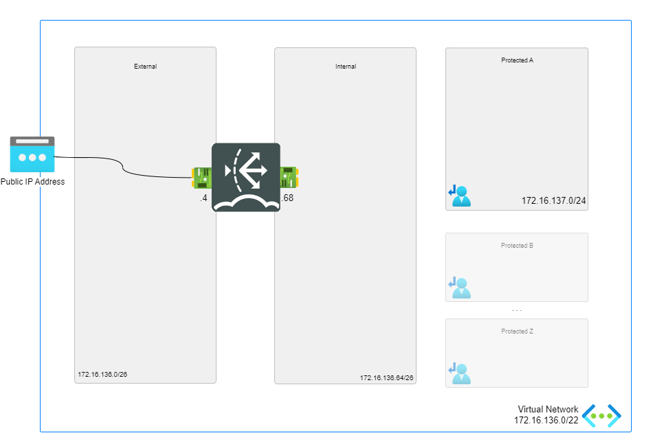
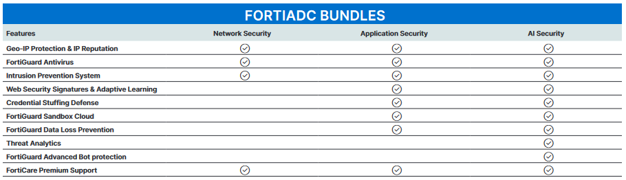

# FortiADC- A Single VM

## Introduction

FortiADC is part of Fortinet's family of Application Delivery Controllers (ADC), designed to enhance the performance, availability, and security of enterprise applications.
It acts like an advanced load balancer, directing traffic to the most suitable backend servers using health checks and load-balancing algorithms.

## Use Cases

#### 1. Application Availability
- **Objective:** Ensure high availability and reliable application performance with Advanced Layer 4-7 load balancing.
- **Features:** [Server Load Balancing (SLB)](https://docs.fortinet.com/document/fortiadc/7.6.0/administration-guide/975733/server-load-balancing), [Link Load Balancing](https://docs.fortinet.com/document/fortiadc/7.6.0/administration-guide/337937/link-load-balancing), [Global Load Balancing (GSLB)](https://docs.fortinet.com/document/fortiadc/7.6.0/administration-guide/842895/global-load-balancing), [content routing](https://docs.fortinet.com/document/fortiadc/7.6.0/administration-guide/561482/configuring-content-routes), and [health checks](https://docs.fortinet.com/document/fortiadc/7.6.0/administration-guide/922491/health-check).

#### 2. Hybrid Cloud Connectors
- **Objective:** Scale applications across regions or cloud platforms.
- **Features:** Load balancing across cloud platforms to enhance availability.

#### 3. Web Application Security 
- **Objective:** Protect web applications from OWASP Top 10 risks.
- **Features:** [WAF and API protection](https://docs.fortinet.com/document/fortiadc/7.4.2/handbook/503987/web-application-firewall) , [adaptive learning](https://docs.fortinet.com/document/fortiadc/7.6.0/administration-guide/128496/waf-adaptive-learning), [credential stuffing defense](https://docs.fortinet.com/document/fortiadc/7.6.0/administration-guide/870251/configuring-a-credential-stuffing-defense-policy).

#### 4. Advanced Application Security Based on Deep learning and AI
- **Objective:** Protect web applications from sophesticated bot attacks and unknown attack patterens.
- **Features:** [Advanced Bot Protection (ABP)](https://docs.fortinet.com/document/fortiadc/7.6.0/administration-guide/162426/advanced-bot-protection-abp) and [AI Threat Analytics integration with FortiWeb Cloud](https://docs.fortinet.com/document/fortiadc/7.6.0/administration-guide/52944/ai-threat-analytics).

#### 5. Security Accelerator
- **Objective:** Improve performance and availability of FortiGates.
- **Features:** [SSL offload](https://docs.fortinet.com/document/fortiadc/7.6.0/administration-guide/397561/ssl-decryption-by-forward-proxy), [security prefiltering](https://docs.fortinet.com/document/fortiadc/7.6.0/administration-guide/303599/intrusion-prevention), and load balancing.

#### 6. Application Automation
- **Objective:** Auto Actions Based-on Application Events.
- **Features:** Ensure Application automation actions and Application Security using [Automation Stitches](https://docs.fortinet.com/document/fortiadc/7.6.0/administration-guide/599379/automation) and DevOps Tools.

## Design

FortiADC Single VM environment consists of:

- 1 standalone FortiADC virtual machine with 2 NICs: external and internal.
- 1 VNETs containing 2 subnets: external and internal.
- Standard public IP attached to port1 interface for management.
- Network security group (NSG) which allows inbound HTTP, SSH traffic.

## Deployment

### Azure Portal

Azure Portal Wizard:

Custom Deployment:

## License and Bundles

There are three different license types available for FortiADC:

-**BYOL:** A demo license can be made available via your Fortinet partner or on our website. The license can be injected during deployment or added after deployment. Purchased licenses need to be registered on the Fortinet support site. Download the .lic file after registration. Note, these files may not work until 60 minutes after it's initial creation.

-**FLEX:** A demo FortiFlex evaluation account can be made available via you Fortinet partner. The FortiFlex token can be injected during deployment or added after deployment.

-**PAYG or OnDemand:** These licenses are automatically generated during the deployment of the FortiADC-VM systems.

Fortinet offers three main FortiADC bundles to cater to different security and performance needs. These bundles are available across various hardware, virtual machine, and cloud platforms. Here are the bundles:

-**Network Security Bundle:** Provides robust protection for network traffic, focusing on mitigating threats with features like Intrusion Prevention System (IPS), FortiGuard Antivirus, and geo-IP protection.

-**Application Security Bundle:** Designed to shield applications from specific threats such as OWASP Top 10 risks and bot attacks. It includes features like Web Application Firewall (WAF), FortiGuard Sandbox Cloud, and Data Loss Prevention (DLP).

-**AI Security Bundle:** Embraces AI/ML technologies for proactive threat detection. This bundle includes advanced analytics for real-time threat hunting and mitigation, helping you stay ahead of sophisticated cyberattacks.

More information can be found from [ordering guide](https://www.fortinet.com/content/dam/fortinet/assets/data-sheets/og-fortiadc.pdf).

## Support

Fortinet-provided scripts in this and other GitHub projects do not fall under the regular Fortinet technical support scope and are not supported by FortiCare Support Services.
For direct issues, please refer to the [Issues](https://github.com/40net-cloud/fortinet-azure-solutions/issues) tab of this GitHub project.

## License

[License](/../../blob/main/LICENSE) © Fortinet Technologies. All rights reserved.
