# FortiAnalyzer High Availability

:wave: - [Introduction](#introduction) - [Design](#design) - [Deployment](#deployment) - [Requirements](#requirements-and-limitations) - [Configuration](#configuration) - [Troubleshooting](#troubleshooting) - :wave:

## Introduction

FortiAnalyzer underpins the Fortinet Security Fabric, providing centralized logging and analysis, plus end-to-end visibility. As a result, analysts can manage security posture more effectively, automate security processes, and respond to threats quickly.

FortiAnalyzer automatically collects, stores, and analyzes logs from all Fortinet security devices including FortiGate Next-Generation Firewalls, VPNs, and intrusion detection and prevention systems. You can easily manage large volumes of logs and search for specific events using various search criteria.

This ARM template deploys two FortiAnalyzers with High availability accompanied by the required infrastructure.

## Design

This Azure ARM template will automatically deploy a full working environment containing the following components.

- 2 FortiAnalyzer VM with one NIC and data disk(s) for log storage
- 1 VNETs containing a subnet for the FortiAnalyzer
- Standard public IPs depending on deployment scenarios:
	
	* Active-Passive with Public IP Attached to Secondary Private IP Address: 2 optional Public IPs and one mandatory HA Public IP	
	* Active-Passive Using Secondary Private IP Address: 2 optional Public IPs
	* Geo-redundant HA (Active-Active) : 2 optional Public IPs
	
To enhance the availability of the solution VM can be installed in different Availability Zones instead of an Availability Set. The availability zone is the default option in the template. If Availability Zones deployment is selected but the location does not support Availability Zones an Availability Set will be deployed. If Availability Zones deployment is selected and Availability Zones are available in the location, FortiAnalyzer A will be placed in Zone 1, FortiAnalyzer B will be placed in Zone 2.

This Azure ARM template can also be extended or customized based on your requirements. Additional subnets besides the ones mentioned above are not automatically generated.

We will present three different scenarios for deploying FortiAnalyzer in high availability HA configuration:

### Active-Passive with Public IP Attached to Secondary Private IP Address

FortiAnalyzer HA will be configured in VRRP mode using unicast. There will be a dedicated public IP address for HA attached to secondary private IP address. 
When the failover occurs, the HA public IP address will move automatically from the old primary to new primary FortiAnalyzer unit.

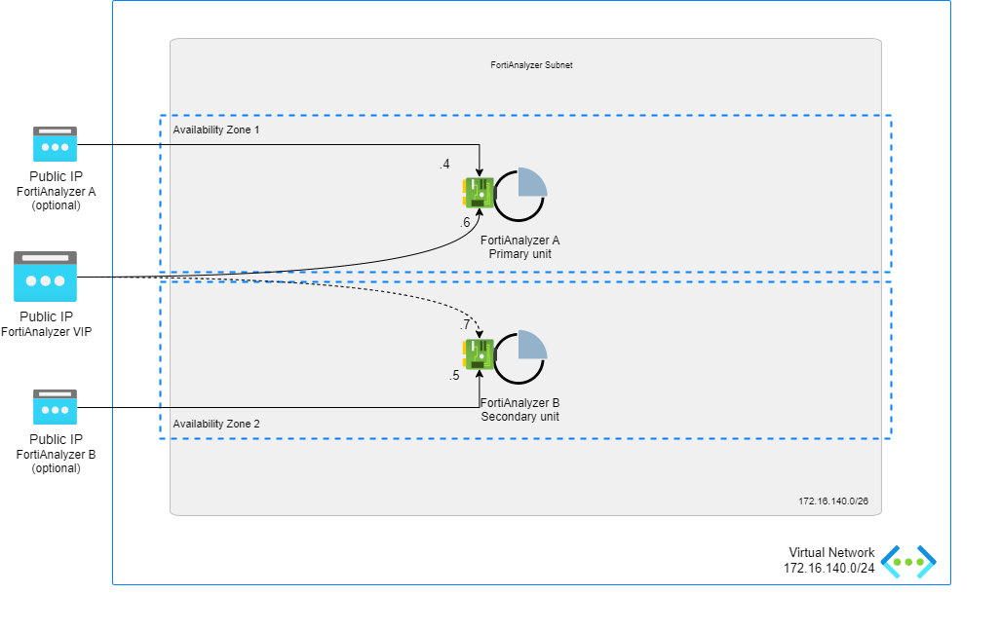

### Active-Passive Using Secondary Private IP Address

FortiAnalyzer HA will be configured in VRRP mode using unicast. There will be a dedicated HA secondary private IP address. 
When the failover occurs, the HA secondary private IP address will move automatically from the old primary to new primary FortiAnalyzer unit.

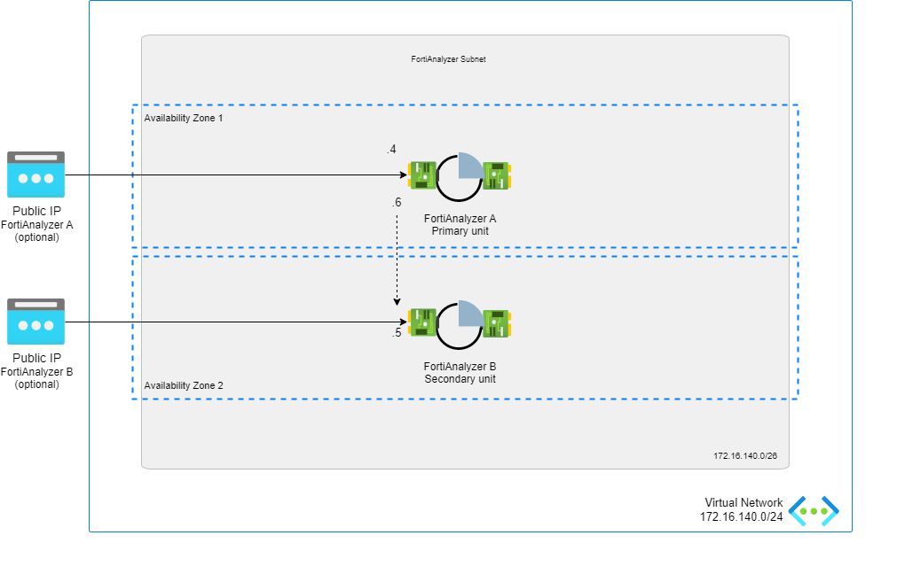

### Geo-Redundant HA (Active-Active)

The active-active mode in FortiAnalyzer HA facilitates the creation of a geo-redundant solution. In this mode, all HA members can independently receive logs and archive files from their directly connected devices and forward these to their HA peers. Additionally, each HA member can forward the logs and archive files it receives directly to a remote server.

To operate in this mode, unicast must be enabled for the HA heartbeat. This setting can only be configured via the CLI. For detailed instructions, refer to [the FortiAnalyzer documentation](https://docs.fortinet.com/document/fortianalyzer/7.6.0/administration-guide/776771/geo-redundant-ha).

When unicast is enabled, VRRP packets are sent to the peer address instead of the multicast address. Ensure that VRRP (IP protocol 112) is allowed through any firewalls that connect the HA members.


## Deployment

For the deployment, you can use the Azure Portal, Azure CLI, Powershell or Azure Cloud Shell. The Azure ARM templates are exclusive to Microsoft Azure and can't be used in other cloud environments. The main template is the `mainTemplate.json` which you can use in the Azure Portal. A `deploy.sh` script is provided to facilitate the deployment. You'll be prompted to provide the 4 required variables:

- PREFIX : This prefix will be added to each of the resources created by the template for ease of use and visibility.
- LOCATION : This is the Azure region where the deployment will be deployed.
- USERNAME : The username used to login to the FortiAnalyzer GUI and SSH management UI.
- PASSWORD : The password used for the FortiAnalyzer GUI and SSH management UI.

### Azure Portal

Azure Portal Wizard:
[](https://portal.azure.com/#create/Microsoft.Template/uri/https%3A%2F%2Fraw.githubusercontent.com%2F40net-cloud%2Ffortinet-azure-solutions%2Fmain%2FFortiAnalyzer%2Fha%2FmainTemplate.json/createUIDefinitionUri/https%3A%2F%2Fraw.githubusercontent.com%2F40net-cloud%2Ffortinet-azure-solutions%2Fmain%2FFortiAnalyzer%2Fha%2FcreateUiDefinition.json)

Custom Deployment:
[](https://portal.azure.com/#create/Microsoft.Template/uri/https%3A%2F%2Fraw.githubusercontent.com%2F40net-cloud%2Ffortinet-azure-solutions%2Fmain%2FFortiAnalyzer%2Fha%2FmainTemplate.json)
[](http://armviz.io/#/?load=https%3A%2F%2Fraw.githubusercontent.com%2F40net-cloud%2Ffortinet-azure-solutions$2Fmain%2FFortiAnalyzer%2Fha%2FmainTemplate.json)

### Azure CLI
To fast track the deployment, use the Azure Cloud Shell. The Azure Cloud Shell is an in-browser CLI that contains Terraform and other tools for deployment into Microsoft Azure. It is accessible via the Azure Portal or directly at [https://shell.azure.com/](https://shell.azure.com). You can copy and paste the below one-liner to get started with your deployment.

`cd ~/clouddrive/ && wget -qO- https://github.com/40net-cloud/fortinet-azure-solutions/archive/main.tar.gz | tar zxf - && cd ~/clouddrive/fortinet-azure-solutions-main/FortiAnalyzer/ha/ && ./deploy.sh`


After deployment, you will be shown the IP addresses of all deployed components. This information is also stored in the output directory in the 'summary.out' file. You can access both management GUI's using the public management IP addresses using HTTPS on port 443.

## Requirements and limitations

The Azure ARM template deployment deploys different resources and is required to have the access rights and quota in your Microsoft Azure subscription to deploy the resources.

- The template will deploy Standard D4as_v4 VMs for this architecture. Other VM instances are supported as well with a recommended minimum of 4 vCPU and 16Gb of RAM. A list can be found [here](https://docs.fortinet.com/document/FortiAnalyzer-public-cloud/7.6.0/azure-administration-guide/351055/instance-type-support)
- A Network Security Group is installed that only opens TCP port 22, 443,5199 and 514 for access to the FortiAnalyzer. Additional ports might be needed to support your use case and are documented [here](https://docs.fortinet.com/document/FortiAnalyzer/7.6.0/FortiAnalyzer-ports/465971)
- License for FortiAnalyzer
  -  BYOL: A demo license can be made available via your Fortinet partner or on our website. These can be injected during deployment or added after deployment.

## Configuration

The HA configuration requires the serialnumbers of both FortiAnalyzer VMs in order to complete the config. If the serialnumbers are not provided during deployment the FortiAnalyzer HA config needs to be performed manually afterwards.

### Active-Passive with Public IP Attached to Secondary Private IP Address

After deployment perform and validate the following three steps:
 
- During deployment the root certificate (DigiCert Global Root ca) for management.azure.com is added. This certificate can also be downloaded [here](https://learn.microsoft.com/en-us/azure/security/fundamentals/azure-ca-details?tabs=root-and-subordinate-cas-list) and added as a local CA certificate on the FortiAnalyzer
- For the failover process, FortiAnalyzer uses managed identity on Microsoft Azure to migrate the public IP. Assign either the network contributor or a custom role to the resource group containing the FortiAnalyzer resources (VM, network interface, public ip address, network security group). More information can be found [here](#vrrp-managed-identity)
- The FortiAnalyzer devices need to have outbound access to management.azure.com via either the attached public IPs or another outbound path

FortiAnalyzer A and FortiAnalyzer B configuration should be like below:

#### FortiAnalyzer A

<pre><code>
config system ha
 set mode a-p
 set group-id 10
 set group-name FAZAZURE
 set hb-interface "port1"
  config peer
   edit 1
     set serial-number <b>FortiAnalyzer B serial number</b>
     set addr <b>FortiAnalyzer B IP address</b>
    next
  end
 set preferred-role primary
  config vip
   edit 1
    set vip <b>FortiAnalyzer Public IP address in Azure</b>
    set vip-interface port1
   next
  end
end
</code></pre>

#### FortiAnalyzer B

<pre><code>
config system ha
 set mode a-p
 set group-id 10
 set group-name FAZAZURE
 set hb-interface "port1"
  config peer
   edit 1
    set serial-number <b>FortiAnalyzer A serial number</b>
    set addr <b>FortiAnalyzer A IP address</b>
   next
  end
 set preferred-role secondary
  config vip
   edit 1
    set vip <b>FortiAnalyzer Public IP address in Azure</b>
    set vip-interface port1
   next
  end
end
</code></pre>

Fortigate configuration should be:

<pre><code>
config log fortianalyzer setting
  set status enable
  set server <b>FortiAnalyzer HA Public IP address or FQDN</b>
  set serial <b>FortiAnalyzer A serial number</b>
end
</code></pre>


### Active-Passive Using Secondary Private IP Address

You will follow the same steps as in the previous scenario, with the only change being the use of private IPs instead of public IPs.

#### FortiAnalyzer A

<pre><code>
config system ha
 set mode a-p
 set group-id 10
 set group-name FAZAZURE
 set hb-interface "port1"
  config peer
   edit 1
    set serial-number <b>FortiAnalyzer B serial number</b>
    set addr <b>FortiAnalyzer B IP address - 172.16.140.5</b>
   next
  end
 set preferred-role primary
  config vip
   edit 1
    set vip <b>FortiAnalyzer HA private IP address - 172.16.140.6</b>
    set vip-interface port1
    next
   end
end
</code></pre>

#### FortiAnalyzer B

<pre><code>
config system ha
 set mode a-p
 set group-id 10
 set group-name FAZAZURE
 set hb-interface "port1"
  config peer
   edit 1
    set serial-number <b>FortiAnalyzer A serial number</b> 
    set addr <b>FortiAnalyzer A IP address - 172.16.140.4</b>
   next
  end
 set preferred-role secondary
  config vip
   edit 1
    set vip <b>FortiAnalyzer HA private IP address - 172.16.140.6</b>
    set vip-interface port1
   next
  end
end
</code></pre>

Fortigate configuration should be:

<pre><code>
config log fortianalyzer setting
  set status enable
  set server <b>FortiAnalyzer HA private IP address</b>
  set serial <b>FortiAnalyzer A serial number</b>
end
</code></pre>

### Active-Active

The configuration for FortiAnalyzer A and FortiAnalyzer B should be as follows:

#### FortiAnalyzer A

<pre><code>
config system ha
 set mode a-a
 set group-id 10
 set group-name "FAZAZURE"
 set hb-interface "port1"
 set hb-interface "port1"
  config peer
   edit 1
    set addr <b>FortiAnalyzer B IP address - 172.16.140.5</b>
    set serial-number <b>FortiAnalyzer B serial number</b> 
   next
  end
 set preferred-role primary
end
</code></pre>

#### FortiAnalyzer B

<pre><code>
config system ha
 set mode a-a
 set group-id 10
 set group-name "FAZAZURE"
 set hb-interface "port1"
 set hb-interface "port1"
  config peer
   edit 1
    set addr <b>FortiAnalyzer A IP address - 172.16.140.4</b>
    set serial-number <b>FortiAnalyzer A serial number</b> 
   next
  end
end
</code></pre>

Fortigate configuration should be:

<pre><code>
config log fortianalyzer setting
  set status enable
  set server <b>FortiAnalyzer A IP address or FQDN</b>
  set alt-server <b>FortiAnalyzer B IP address or FQDN</b>
  set serial <b>"FortiAnalyzer A serial number"</b> <b>"FortiAnalyzer B serial number"</b>
end
</code></pre>


### VRRP managed identity 

In case of automatic HA failover / VRRP the secondary FortiManger will become primary and start communication with Microsoft Azure to migrate the VIP (public or private IP address). For the communication, credentials are needed using a managed identity. During the deployment the system assigned managed identity is enabled on each FortiManger. It is required after deployment to provide the FortiAnalyzer systems access to the resource group containing it's resources in Azure. This access can be using the Network Contributor role or a custom role. The following resources are updated:

- FortiGate-VM network interfaces
- Network security group attached to the FortiAnalyzer network interface nic1
- VIP public IP address or private IP address attached to the FortiAnalyzer network interface nic1 as a secondary ipconfig
- VNET and subnet that has the VIP IP address attached

#### Network contributor role

##### Azure Portal

1. In the Azure portal, open your resource group and go to Access control (IAM).
2. Click Add a role assignment.
3. From the Role dropdown list, select Network Contributor.
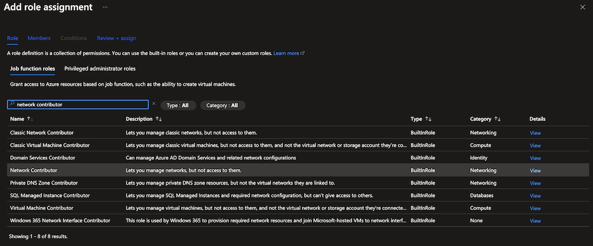
4. Select the FortiAnalyzer-VMs as virtual machine members for Managed Identity
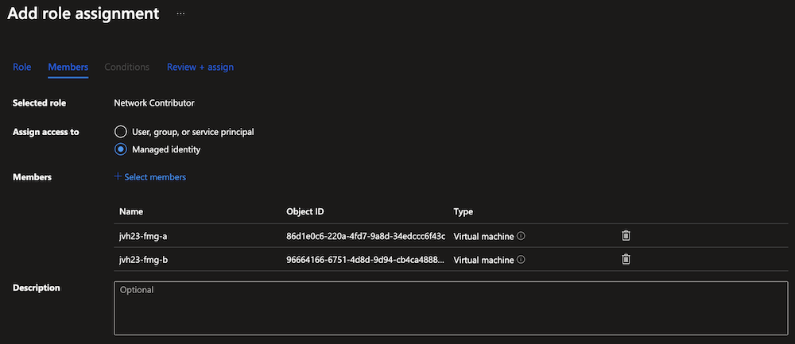
5. Review + assign the role
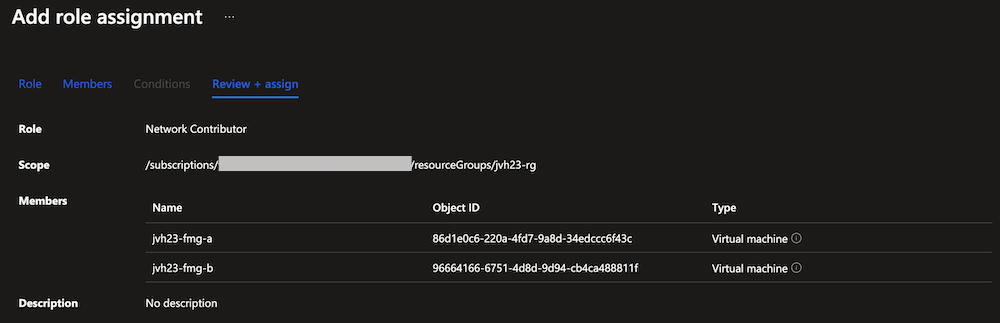

##### Azure CLI

```
$ spID=$(az resource list -n {<FortiAnalyzer-VM name>} --query [*].identity.principalId --out tsv)
$ az role assignment create --assignee $spID --role 'Network Contributor' --scope /subscriptions/{Azure subscription ID}/resourceGroups/{Azure resourceGroup name}
```

#### Customer specific role

You must assign the Fortinet FortiGate SDN Connector RW role to both FortiGate-VMs when in an active-active or active-passive setup. You must apply this role since the VM principal ID must be retrieved. This action assigns required access rights for the service principal that Azure AD is managing specific for the FortiGate-VM to access Azure resources in the Azure subscription.

##### Azure Portal

1. In the Azure portal, open your resource group and go to Access control (IAM).
2. Click Add a custom role
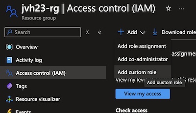
3. Give the role a name
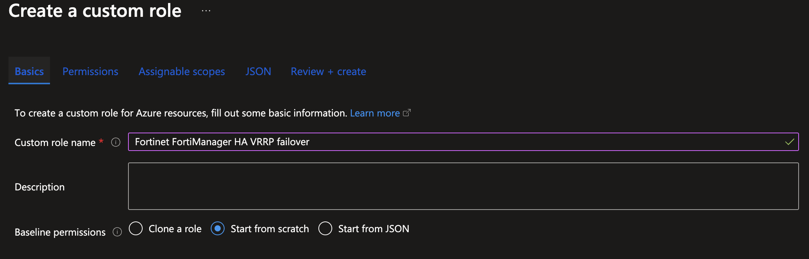
4. Go to the JSON tab and using edit fill in the json code from the Azure CLI section or the 'azure_iamrol_rw.json' file
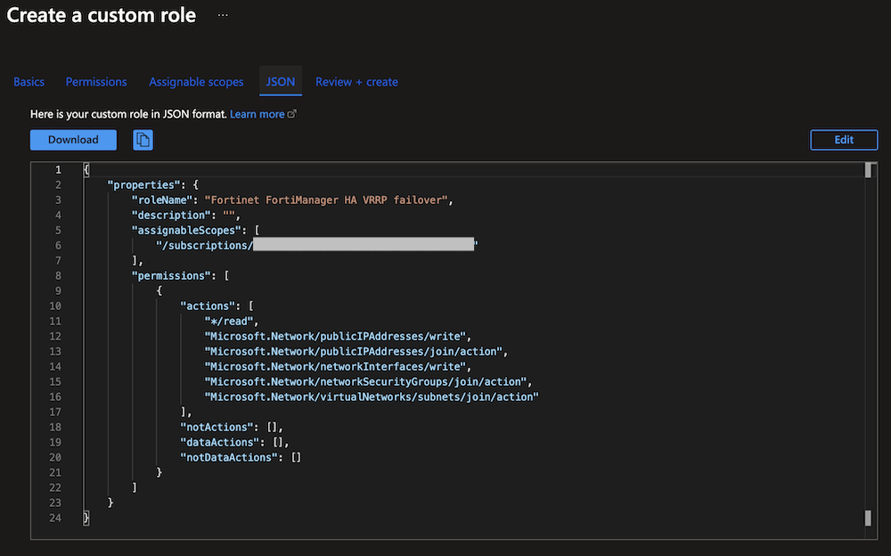
5. Review + assign the custom role

6. In the Azure portal, open your resource group and go to Access control (IAM).
7. Click Add a role assignment.
8. From the Role dropdown list, select your custom role
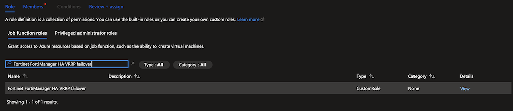
9. Select the FortiAnalyzer-VMs as virtual machine members for Managed Identity
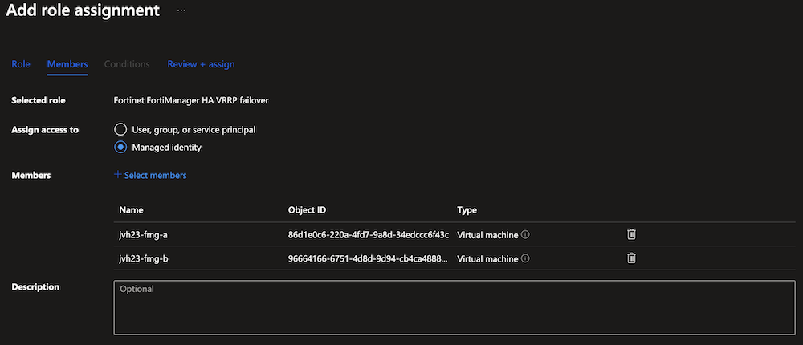
10. Review + assign the role
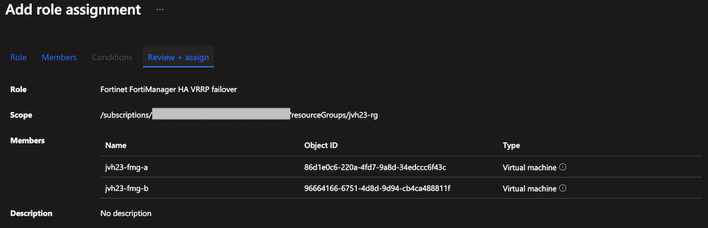

##### Azure CLI

Create a JSON file that contains the following data or download the json file from github. Fill in your subscription ID, replacing in the curly brackets placeholder.

```json
{
    "Name": "Fortinet FortiAnalyzer HA VRRP failover",
    "IsCustom": true,
    "Description": "Role to update the public ip address",
    "Actions": [
        "*/read",
        "Microsoft.Network/publicIPAddresses/write",
        "Microsoft.Network/publicIPAddresses/join/action",
        "Microsoft.Network/networkInterfaces/write",
        "Microsoft.Network/networkSecurityGroups/join/action",
        "Microsoft.Network/virtualNetworks/subnets/join/action"
    ],
    "DataActions": [],
    "NotActions": [],
    "NotDataActions": [],
    "AssignableScopes": [
        "/subscriptions/{subscriptionID1}"
    ]
}
```

This action assigns required access rights for the managed identity of the FortiAnalyzer-VM to access Azure resources in the Azure Resource Group.

```bash
$ az role definition create --role-definition azure_SDN_iamrole_rw.json
$ spID=$(az resource list -n {<FortiAnalyzer-VM name>} --query [*].identity.principalId --out tsv)
$ az role assignment create --assignee $spID --role 'Fortinet FortiAnalyzer HA VRRP failover' --scope /subscriptions/{Azure subscription ID}/resourceGroups/{Azure resourceGroup name}
```

## Troubleshooting

You should be able to see cluster status from GUI:

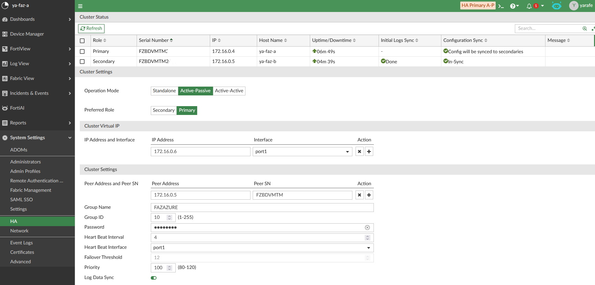

You check HA status from cli using the following commands: 

```
ya-faz-a # get sys status
Platform Type                   : FAZVM64-AZURE
Platform Full Name              : FortiAnalyzer-VM64-AZURE
Version                         : v7.6.0-build3340 240729 (GA.F)
Serial Number                   : FZBDVMTMxxxxxx
BIOS version                    : 04000002
Hostname                        : ya-faz-a
Max Number of Admin Domains     : 5
Admin Domain Configuration      : Disabled
FIPS Mode                       : Disabled
HA Mode                         : A-P
Branch Point                    : 3340
Release Version Information     : GA.F
Current Time                    : Wed Sep 04 01:02:04 PDT 2024
Daylight Time Saving            : Yes
Time Zone                       : (GMT-8:00) Pacific Time (US & Canada).
x86-64 Applications             : Yes
Disk Usage                      : Free 117.15GB, Total 125.43GB
File System                     : Ext4
License Status                  : Valid
Image Signature                 : Image is GA Certified
```

```
ya-faz-a # diagnose ha status
HA-Status: Primary (active)
     up-time: 8m11.248s
 config-sync: Allow
   serial-no: FZBDVMTMxxxxxx
      fazuid: 2415564604
    hostname: ya-faz-a

HA-Secondary FAZAZURE@172.16.0.5 FZBDVMTMxxxxxx
          ip: 172.16.0.5
   serial-no: FZBDVMTMxxxxxx
      fazuid: 2305159286
    hostname: ya-faz-b
     conn-st: up
up/down-time: 3m8.096s
    conn-msg: 
  cfgsync-st: up, 2m47.199s
data-init-sync-st: done, 2m47.199s
```

You can verify the communication with Azure REST API in shell mode.
Enable shell and run these using exec shell. Please, visit the [link](https://community.fortinet.com/t5/FortiAnalyzer/Technical-Tip-How-to-enable-backend-shell-access-in-FortiAnalyzer/ta-p/242340) for more details.
Then run the following commands:

```
# fazutil azure vm
# fazutil azure nic
# fazutil azure imds
# fazutil information ha-azure
```
Please note that shell access has been removed on [7.6](https://docs.fortinet.com/document/fortianalyzer/7.6.0/release-notes/901026).

Check VRRP traffic with the command:

```
diagnose sniffer packet port1 "ip proto 112" 4
```

Force a failover. Run this on the active FortiAnalyzer
```
# diag ha failover
```

Logging of the Azure Rest API calls
```
# diagnose ha dump-cloud-api-log
```

## Support
Fortinet-provided scripts in this and other GitHub projects do not fall under the regular Fortinet technical support scope and are not supported by FortiCare Support Services.
For direct issues, please refer to the [Issues](https://github.com/40net-cloud/fortinet-azure-solutions/issues) tab of this GitHub project.

## License
[License](/../../blob/main/LICENSE) © Fortinet Technologies. All rights reserved.
