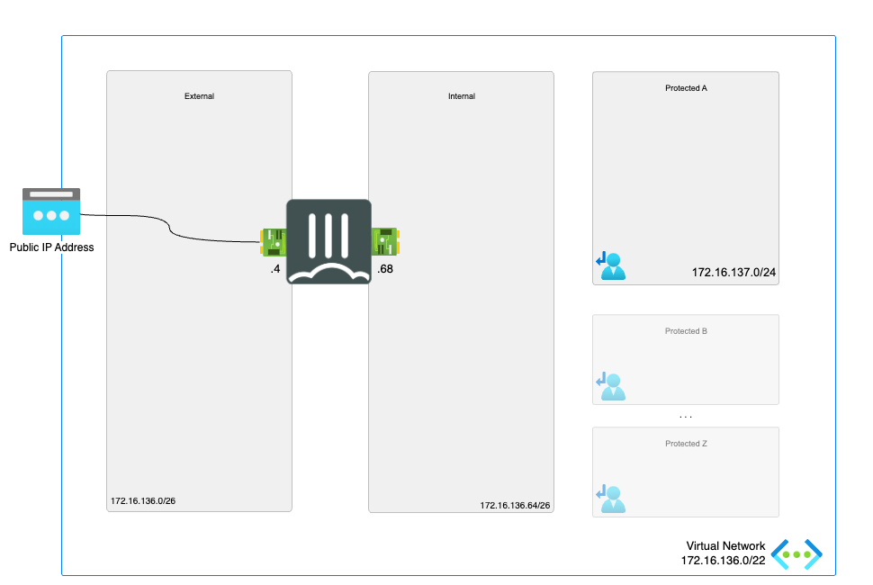

# FortiGate Next-Generation Firewall - A Single VM

## Introduction

As organizations increase their compute footprint in the cloud, Fortinet provides customers with a broad array of security solutions to protect Azure based resources and workloads. Fortinet solutions are tightly integrated and designed to help customers maintain a consistent security posture across applications, clouds and datacenters. Fortinet protects and provides SD WAN connectivity to Azure-based applications with the FortiGate-VM next generation firewalls.
Products are available as both pay as you go (PAYG) and bring your own license (BYOL) procurement.

## Design

In Microsoft Azure, this single FortiGate-VM setup a basic setup to start exploring the capabilities of the next generation firewall. The central system will receive, using user-defined routing (UDR), all or specific traffic that needs inspection going to/coming from on-prem networks or the public internet.

This Azure ARM template will automatically deploy a full working environment containing the following components.

- 1 FortiGate firewalls in an active/passive deployment
- 1 VNETs containing 2 protected subnets
- User Defined Routes (UDR) for the protected subnets

This Azure ARM template can also be extended or customized based on your requirements. Additional subnets besides the ones mentioned above are not automatically generated. By extending the Azure ARM templates additional subnets can be added. Additional subnets will require their own routing tables.

## Deployment

For the deployment, you can use the Azure Portal, Azure CLI, Powershell or Azure Cloud Shell. The Azure ARM templates are exclusive to Microsoft Azure and can't be used in other cloud environments. The main template is the `azuredeploy.json` which you can use in the Azure Portal. A `deploy.sh` script is provided to facilitate the deployment. You'll be prompted to provide the 4 required variables:

- PREFIX : This prefix will be added to each of the resources created by the template for ease of use and visibility.
- LOCATION : This is the Azure region where the deployment will be deployed.
- USERNAME : The username used to login to the FortiGate GUI and SSH management UI.
- PASSWORD : The password used for the FortiGate GUI and SSH management UI.

### Azure Portal

### Azure CLI
To fast track the deployment, use the Azure Cloud Shell. The Azure Cloud Shell is an in-browser CLI that contains Terraform and other tools for deployment into Microsoft Azure. It is accessible via the Azure Portal or directly at [https://shell.azure.com/](https://shell.azure.com). You can copy and paste the below one-liner to get started with your deployment.

`cd ~/clouddrive/ && wget -qO- https://github.com/jvhoof/fortinet-azure-solutions/archive/master.zip | jar x && cd ~/clouddrive/fortinet-azure-solutions-master/FortiGate/A-Single-VM/ && ./deploy.sh`

After deployment, you will be shown the IP addresses of all deployed components. This information is also stored in the output directory in the 'summary.out' file. You can access both management GUI's using the public management IP addresses using HTTPS on port 443.

## Requirements and limitations

The Azure ARM template deployment deploys different resources and is required to have the access rights and quota in your Microsoft Azure subscription to deploy the resources.

- The template will deploy Standard F2s VMs to deploy the setup
- Licenses for Fortigate
  - BYOL: A demo license can be made available via your Fortinet partner or on our website. These can be injected during deployment or added after deployment.
  - PAYG or OnDemand: These licenses are automatically generated during the deployment of the FortiGate systems.

The FortiGate-VM uses [Managed Identities](https://docs.microsoft.com/en-us/azure/active-directory/managed-identities-azure-resources/)for the SDN Fabric Connector. A SDN Fabric Connector is created automatically during deployment. After deployment, it is required apply the 'Reader' role to Azure Subscription you want the FortiGate-VM(s) to resolve Azure Resources from.

## Support
Fortinet-provided scripts in this and other GitHub projects do not fall under the regular Fortinet technical support scope and are not supported by FortiCare Support Services.
For direct issues, please refer to the [Issues](https://github.com/jvhoof/fortinet-azure-solutions/issues) tab of this GitHub project.

## License
[License](LICENSE) © Fortinet Technologies. All rights reserved.
