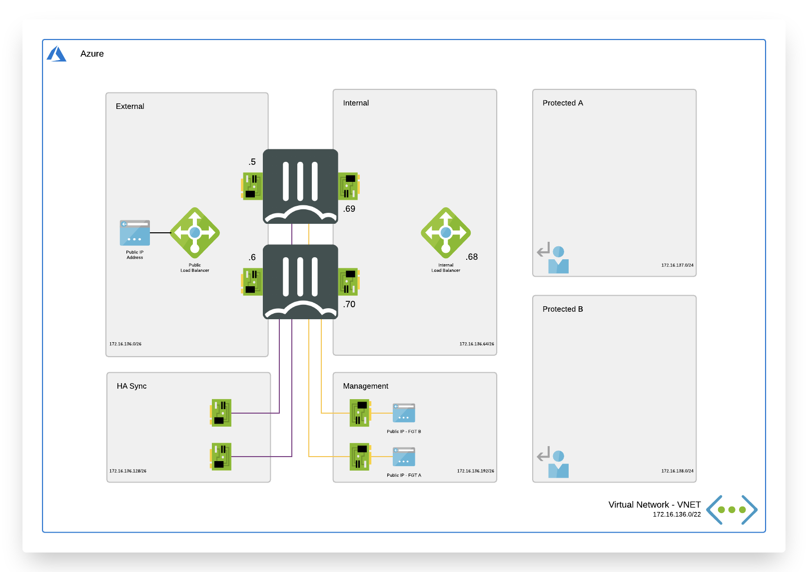

# Active / Passive High Available FortiGate pair with external and internal Azure Standard Load Balancer

# Introduction

More and more enterprises are turning to Microsoft Azure to extend internal data centers and take advantage of the elasticity of the public cloud. While Azure secures the infrastructure, you are responsible for protecting everything you put in it. Fortinet Security Fabric provides Azure and Office 365 users the broad protection, native integration and automated management enabling customers with consistent enforcement and visibility across their multi-cloud infrastructure.

# Design

In Microsoft Azure you can deploy a Active Passive pair of FortiGate VM's that communicate with each other and the Azure fabric. The FortiGate setup will receive the to be inspected traffic using user defined routing (UDR). You can send all or specific traffic that needs inspection going to/coming from on-prem networks or public internet by changing the UDR routing.

This ARM template will automatically deploy a full working environment containing the the following components.

  - 2 x FortiGate firewall's in an active/passive deployment
  - 1 x external Azure Standard Load Balancer for communication with internet
  - 1 x internal Azure Standard Load Balancer to receive all internal traffic and forwarding towards Azure Gateways connecting ExpressRoute or Azure VPN's.
  - 1 x VNET with 2 protected subnets
  - User Defined Routes (UDR) for the protected subnets

This ARM template can also be used to extend or customize based on your requirements. Additional subnets besides the one's mentioned above are not automatically generated. By adapting the ARM templates you can add additional subnets which prefereably require their own routing tables.

## How to deploy

The FortiGate solution can be deployed using the Azure Portal or Azure CLI. There are 4 variables needed to complete kickstart the deployment. The deploy.sh script will ask them automatically. When you deploy the ARM template the Azure Portal will request the variables as a requirement.

  - PREFIX : This prefix will be added to each of the resources created by the templates for easy of use, manageability and visibility.
  - LOCATION : This is the Azure region where the deployment will be deployed
  - USERNAME : The username used to login to the FortiGate GUI and SSH mangement UI.
  - PASSWORD : The password used for the FortiGate GUI and SSH management UI.

### Azure Portal

### Azure CLI

For Microsoft Azure there is a second option by using the Azure Cloud Shell. The Azure Cloud Shell is an in-browser CLI that contains all tools for deployment into Microsoft Azure. It is accesible via the Azure Portal or directly via [https://shell.azure.com/](https://shell.azure.com). You can copy and past the below one-liner to get start with your deployment.
To deploy via Azure Cloud Shell you can connect via the Azure Portal or directly to [https://shell.azure.com/](https://shell.azure.com/).

- Login into the Azure Cloud Shell
- Run the following command in the Azure Cloud:

`cd ~/clouddrive/ && wget -qO- https://github.com/jvhoof/fortinet-azure-solutions/archive/master.zip | jar x && cd ~/clouddrive/fortinet-azure-solutions-master/FortiGate/Active-Passive-ELB-ILB/ && ./deploy.sh`

- The script will ask you a few questions to bootstrap a full deployment.

After deployment you will be shown the IP address of all deployed components, this information is also stored in the output directory in the summary.out file. You can access both management GUI's using the public management IP's using HTTPS on port 443.

## Post deployment

During the deployment the FortiGate systems are pre-configured with the required routing, clustering information, ... This information can be found in the 'customdata' field in the ARM template.

After deployment you need to apply the license unless you are using PAYG licensing.  To apply BYOL licenses, first register the licenses with http://support.fortinet.com and download the .lic files.  Note, these files may not work until 30 minutes after it's initial created.

Next, connect via HTTPS to both FortiGates via their management addresses and upload unique license files for each.

Once, licensed and rebooted, you can proceed to configure firewall policy and other security features of the FortiGate as you like. The SDN connector can be used to pull information from Azure using the Azure API.

A step by step guide can be found on our [documentation site](https://docs2.fortinet.com/vm/azure/fortigate/6.0/use-case-automatically-updating-dynamic-addresses-using-fabric-connector/6.0.0/502895/overview)

# Requirements and limitations

The ARM template deployment different resource and it is required to have the access rights and quota in your Microsoft Azure subscription to deploy the resources.

- The template will deploy Standard F4s VM's to deploy the required active/passive setup
- Licenses for Fortigate
  - BYOL: Demo license can be made available via your Fortinet partner or on our website. These can be injected during deployment or added after deployment.
  - PAYG or OnDemand: These licenses are automaticaly generated during the deployment of the FortiGate systems.

# CI/CD pipeline and testing

# License

Permission is hereby granted, free of charge, to any person obtaining a copy of this software and associated documentation files (the "Software"), to deal in the Software without restriction, including without limitation the rights to use, copy, modify, merge, publish, distribute, sublicense, and/or sell copies of the Software, and to permit persons to whom the Software is furnished to do so, subject to the following conditions:

The above copyright notice and this permission notice shall be included in all copies or substantial portions of the Software.

THE SOFTWARE IS PROVIDED "AS IS", WITHOUT WARRANTY OF ANY KIND, EXPRESS OR IMPLIED, INCLUDING BUT NOT LIMITED TO THE WARRANTIES OF MERCHANTABILITY, FITNESS FOR A PARTICULAR PURPOSE AND NONINFRINGEMENT. IN NO EVENT SHALL THE AUTHORS OR COPYRIGHT HOLDERS OR FORTINET SUPPORT (TAC) BE LIABLE FOR ANY CLAIM, DAMAGES OR OTHER LIABILITY, WHETHER IN AN ACTION OF CONTRACT, TORT OR OTHERWISE, ARISING FROM, OUT OF OR IN CONNECTION WITH THE SOFTWARE OR THE USE OR OTHER DEALINGS IN THE SOFTWARE.