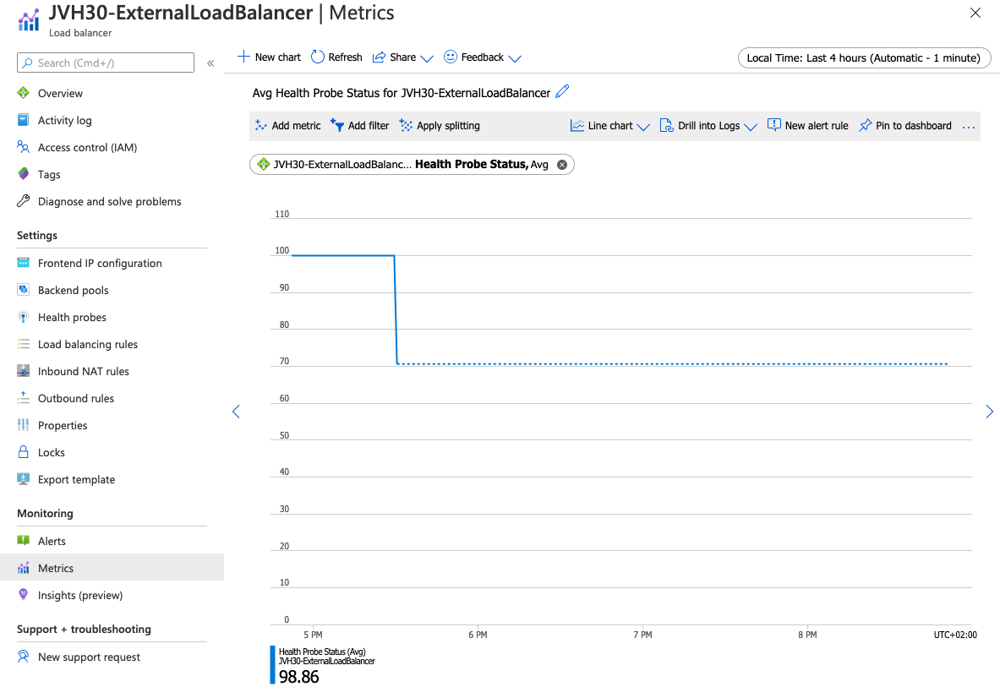

# Troubleshooting

There are different components in the whole delivery chain

1. Azure Load Balancer
2. Network Security Groups
3. Standard Public IP
4. FortiGate

## Azure Load Balancer

The Azure Load Balancer comes in 2 different flavors/SKUs: Basic and Standard. Due to the requirements in this deployment Standard SKU Load Balancers are used in this setup.
Microsoft provides extensive documentation on the Azure Load Balancer [here](https://docs.microsoft.com/en-us/azure/load-balancer/load-balancer-overview). Before deployment it is advised to verify the [different components and concepts](https://docs.microsoft.com/en-us/azure/load-balancer/components) of the Azure Load Balancer.

Once deployed and the traffic is somehow not flowing as expected the Azure Load Balancer, as it is in the data path, could be the source. Most of the issues seens with the Azure Load Balancer are regarding the health probes not responding. The current status of the health probes can be verified in the Azure Portal > Your Azure Load Balancer > Monitoring > Metrics > Metric - 'Health Probe Status'. The example taken from a test setup shows a health probe that stops responding around 5:30 PM.

<p align="center">
  
</p>

Microsoft provides additional troubleshooting steps on the Azure Load Balancer [here](https://docs.microsoft.com/en-us/azure/load-balancer/load-balancer-troubleshoot).

## Network Security Groups (NSG)

Microsoft provides access control lists (ACL) on Azure networking attaching to a subnet or a network interface of a virtual machine. Debugging is possible by writing logs to a Storage Account or Azure Log Analytics. More information can be found [here](https://docs.microsoft.com/en-us/azure/virtual-network/virtual-network-nsg-manage-log)

Below you can see an output in JSON of a log rule as they can be found on the storage account:

```
{
  "records": [
    {
      "time": "2020-08-03T07:18:43.2317151Z",
      "systemId": "ca0eb670-63ac-4f05-9d82-7c01addd59f3",
      "macAddress": "000D3ABEB097",
      "category": "NetworkSecurityGroupFlowEvent",
      "resourceId": "/SUBSCRIPTIONS/F7F4728A-781F-470F-B029-BAC8A9DF75AF/RESOURCEGROUPS/JVHAZS-RG/PROVIDERS/MICROSOFT.NETWORK/NETWORKSECURITYGROUPS/JVHAZS-HOST1-NSG",
      "operationName": "NetworkSecurityGroupFlowEvents",
      "properties": {
        "Version": 2,
        "flows": [
          {
            "rule": "DefaultRule_DenyAllInBound",
            "flows": [
              {
                "mac": "000D3ABEB097",
                "flowTuples": [
                  "1596439087,94.102.51.77,10.0.0.4,58501,8121,T,I,D,B,,,,",
                  "1596439097,194.26.29.143,10.0.0.4,53411,32457,T,I,D,B,,,,",
                  "1596439102,87.251.74.200,10.0.0.4,44755,8213,T,I,D,B,,,,",
                  "1596439103,45.129.33.8,10.0.0.4,51401,9849,T,I,D,B,,,,"
                ]
              }
            ]
          }
        ]
      }
    }
  ]
}

```
## Standard Public IP

The standard public ip has some extra features like zone redundancy. The most important item property of this Standard SKU resource is that inbound communication failes until an network security group is associated with the network interface or subnet that allows the inbound traffic.

More information can be found [here](https://docs.microsoft.com/en-us/azure/virtual-network/public-ip-addresses#standard)

## FortiGate

