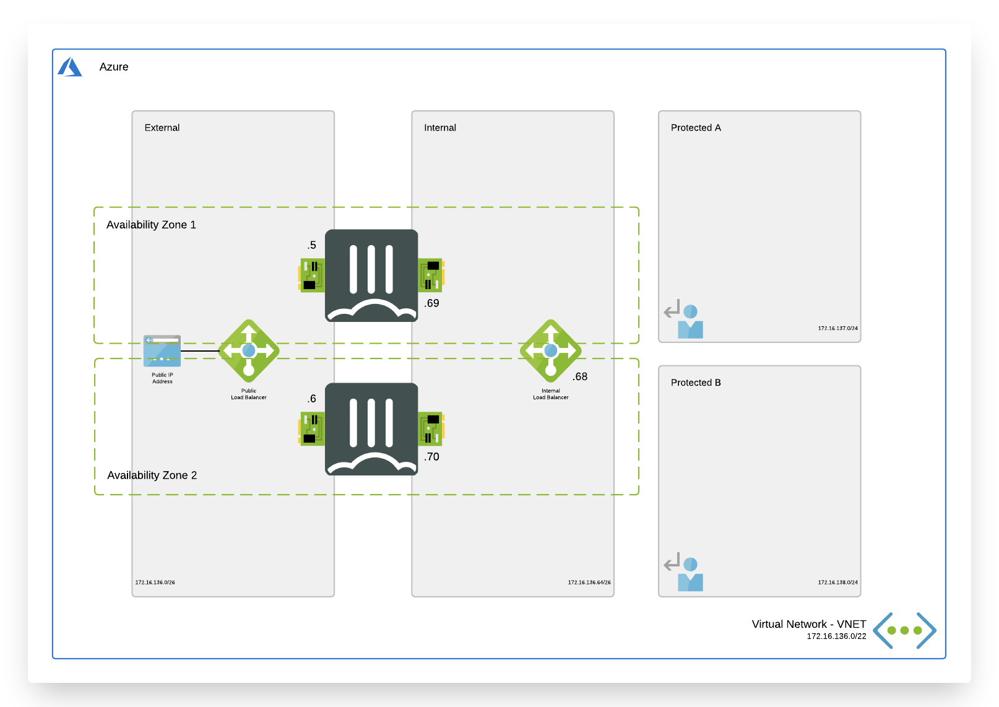

# Active/Active Load Balanced Standalone FortiGate Pair

## Introduction

This Azure ARM template deploys an Active/Active FortiGate Pair combined with the Microsoft Azure Standard Load Balancer both on the external and the internal sides. Additionally, Fortinet Fabric Connectors deliver the ability to create dynamic security policies.

This template allows for the choice to utilize Azure Availability Zones or Availability Sets.

## Design

In Microsoft Azure, you can deploy an active/active pair of FortiGate VMs that communicate with each other and the Azure fabric. This FortiGate setup will receive the to be inspected traffic using user defined routing (UDR) and public IPs. You can send all or specific traffic that needs inspection, going to/coming from on-prem networks or public internet by adapting the UDR routing.

This Azure ARM template will automatically deploy a full working environment containing the the following components.

- 2 FortiGate firewalls in an active/active deployment
- 1 external Azure Standard Load Balancer for communication with internet
- 1 internal Azure Standard Load Balancer to receive all internal traffic and forwarding towards Azure Gateways connecting ExpressRoute or Azure VPNs.
- 1 VNET with 2 protected subnets
- 1 public IP for services and FortiGate management
- User Defined Routes (UDR) for the protected subnets



This ARM template can also be used to extend or customized based on your requirements. Additional subnets besides the ones mentioned above are not automatically generated. By adapting the ARM templates you can add additional subnets which preferably require their own routing tables.

## How to deploy

The FortiGate solution can be deployed using the Azure Portal.

### Azure Portal

Standard Custom Template Deployment:

[](https://portal.azure.com/#create/Microsoft.Template/uri/https%3A%2F%2Fraw.githubusercontent.com%2F40net-cloud%2Ffortinet-azure-solutions%2Fmain%2FFortiGate%2FAvailabilityZones%2FActive-Active-ELB-ILB-AZ%2Fazuredeploy.json)

Azure Portal Wizard Template Deployment:

[](https://portal.azure.com/#create/Microsoft.Template/uri/https%3A%2F%2Fraw.githubusercontent.com%2F40net-cloud%2Ffortinet-azure-solutions%2Fmain%2FFortiGate%2FAvailabilityZones%2FActive-Active-ELB-ILB-AZ%2Fazuredeploy.json/createUIDefinitionUri/https%3A%2F%2Fraw.githubusercontent.com%2F40net-cloud%2Ffortinet-azure-solutions%2Fmain%2FFortiGate%2FAvailabilityZones%2FActive-Active-ELB-ILB-AZ%2FcreateUiDefinition.json)

## Requirements and limitations

The ARM template deploys different resources and it is required to have the access rights and quota in your Microsoft Azure subscription to deploy the resources.

- The template will deploy Standard F2s VMs for this architecture. Other VM instances are supported as well with a minimum of 2 NICs. A list can be found [here](https://docs.fortinet.com/document/fortigate-public-cloud/7.0.0/azure-administration-guide/562841/instance-type-support)
- Licenses for Fortigate
  - BYOL: A demo license can be made available via your Fortinet partner. These can be injected during deployment or added after deployment. Purchased licenses need to be registered on the [Fortinet support site](http://support.fortinet.com). Download the .lic file after registration. Note, these files may not work until 30 minutes after their initial creation.
  - PAYG or OnDemand: These licenses are automatically generated during the deployment of the FortiGates.
- The password provided during deployment must meet password complexity rules from Microsoft Azure:
  - It must be 12 characters or longer
  - It needs to contain characters from at least 3 of the following groups: uppercase characters, lowercase characters, numbers, and special characters excluding '\' or '-'
- The terms for the FortiGate PAYG or BYOL image in the Azure Marketplace needs to be accepted once before usage. This is done automatically during deployment via the Azure Portal. For the Azure CLI the commands below need to be run before the first deployment in a subscription.
  - BYOL:
`az vm image accept-terms --publisher fortinet --offer fortinet_fortigate-vm_v5 --plan fortinet_fg-vm`
  - PAYG:
`az vm image accept-terms --publisher fortinet --offer fortinet_fortigate-vm_v5 --plan fortinet_fg-vm_payg_20190624`

## FortiGate configuration

The FortiGate VMs need a specific configuration to match the deployed environment. This configuration can be injected during provisioning or afterwards via the different options including GUI, CLI, FortiManager or REST API.

- [Default configuration using this template](/FortiGate/Active-Active-ELB-ILB/doc/config-provisioning.md)

### Fabric Connector

The FortiGate-VM uses [Managed Identities](https://docs.microsoft.com/en-us/azure/active-directory/managed-identities-azure-resources/) for the SDN Fabric Connector. A SDN Fabric Connector is created automatically during deployment. After deployment, it is required apply the 'Reader' role to the Azure Subscription you want to resolve Azure Resources from. More information can be found on the [Fortinet Documentation Library](https://docs.fortinet.com/vm/azure/fortigate/7.0/azure-administration-guide/7.0.0/236610/creating-a-fabric-connector-using-a-managed-identity).

### North South traffic

When configuring the policies on the FortiGates to allow and forward traffic to internal hosts, it is recommended that you enable the NAT checkbox (this will S-NAT the packets to the IP of port2). Doing so will enforce symmetric return.

It is possible to use FGSP to synchronize sessions and thereby allow asymmetric return traffic. However this is not best practice from a security perspective, because it limits the ability of IPS by potentially only seeing one side of the conversation on each FGT. The FortiGate IPS takes both sides of the conversation into account for increased security and visibility. Reducing this visibility on the FortiGate may decrease the IPS efficacy.

Often S-NAT is not desired because it's necessary to retain the original source IP. For HTTP or HTTPS traffic in particular, you can enable the Load Balancing feature on the FortiGate which gives you the option to copy the source IP into the X-Forwarded-For header, [review here.](https://docs.fortinet.com/document/fortigate/7.0.1/administration-guide/883151/learn-client-ip-addresses)

If you prefer to use FGSP for session synchronization. It can be enable during deployment by adding this recommended configuration to both FortiGate VMs.

```sh
config system ha
    set session-pickup enable
    set session-pickup-connectionless enable
    set session-pickup-nat enable
    set session-pickup-expectation enable
    set override disable
end

config system cluster-sync
    edit 0
        set peerip 10.0.1.x
        set syncvd "root"
    next
end
```

- Where x in 10.0.1.x is the IP of port 1 of the opposite FortiGate. With the default values this would be either 5 or 6.

### Configuration synchronization

The FortiGate VMs are, in this Active/Active setup, independent units. The FGCP protocol, used in the Active/Passive setup, to sync the configuration is not applicable here. To enable configuration sync between both units the sync from the autoscaling setup can be used. This will sync all configuration except for the specific configuration item proper to the specific VM like hostname, routing and others. To enable the configuration sync the config below can be used on both.

FortiGate A

```sh
config system auto-scale
    set status enable
    set role master
    set sync-interface "port2"
    set psksecret "a big secret"
end
```

FortiGate B

```sh
config system auto-scale
    set status enable
    set sync-interface "port2"
    set master-ip 172.16.136.69
    set psksecret "a big secret"
end
```

## Support

Fortinet-provided scripts in this and other GitHub projects do not fall under the regular Fortinet technical support scope and are not supported by FortiCare Support Services.
For direct issues, please refer to the [Issues](https://github.com/40net-cloud/fortinet-azure-solutions/issues) tab of this GitHub project.

## License

[License](/LICENSE) © Fortinet Technologies. All rights reserved.
