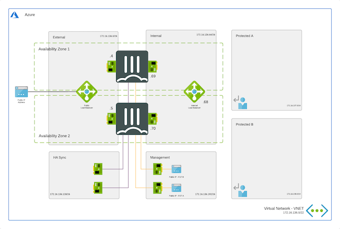

# Availability Zones - Active/Passive High Available FortiGate pair with external and internal Azure Standard Load Balancer

## Introduction

Enterprises are using Microsoft Azure to extend or replace internal data centers and take advantage of the elasticity of the Public Cloud. While Azure secures the infrastructure, enterprises are responsible for protecting the resources they create. As workloads are being moved from local data centers, connectivity and security are key elements to take into account. FortiGate-VM offers a consistent security posture and protects connectivity across public and private clouds, while high-speed VPN connections protect data.

This Azure ARM template deploys an Active/Active FortiGate pair combined with the Microsoft Azure Standard Load Balancer both in the external and the internal subnet. Additionally, Fortinet Fabric Connectors deliver the ability to create dynamic security policies.

Microsoft defines an Availability Zone to have the following properties:

- Unique physical location with an Azure Region
- Each zone is made up of one or more Data Center(s)
- Independent power, cooling and networking
- Inter Availability Zone network latency < 2ms (radius of +/- 100km)
- Fault-tolerant to protect from Data Center failure

Based on information in the presentation ['Inside Azure Data Center architecture with Mark Russinovich' at Microsoft Ignite 2019](https://www.youtube.com/watch?v=X-0V6bYfTpA)

## Design

VMs running in Microsoft Azure using Availability Zones have a better SLA provided by the platform. Each individual VM in this setup has a 99.99% uptime SLA compared to 99.95% for the VMs running in a Availability Set. SLA documentation from Microsoft can be found [here](https://azure.microsoft.com/en-us/support/legal/sla/virtual-machines/v1_9/).

A cluster of FortiGate VMs will have a cross region/parallel SLA of 99,999999%. More information about the uptime of the Azure Data Center can be found on [this blog post](<https://kvaes.wordpress.com/2020/02/16/is-azure-a-tier-3-Data/> Center-and-what-about-service-levels-in-a-broader-sense/). FortiGate A will be deployed in Zone 1. FortiGate B will deployed in Zone 2. The template can of course be changed to use other zones.

This ARM template can also be used to extend or be customized based on design requirements. Additional subnets besides the one's mentioned above are not automatically generated. By adapting the ARM templates you can add additional subnets which preferably require their own routing tables.

## How to deploy

The FortiGate solution can be deployed using the Azure Portal or Azure CLI.

### Azure Portal

Azure Portal: 

 
Azure Portal Wizard: 

### Azure CLI

There are 4 variables needed to complete kickstart the deployment. The deploy.sh script will ask them automatically. When you deploy the ARM template the Azure Portal will request the variables as a requirement.

- PREFIX : This prefix will be added to each of the resources created by the templates for easy of use, manageability and visibility.
- LOCATION : This is the Azure region where the deployment will be deployed
- USERNAME : The username used to login to the FortiGate GUI and SSH management UI.
- PASSWORD : The password used for the FortiGate GUI and SSH management UI.

To deploy via Azure Cloud Shell you can connect via the Azure Portal or directly to [https://shell.azure.com/](https://shell.azure.com/).

- Login into the Azure Cloud Shell
- Run the following command in the Azure Cloud:

`cd ~/clouddrive/ && wget -qO- https://github.com/40net-cloud/fortinet-azure-solutions/archive/main.tar.gz | tar zxf - && cd ~/clouddrive/fortinet-azure-solutions-main/FortiGate/AvailabilityZones/Active-Passive-ELB-ILB-AZ/ && ./deploy.sh`

- The script will ask you a few questions to bootstrap a full deployment.

After deployment the IP address of all deployed components will be displayed. Access each FortiGate's management GUIs and SSH using their public IP address. The FortiGate VMs are also accessible using their private IPs on the internal subnet using HTTPS on port 443 and SSH on port 22.

## Requirements and limitations

More documentation can be found on [the Availability Set version of this template](../../Active-Passive-ELB-ILB/README.md).

## License

[License](LICENSE) © Fortinet Technologies. All rights reserved.
