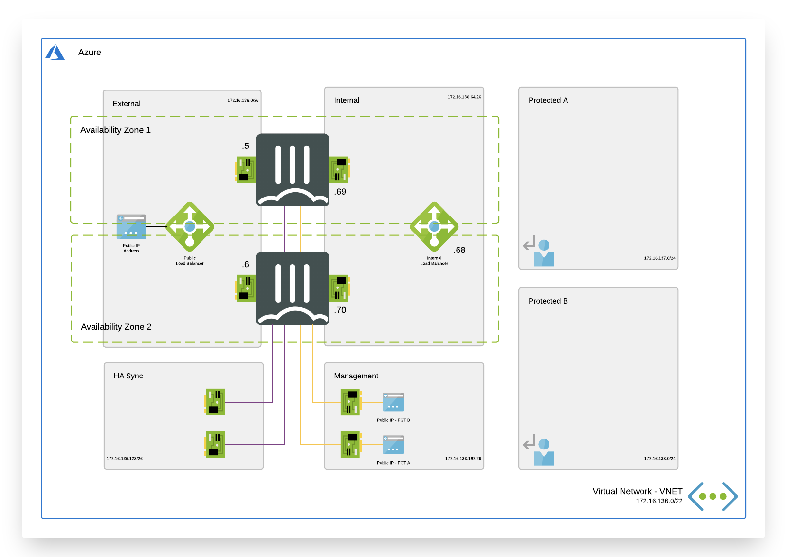

# Active/Passive High Available FortiGate pair with external and internal Azure Standard Load Balancer

# Introduction

More and more enterprises are turning to Microsoft Azure to extend internal data centers and take advantage of the elasticity of the public cloud. While Azure secures the infrastructure, you are responsible for protecting everything you put in it. Fortinet Security Fabric provides Azure the broad protection, native integration and automated management enabling customers with consistent enforcement and visibility across their multi-cloud infrastructure.

This ARM template deploys a High Availability pair of FortiGate Next-Generation Firewallis accompanied by the required infrastructure. Additionally, Fortinet Fabric Connectors deliver the ability to create dynamic security policies.

# Design

In Microsoft Azure, you can deploy an active/passive pair of FortiGate VMs that communicate with each other and the Azure fabric. This FortiGate setup will receive the to be inspected traffic using user defined routing (UDR) and public IPs. You can send all or specific traffic that needs inspection, going to/coming from on-prem networks or public internet by adapting the UDR routing.

This Azure ARM template will automatically deploy a full working environment containing the the following components.

  - 2 FortiGate firewall's in an active/passive deployment
  - 1 external Azure Standard Load Balancer for communication with internet
  - 1 internal Azure Standard Load Balancer to receive all internal traffic and forwarding towards Azure Gateways connecting ExpressRoute or Azure VPN's
  - 1 VNET with 2 protected subnets and 4 subnets required for the FortiGate deployment (external, internal, ha mgmt and ha sync)
  - User Defined Routes (UDR) for the protected subnets

This ARM template can also be used to extend or customized based on your requirements. Additional subnets besides the one's mentioned above are not automatically generated. By adapting the ARM templates you can add additional subnets which prefereably require their own routing tables.

## How to deploy

The FortiGate solution can be deployed using the Azure Portal or Azure CLI. There are 4 variables needed to complete kickstart the deployment. The deploy.sh script will ask them automatically. When you deploy the ARM template the Azure Portal will request the variables as a requirement.

  - PREFIX : This prefix will be added to each of the resources created by the templates for easy of use, manageability and visibility.
  - LOCATION : This is the Azure region where the deployment will be deployed
  - USERNAME : The username used to login to the FortiGate GUI and SSH mangement UI.
  - PASSWORD : The password used for the FortiGate GUI and SSH management UI.

### Azure Portal

### Azure CLI

For Microsoft Azure there is a second option by using the Azure Cloud Shell. The Azure Cloud Shell is an in-browser CLI that contains all tools for deployment into Microsoft Azure. It is accesible via the Azure Portal or directly via [https://shell.azure.com/](https://shell.azure.com). You can copy and past the below one-liner to get start with your deployment.
To deploy via Azure Cloud Shell you can connect via the Azure Portal or directly to [https://shell.azure.com/](https://shell.azure.com/).

- Login into the Azure Cloud Shell
- Run the following command in the Azure Cloud:

`cd ~/clouddrive/ && wget -qO- https://github.com/jvhoof/fortinet-azure-solutions/archive/master.zip | jar x && cd ~/clouddrive/fortinet-azure-solutions-master/FortiGate/Active-Passive-ELB-ILB/ && ./deploy.sh`

- The script will ask you a few questions to bootstrap a full deployment.

After deployment you will be shown the IP address of all deployed components. Both FortiGate VMs are accessible using the public management IPs using HTTPS on port 443 and SSH on port 22.

# Requirements and limitations

The ARM template deploy different resource and it is required to have the access rights and quota in your Microsoft Azure subscription to deploy the resources.

- The template will deploy Standard F4s VMs for this architecture. Other VM instances are supported as well with a minimum of 2 NICs. A list can be found [here](https://docs.fortinet.com/document/fortigate/6.2.0/azure-cookbook/562841/instance-type-support)
- Licenses for Fortigate
  - BYOL: A demo license can be made available via your Fortinet partner or on our website. These can be injected during deployment or added after deployment. Purchased licenses need to be registered on the [Fortinet support site] (http://support.fortinet.com). Download the .lic file after registration. Note, these files may not work until 30 minutes after it's initial creation.
  - PAYG or OnDemand: These licenses are automatically generated during the deployment of the FortiGate systems.

### Fabric Connector
The FortiGate-VM uses [Managed Identities](https://docs.microsoft.com/en-us/azure/active-directory/managed-identities-azure-resources/) for the SDN Fabric Connector. A SDN Fabric Connector is created automatically during deployment. After deployment, it is required apply the 'Reader' role to Azure Subscription you want the FortiGate-VM(s) to resolve Azure Resources from. More information can be found on the [Fortinet Documentation Libary](https://docs.fortinet.com/vm/azure/fortigate/6.2/azure-cookbook/6.2.0/236610/creating-a-fabric-connector-using-a-managed-identity).

# FortiGate provisioning

## Cloud init and custom data

Microsoft Azure offers, like many other cloud providers, the possibility to inject a configuration during deployment. This method is referred to as Cloud-Init. Both using templates (ARM or Terraform) or via CLI (Powershell, AzureCLI), it is possible to provide a file with this configuration. In the case of FortiGate there are 3 formatting options available.

### Inline configuration file

In this ARM template, a FortiGate configuration is passed via the customdata field used by Azure for the Cloud-Init process. Using variables and parameters you can customize the configuration based on the input provided during deployment. The full configuration injected during deployment with the default parameters can be found at the end of this documentation.

<pre>
...
    "fgaCustomData": "[base64(concat('config system...
...
  "osProfile": {
...
    "customData": "[variables('fgaCustomData')]"
  },
...
</pre>

### Inline configuration and license file

To provide the configuration and the license during deployment it is required to encode both using MIME. Similar to how email is encoded it is possible to pass in one variable both the FortiGate configuration in part 1 and the license file in part 2. The code snippet below requires the config and license file content in the respective bold text placeholders.

<pre>
Content-Type: multipart/mixed; boundary="===============0086047718136476635=="
MIME-Version: 1.0

--===============0086047718136476635==
Content-Type: text/plain; charset="us-ascii"
MIME-Version: 1.0
Content-Transfer-Encoding: 7bit
Content-Disposition: attachment; filename="config"

<b>Your FortiGate configuration file</b>

--===============0086047718136476635==
Content-Type: text/plain; charset="us-ascii"
MIME-Version: 1.0
Content-Transfer-Encoding: 7bit
Content-Disposition: attachment; filename="${fgt_license_file}"

<b>Your FortiGate license file content</b>

--===============0086047718136476635==--

</pre>

### Externally loaded configuration and/or license file

In certain environments it is possible to pull a configuration and license from a central repository. For example an Azure Storage Account or configuration management system. It is possible to provide these instead of the full configuration. The configURI and licenseURI need to be replaced with a HTTP(S) url that is accessible by the FortiGate during deployment.

<pre>
{
  "config-url": "<b>configURI</b>",
  "license-url": "<b>licenseURI</b>"
}
</pre>

## More information

These links give you more information on these provisioning techniques:

  - https://docs.microsoft.com/en-us/azure/virtual-machines/custom-data

  - https://docs.fortinet.com/document/fortigate/6.2.0/azure-cookbook/281476/bootstrapping-the-fortigate-cli-at-initial-bootup-using-user-data

## Debugging

After deployment, it is possible to review the cloudinit data on the FortiGate by running the command 'diag debug cloudinit show'

<pre>
fgtasg-byol300000W # diag debug cloudinit show
>> Run config script
>> Finish running script
>> fgtasg-byol300000W $ config sys interface
>> fgtasg-byol300000W (interface) $ edit "port2"
>> fgtasg-byol300000W (port2) $ set mode dhcp
</pre>

# FortiGate default configuration

After deployment, the below configuration has been automatically injected during the deployment. The bold sections are the default values. If parameters have been changed during deployment these values will be different.

## FortiGate A

<pre>
config system sdn-connector
  edit AzureSDN
    set type azure
  next
end
config router static
  edit 1
    set gateway <b>172.16.136.1</b>
    set device port1
  next
  edit 2
    set dst <b>172.16.136.0/22</b>
    set device port2
    set gateway <b>172.16.136.65</b>
  next
  edit 3
    set dst 168.63.129.16 255.255.255.255
    set device port2
    set gateway <b>172.16.136.65</b>
  next
  edit 4
    set dst 168.63.129.16 255.255.255.255
    set device port1
    set gateway <b>172.16.136.1</b>
  next
end
config system probe-response
  set http-probe-value OK
  set mode http-probe
end
config system interface
  edit port1
    set mode static
    set ip <b>172.16.136.5/26</b>
    set description external
    set allowaccess probe-response
  next
  edit port2
    set mode static
    set ip <b>172.16.136.69/24</b>
    set description internal
    set allowaccess probe-response
  next
  edit port3
    set mode static
    set ip <b>172.16.136.133/24</b>
    set description hasyncport
  next
  edit port4
    set mode static
    set ip <b>172.16.136.197/24</b>
    set description management
    set allowaccess ping https ssh ftm
  next
end
config system ha
  set group-name AzureHA
  set mode a-p
  set hbdev port3 100
  set session-pickup enable
  set session-pickup-connectionless enable
  set ha-mgmt-status enable
  config ha-mgmt-interfaces
    edit 1
      set interface port4
      set gateway <b>172.16.136.193</b>
    next
  end
  set override disable
  set priority 255
  set unicast-hb enable
  set unicast-hb-peerip <b>172.16.136.134</b>
end
</pre>

<pre>
config system sdn-connector
  edit AzureSDN
    set type azure
  next
end
config router static
  edit 1
    set gateway <b>172.16.136.1</b>
    set device port1
  next
  edit 2
    set dst <b>172.16.136.0/22</b>
    set device port2
    set gateway <b>172.16.136.65</b>
  next
  edit 3
    set dst 168.63.129.16 255.255.255.255
    set device port2
    set gateway <b>172.16.136.65</b>
  next
  edit 4
    set dst 168.63.129.16 255.255.255.255
    set device port1
    set gateway <b>172.16.136.1</b>
  next
end
config system probe-response
  set http-probe-value OK
  set mode http-probe
end
config system interface
  edit port1
    set mode static
    set ip <b>172.16.136.6/26</b>
    set description external
    set allowaccess probe-response
  next
  edit port2
    set mode static
    set ip <b>172.16.136.70/26</b>
    set description internal
    set allowaccess probe-response
  next
  edit port3
    set mode static
    set ip <b>172.16.136.134/26</b>
    set description hasyncport
  next
  edit port4
    set mode static
    set ip <b>172.16.136.198/26</b>
    set description management
    set allowaccess ping https ssh ftm
  next
end
config system ha
  set group-name AzureHA
  set mode a-p
  set hbdev port3 100
  set session-pickup enable
  set session-pickup-connectionless enable
  set ha-mgmt-status enable
  config ha-mgmt-interfaces
    edit 1
      set interface port4
      set gateway <b>172.16.136.193</b>
    next
  end
  set override disable
  set priority 1
  set unicast-hb enable
  set unicast-hb-peerip <b>172.16.136.133</b>
end
</pre>

# License

Permission is hereby granted, free of charge, to any person obtaining a copy of this software and associated documentation files (the "Software"), to deal in the Software without restriction, including without limitation the rights to use, copy, modify, merge, publish, distribute, sublicense, and/or sell copies of the Software, and to permit persons to whom the Software is furnished to do so, subject to the following conditions:

The above copyright notice and this permission notice shall be included in all copies or substantial portions of the Software.

THE SOFTWARE IS PROVIDED "AS IS", WITHOUT WARRANTY OF ANY KIND, EXPRESS OR IMPLIED, INCLUDING BUT NOT LIMITED TO THE WARRANTIES OF MERCHANTABILITY, FITNESS FOR A PARTICULAR PURPOSE AND NONINFRINGEMENT. IN NO EVENT SHALL THE AUTHORS OR COPYRIGHT HOLDERS OR FORTINET SUPPORT (TAC) BE LIABLE FOR ANY CLAIM, DAMAGES OR OTHER LIABILITY, WHETHER IN AN ACTION OF CONTRACT, TORT OR OTHERWISE, ARISING FROM, OUT OF OR IN CONNECTION WITH THE SOFTWARE OR THE USE OR OTHER DEALINGS IN THE SOFTWARE.