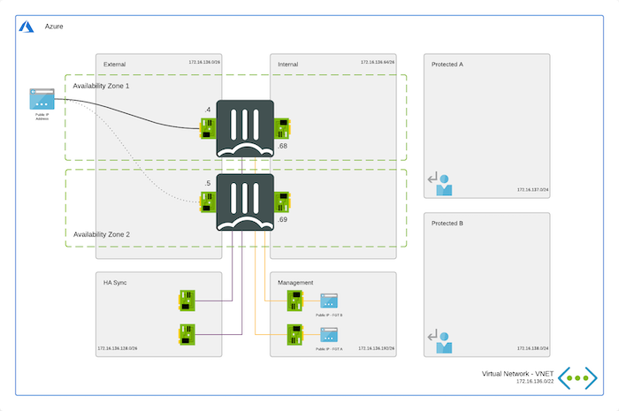

# Availability Zone - Active/Passive High Available FortiGate pair with Fabric Connector Failover

## Introduction

This design operates almost exactly the same as the more common variant using Availability Sets that can be found [here](/FortiGate/Active-Passive-SDN/README.md). The main difference between both is that these templates use Availability Zones instead the Availability Sets.

Microsoft defines an Availability Zone to have the following properties:

- Unique physical location with an Azure Region
- Each zone is made up of one or more datacenter(s)
- Independent power, cooling and networking
- Inter Availability Zone network latency < 2ms (radius of +/- 100km)
- Fault-tolerant to protect from datacenter failure

Based on information in the presentation ['Inside Azure datacenter architecture with Mark Russinovich' at Microsoft Ignite 2019](https://www.youtube.com/watch?v=X-0V6bYfTpA)

## Design

VMs running in Microsoft Azure using Availability Zones have a better SLA provided by the platform. Each individual VM in this setup has a 99.99% uptime SLA compared to 99.95% for the VMs running in a Availability Set. SLA documentation from Microsoft can be found [here](https://azure.microsoft.com/en-us/support/legal/sla/virtual-machines/v1_9/).

A cluster of FortiGate VMs will have a cross region/parallel SLA of 99,999999%. More information about the uptime of the Azure datacenter can be found on [this blog post](https://kvaes.wordpress.com/2020/02/16/is-azure-a-tier-3-datacenter-and-what-about-service-levels-in-a-broader-sense/). FortiGate A will be deployed in Zone 1. FortiGate B will deployed in Zone 2. The template can off course be changed to use other zones.

This ARM template can also be used to extend or customized based on your requirements. Additional subnets besides the ones mentioned above are not automatically generated. By adapting the ARM templates you can add additional subnets which preferably require their own routing tables.

## How to deploy

The FortiGate solution can be deployed using the Azure Portal.

### Azure Portal

Standard Custom Template Deployment:

Azure Portal Wizard Template Deployment:

## Requirements and limitations

More documentation can be found on [the Availability Set version of this template](/FortiGate/Active-Passive-SDN/README.md).

## License

[License](/LICENSE) © Fortinet Technologies. All rights reserved.
