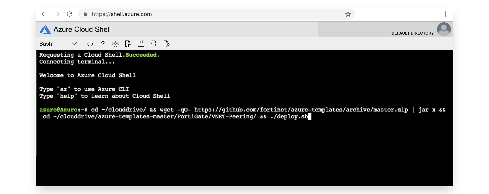

# Availability Zone - Active/Active loadbalanced pair of standalone FortiGates for resilience and scale
*Terraform deployment template for Microsoft Azure*

This design operates almost exactly the same as the more common variant using Availability Sets that can be found [here](../../../Terraform/Active-Active-ELB-ILB/README.md). The main difference between both is that these templates use Availability Zones instead the Availability Sets.

Microsoft defines an Availability Zone to have the following properties:

- Unique physical location with an Azure Region
- Each zone is made up of one or more datacenter(s)
- Independent power, cooling and networking
- Inter Availability Zone network latency < 2ms (radius of +/- 100km)
- Fault-tolerant to protect from datacenter failure

Based on information in the presentation ['Inside Azure datacenter architecture with Mark Russinovich' at Microsoft Ignite 2019](https://www.youtube.com/watch?v=X-0V6bYfTpA)

## Design

VMs running in Microsoft Azure using Availability Zones have a better SLA provided by the platform. Each individual VM in this setup has a 99.99% uptime SLA compared to 99.95% for the VMs running in a Availability Set. SLA documentation from Microsoft can be found [here](https://azure.microsoft.com/en-us/support/legal/sla/virtual-machines/v1_9/).

A cluster of FortiGate VMs will have a cross region/parallel SLA of 99,999999%. More information about the uptime of the Azure datacenter can be found on [this blog post](https://kvaes.wordpress.com/2020/02/16/is-azure-a-tier-3-datacenter-and-what-about-service-levels-in-a-broader-sense/). FortiGate A will be deployed in Zone 1. FortiGate B will deployed in Zone 2. The template can off course be changed to use other zones.

This Terraform template can also be used to extend or customized based on your requirements. Additional subnets besides the one's mentioned above are not automatically generated. By adapting the ARM templates you can add additional subnets which preferably require their own routing tables.

## How to deploy

For the deployment Terraform is required. This multi-cloud deployment tool can be downloaded from the website of [Hashicorp](https://www.terraform.io/) who created and maintains it. You can either run the different stage manually (terraform init, plan, apply). Additionally, a `deploy.sh` script is provided to facilitate the deployment. You'll be prompted to provide the 4 required variables:

- PREFIX : This prefix will be added to each of the resources created by the template for ease of use and visibility.
- LOCATION : This is the Azure region where the deployment will be deployed.
- USERNAME : The username used to login to the FortiGate GUI and SSH management UI.
- PASSWORD : The password used for the FortiGate GUI and SSH management UI.

For Microsoft Azure there is a fast track option by using the Azure Cloud Shell. The Azure Cloud Shell is an in-browser CLI that contains Terraform and other tools for deployment into Microsoft Azure. Azure Cloud Shell is accessible via the Azure Portal or directly via [https://shell.azure.com/](https://shell.azure.com). You can copy and past the below one-liner to get start with your deployment.

`cd ~/clouddrive/ && wget -qO- https://github.com/fortinet/azure-templates/archive/master.tar.gz | tar zxf - && cd ~/clouddrive/azure-templates-master/FortiGate/Terraform/Active-Active-ELB-ILB/ && ./deploy.sh`

After deployment you will be shown the IP address of all deployed components, this information is also stored in the output directory in the `summary.out` file. You can access both management GUIs and SSH using the public IP address of the load balancer using HTTPS on port 40030, 40031 and for SSH on port 50030 and 50031.

!!! Beware that the output directory, Terraform Plan file and Terraform State files contain deployment information such as password, usernames, IP addresses and others.

## Requirements and limitations

The Terraform template deployment deploys different resources and is required to have the access rights and quota in your Microsoft Azure subscription to deploy the resources.

More documentation can be found in [the Availability Set version of this template](../../../Terraform/Active-Active-ELB-ILB/README.md) and [the ARM template version of this template](../../../Active-Active-ELB-ILB/README.md).

## Support
Fortinet-provided scripts in this and other GitHub projects do not fall under the regular Fortinet technical support scope and are not supported by FortiCare Support Services.
For direct issues, please refer to the [Issues](https://github.com/fortinet/azure-templates/issues) tab of this GitHub project.
For other questions related to this project, contact [github@fortinet.com](mailto:github@fortinet.com).

## License
[License](LICENSE) © Fortinet Technologies. All rights reserved.
