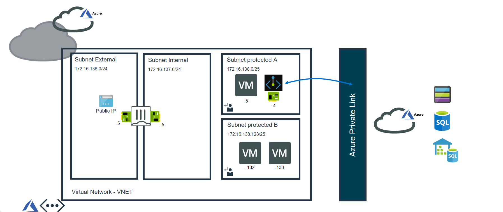
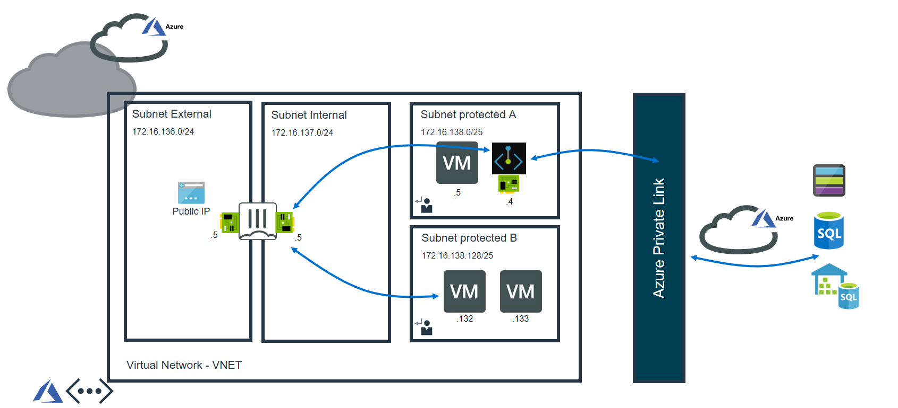
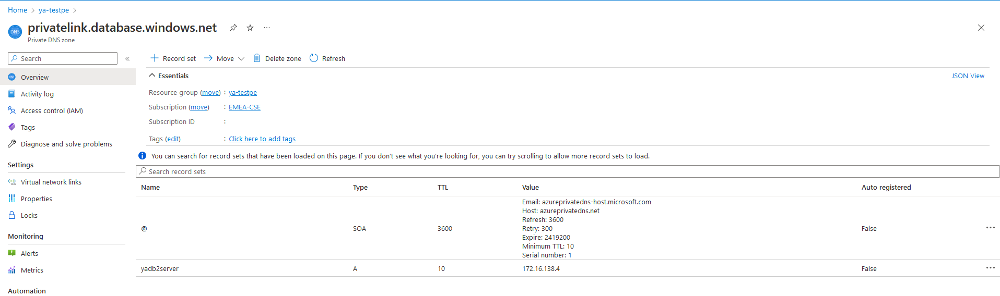
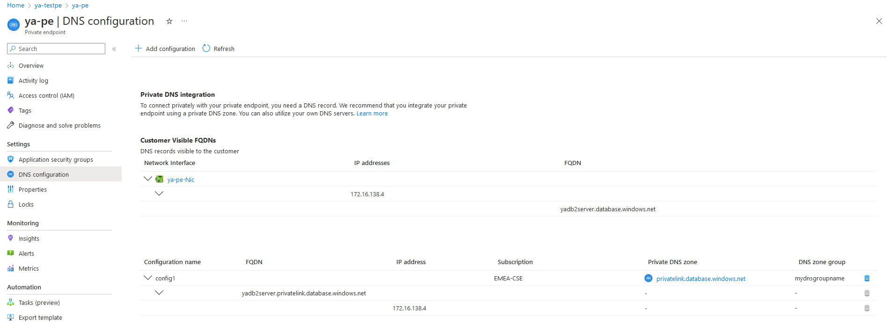
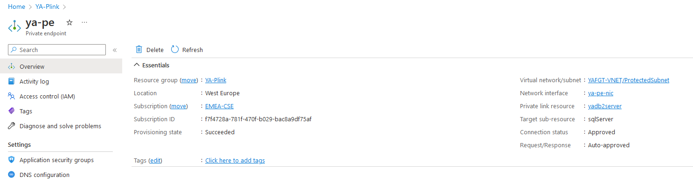
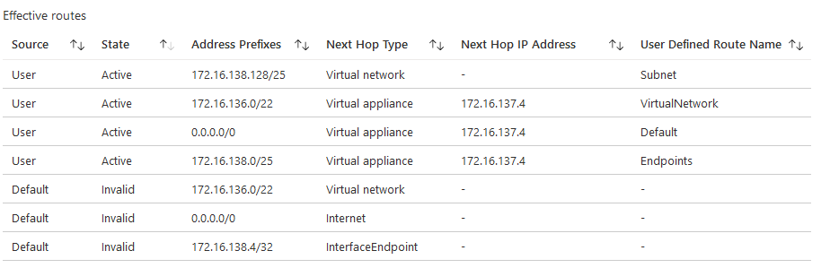
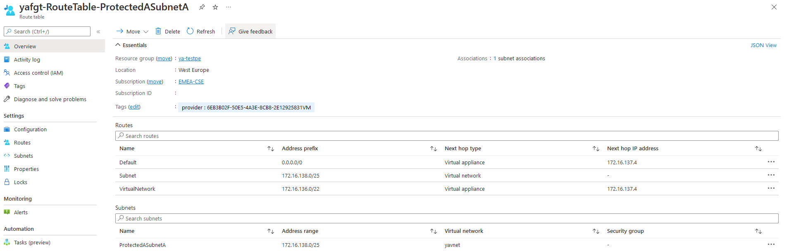
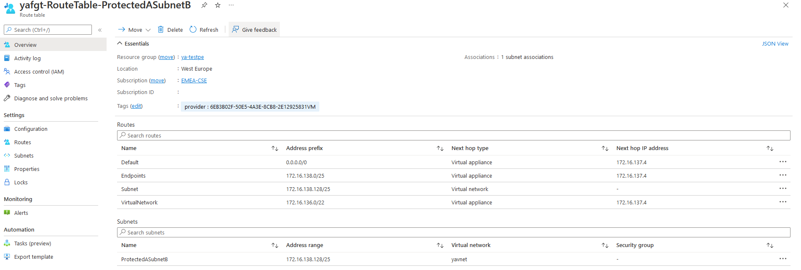
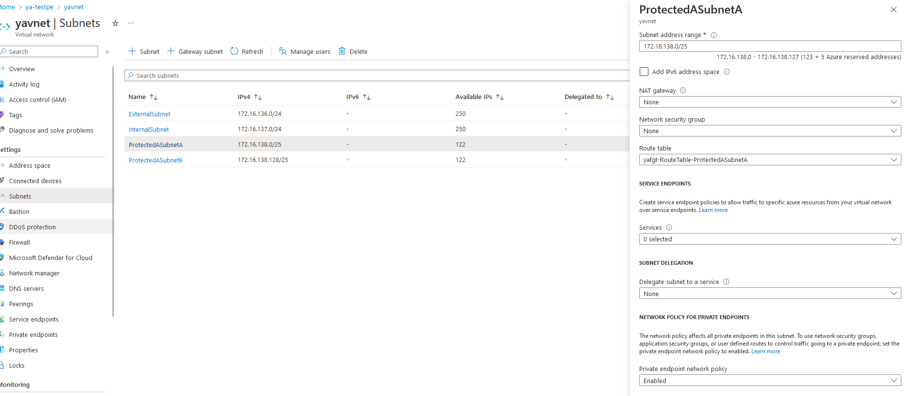

# Private Link integration with FGT

## Introduction

Private endpoint allow you to connect privately and securely to azure PAAS service such as Azure Storage and Azure SQL database.
Private endpoint will be linked to azure service. It uses interface with private IP address from your Vnet.

We will interoduce here Fortient solution to integrate FGT with private endpoint. 
This will allow FGT to inspect all traffic between client machines and Private endpoint.

You can find more information about private endpoint properties and supported resources from [here](https://docs.microsoft.com/en-us/azure/private-link/private-endpoint-overview).

## Design

The ARM template will deploy here the following components:

- 1 Vnet with for subnets:
  - Internal subnet for FGT internal interface 
  - External subnet for FGT external interface
  - ProtectedSubnetA where the private endpoint is located
  - ProtectedSubnetB where the client windows machines can be deployed 

- Single FGT Vm with two interfaces which are located in internal and external subnets.
- 1 public IP address attached to FGT external interface
- Private endpoint with interface linked to the selected resource (ex: SQL server)
- Private DNS zone linked to Vnet
- Routing table for ProtectedSubnetA
- Routing table for ProtectedSubnetB

The traffic should be forwarded from client to FGT internal interface for traffice inspection. 
After that FGT will send the traffic from internal interface to the private endpoint interface.

Private DNS integration with private endpoint is <b>mandatory</b> here. The clients should be able to resolve the server FQDN with the Private endpoint IP address.

There is a list of DNS zone names related to each resource/sub resource. Microsoft reommend to use that list for DNS zone integrated with the private endpoint.
Please, check the link from [here](https://docs.microsoft.com/en-us/azure/private-link/private-endpoint-dns).

You could also verify your private endpoint settings. You can check that the private link resource is linked to the correct service and the connection status is approved.

When the private endpoint is created , a route will be injected in the routing table to forward the traffic to the end point. We have overwrite this route to forward the traffic from the client to FGT first. You can check The effective routes on the client interface to see the valid routes.

The screenshots below show how routing table looks like for private endpoint and client subnets. Basically, all traffic should be forwarded to the FGT internal interface behalf the traffic within the same subnet.

Microsoft has announced recently about feature enhancement related to UDR support for private endpoint.

There is no need now to use/32 prefix for the endpoint. 
you can use wider prefix in the routing table for routes destined to private endpoints. This enhancement requires enable Private endpoints subnet property which is callled <b>PrivateEndpointNetworkPolicies</b>.

Microsoft recommends also to use always <b>SNAT</b> for the traffic destined to a private endpoint to ensure return traffic is honored. You can find [here](https://docs.microsoft.com/en-us/azure/private-link/private-endpoint-overview) UDR limitations.

## Deployment: Azure Portal

Custom Deployment:

## Requirements and limitations

The ARM template deploys different resources and it is required to have the access rights and quota in your Microsoft Azure subscription to deploy the resources.

- The template will deploy Standard F2s VMs for this architecture. Other VM instances are supported as well with a minimum of 2 NICs. A list can be found [here](https://docs.fortinet.com/document/fortigate-public-cloud/7.0.0/azure-administration-guide/562841/instance-type-support)
- Licenses for Fortigate
  - BYOL: A demo license can be made available via your Fortinet partner or on our website. These can be injected during deployment or added after deployment. Purchased licenses need to be registered on the [Fortinet support site](http://support.fortinet.com). Download the .lic file after registration. Note, these files may not work until 60 minutes after it's initial creation.
  - PAYG or OnDemand: These licenses are automatically generated during the deployment of the FortiGate systems.
  - The password provided during deployment must need password complexity rules from Microsoft Azure:
  - It must be 12 characters or longer
  - It needs to contain characters from at least 3 of the following groups: uppercase characters, lowercase characters, numbers, and special characters excluding '\' or '-'
- The terms for the FortiGate PAYG or BYOL image in the Azure Marketplace needs to be accepted once before usage. This is done automatically during deployment via the Azure Portal. For the Azure CLI the commands below need to be run before the first deployment in a subscription.
  - BYOL
`az vm image terms accept --publisher fortinet --offer fortinet_fortigate-vm_v5 --plan fortinet_fg-vm`
  - PAYG
`az vm image terms accept --publisher fortinet --offer fortinet_fortigate-vm_v5 --plan fortinet_fg-vm_payg_2022`

## FortiGate configuration

The FortiGate VMs need a specific configuration to match the deployed environment. This configuration can be injected during provisioning or afterwards via the different options including GUI, CLI, FortiManager or REST API.

- [Default configuration using this template](doc/config-provisioning.md)

Some additional DNS configuration is required on FGT if the client wants to connect to private endpoint through IPsec tunnel. In this case FGT should work as DNS Forwarder. You can find [here](doc/FGT-DNS-Forwarder.md)  more detail.

### Fabric Connector

The FortiGate-VM uses [Managed Identities](https://docs.microsoft.com/en-us/azure/active-directory/managed-identities-azure-resources/) for the SDN Fabric Connector. A SDN Fabric Connector is created automatically during deployment. After deployment, it is required apply the 'Reader' role to the Azure Subscription you want to resolve Azure Resources from. More information can be found on the [Fortinet Documentation Libary](https://docs.fortinet.com/vm/azure/fortigate/7.0/azure-administration-guide/7.0.0/236610/creating-a-fabric-connector-using-a-managed-identity).

## Support

Fortinet-provided scripts in this and other GitHub projects do not fall under the regular Fortinet technical support scope and are not supported by FortiCare Support Services.
For direct issues, please refer to the [Issues](https://github.com/40net-cloud/fortinet-azure-solutions/issues) tab of this GitHub project.

## License

[License](/../../blob/main/LICENSE) © Fortinet Technologies. All rights reserved.
