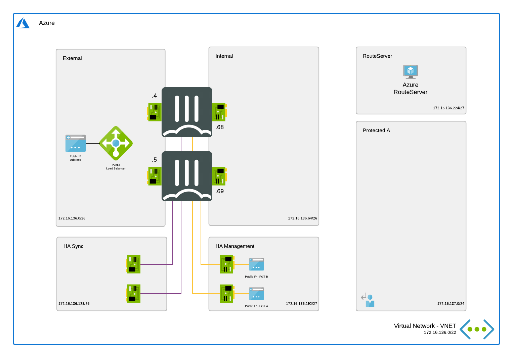

## Active/Passive High Available FortiGate pair with Azure Route Server

# Introduction

More and more enterprises are turning to Microsoft Azure to extend internal data centers and take advantage of the elasticity of the public cloud. While Azure secures the infrastructure, you are responsible for protecting everything you put in it. Fortinet Security Fabric provides Azure the broad protection, native integration and automated management enabling customers with consistent enforcement and visibility across their multi-cloud infrastructure.

This Terraform template deploys a High Availability pair of FortiGate Next-Generation Firewalls accompanied by the required infrastructure. Additionally, Fortinet Fabric Connectors deliver the ability to create dynamic security policies.

# Design

In Microsoft Azure, you can deploy an active/passive pair of FortiGate VMs that communicate with each other and the Azure fabric. This FortiGate setup will receive the to be inspected traffic using user defined routing (UDR) and public IPs. You can send all or specific traffic that needs inspection, going to/coming from on-prem networks or public internet by adapting the UDR routing.

This Terraform template will automatically deploy a full working environment containing the the following components.

  - 2 FortiGate firewall's in an active/passive deployment
  - 1 VNET with 1 protected subnets, 1 routeserver subnet and 4 subnets required for the FortiGate deployment (external, internal, ha mgmt and ha sync).
	- 4 public IPs. The first public IP is for cluster access to/through the active FortiGate. Two for MGMT access to each FortiGate and the last one is required for the Azure Route Server
  - User Defined Routes (UDR) for the FortiGate VMs
  - Azure Route Server and all configuration on the FortiGate to get started

## Deployment

For the deployment Terraform is required. This multi-cloud deployment tool can be downloaded from the website of [Hashicorp](https://www.terraform.io/) who created and maintains it. You can either run the different stage manually (terraform init, plan, apply). Additionally, a `deploy.sh` script is provided to facilitate the deployment. You'll be prompted to provide the 4 required variables:

- PREFIX : This prefix will be added to each of the resources created by the template for ease of use and visibility.
- LOCATION : This is the Azure region where the deployment will be deployed.
- USERNAME : The username used to login to the FortiGate GUI and SSH management UI.
- PASSWORD : The password used for the FortiGate GUI and SSH management UI.

For Microsoft Azure there is a fast track option by using the Azure Cloud Shell. The Azure Cloud Shell is an in-browser CLI that contains Terraform and other tools for deployment into Microsoft Azure. Azure Cloud Shell is accessible via the Azure Portal or directly via [https://shell.azure.com/](https://shell.azure.com). You can copy and past the below one-liner to get start with your deployment.

`cd ~/clouddrive/ && wget -qO- https://github.com/40net-cloud/fortinet-azure-solutions/archive/main.tar.gz | tar zxf - && cd ~/clouddrive/fortinet-azure-solutions/FortiGate/AzureRouteServer/Terraform/Active-Passive/ && ./deploy.sh`

# Requirements and limitations

The Terraform template deployment deploys different resources and is required to have the access rights and quota in your Microsoft Azure subscription to deploy the resources.

For more specific information verify the documentation included in the [ARM-Template](https://github.com/40net-cloud/fortinet-azure-solutions/tree/main/FortiGate/AzureRouteServer/Active-Passive)

## Fabric Connector

The FortiGate-VM uses [Managed Identities](https://docs.microsoft.com/en-us/azure/active-directory/managed-identities-azure-resources/) for the SDN Fabric Connector. A SDN Fabric Connector is created automatically during deployment. After deployment, it is required apply the 'Reader' role to the Azure Subscription you want to resolve Azure Resources from. More information can be found on the [Fortinet Documentation Libary](https://docs.fortinet.com/document/fortigate-public-cloud/7.2.0/azure-administration-guide/236610/configuring-an-sdn-connector-using-a-managed-identity).

## Support
Fortinet-provided scripts in this and other GitHub projects do not fall under the regular Fortinet technical support scope and are not supported by FortiCare Support Services.
For direct issues, please refer to the [Issues](https://github.com/fortinet/azure-templates/issues) tab of this GitHub project.
For other questions related to this project, contact [github@fortinet.com](mailto:github@fortinet.com).

## License
[License](/../../blob/main/LICENSE) © Fortinet Technologies. All rights reserved.
