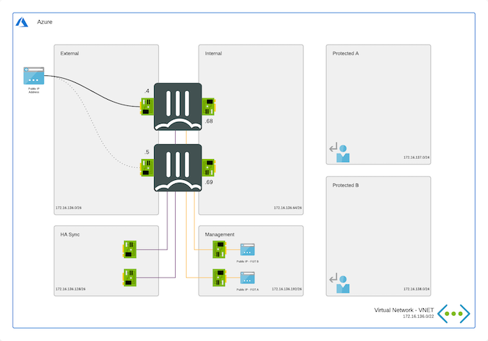

# Active/Passive High Available FortiGate pair with Fabric Connector Failover

## Introduction

This ARM template deploys a High Availability pair of FortiGate Next-Generation Firewalls accompanied by the required infrastructure. Additionally, Fortinet Fabric Connectors deliver the ability to create dynamic security policies.

## Design

In Microsoft Azure Stack Hub, you can deploy an active/passive pair of FortiGate VMs that communicate with each other and the Azure fabric. This FortiGate setup will receive the to be inspected traffic using user defined routing (UDR) and public IPs. You can send all or specific traffic that needs inspection, going to/coming from on-prem networks or public internet by adapting the UDR routing.

This Azure ARM template will automatically deploy a full working environment containing the the following components.

  - 2 FortiGate firewall's in an active/passive deployment
  - 1 VNET with 2 protected subnets and 4 subnets required for the FortiGate deployment (external, internal, ha mgmt and ha sync). If using an existing vnet, it must already have 5 subnets
	- 3 public IPs. The first public IP is for cluster access to/through the active FortiGate.  The other two PIPs are for Management access
  - User Defined Routes (UDR) for the protected subnets

This ARM template can also be used to extend or customized based on your requirements. Additional subnets besides the one's mentioned above are not automatically generated. By adapting the ARM templates you can add additional subnets which preferably require their own routing tables.

## How to deploy

The FortiGate solution can be deployed using the Azure Portal or Azure CLI. There are 4 variables needed to complete kickstart the deployment. The deploy.sh script will ask them automatically. When you deploy the ARM template the Azure Portal will request the variables as a requirement.

  - PREFIX : This prefix will be added to each of the resources created by the templates for easy of use, manageability and visibility.
  - LOCATION : This is the Azure region where the deployment will be deployed
  - USERNAME : The username used to login to the FortiGate GUI and SSH management UI.
  - PASSWORD : The password used for the FortiGate GUI and SSH management UI.

### Azure Portal

## Requirements and limitations

The ARM template deploys different resources and it is required to have the access rights and quota in your Microsoft Azure subscription to deploy the resources.

- The template will deploy Standard F4s VMs for this architecture. Other VM instances are supported as well with a minimum of 4 NICs. A list can be found [here](https://docs.fortinet.com/document/fortigate-public-cloud/7.4.0/azure-administration-guide/562841/instance-type-support)
- Licenses for FortiGate
  - BYOL: A demo license can be made available via your Fortinet partner or on our website. These can be injected during deployment or added after deployment. Purchased licenses need to be registered on the [Fortinet support site] (http://support.fortinet.com). Download the .lic file after registration. Note, these files may not work until 60 minutes after it's initial creation.
  - PAYG or OnDemand: These licenses are automatically generated during the deployment of the FortiGate systems.
- The password provided during deployment must need password complexity rules from Microsoft Azure:
  - It must be 12 characters or longer
  - It needs to contain characters from at least 3 of the following groups: uppercase characters, lowercase characters, numbers, and special characters excluding '\' or '-'

## FortiGate configuration

The FortiGate VMs need a specific configuration to operate in your environment. This configuration can be injected during provisioning or afterwards via the different management options including GUI, CLI, FortiManager or REST API.

- [Default configuration using this template](doc/config-provisioning.md)
- [Failover configuration](doc/config-failover.md)

### Fabric Connector

The FortiGate-VM uses service principal to access the Azure Stack Hub management inteface. A SDN Fabric Connector needs to be created after deployment. Additional role assigments are needed to give the SDN connector access to the resources in 'Reader' mode and/or access to the routing tables, public IPs and virtual machine for failover. More information can be found on the [Fortinet Documentation Libary](https://docs.fortinet.com/document/fortigate-public-cloud/7.0.0/azure-administration-guide/419755/sdn-connector-in-azure-stack).

## Support
Fortinet-provided scripts in this and other GitHub projects do not fall under the regular Fortinet technical support scope and are not supported by FortiCare Support Services.
For direct issues, please refer to the [Issues](https://github.com/fortinet/azure-templates/issues) tab of this GitHub project.
For other questions related to this project, contact [github@fortinet.com](mailto:github@fortinet.com).

## License
[License](/../../blob/main/LICENSE) © Fortinet Technologies. All rights reserved.