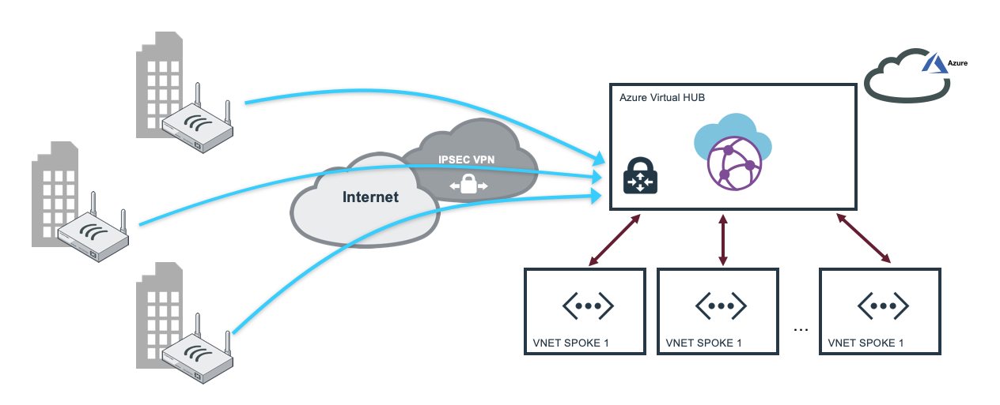
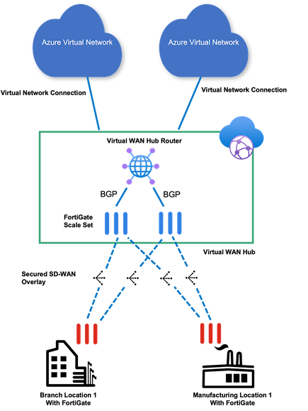
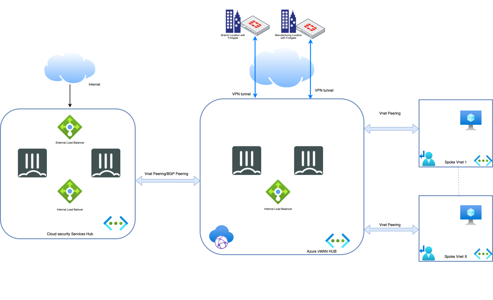
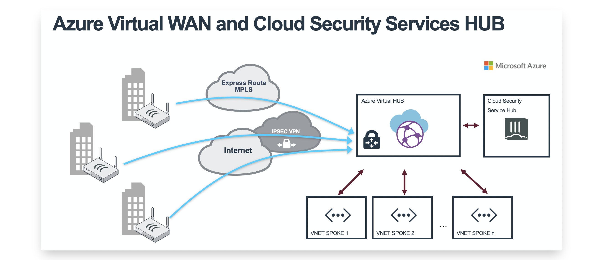
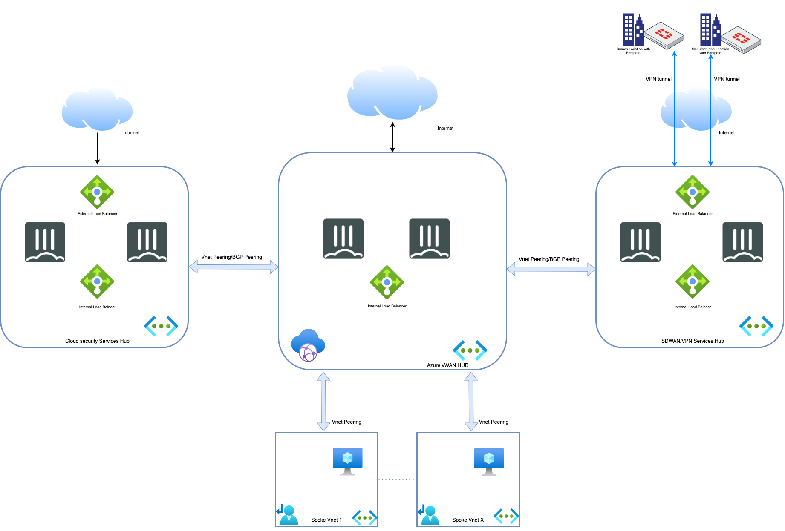
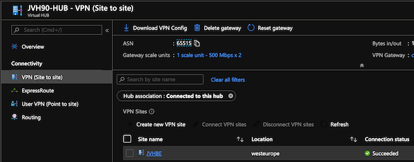
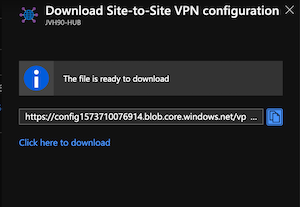

# Fortigate NGFW for Microsoft Azure Virtual WAN


## Introduction

Microsoft Azure Virtual WAN provides easy, unified and global connectivity. It support large-scale branch connectivity and optimal routing using the Microsoft global network. The FortiGate appliances located in branch and datacenter locations can connect into Microsoft Azure Virtual HUB. From the Azure Virtual HUB connections can be made to peered VNETs as well as other Virtual HUBs in different regions.

## Design

On this webpage we have created different scenarios on how to integrate FortiGate and Microsoft Azure Virtual WAN. All of these scenarios can be deployed using the associated ARM template into your Azure Subscription. Once connected and configured there is a webpage contained on this github that will convert the JSON configuration provided by Microsoft Azure Virtual WAN into a FortiGate VPN configuration that you can copy and paste into your device.

* Scenario 1 : FortiGate branch connection into Virtual HUB using Azure VPN Gateway

* Scenario 2 : FortiGate integration inside Azure Virtual WAN HUB
* Scenario 3 : FortiGate  integration inside Azure Virtual WAN HUB with additional Cloud Security Services Hub for publishing services to Internet 
* Scenario 4 : FortiGate branch connection into Virtual HUB with peered VNETs secured by a FortiGate Active/Passive cluster
* Scenario 5 : FortiGate  integration inside Azure Virtual WAN HUB with additional Cloud Security Services Hub for publishing services to Internet and SDWAN/VPN Services Hub for VPN connectivity

## Deployment

Deployment of the different scenario's is either via the ARM template or Azure CLI depending on the supported functionality in the deployment method. Generally the Azure CLI option is better supported at the moment for deployment. The Azure Cloud Shell is an in-browser version of Azure CLI that contains all the required tools for deployment in to Microsoft Azure. It is accessible via the Azure Portal or directly at [https://shell.azure.com/](https://shell.azure.com). You can copy and paste the below one-liner to get started with your deployment.

You'll be prompted to provide a minimum of 2 required variables as well as specific variables per scenario:

- PREFIX : This prefix will be prepended to each of the resources names created by the template for ease of use and visibility.
- LOCATION : This is the Azure region where the deployment will be deployed.

### Scenario 1 FortiGate branch connection into Virtual HUB using Azure VPN Gateway



Scenario 1 will deploy a branch to Azure Virtual HUB setup. Azure VirtualWAN components will be deployed and a first VPN branch site is configured in Azure VirtualWAN. To manage the VPN tunnels, you can use our Azure Function to manage both the Azure VirtualWAN and branch IPSEC config. For smaller setups or demo a convertor is linked that will convert your Azure VirtualWAN json info into a FortiGate configuration.

- [FortiGate and Azure Virtual WAN integration](https://www.fortinet.com/content/dam/fortinet/assets/deployment-guides/dg-fortigate-azure-wan-integration.pdf)
- [FortiGate Azure Virtual WAN config convertor](https://40net-cloud.github.io/fortinet-azure-solutions/FortiGate/AzureVirtualWAN/)

To configure the first branch VPN tunnel the endpoint and private ip range of this branch are required during deployment:

- VPNSITE PREFIX : This prefix will be prepended to each of the resources regarding the VPN Branch connecting into Virtual WAN.
- VPNSITE PUBLIC IP ADDRESS : This is the public IP address of the FortiGate device connecting into Virtual WAN.

Details about post deployment and Fortigate Azure Virtual WAN converter are provided 
[here](https://github.com/piotr-nwt/Github/tree/master/fortinet-azure-solutions-main/FortiGate/AzureVirtualWAN#post-deployment)

#### Azure Portal

<a href="https://portal.azure.com/#create/Microsoft.Template/uri/https%3A%2F%2Fraw.githubusercontent.com%2F40net-cloud%2Ffortinet-azure-solutions%2Fmain%2FFortiGate%2FAzureVirtualWAN%2Fscenario1%2Fazuredeploy.json" target="_blank">
  
</a>
<a href="http://armviz.io/#/?load=https%3A%2F%2Fraw.githubusercontent.com%2F40net-cloud%2Ffortinet-azure-solutions$2Fmain%2FFortiGate%2FAzureVirtualWAN%2Fscenario1%2Fazuredeploy.json" target="_blank">
  
</a>

#### Azure CLI

`cd ~/clouddrive/ && wget -qO- https://github.com/40net-cloud/fortinet-azure-solutions/archive/main.tar.gz | tar zxf - && cd ~/clouddrive/fortinet-azure-solutions-main/FortiGate/AzureVirtualWAN/scenario1/ && ./deploy.sh`

### Scenario 2 : FortiGate integration inside Azure Virtual WAN HUB


In Scenario 2 FortiGate-VMs are deployed and run natively inside Azure vWAN HUB in Active/Active Cluster.  With this integration, you can use a Managed Application to deploy FortiGate-VM into the Azure Virtual WAN hub, where the FortiGate will be deployed and configured automatically to peer via BGP with the Virtual WAN hub router, extending next-generation firewall and secure SD-WAN capabilities to the cloud. To further simplify the process, FortiGate-VM can be deployed directly from Azure Marketplace, or can be deployed from the virtual hub via the Azure portal. 

You can use the one-touch configurations from the Azure Virtual WAN portal to enable security policies and routing for North-South, East-West traffic, and internet-bound traffic. This allows you to apply FortiGate-VM’s extensive security services including IPS, application control, and SSL, as well as SD-WAN services such as application steering, to Virtual WAN traffic.
The solution is scalable, load balanced and configured for active-active highly resilient deployments.

FortiGate-VM and Fortinet Secure SD-WAN Native Integration with Azure Virtual WAN provides multiple benefits like :
- Elasticity as this solution is scalable, load balanced and configured for active-active highly resilient deployments
- Managed Application: FortiGate-VM is being deployed as Azure Managed Application. This eases administration overhead aspects of IaaS solutions providing automated deployment and configuration, automated updates and upgrades, as well as constant monitoring of the solution.
- Best-in-class SD-WAN and [NGFW](https://www.fortinet.com/products/next-generation-firewall.html?utm_source=blog&utm_campaign=fortigate) solution. FortiGate-VM is the only solution in the market that can provide those two functionalities in one offering for Azure vWAN HUB,

Below you can find links to sections describing in details architecture of this setup and flows for outbound and east-west connectivity.

[Architecture](flows/architecture.md)

[Flows](flows/flows.md)


### Scenario 3: FortiGate  integration inside Azure Virtual WAN HUB with additional Cloud Security Services Hub for publishing services to Internet 


Scenario 3 combines integration of FortiGate-VMs in Azure vWAN HUB and Cloud Security Services Hub which consist of Active Passive HA FortiGate cluster with External & Internal Azure Load Balancer that is described in details [here](https://github.com/40net-cloud/fortinet-azure-solutions/tree/main/FortiGate/Active-Passive-ELB-ILB).
You can find there information about the flows in this architecture as well as ARM template for it's deployment.

This scenario can be used in situation when you would like to publish some services running in Azure like http/https to Internet using  Cloud Security Services Hub. As Public IPs used by FortiGates-VM running inside Azure vWAN HUB belongs to Microsoft and are kept in managed resource group belonging to Microsoft there is in no possibility to use use them to publish services.
Therefore such combination of FortiGate vWAN Hub integration & Cloud Security Services Hub gives you possibility to overcome this limitation.

In this architecture you can configure an Azure Virtual WAN hub router to peer with Fortigates in your Cloud Security Services Hub  using BGP Peering described [here](https://learn.microsoft.com/en-us/azure/virtual-wan/create-bgp-peering-hub-portal)


### Scenario 4 : FortiGate branch connection into Virtual HUB with peered VNETs secured by a FortiGate Active/Passive cluster



Scenario 4 uses the Azure Virtual WAN routing capabilities. Either using static routing or BGP dynamic routing. Both scenario's have separate page with more information.

- [Static Routing](routing/)
- [Dynamic routing using BGP Peering](bgppeering/)

### Scenario 5 : FortiGate  integration inside Azure Virtual WAN HUB with additional Cloud Security Services Hub for publishing services to Internet and SDWAN/VPN Services Hub for VPN connectivity



For  Enterprise customers with substantial amount of resources deployed in Microsoft Azure and large number of on-premise branch officies which should be connected to Microsoft Azure vWAN HUB we created an architecture where different use-cases are handled by different FortiGate-VM HA clusters.

Scenario 5 consist of:
- Azure vWAN HUB with integrated FortiGate-VM which is used for North-South VNET to Internet and East-West VNET to VNET filtering
- Cloud Security Services Hub (AP HA ELB/ILB FortiGate-VM cluster) which is used for secure publishing of services like HTTP, HTTPS, RDP etc. to the Internet
- SDWAN/VPN Services Hub which is used for VPN/SDWAN connectivity between on-premise branch officies and Microsoft Azure

As a result this is very scalable architecture which fits the needs of large Enterprise customers requiring high performance.

In this architecture you can configure an Azure Virtual WAN hub router to peer with Fortigates in your Cloud Security Services Hub & SDWAN/VPN Services Hub  using BGP Peering described [here](https://learn.microsoft.com/en-us/azure/virtual-wan/create-bgp-peering-hub-portal)

## Post deployment

The deployment of the VPN Gateway inside the Azure Virtual HUB can take some time (>30min). Once everything is in the 'Succeeded' state. The VPN Site configuration can be downloaded from the Azure Portal.





[FortiGate Azure Virtual WAN convertor](https://40net-cloud.github.io/fortinet-azure-solutions/FortiGate/Playground/AzureVirtualWAN/)

Using [this webpage](https://40net-cloud.github.io/fortinet-azure-solutions/FortiGate/Playground/AzureVirtualWAN/) you can convert the Microsoft JSON configuration file of a vpn site into a FortiGate configuration that can be added into the FortiGate branch configuration. This webpage can also be downloaded but only processes data locally in your browser using Javascript. No data is send to a server for processing.

The external and internal interface of the FortiGate needs to be added into the resulting configuration. Search for "## EXTERNAL INTERFACE ##" and "## INTERNAL INTERFACE ##".

```
config system interface
  edit "VPNSITE1-1"
    set vdom "root"
    set ip 169.127.32.1 255.255.255.255
    set type tunnel
    set remote-ip 172.16.110.13 255.255.255.255
    set interface "## EXTERNAL INTERFACE ##"
  next
  edit "VPNSITE1-2"
    set vdom "root"
    set ip 169.127.32.1 255.255.255.255
    set type tunnel
    set remote-ip 172.16.110.12 255.255.255.255
    set interface "## EXTERNAL INTERFACE ##"
  next
end
```

```
config firewall policy
  edit 0
    set srcintf "VPNSITE1-1" "VPNSITE2-2"
    set dstintf "## INTERNAL INTERFACE ##"
    set srcaddr all
    set dstaddr all
    set action accept
    set schedule always
    set service ANY
  next
end
config firewall policy
  edit 0
    set srcintf "## INTERNAL INTERFACE ##"
    set srcintf "VPNSITE1-1" "VPNSITE2-2"
    set srcaddr all
    set dstaddr all
    set action accept
    set schedule always
    set service ANY
  next
end
```

## Requirements and limitations

The Azure ARM template deployment deploys different resources and is required to have the access rights and quota in your Microsoft Azure subscription to deploy the resources.

- The template will deploy Standard F4s VMs to deploy the required active/passive setup. More information can be found in the documentation on this setup.

## Support
Fortinet-provided scripts in this and other GitHub projects do not fall under the regular Fortinet technical support scope and are not supported by FortiCare Support Services.
For direct issues, please refer to the [Issues](https://github.com/fortinet/azure-templates/issues) tab of this GitHub project.
For other questions related to this project, contact [github@fortinet.com](mailto:github@fortinet.com).

## License
[License](LICENSE) © Fortinet Technologies. All rights reserved.
