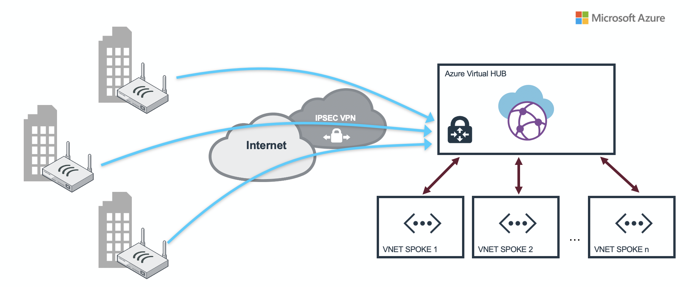
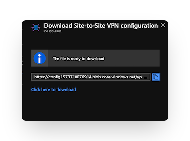

# Fortigate NGFW for Microsoft Azure Virtual WAN


## Introduction

Microsoft Azure Virtual WAN provides easy, unified and global connectivity. It supports large-scale branch connectivity and optimal routing using the Microsoft global network. 

Fortinet offers integration with Azure Virtual WAN in different ways to provide different security and connectivity solutions both inside Azure as well as on-premise locations into Azure. There are different architectures available that each provide specific functionality. Some functionality can be overlapping between the different architectures. In this overview, we are going to give all the information needed to select the architecture or combination of architectures for your environment.

Azure Virtual WAN offers options to interact with FortiGate Next-Generation Firewall in different locations. Different scenario's can be combined to provide more performance, separation of functions, management.

* Inside Azure Virtual WAN Hub. The FortiGate is deployed through a solution that is jointly managed by Microsoft Azure and FortiManager
* Outside Azure Virtual WAN Hub in a peered spoke acting as a Cloud Security Services Hub
* On-premises FortiGate in branch or datacenter connecting via SD-WAN using both IPSec tunnels and/or ExpressRoute

### FortiGate inside Azure Virtual WAN Hub

[//]: # (scenario 2)
* [FortiGate Secure SD-WAN](#fortigate-secure-sd-wan-inside-azure-virtual-wan-hub): 
Connecting your branches and datacenters into the FortiGate Next-Generation Firewall running in Virtual WAN Hub and managed by FortiManager 

### FortiGate outside Azure Virtual WAN Hub

In case the integrated model is doesn't fit your organisation or you already have a FortiGate cluster running in a hub spoke model you can connect this environment with Azure Virtual WAN.

[//]: # (scenario 3)
* [North-South](#north-south): Handling the inbound connectivity from internet to your workloads connected to Azure Virtual WAN
[//]: # (scenario 4)
* Branch to spoke inspection - traffic inspection by the FortiGate-VM for traffic initiated in the branch or spoke
[//]: # (scenario 5)
* FortiGate Secure SD-WAN - connecting your branches to a FortiGate-VM cluster outside of the Virtual WAN hub

### FortiGate connectivity to Azure Virtual WAN Hub
[//]: # (-)
* [FortiGate connectivity to the VPN Gateway inside of Virtual WAN Hub](#fgt2vpngateway)

## Deployment

Deployment of the different scenario's is either via the Azure Portal, ARM template or Azure CLI depending on the supported functionality in the deployment method. Depending on the availability a link to the Azure Portal, a guide or CLI command will be shown to get your started with the deployment. The links will be provided in each of the scenario subsections.

## Scenarios

### FortiGate Secure SD-WAN (inside Azure Virtual WAN Hub)
*Connecting your branches and datacenters into the FortiGate Next-Generation Firewall running in Virtual WAN Hub and managed by FortiManager*

<p align="center">
  
</p>

In this scenario, a FortiGate-VMs Active/Active cluster is deployed and runs natively inside Azure Virtual WAN Hub. With this integration, the FortiGate-VMs are deployed using a Managed Application on Azure Marketplace, into the Azure Virtual WAN hub. During deployment the FortiGate-VMs are configured  to peer via BGP with the Virtual WAN hub router as well as link it with the FortiManager for further management. 

The solution is load balanced and configured for active-active highly resilient deployments.

FortiGate-VM and Fortinet Secure SD-WAN Native Integration with Azure Virtual WAN provides multiple benefits like :
- Elasticity as this solution is scalable, load balanced and configured for active-active highly resilient deployments
- Managed Application: FortiGate-VM is being deployed as Azure Managed Application. This eases administration overhead aspects of IaaS solutions providing automated deployment and configuration, automated updates and upgrades, as well as constant monitoring of the solution.
- Best-in-class SD-WAN and [NGFW](https://www.fortinet.com/products/next-generation-firewall.html?utm_source=blog&utm_campaign=fortigate) solution. FortiGate-VM is the only solution in the market that can provide those two functionalities in one offering for Azure vWAN HUB,

This setup can be combined with different FortiGate deployment outside of the Virtual WAN Hub like the [North-South](#north-south) setup for ingress publishing of services.

More information can be found [here](doc/insidevwan-sdwan.md)

### North-South
*Inbound connectivity from internet to your workloads connected to Azure Virtual WAN*

<p align="center">
  
</p>

In this scenario, the ingress traffic flows are handled by a FortiGate-VM cluster outside of the Virtual WAN Hub. The Public IPs assigned to the FortiGate instances inside the Virtual WAN Hub only provide access for management using FortiManager and IPSEC VPN tunnels. To provide any additional access to your workload a separate FortiGate cluster can be installed in a spoke VNET, dubbed "Cloud Security Services Hub", handling all the inbound traffic using an External Azure Load Balancer. 

In this scenario, you can configure an Azure Virtual WAN hub router to peer with Fortigates in your Cloud Security Services Hub using BGP Peering.

* [Microsoft: Azure Virtual WAN BGP peering](https://learn.microsoft.com/en-us/azure/virtual-wan/create-bgp-peering-hub-portal)
* [Microsoft: Azure Virtual WAN Hub routing](https://learn.microsoft.com/en-us/azure/virtual-wan/about-virtual-hub-routing).

More information can be found [here](doc/outsidevwan-north-south.md)


### Scenario 4 : FortiGate branch connection into Virtual HUB with peered VNETs secured by a FortiGate Active/Passive cluster


Scenario 4 uses the Azure Virtual WAN routing capabilities. Either using static routing or BGP dynamic routing. Both scenario's have separate page with more information.

- [Static Routing](routing/)
- [Dynamic routing using BGP Peering](bgppeering/)

### Scenario 5 : FortiGate  integration inside Azure Virtual WAN HUB with additional Cloud Security Services Hub for publishing services to Internet and SDWAN/VPN Services Hub for VPN connectivity


For  Enterprise customers with substantial amount of resources deployed in Microsoft Azure and large number of on-premise branch officies which should be connected to Microsoft Azure vWAN HUB we created an architecture where different use-cases are handled by different FortiGate-VM HA clusters.

Scenario 5 consist of:
- Azure vWAN HUB with integrated FortiGate-VM which is used for North-South VNET to Internet and East-West VNET to VNET filtering
- Cloud Security Services Hub (AP HA ELB/ILB FortiGate-VM cluster) which is used for secure publishing of services like HTTP, HTTPS, RDP etc. to the Internet
- SDWAN/VPN Services Hub which is used for VPN/SDWAN connectivity between on-premise branch officies and Microsoft Azure

As a result this is very scalable architecture which fits the needs of large Enterprise customers requiring high performance.

In this architecture you can configure an Azure Virtual WAN hub router to peer with Fortigates in your Cloud Security Services Hub & SDWAN/VPN Services Hub  using BGP Peering described [here](https://learn.microsoft.com/en-us/azure/virtual-wan/create-bgp-peering-hub-portal)

### FortiGate connectivity to the VPN Gateway inside of Virtual WAN Hub



In this scenario, the FortiGate in a branch location will connect to the Virtual HUB VPN Gateway. 

To configure the VPN tunnels you need to configure both Azure and the FortiGate on-premises.

- [Fortinet: local FortiGate to Azure VPN Gateway](https://docs.fortinet.com/document/fortigate-public-cloud/7.2.0/azure-administration-guide/989216/connecting-a-local-fortigate-to-an-azure-vnet-vpn)
- [Microsoft: Create a site-to-site connection to Azure Virtual WAN](https://learn.microsoft.com/en-us/azure/virtual-wan/virtual-wan-site-to-site-portal)
- [Microsoft: Supported encrption and authentication methods](https://learn.microsoft.com/en-us/azure/virtual-wan/virtual-wan-ipsec)

For smaller setups or demo a convertor is linked that will convert your Azure VirtualWAN VPN config into a FortiGate configuration.
- [FortiGate Azure Virtual WAN config convertor](https://40net-cloud.github.io/fortinet-azure-solutions/FortiGate/AzureVirtualWAN/)

An ARM Template is provide to deploy a Azure Virtual WAN setup and a Virtual WAN configuration for a first VPN branch site. A prefix and public IP address of the branch FortiGate are required during deployment:

- VPNSITE PREFIX : This prefix will be prepended to each of the resources regarding the VPN Branch connecting into Virtual WAN.
- VPNSITE PUBLIC IP ADDRESS : This is the public IP address of the FortiGate device connecting into Virtual WAN.

#### Deployment

[](https://portal.azure.com/#create/Microsoft.Template/uri/https%3A%2F%2Fraw.githubusercontent.com%2F40net-cloud%2Ffortinet-azure-solutions%2Fmain%2FFortiGate%2FAzureVirtualWAN%2Fscenario1%2Fazuredeploy.json)
[](http://armviz.io/#/?load=https%3A%2F%2Fraw.githubusercontent.com%2F40net-cloud%2Ffortinet-azure-solutions$2Fmain%2FFortiGate%2FAzureVirtualWAN%2Fscenario1%2Fazuredeploy.json)

Details about post deployment and Fortigate Azure Virtual WAN converter are provided [here](#post-deployment)


## Post deployment {#post-deployment}

The deployment of the VPN Gateway inside the Azure Virtual HUB can take some time (>30min). Once everything is in the 'Succeeded' state. The VPN Site configuration can be downloaded from the Azure Portal.




[FortiGate Azure Virtual WAN convertor](https://40net-cloud.github.io/fortinet-azure-solutions/FortiGate/Playground/AzureVirtualWAN/)

Using [this webpage](https://40net-cloud.github.io/fortinet-azure-solutions/FortiGate/Playground/AzureVirtualWAN/) you can convert the Microsoft JSON configuration file of a vpn site into a FortiGate configuration that can be added into the FortiGate branch configuration. This webpage can also be downloaded but only processes data locally in your browser using Javascript. No data is send to a server for processing.

The external and internal interface of the FortiGate needs to be added into the resulting configuration. Search for "## EXTERNAL INTERFACE ##" and "## INTERNAL INTERFACE ##".

```
config system interface
  edit "VPNSITE1-1"
    set vdom "root"
    set ip 169.127.32.1 255.255.255.255
    set type tunnel
    set remote-ip 172.16.110.13 255.255.255.255
    set interface "## EXTERNAL INTERFACE ##"
  next
  edit "VPNSITE1-2"
    set vdom "root"
    set ip 169.127.32.1 255.255.255.255
    set type tunnel
    set remote-ip 172.16.110.12 255.255.255.255
    set interface "## EXTERNAL INTERFACE ##"
  next
end
```

```
config firewall policy
  edit 0
    set srcintf "VPNSITE1-1" "VPNSITE2-2"
    set dstintf "## INTERNAL INTERFACE ##"
    set srcaddr all
    set dstaddr all
    set action accept
    set schedule always
    set service ANY
  next
end
config firewall policy
  edit 0
    set srcintf "## INTERNAL INTERFACE ##"
    set srcintf "VPNSITE1-1" "VPNSITE2-2"
    set srcaddr all
    set dstaddr all
    set action accept
    set schedule always
    set service ANY
  next
end
```

## Requirements and limitations

The Azure ARM template deployment deploys different resources and is required to have the access rights and quota in your Microsoft Azure subscription to deploy the resources.

- The template will deploy Standard F4s VMs to deploy the required active/passive setup. More information can be found in the documentation on this setup.

## Support
Fortinet-provided scripts in this and other GitHub projects do not fall under the regular Fortinet technical support scope and are not supported by FortiCare Support Services.
For direct issues, please refer to the [Issues](https://github.com/fortinet/azure-templates/issues) tab of this GitHub project.
For other questions related to this project, contact [github@fortinet.com](mailto:github@fortinet.com).

## License
[License](LICENSE) © Fortinet Technologies. All rights reserved.
