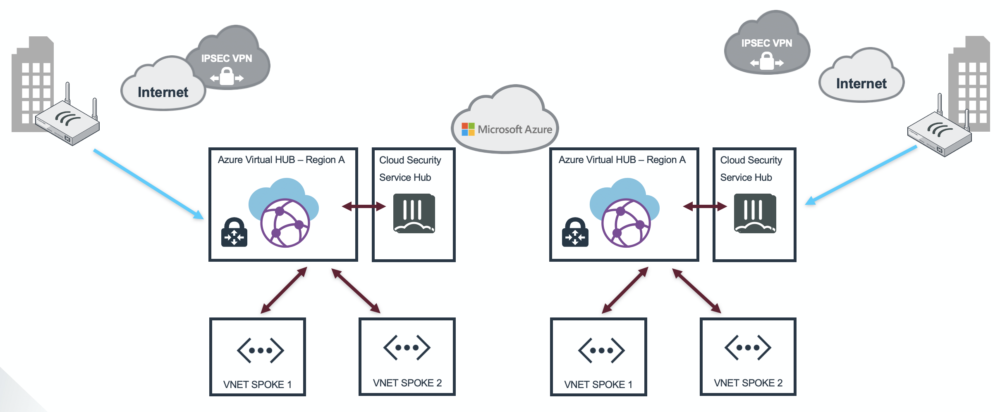

# Fortigate NGFW for Microsoft Azure Virtual WAN

## Introduction

Microsoft Azure Virtual WAN provides easy, unified and global connectivity. It support large-scale branch connectivity and optimal routing using the Microsoft global network. The FortiGate appliances located in branch and datacenter locations can connect into Microsoft Azure Virtual HUB. From the Azure Virtual HUB connections can be made to peered VNETs as well as other Virtual HUBs in different regions.

## Design

On this webpage we have created different scenarios on how to integrate FortiGate and Microsoft Azure Virtual WAN. All of these scenarios can be deployed using the associated ARM template into your Azure Subscription. Once connected and configured there is a webpage contained on this github that will convert the JSON configuration provided by Microsoft Azure Virtual WAN into a FortiGate VPN configuration that you can copy and paste into your device.

* Scenario 1 : FortiGate branch connection into Virtual HUB
* Scenario 2 : FortiGate branch connection into Virtual HUB with peered VNETs secured by a FortiGate Active/Passive cluster
* Scenario 3 : FortiGate branch connection into Virtual HUB and onto a Virtual HUB in a different region with a FortiGate branch connected
* Scenario 4 : FortiGate branch connection into FortiGate in Azure using Virtual WAN to connect to different regions across the Microsoft global network

*Currently scenario 3 is on the roadmap by Microsoft as mentioned in their [documentation](https://docs.microsoft.com/en-us/azure/virtual-wan/virtual-wan-global-transit-network-architecture).*

## Deployment

For the deployment, you can use the Azure Portal, Azure CLI, Powershell or Azure Cloud Shell. The Azure ARM templates are exclusive to Microsoft Azure and can't be used in other cloud environments. The main templates are `scenarioX.json` where the X is the number of the scenario. You can use these templates in the Azure Portal by clicking on the 'Deploy to Azure' button. Alternatively, a `deploy.sh` script is provided to facilitate the deployment. This script can use the Azure Cloud Shell. The Azure Cloud Shell is an in-browser CLI that contains all the required tools for deployment in to Microsoft Azure. It is accessible via the Azure Portal or directly at [https://shell.azure.com/](https://shell.azure.com). You can copy and paste the below one-liner to get started with your deployment.

You'll be prompted to provide a minimum of 2 required variables as well as specific variables per scenario:

- PREFIX : This prefix will be prepended to each of the resources names created by the template for ease of use and visibility.
- LOCATION : This is the Azure region where the deployment will be deployed.

### Post deployment

The deployment of the VPN Gateway inside the Azure Virtual HUB can take some time (>30min). Once everything is in the 'Succeeded' state. The VPN Site configuration can be downloaded from the Azure Portal.


[FortiGate Azure Virtual WAN convertor](https://40net-cloud.github.io/fortinet-azure-solutions/FortiGate/Playground/AzureVirtualWAN/)

Using [this webpage](https://40net-cloud.github.io/fortinet-azure-solutions/FortiGate/Playground/AzureVirtualWAN/) you can convert the Microsoft JSON configuration file of a vpn site into a FortiGate configuration that can be added into the FortiGate branch configuration. This webpage can also be downloaded but only processes data locally in your browser using Javascript. No data is send to a server for processing.

The external and internal interface of the FortiGate needs to be added into the resulting configuration. Search for "## EXTERNAL INTERFACE ##" and "## INTERNAL INTERFACE ##".

```
config system interface
  edit "VPNSITE1-1"
    set vdom "root"
    set ip 169.127.32.1 255.255.255.255
    set type tunnel
    set remote-ip 172.16.110.13 255.255.255.255
    set interface "## EXTERNAL INTERFACE ##"
  next
  edit "VPNSITE1-2"
    set vdom "root"
    set ip 169.127.32.1 255.255.255.255
    set type tunnel
    set remote-ip 172.16.110.12 255.255.255.255
    set interface "## EXTERNAL INTERFACE ##"
  next
end
```

```
config firewall policy
  edit 0
    set srcintf "VPNSITE1-1" "VPNSITE2-2"
    set dstintf "## INTERNAL INTERFACE ##"
    set srcaddr all
    set dstaddr all
    set action accept
    set schedule always
    set service ANY
  next
end
config firewall policy
  edit 0
    set srcintf "## INTERNAL INTERFACE ##"
    set srcintf "VPNSITE1-1" "VPNSITE2-2"
    set srcaddr all
    set dstaddr all
    set action accept
    set schedule always
    set service ANY
  next
end
```

### Scenario 1


- VPNSITE PREFIX : This prefix will be prepended to each of the resources regarding the VPN Branch connecting into Virtual WAN.
- VPNSITE PUBLIC IP ADDRESS : This is the public IP address of the FortiGate device connecting into Virtual WAN.

#### Azure Portal

<a href="https://portal.azure.com/#create/Microsoft.Template/uri/https%3A%2F%2Fraw.githubusercontent.com%2F40net-cloud%2Ffortinet-azure-solutions%2Fmain%2FFortiGate%2FAzureVirtualWAN%2Fscenario1%2Fazuredeploy.json" target="_blank"></a>
<a href="http://armviz.io/#/?load=https%3A%2F%2Fraw.githubusercontent.com%2F40net-cloud%2Ffortinet-azure-solutions$2Fmain%2FFortiGate%2FAzureVirtualWAN%2Fscenario1%2Fazuredeploy.json" target="_blank">
    
</a>

#### Azure CLI

`cd ~/clouddrive/ && wget -qO- https://github.com/40net-cloud/fortinet-azure-solutions/archive/main.zip | jar x && cd ~/clouddrive/fortinet-azure-solutions-main/FortiGate/AzureVirtualWAN/ && ./scenario1.sh`

### Scenario 2


- VPNSITE PREFIX : This prefix will be prepended to each of the resources regarding the VPN Branch connecting into Virtual WAN.
- VPNSITE PUBLIC IP ADDRESS : This is the public IP address of the FortiGate device connecting into Virtual WAN.
- ADMINPASSWORD : Password for the FortiGate cluster deployed in Azure

#### Azure Portal

<a href="https://portal.azure.com/#create/Microsoft.Template/uri/https%3A%2F%2Fraw.githubusercontent.com%2F40net-cloud%2Ffortinet-azure-solutions%2Fmain%2FFortiGate%2FAzureVirtualWAN%2Fscenario2%2Fazuredeploy.json" target="_blank"></a>
<a href="http://armviz.io/#/?load=https%3A%2F%2Fraw.githubusercontent.com%2F40net-cloud%2Ffortinet-azure-solutions$2Fmain%2FFortiGate%2FAzureVirtualWAN%2Fscenario2%2Fazuredeploy.json" target="_blank">
    
</a>

#### Azure CLI

`cd ~/clouddrive/ && wget -qO- https://github.com/40net-cloud/fortinet-azure-solutions/archive/main.zip | jar x && cd ~/clouddrive/fortinet-azure-solutions-main/FortiGate/AzureVirtualWAN/ && ./scenario2.sh`

### Scenario 3


#### Azure Portal

<a href="https://portal.azure.com/#create/Microsoft.Template/uri/https%3A%2F%2Fraw.githubusercontent.com%2F40net-cloud%2Ffortinet-azure-solutions%2Fmain%2FFortiGate%2FAzureVirtualWAN%2Fscenario3%2Fazuredeploy.json" target="_blank"></a>
<a href="http://armviz.io/#/?load=https%3A%2F%2Fraw.githubusercontent.com%2F40net-cloud%2Ffortinet-azure-solutions$2Fmain%2FFortiGate%2FAzureVirtualWAN%2Fscenario3.json" target="_blank">
    
</a>

#### Azure CLI

`cd ~/clouddrive/ && wget -qO- https://github.com/40net-cloud/fortinet-azure-solutions/archive/main.zip | jar x && cd ~/clouddrive/fortinet-azure-solutions-main/FortiGate/AzureVirtualWAN/ && ./scenario3.sh`

<!---
### Scenario 4



#### Azure Portal

<a href="https://portal.azure.com/#create/Microsoft.Template/uri/https%3A%2F%2Fraw.githubusercontent.com%2F40net-cloud%2Ffortinet-azure-solutions%2Fmain%2FFortiGate%2FAzureVirtualWAN%2Fscenario4.json" target="_blank"></a>
<a href="http://armviz.io/#/?load=https%3A%2F%2Fraw.githubusercontent.com%2F40net-cloud%2Ffortinet-azure-solutions$2Fmain%2FFortiGate%2FAzureVirtualWAN%2Fscenario3.json" target="_blank">
    
</a>
--->

## Requirements and limitations

The Azure ARM template deployment deploys different resources and is required to have the access rights and quota in your Microsoft Azure subscription to deploy the resources.

- The template will deploy Standard F4s VMs to deploy the required active/passive setup
- Licenses for Fortigate
  - BYOL: A demo license can be made available via your Fortinet partner or on our website. These can be injected during deployment or added after deployment.
  - PAYG or OnDemand: These licenses are automatically generated during the deployment of the FortiGate systems.

The FortiGate-VM uses [Managed Identities](https://docs.microsoft.com/en-us/azure/active-directory/managed-identities-azure-resources/)for the SDN Fabric Connector. A SDN Fabric Connector is created automatically during deployment. After deployment, it is required apply the 'Reader' role to Azure Subscription you want the FortiGate-VM(s) to resolve Azure Resources from.

## Support
Fortinet-provided scripts in this and other GitHub projects do not fall under the regular Fortinet technical support scope and are not supported by FortiCare Support Services.
For direct issues, please refer to the [Issues](https://github.com/fortinet/azure-templates/issues) tab of this GitHub project.
For other questions related to this project, contact [github@fortinet.com](mailto:github@fortinet.com).

## License
[License](LICENSE) © Fortinet Technologies. All rights reserved.
