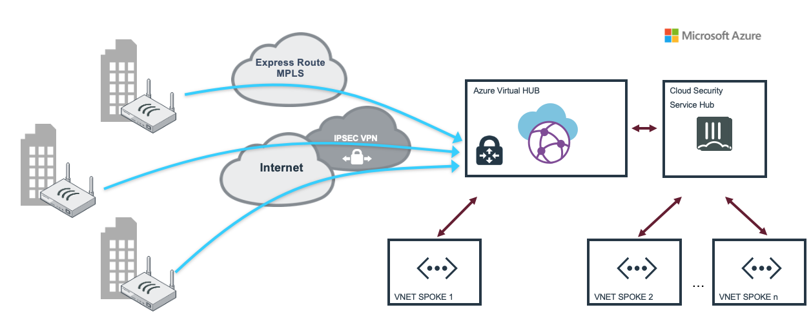
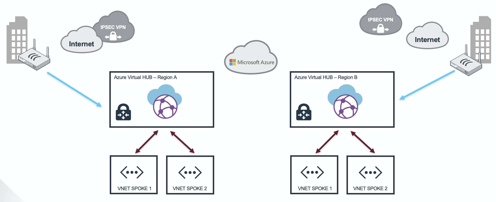
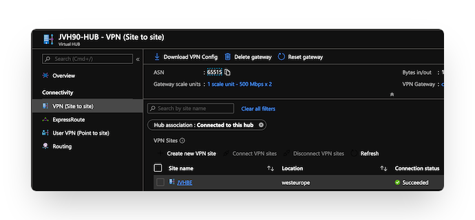

# Fortigate NGFW for Microsoft Azure Virtual WAN

## Introduction

Microsoft Azure Virtual WAN provides easy, unified and global connectivity. It support large-scale branch connectivity and optimal routing using the Microsoft global network. The FortiGate appliances located in branch and datacenter locations can connect into Microsoft Azure Virtual HUB. From the Azure Virtual HUB connections can be made to peered VNETs as well as other Virtual HUBs in different regions.

## Design

On this webpage we have created different scenarios on how to integrate FortiGate and Microsoft Azure Virtual WAN. All of these scenarios can be deployed using the associated ARM template into your Azure Subscription. Once connected and configured there is a webpage contained on this github that will convert the JSON configuration provided by Microsoft Azure Virtual WAN into a FortiGate VPN configuration that you can copy and paste into your device.

* Scenario 1 : FortiGate branch connection into Virtual HUB
* Scenario 2 : FortiGate branch connection into Virtual HUB with peered VNETs secured by a FortiGate Active/Passive cluster
* Scenario 3 : FortiGate branch connection into Virtual HUB and onto a Virtual HUB in a different region with a FortiGate branch connected
* Scenario 4 : FortiGate branch connection into FortiGate in Azure using Virtual WAN to connect to different regions across the Microsoft global network

## Deployment

Deployment of the different scenario's is either via the ARM template or Azure CLI depending on the supported functionality in the deployment method. Generally the Azure CLI option is better supported at the moment for deployment. The Azure Cloud Shell is an in-browser version of Azure CLI that contains all the required tools for deployment in to Microsoft Azure. It is accessible via the Azure Portal or directly at [https://shell.azure.com/](https://shell.azure.com). You can copy and paste the below one-liner to get started with your deployment.

You'll be prompted to provide a minimum of 2 required variables as well as specific variables per scenario:

- PREFIX : This prefix will be prepended to each of the resources names created by the template for ease of use and visibility.
- LOCATION : This is the Azure region where the deployment will be deployed.

### Scenario 1


Scenario 1 will deploy a branch to Azure Virtual HUB setup. Azure VirtualWAN components will be deployed and a first VPN branch site is configured in Azure VirtualWAN. To manage the VPN tunnels, you can use our Azure Function to manage both the Azure VirtualWAN and branch IPSEC config. For smaller setups or demo a convertor is linked that will convert your Azure VirtualWAN json info into a FortiGate configuration.

- [FortiGate and Azure Virtual WAN integration](https://www.fortinet.com/content/dam/fortinet/assets/deployment-guides/dg-fortigate-azure-wan-integration.pdf)
- [FortiGate Azure Virtual WAN config convertor](https://40net-cloud.github.io/fortinet-azure-solutions/FortiGate/AzureVirtualWAN/)

To configure the first branch VPN tunnel the endpoint and private ip range of this branch are required during deployment:

- VPNSITE PREFIX : This prefix will be prepended to each of the resources regarding the VPN Branch connecting into Virtual WAN.
- VPNSITE PUBLIC IP ADDRESS : This is the public IP address of the FortiGate device connecting into Virtual WAN.

#### Azure Portal

<a href="https://portal.azure.com/#create/Microsoft.Template/uri/https%3A%2F%2Fraw.githubusercontent.com%2F40net-cloud%2Ffortinet-azure-solutions%2Fmain%2FFortiGate%2FAzureVirtualWAN%2Fscenario1%2Fazuredeploy.json" target="_blank">
  
</a>
<a href="http://armviz.io/#/?load=https%3A%2F%2Fraw.githubusercontent.com%2F40net-cloud%2Ffortinet-azure-solutions$2Fmain%2FFortiGate%2FAzureVirtualWAN%2Fscenario1%2Fazuredeploy.json" target="_blank">
  
</a>

#### Azure CLI

`cd ~/clouddrive/ && wget -qO- https://github.com/40net-cloud/fortinet-azure-solutions/archive/main.tar.gz | tar zxf - && cd ~/clouddrive/fortinet-azure-solutions-main/FortiGate/AzureVirtualWAN/scenario1/ && ./deploy.sh`

### Scenario 2



Scenario 2 uses the Azure Virtual WAN routing capabilities. Either using static routing or BGP dynamic routing. Both scenario's have separate page with more information.

- [Static Routing](routing/)
- [Dynamic routing using BGP Peering](bgppeering/)

### Scenario 3



Scenario 3 combines the multiple hubs in different regions and uses the [Microsoft Global Transit Network](https://docs.microsoft.com/en-us/azure/virtual-wan/virtual-wan-global-transit-network-architecture) to transit between the different HUBs.

#### Azure Portal

<a href="https://portal.azure.com/#create/Microsoft.Template/uri/https%3A%2F%2Fraw.githubusercontent.com%2F40net-cloud%2Ffortinet-azure-solutions%2Fmain%2FFortiGate%2FAzureVirtualWAN%2Fscenario3%2Fazuredeploy.json" target="_blank">
  
</a>
<a href="http://armviz.io/#/?load=https%3A%2F%2Fraw.githubusercontent.com%2F40net-cloud%2Ffortinet-azure-solutions$2Fmain%2FFortiGate%2FAzureVirtualWAN%2Fscenario3.json" target="_blank">
  
</a>

#### Azure CLI

`cd ~/clouddrive/ && wget -qO- https://github.com/40net-cloud/fortinet-azure-solutions/archive/main.tar.gz | tar zxf - && cd ~/clouddrive/fortinet-azure-solutions-main/FortiGate/AzureVirtualWAN/scenario3/ && ./deploy.sh`

### Scenario 4

Scenario 4 combines the multiple hubs in different regions and uses the [Microsoft Global Transit Network](https://docs.microsoft.com/en-us/azure/virtual-wan/virtual-wan-global-transit-network-architecture) to transit between the different HUBs from scenario 3 with the scenario 2 where you have the additional control of the traffic using the FortiGate inside each HUB.


## Post deployment

The deployment of the VPN Gateway inside the Azure Virtual HUB can take some time (>30min). Once everything is in the 'Succeeded' state. The VPN Site configuration can be downloaded from the Azure Portal.




[FortiGate Azure Virtual WAN convertor](https://40net-cloud.github.io/fortinet-azure-solutions/FortiGate/Playground/AzureVirtualWAN/)

Using [this webpage](https://40net-cloud.github.io/fortinet-azure-solutions/FortiGate/Playground/AzureVirtualWAN/) you can convert the Microsoft JSON configuration file of a vpn site into a FortiGate configuration that can be added into the FortiGate branch configuration. This webpage can also be downloaded but only processes data locally in your browser using Javascript. No data is send to a server for processing.

The external and internal interface of the FortiGate needs to be added into the resulting configuration. Search for "## EXTERNAL INTERFACE ##" and "## INTERNAL INTERFACE ##".

```
config system interface
  edit "VPNSITE1-1"
    set vdom "root"
    set ip 169.127.32.1 255.255.255.255
    set type tunnel
    set remote-ip 172.16.110.13 255.255.255.255
    set interface "## EXTERNAL INTERFACE ##"
  next
  edit "VPNSITE1-2"
    set vdom "root"
    set ip 169.127.32.1 255.255.255.255
    set type tunnel
    set remote-ip 172.16.110.12 255.255.255.255
    set interface "## EXTERNAL INTERFACE ##"
  next
end
```

```
config firewall policy
  edit 0
    set srcintf "VPNSITE1-1" "VPNSITE2-2"
    set dstintf "## INTERNAL INTERFACE ##"
    set srcaddr all
    set dstaddr all
    set action accept
    set schedule always
    set service ANY
  next
end
config firewall policy
  edit 0
    set srcintf "## INTERNAL INTERFACE ##"
    set srcintf "VPNSITE1-1" "VPNSITE2-2"
    set srcaddr all
    set dstaddr all
    set action accept
    set schedule always
    set service ANY
  next
end
```

## Requirements and limitations

The Azure ARM template deployment deploys different resources and is required to have the access rights and quota in your Microsoft Azure subscription to deploy the resources.

- The template will deploy Standard F4s VMs to deploy the required active/passive setup. More information can be found in the documentation on this setup.

## Support
Fortinet-provided scripts in this and other GitHub projects do not fall under the regular Fortinet technical support scope and are not supported by FortiCare Support Services.
For direct issues, please refer to the [Issues](https://github.com/fortinet/azure-templates/issues) tab of this GitHub project.
For other questions related to this project, contact [github@fortinet.com](mailto:github@fortinet.com).

## License
[License](LICENSE) © Fortinet Technologies. All rights reserved.
