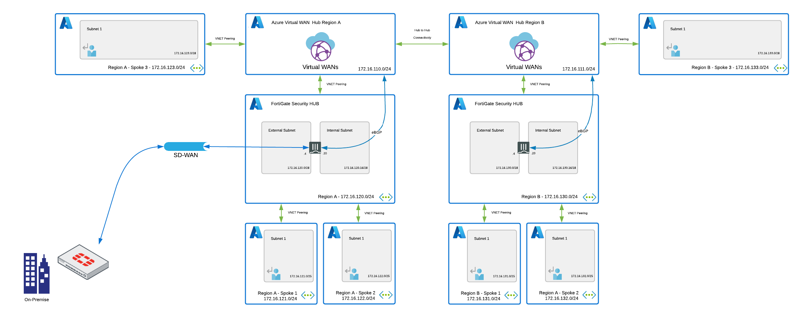
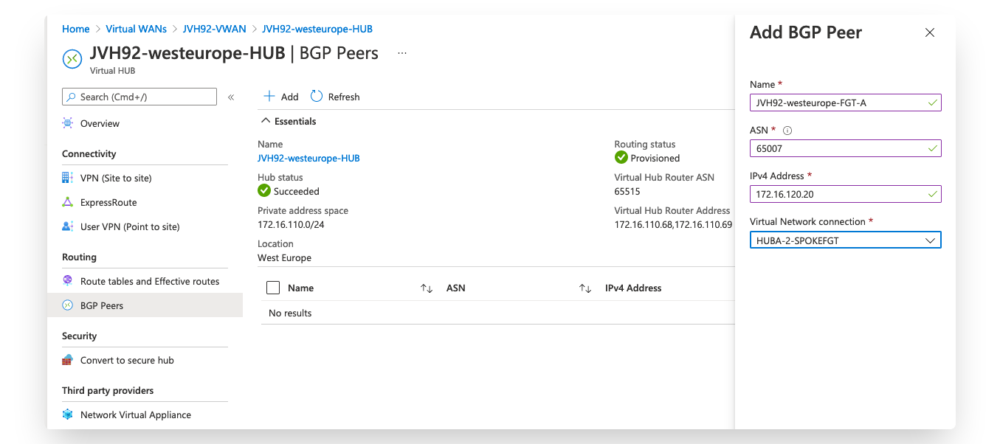
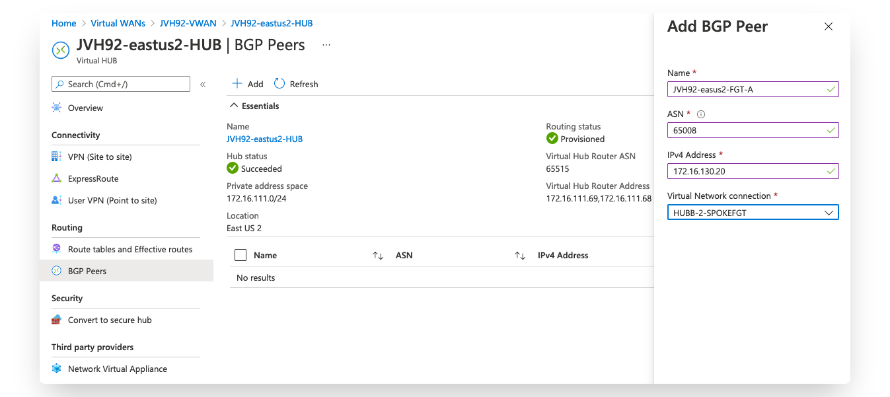
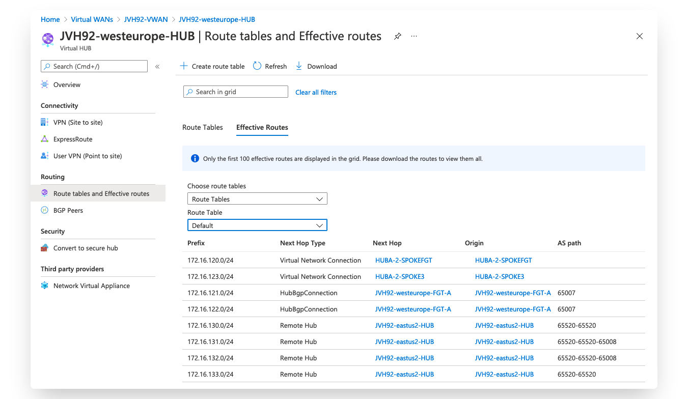
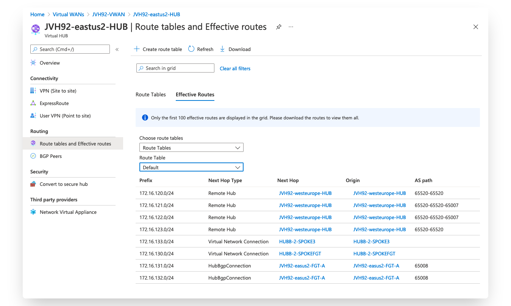

# Azure Virtual WAN BGP peering

## Introduction

Azure Virtual WAN allows exchange of routing information using the BGP protocol between the Azure Virtual WAN hub router and the FortiGate NGFW system. This provides benefits over the static routing options updating both sides as new environments become available, e.g. new VPN tunnels are connected to the FortiGate are forwarded to Azure Virtual WAN hub, routing updates towards the FGT as new hubs and spokes are provisioned.

More information about the BGP peering integration can be found [here](https://docs.microsoft.com/en-us/azure/virtual-wan/scenario-bgp-peering-hub).

Currently the BGP peering option is in Preview. The functionality needs to be enabled by Microsoft for your specific Azure Subscription and Azure Virtual WAN HUB. More information can be found [here](https://docs.microsoft.com/en-us/azure/virtual-wan/create-bgp-peering-hub-portal)

## Design

To showcase the capabilities of the BGP integration a dual hub Azure Virtual WAN setup is to clarify the functionality and the limitations.

The deployment is currently available in the form of a script using Azure CLI. It will automatically deploy a full working environment containing the the following components.

  - 2 single FortiGate firewall's one in each region
  - 4 VNETs per region: FortiGate Hub, Spoke1, Spoke2 and Spoke3. Spoke 1 and 2 are peered with the FortiGate VNET. FortiGate Hub and Spoke3 are peered directly to the VirtualHUB
	- 3 public IPs. The first public IP is for cluster access to/through the active FortiGate.  The other two PIPs are for Management access. To deploy with public IPs on the FortiGate VMs you can use the 'Azure Portal Wizard - Deploy to Azure' button and select none for the the second and third public IP
  - User Defined Routes (UDR) for the FortiGate VM and Spoke 1 and Spoke 2 per region pointing towards the FortiGate VM



This script can also be extended or customized based on your requirements. Additional subnets besides the one's mentioned above are not automatically generated. By adapting the script, you can add additional subnets which preferably require their own routing tables.

## How to deploy

The FortiGate solution is deployed using the Azure Portal combined with a script that uses Azure CLI.

There are minimal 5 variables needed to complete the deployment.

  - PREFIX : This prefix will be added to each of the resources created by the templates for easy of use, manageability and visibility.
  - LOCATION Hub A : This is the Azure region for hub A
  - LOCATION Hub B : This is the Azure region for hub B
  - USERNAME : The username used to login to the FortiGate GUI and SSH management UI.
  - PASSWORD : The password used for the FortiGate GUI and SSH management UI.

### Step 1: Create a resource group for your deployment

#### Azure Portal

1. Search in the Azure Portal top bar for Resource Group and press enter.

2. In the services results select Resource Group. On the Resource Group page, select the Create option.

3. On the Create Resource Group page, fill in the fields. Modify the example values to apply to your environment.

The deployment script uses by default the prefix followed by the string '-RG' as the resource group. To complete this setup it is best to use this naming convention or adapt the deploy script.

#### Azure CLI

Using Azure CLI a resource group can be created with the below command. Replace the words PREFIX and LOCATION with your required values.

```
# az group create --name PREFIX-RG --location LOCATION
{
  "id": "/subscriptions/xxxxxxxx-xxxx-xxxx-xxxx-xxxxxxxxxx/resourceGroups/PREFIX-RG",
  "location": "LOCATION",
  "managedBy": null,
  "name": "PREFIX-RG",
  "properties": {
    "provisioningState": "Succeeded"
  },
  "tags": null,
  "type": "Microsoft.Resources/resourceGroups"
}
```

### Step 2: Create your Azure Virtual WAN

The Azure Virtual WAN needs to be deployed inside of your Azure Subscription. Once deployed the BGP peering features need to be enabled by sending an email as explained in this link [here](https://docs.microsoft.com/en-us/azure/virtual-wan/create-bgp-peering-hub-portal?WT.mc_id=AZ-MVP-5003408#prerequisites)

#### Azure Portal

1. Search in the Azure Portal top bar for Virtual WAN and press enter.

2. In the services results select Virtual WAN. On the Azure Virtual WAN page, select the Create option.

3. On the Create WAN page, on the Basics tab, fill in the fields. Modify the example values to apply to your environment.

The deployment script uses by default the prefix followed by the string '-VWAN' as the resource group. To complete this setup it is best to use this naming convention or adapt the deploy script.

#### Azure CLI

Using Azure CLI a Virtual WAN can be created with the below command. Replace the words PREFIX and LOCATION with your required values.

```
# az network vwan creat --name PREFIX-VWAN --resource-group PREFIX-RG --type
Standard
{
  "allowBranchToBranchTraffic": true,
  "allowVnetToVnetTraffic": null,
  "disableVpnEncryption": false,
  "etag": "W/\"dcf57f42-8860-482b-9abe-60d582d1a9af\"",
  "id": "/subscriptions/xxxxxxxx-xxxx-xxxx-xxxx-xxxxxxxxxx/resourceGroups/PREFIX-RG/providers/Microsoft.Network/virtualWans/PREFIX-VWAN",
  "location": "westeurope",
  "name": "PREFIX-VWAN",
  "office365LocalBreakoutCategory": "None",
  "provisioningState": "Succeeded",
  "resourceGroup": "PREFIX-RG",
  "tags": null,
  "type": "Microsoft.Network/virtualWans",
  "virtualHubs": null,
  "virtualWanType": "Standard",
  "vpnSites": null
}
```

### Step 3: Enable BGP peering on your Azure Virtual WAN

Currently the BGP peering option is in Preview. Follow the guide [here](https://docs.microsoft.com/en-us/azure/virtual-wan/create-bgp-peering-hub-portal) and send an email to enable the feature on the Azure Virtual WAN you just deployed. Once done you can continue with step 4.

### Step 4: Deployment of the demo environment

The setup of the demo environment is currently available using a script that uses Azure CLI commands. The easiest way to get started is to open the Azure Cloud Shell on the Azure Portal via this URL: [https://shell.azure.com/](https://shell.azure.com/)


### Azure CLI

`cd ~/clouddrive/ && wget -qO- https://github.com/40net-cloud/fortinet-azure-solutions/archive/main.tar.gz | tar zxf - && cd ~/clouddrive/fortinet-azure-solutions-main/FortiGate/AzureVirtualWAN/bgppeering/ && ./deploy.sh`

### Step 5: Configure BGP peering

The final step in the deployment is to configure BGP peering on the Virtual Hub. We configuration on the FortiGate is created so that the internal subnet is connecting to the BGP peering endpoint of Virtual WAN.

As the BGP peering is in a gated public preview you need to access the Azure Portal via this link: [https://aka.ms/azurecortexv2](https://aka.ms/azurecortexv2).

- Locate your VWAN configuration using the search bar.
- Open the first HUB and select BGP Peers
- Add the BGP peer configuration entering the ASN, internal FortiGate IP address and the Virtual Network connection linked to the FortiGate.
- Make sure to enable this on both Virtual Hub





After configuration, the routing tables on both the FortiGate and Azure Virtual WAN will show all the networks.

#### Routing table on FortiGate A:

```
JVH92-westeurope-FGT-A # get router info routing-table all
Codes: K - kernel, C - connected, S - static, R - RIP, B - BGP
       O - OSPF, IA - OSPF inter area
       N1 - OSPF NSSA external type 1, N2 - OSPF NSSA external type 2
       E1 - OSPF external type 1, E2 - OSPF external type 2
       i - IS-IS, L1 - IS-IS level-1, L2 - IS-IS level-2, ia - IS-IS inter area
       * - candidate default

Routing table for VRF=0
S*      0.0.0.0/0 [10/0] via 172.16.120.1, port1
S       172.16.110.0/24 [10/0] via 172.16.120.17, port2
S       172.16.120.0/24 [10/0] via 172.16.120.17, port2
C       172.16.120.0/28 is directly connected, port1
C       172.16.120.16/28 is directly connected, port2
S       172.16.121.0/24 [10/0] via 172.16.120.17, port2
S       172.16.122.0/24 [10/0] via 172.16.120.17, port2
B       172.16.123.0/24 [20/0] via 172.16.110.68 (recursive via 172.16.120.17, port2), 00:05:54
                        [20/0] via 172.16.110.69 (recursive via 172.16.120.17, port2), 00:05:54
B       172.16.130.0/24 [20/0] via 172.16.110.68 (recursive via 172.16.120.17, port2), 00:05:54
                        [20/0] via 172.16.110.69 (recursive via 172.16.120.17, port2), 00:05:54
B       172.16.131.0/24 [20/0] via 172.16.110.68 (recursive via 172.16.120.17, port2), 00:00:41
                        [20/0] via 172.16.110.69 (recursive via 172.16.120.17, port2), 00:00:41
B       172.16.132.0/24 [20/0] via 172.16.110.68 (recursive via 172.16.120.17, port2), 00:00:41
                        [20/0] via 172.16.110.69 (recursive via 172.16.120.17, port2), 00:00:41
B       172.16.133.0/24 [20/0] via 172.16.110.68 (recursive via 172.16.120.17, port2), 00:05:54
                        [20/0] via 172.16.110.69 (recursive via 172.16.120.17, port2), 00:05:54
```

#### Routing table on FortiGate B:

```
JVH92-eastus2-FGT-A # get router info routing-table all
Codes: K - kernel, C - connected, S - static, R - RIP, B - BGP
       O - OSPF, IA - OSPF inter area
       N1 - OSPF NSSA external type 1, N2 - OSPF NSSA external type 2
       E1 - OSPF external type 1, E2 - OSPF external type 2
       i - IS-IS, L1 - IS-IS level-1, L2 - IS-IS level-2, ia - IS-IS inter area
       * - candidate default

Routing table for VRF=0
S*      0.0.0.0/0 [10/0] via 172.16.130.1, port1
S       172.16.111.0/24 [10/0] via 172.16.130.17, port2
B       172.16.120.0/24 [20/0] via 172.16.111.68 (recursive via 172.16.130.17, port2), 00:00:35
                        [20/0] via 172.16.111.69 (recursive via 172.16.130.17, port2), 00:00:35
B       172.16.121.0/24 [20/0] via 172.16.111.68 (recursive via 172.16.130.17, port2), 00:00:35
                        [20/0] via 172.16.111.69 (recursive via 172.16.130.17, port2), 00:00:35
B       172.16.122.0/24 [20/0] via 172.16.111.68 (recursive via 172.16.130.17, port2), 00:00:35
                        [20/0] via 172.16.111.69 (recursive via 172.16.130.17, port2), 00:00:35
B       172.16.123.0/24 [20/0] via 172.16.111.68 (recursive via 172.16.130.17, port2), 00:00:35
                        [20/0] via 172.16.111.69 (recursive via 172.16.130.17, port2), 00:00:35
S       172.16.130.0/24 [10/0] via 172.16.130.17, port2
C       172.16.130.0/28 is directly connected, port1
C       172.16.130.16/28 is directly connected, port2
S       172.16.131.0/24 [10/0] via 172.16.130.17, port2
S       172.16.132.0/24 [10/0] via 172.16.130.17, port2
B       172.16.133.0/24 [20/0] via 172.16.111.68 (recursive via 172.16.130.17, port2), 00:00:35
                        [20/0] via 172.16.111.69 (recursive via 172.16.130.17, port2), 00:00:35
```

#### Effective routing table on Virtual Hub A



#### Effective routing table on Virtual Hub B



# FortiGate configuration

The FortiGate VMs need a specific configuration to operate in your environment. This configuration can be injected during provisioning or afterwards via the different management options including GUI, CLI, FortiManager or REST API.

- [Default configuration using this template](doc/config-provisioning.md)

# Requirements and limitations

Any limitations from the [single VM deployment](../../A-Single-VM/README.md) apply here as well.

The Azure Virtual WAN has some considerations to be taken into account and are listed [here](https://docs.microsoft.com/en-us/azure/virtual-wan/scenario-bgp-peering-hub#benefits-and-considerations).


# Support
Fortinet-provided scripts in this and other GitHub projects do not fall under the regular Fortinet technical support scope and are not supported by FortiCare Support Services.
For direct issues, please refer to the [Issues](https://github.com/fortinet/azure-templates/issues) tab of this GitHub project.
For other questions related to this project, contact [github@fortinet.com](mailto:github@fortinet.com).

# License
[License](LICENSE) © Fortinet Technologies. All rights reserved.