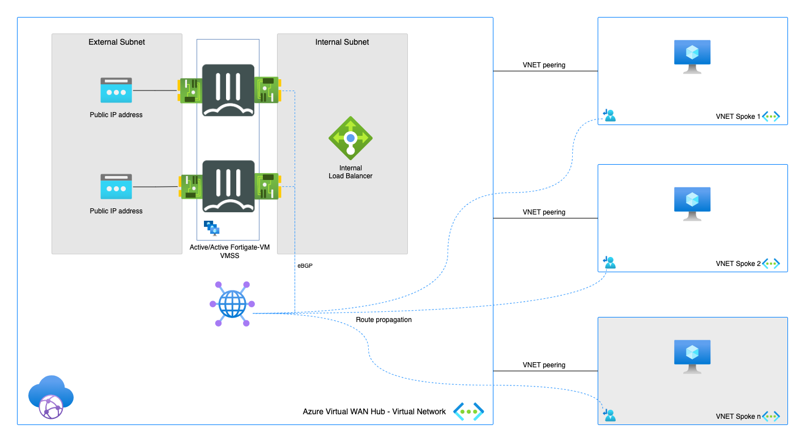
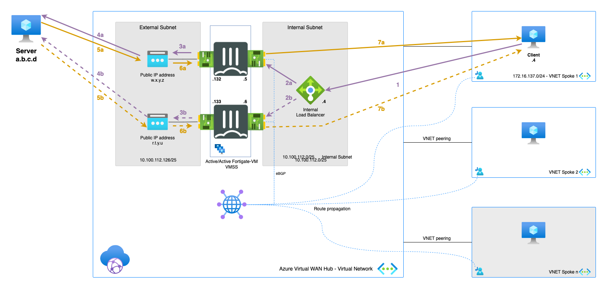

# FortiGate Secure SD-WAN (INSIDE Azure Virtual WAN Hub)
*Connecting your branches and datacenters into the FortiGate Next-Generation Firewall running in Virtual WAN Hub and managed by FortiManager*

  

## Design

  

Setup consist of:
* 2 FortiGate-VMs in a active-active setup using FGSP and UTM Sync
* 2 Public IPs associated with external NICs of the FortiGate-VMs
* Inside of the Azure Virtual WAN Hub an Azure Internal Load Balancer and Azure Routing Service

## Deployment

The integration of the FortiGate inside of the Virtual WAN Hub requires FortiManager to manage the FortiGate instances and the SD-WAN configuration. The deployment process is detailed in the documentation [here](https://docs.fortinet.com/document/fortigate-public-cloud/7.2.2/azure-vwan-sd-wan-deployment-guide/311594/deployment-procedures).

## Requirements and limitations

* FortiManager and FortiGate 7.2.2 and above is required for the deployment integration into Azure Virtual WAN Hub.
* Routing: During the deployment the FortiGate-VMs are coupled to the Azure Routing Service inside the Azure Virtual WAN Hub using BGP. This allows the FortiGate-VMs to inject routes to them for all the remote sites. The gateway the networks is always the ForitGate-VM ip address on the port2.
* The FortiManager needs to be routable and accessible from the FortiGate instances. During the deployment the IP address or dns name of the FortiManager is provided and the FortiGate will try to connect to the FortiManager. Either the FortiManager is accessible via a public IP address and the default route is used. Alternatively, the FortiManager can be reach internal either in a spoke, another hub or on-premises if an IPSEC tunnel or ExpressRoute is terminated on the the Azure Virtual WAN Hub.
* Licenses for Fortigate
  - BYOL: VM, VM Subscription or Flex-VM licenses can be used on these units. A demo license can be made available via your Fortinet partner or on our website. Licenses need to be registered on the [Fortinet support site](http://support.fortinet.com). Download the .lic file after registration. Note, these files may not work until 60 minutes after it's initial creation.
  - PAYG or OnDemand is not supported for the integrated FortiGate-VMs installed inside the Virtual WAN Hub.

## Flows

### Outbound

1. Connection from client to the public IP of server. Azure routes the traffic using Intent Routing to the internal Load Balancer (which is running in managed subscription together with FGTs). - s: 172.16.137.4 - d: a.b.c.d
2. (a/b)Azure Internal Load Balancer probes and send the packet to one of the active FGTs. - s: 172.16.137.4 - d: a.b.c.d
3. (a/b)FGT inspects the packet and when allowed sends the packet translated to it's external port private IP to Public IP associated with the private IP . - s: 10.100.112.132/133 - d: a.b.c.d
4. (a/b)Packet is leaving Azure using public IP address attached and translates the source IP - s: w.x.y.z/r.t.y.u - d: a.b.c.d
5. (a/b)The server responds to the request - s: a.b.c.d d: w.x.y.z/r.t.y.u
6. (a/b)Public IP address associated with corresponding NIC is doing DNAT and forwards the packet to the active FortiGate - s: a.b.c.d - d: 10.100.112.132/133
7. (a/b)The active FGT accepts the return packet after inspection. It translates and routes the packet to the client - s: a.b.c.d - d: 172.16.137.4

### East-West

1. Connection from client to the private IP of server. Azure routes the traffic using Intent Routing to the internal Load Balancer - s: 172.16.137.4 - d: 172.16.138.4
2. zure Internal Load Balancer can send the packet to any of the FGTs in AA cluster. In our diagram we assume that FGT-A received the packet for ease of understanding - s: 172.16.137.4 - d: 172.16.138.4
3. FGT inspects the packet and when allowed sends the packet to the server - s: 172.16.137.4 - d: 172.16.138.4
4. Server responds to the request - s: 172.16.138.4 - d: 172.16.137.4
5. Azure External Load Balancer sends the return packets to the same FGT-A thanks to session persistance - s: 172.16.138.4 - d: 172.16.137.4
6. Active FGT accepts the return packet after inspection - s: 172.16.138.4 - d: 172.16.137.4