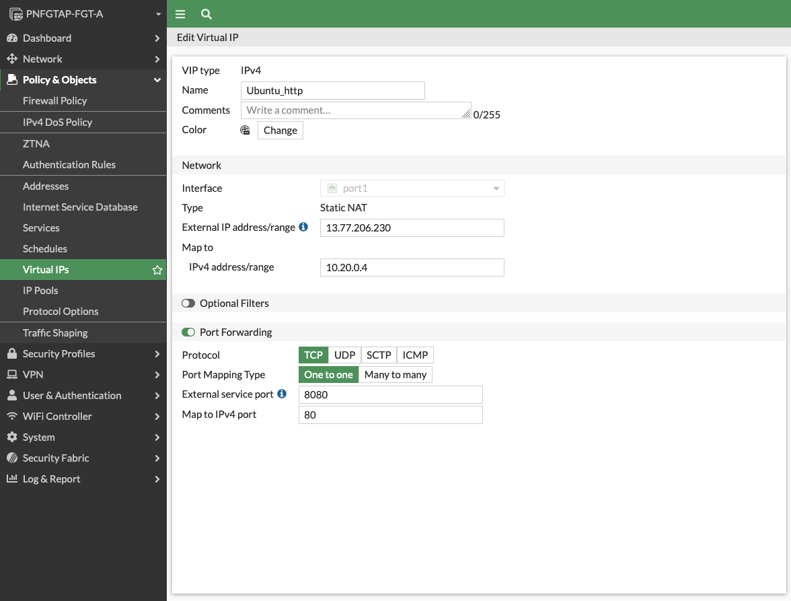
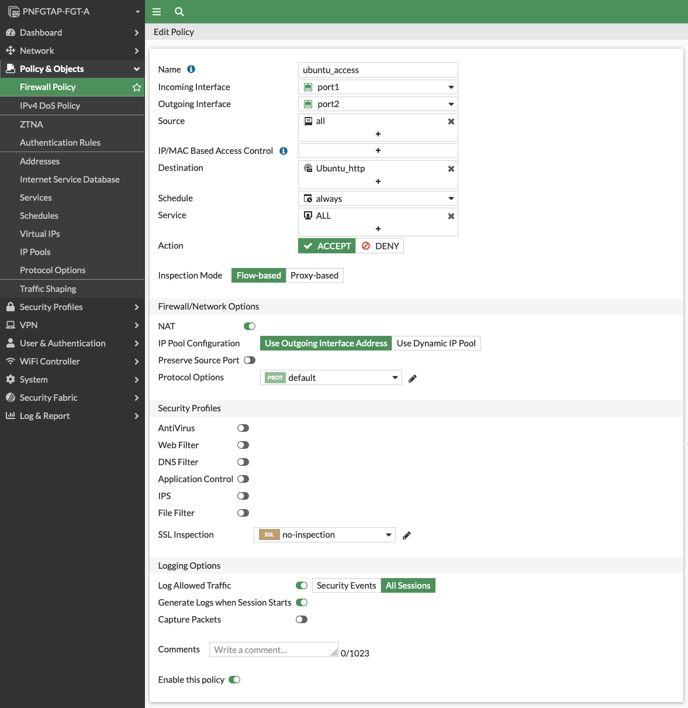
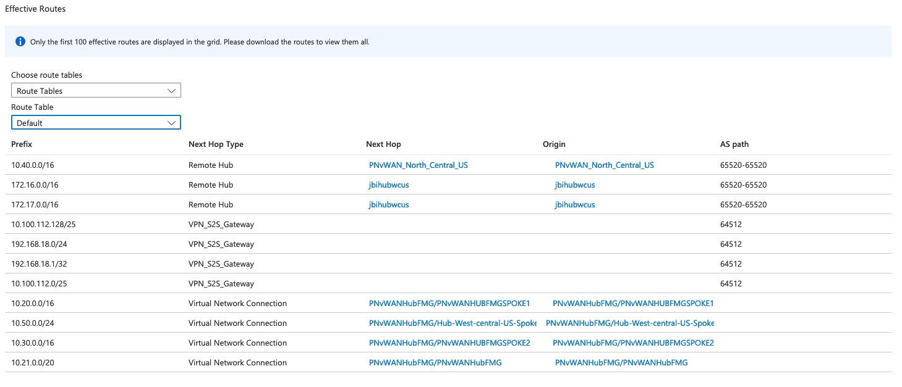

# North-South (FortiGate-VMs deployed in a peered VNET)
*Inbound connectivity from internet to your workloads connected to Azure Virtual WAN*

<p align="center">
  
</p>

## Design

This scenario can use an [active/active](https://github.com/fortinet/azure-templates/tree/main/FortiGate/Active-Active-ELB-ILB) or [active/passive](https://github.com/fortinet/azure-templates/tree/main/FortiGate/Active-Passive-ELB-ILB) deployment or even an [autoscale deployment](https://github.com/40net-cloud/fortinet-azure-solutions/tree/main/FortiGate/Autoscale). The selection is based on your requirements and explained in our documentation [here](https://docs.fortinet.com/document/fortigate-public-cloud/7.2.0/azure-administration-guide/983245). Deployment of these setup can be done either via the Azure Marketplace or via the above GitHub links.

<p align="center">
  <a href="https://github.com/fortinet/azure-templates/tree/main/FortiGate/Active-Passive-ELB-ILB"></a>
  <a href="https://github.com/fortinet/azure-templates/tree/main/FortiGate/Active-Active-ELB-ILB"></a>
  <a href="https://github.com/fortinet/fortigate-autoscale-azure"></a>
</p>

The FortiGate inside of the Virtual WAN Hub offers the connectivity to the on-premises using Secure SD-WAN. Additionally, it can also act as a control point between the ingress setup and the workloads in the different spokes. The FortiGate inside of Virtual WAN is not required for this ingresss scenario to work but is possible as shown below. 

<p align="center">
  
</p>

## Deployment

Deployment of the FortiGate-VM(s) is documented [here](https://docs.fortinet.com/document/fortigate-public-cloud/7.2.0/azure-administration-guide/983245) and can be done via the [Azure Marketplace](https://azuremarketplace.microsoft.com/en/marketplace/apps/fortinet.fortinet-fortigate?tab=Overview) or using the [ARM](https://github.com/fortinet/azure-templates/tree/main/FortiGate) or [Terraform](https://github.com/fortinet/azure-templates/tree/main/FortiGate/Terraform) templates.

A full demo of the BGP peering between Azure Virtual WAN and the FortiGate-VM can be found in GitHub [here](../bgppeering/)

## Requirements and limitations

* Routing: The routing can be handled statically or dynamically both on the FortiGate and Azure level. To make the setup dynamically, BGP peering, needs to be enabled on the Virtual WAN Hub and comunnication needs to be established between the FortiGate-VM units and the Azure Routing Service.
* NAT: Routing directly from the workload in a spoke to the FortiGate in a different spoke across the Virtual WAN Hub is not possible. The inbound traffic should use SNAT behind the FortiGate devices.
* Licenses for Fortigate
  - BYOL: VM, VM Subscription or Flex-VM licenses can be used on these units. A demo license can be made available via your Fortinet partner or on our website. Licenses need to be registered on the [Fortinet support site](http://support.fortinet.com). Download the .lic file after registration. Note, these files may not work until 60 minutes after it's initial creation.
  - PAYG or OnDemand: These licenses are automatically generated during the deployment of the FortiGate systems.

## Flows


1. Connection from client to the public IP of that is attached to the load balancing rule. - s: a.b.c.d - d: w.x.y.z
2. Azure External Load Balancer sends the packet to the active FortiGate-VM. - s: a.b.c.d - d: w.x.y.z
3. FGT inspects the packet and when allowed sends the packet to the server both source and destination are translated - s: 10.21.1.5 - d: 10.20.0.4
4. Server responds to the request - s: 10.20.0.4 - d: 10.21.1.5
5. The FortiGate translates the return packet back to the external IPs - s: w.x.y.z - d: a.b.c.d
6. The Azure External Load Balancer returns the packet to the client - s: w.x.y.z - d: a.b.c.d

## Configuration

### Azure Virtual WAN BGP peering


Add both FortiGate-VM port2 interfaces as BGP endpoints with the AS from the FortiGate. It will also show you the BGP endpoint IPs that you can use in the FortiGate for the BGP configuration.

### FortiGate

Configure the BGP endpoints with information retrieved from the Virtual WAN Hub BGP peering configuration:
```
config router bgp
    set as 64514
    set keepalive-timer 1
    set holdtime-timer 3
    set ebgp-multipath enable
    set graceful-restart enable
    config neighbor
        edit "10.100.32.5"
            set ebgp-enforce-multihop enable
            set interface "port2"
            set remote-as 65515
        next
        edit "10.100.32.4"
            set ebgp-enforce-multihop enable
            set interface "port2"
            set remote-as 65515
        next
    end
end
```

Make sure that that Virtual WAN Hub network is reachable via port2 of the FortiGate-VM by adding a static route:

```
config router static
    edit 0
        set dst 10.100.0.0 255.255.0.0
        set gateway 10.21.1.1
        set device "port2"
    next
end
```
Configure a VIP and Firewall policy for inbound traffic:





### Routing tables

#### FortiGate
```
PNFGTAP-FGT-A # get router info routing-table all 
Codes: K - kernel, C - connected, S - static, R - RIP, B - BGP
       O - OSPF, IA - OSPF inter area
       N1 - OSPF NSSA external type 1, N2 - OSPF NSSA external type 2
       E1 - OSPF external type 1, E2 - OSPF external type 2
       i - IS-IS, L1 - IS-IS level-1, L2 - IS-IS level-2, ia - IS-IS inter area
       V - BGP VPNv4
       * - candidate default

Routing table for VRF=0
S*      0.0.0.0/0 [10/0] via 10.21.0.1, port1, [1/0]
B       10.20.0.0/16 [20/0] via 10.100.32.5 (recursive via 10.21.1.1, port2), 02:33:58, [1/0]
                     [20/0] via 10.100.32.4 (recursive via 10.21.1.1, port2), 02:33:58, [1/0]
C       10.21.0.0/26 is directly connected, port1
C       10.21.1.0/26 is directly connected, port2
B       10.30.0.0/16 [20/0] via 10.100.32.5 (recursive via 10.21.1.1, port2), 02:33:58, [1/0]
                     [20/0] via 10.100.32.4 (recursive via 10.21.1.1, port2), 02:33:58, [1/0]
B       10.40.0.0/16 [20/0] via 10.100.32.5 (recursive via 10.21.1.1, port2), 02:33:58, [1/0]
                     [20/0] via 10.100.32.4 (recursive via 10.21.1.1, port2), 02:33:58, [1/0]
B       10.50.0.0/24 [20/0] via 10.100.32.5 (recursive via 10.21.1.1, port2), 02:33:58, [1/0]
                     [20/0] via 10.100.32.4 (recursive via 10.21.1.1, port2), 02:33:58, [1/0]
S       10.100.0.0/16 [10/0] via 10.21.1.1, port2, [1/0]
B       10.100.112.0/25 [20/0] via 10.100.32.4 (recursive via 10.21.1.1, port2), 00:29:05, [1/0]
                        [20/0] via 10.100.32.5 (recursive via 10.21.1.1, port2), 00:29:05, [1/0]
B       10.100.112.128/25 [20/0] via 10.100.32.4 (recursive via 10.21.1.1, port2), 00:29:05, [1/0]
                          [20/0] via 10.100.32.5 (recursive via 10.21.1.1, port2), 00:29:05, [1/0]
S       168.63.129.16/32 [10/0] via 10.21.0.1, port1, [1/0]
                         [10/0] via 10.21.1.1, port2, [1/0]
```
#### Effective routing table: Virtual WAN Hub default



#### Effective routing table: Backen server interface


