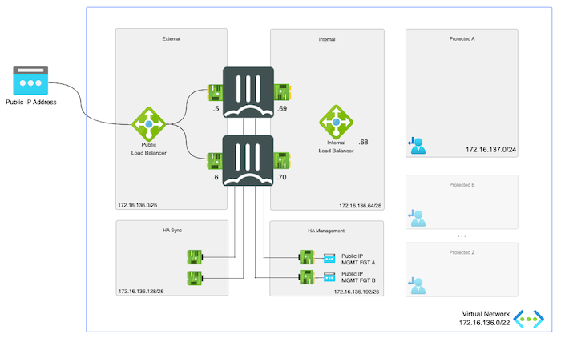
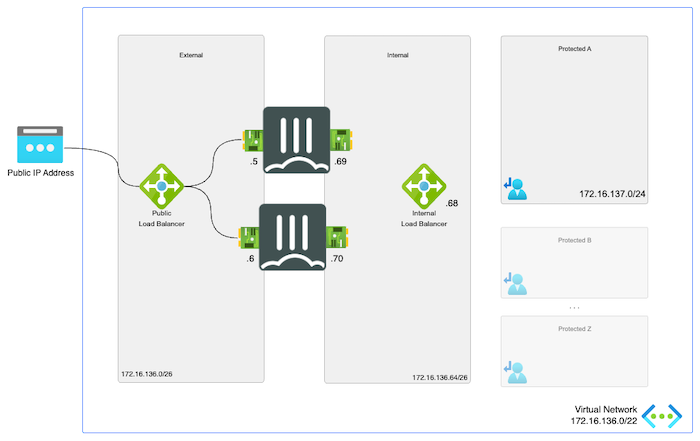

# FortiGate Secure SD-WAN (OUTSIDE Azure Virtual WAN Hub)
*Connecting your branches and datacenters into the FortiGate Next-Generation Firewall in Microsoft Azure*

  

## Design

This scenario preferable uses an [active/passive](https://github.com/fortinet/azure-templates/tree/main/FortiGate/Active-Passive-ELB-ILB) setup to terminate the IPSEC VPN tunnels via the External Azure Load Balancer. An [active/active](https://github.com/fortinet/azure-templates/tree/main/FortiGate/Active-Active-ELB-ILB) deployment would be possible as well but requires the on-premises component to setup 2 IPSEC tunnels to each of the FortiGate units. Deployment of these setup can be done either via the Azure Marketplace or via the above GitHub links.

  
  

## Deployment

Deployment of the FortiGate-VM(s) is documented [here](https://docs.fortinet.com/document/fortigate-public-cloud/7.2.0/azure-administration-guide/983245) and can be done via the [Azure Marketplace](https://azuremarketplace.microsoft.com/en/marketplace/apps/fortinet.fortinet-fortigate?tab=Overview) or using the [ARM](https://github.com/fortinet/azure-templates/tree/main/FortiGate) or [Terraform](https://github.com/fortinet/azure-templates/tree/main/FortiGate/Terraform) templates.

A full demo of the BGP peering between Azure Virtual WAN and the FortiGate-VM can be found in GitHub [here](../bgppeering/)

## Requirements and limitations

* Routing: During the deployment the FortiGate-VMs are coupled to the Azure Routing Service inside the Azure Virtual WAN Hub using BGP. This allows the FortiGate-VMs to inject routes to them for all the remote sites. The gateway the networks is always the ForitGate-VM ip address on the port2.
* Licenses for Fortigate
  - BYOL: VM, VM Subscription or Flex-VM licenses can be used on these units. A demo license can be made available via your Fortinet partner or on our website. Licenses need to be registered on the [Fortinet support site](http://support.fortinet.com). Download the .lic file after registration. Note, these files may not work until 60 minutes after it's initial creation.
  - PAYG or OnDemand: These licenses are automatically generated during the deployment of the FortiGate systems.

## Flows
