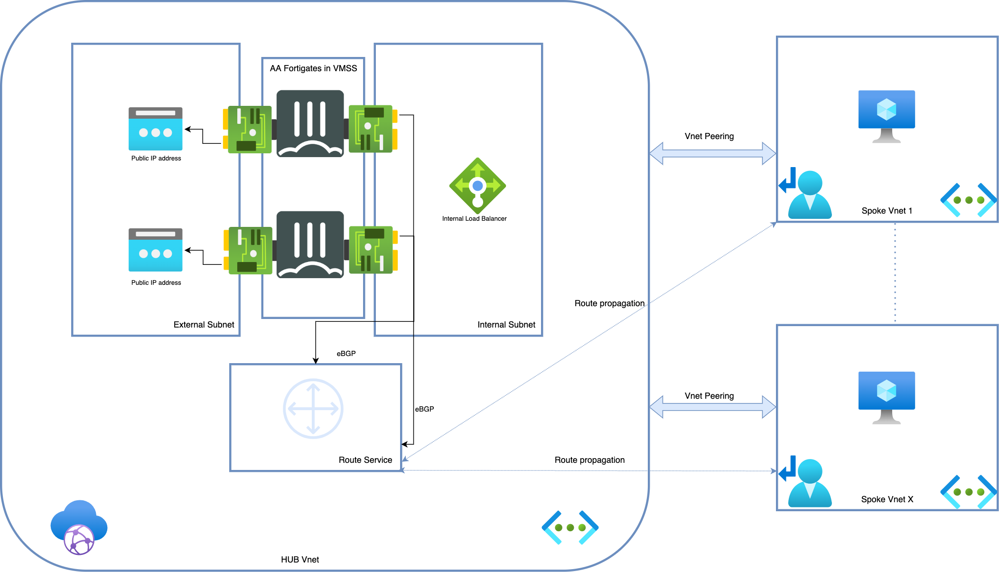

### Architecture 

  

Setup consist of:
- 2 FortiGate-VMs running in VMSS,  active-active FGSP HA setup
- 2 Public IPs associated with external NICs of the FortiGate-VMs
- Azure Routing Service 
- Azure Internal Load Balancer