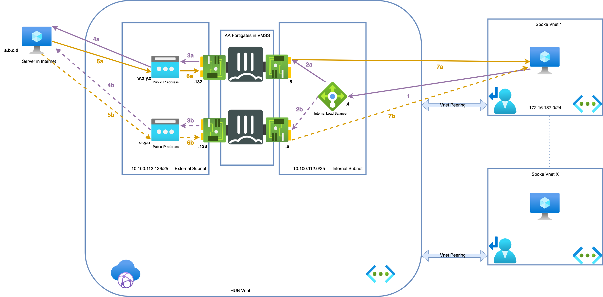
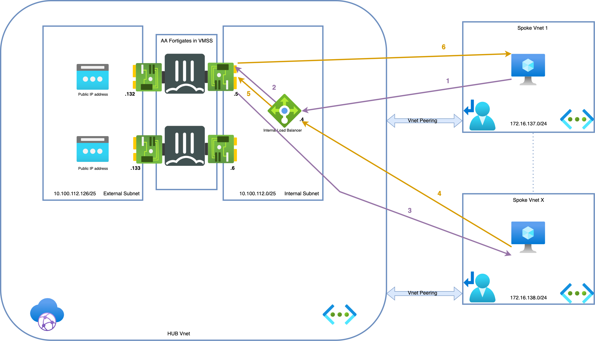

### Outbound Flows

1. Connection from client to the public IP of server. Azure routes the traffic using Intent Routing to the internal Load Balancer (which is running in managed subscription together with FGTs). - s: 172.16.137.4 - d: a.b.c.d
2. (a/b)Azure Internal Load Balancer probes and send the packet to one of the active FGTs. - s: 172.16.137.4 - d: a.b.c.d
3. (a/b)FGT inspects the packet and when allowed sends the packet translated to it's external port private IP to Public IP associated with the private IP . - s: 10.100.112.132/133 - d: a.b.c.d
4. (a/b)Packet is leaving Azure using public IP address attached and translates the source IP - s: w.x.y.z/r.t.y.u - d: a.b.c.d
5. (a/b)The server responds to the request - s: a.b.c.d d: w.x.y.z/r.t.y.u
6. (a/b)Public IP address associated with corresponding NIC is doing DNAT and forwards the packet to the active FortiGate - s: a.b.c.d - d: 10.100.112.132/133
7. (a/b)The active FGT accepts the return packet after inspection. It translates and routes the packet to the client - s: a.b.c.d - d: 172.16.137.4

### East-West Flows

1. Connection from client to the private IP of server. Azure routes the traffic using Intent Routing to the internal Load Balancer - s: 172.16.137.4 - d: 172.16.138.4
2. zure Internal Load Balancer can send the packet to any of the FGTs in AA cluster. In our diagram we assume that FGT-A received the packet for ease of understanding - s: 172.16.137.4 - d: 172.16.138.4
3. FGT inspects the packet and when allowed sends the packet to the server - s: 172.16.137.4 - d: 172.16.138.4
4. Server responds to the request - s: 172.16.138.4 - d: 172.16.137.4
5. Azure External Load Balancer sends the return packets to the same FGT-A thanks to session persistance - s: 172.16.138.4 - d: 172.16.137.4
6. Active FGT accepts the return packet after inspection - s: 172.16.138.4 - d: 172.16.137.4