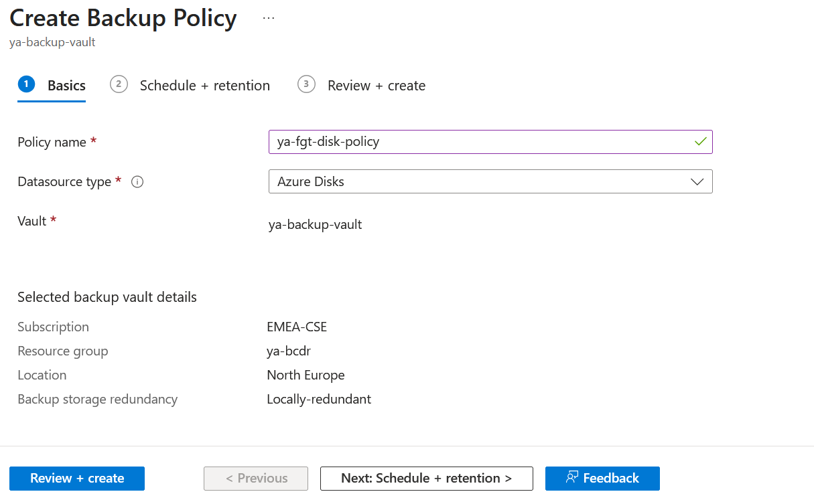
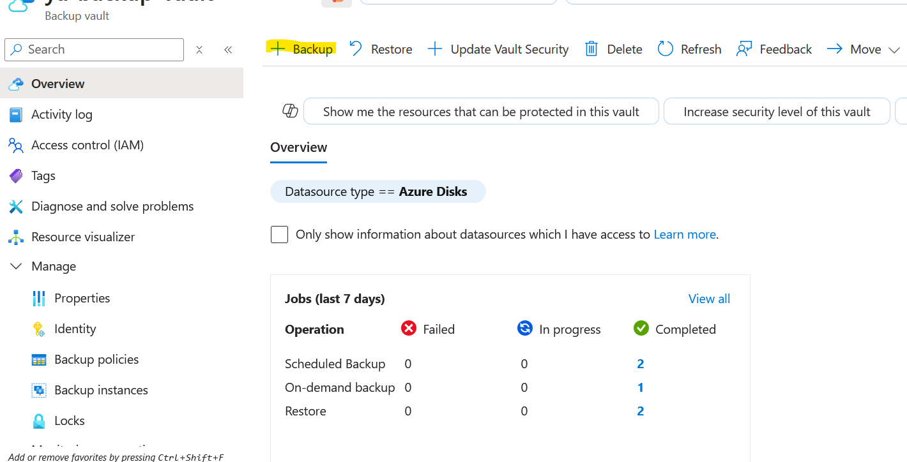
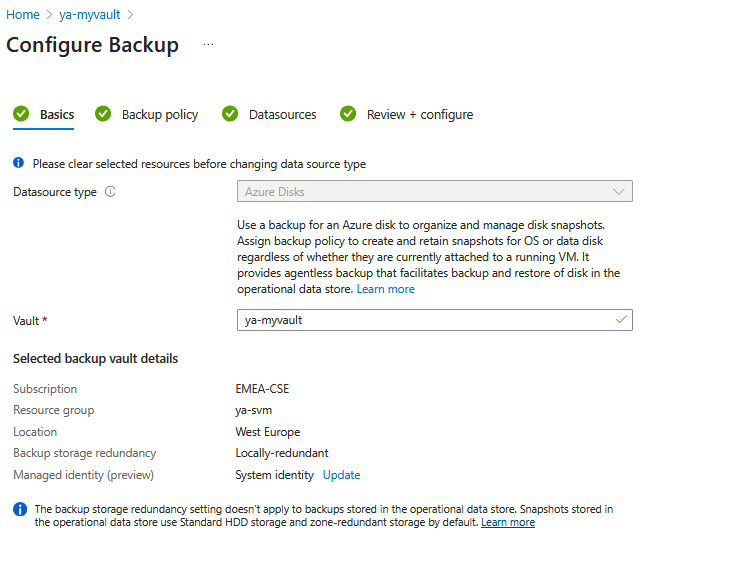
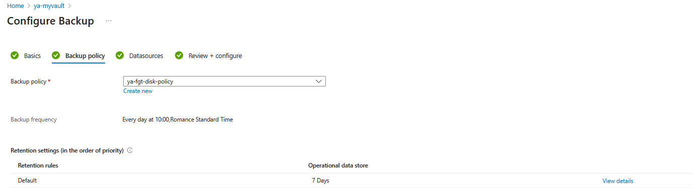
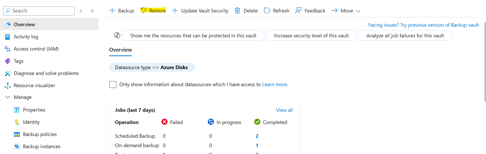
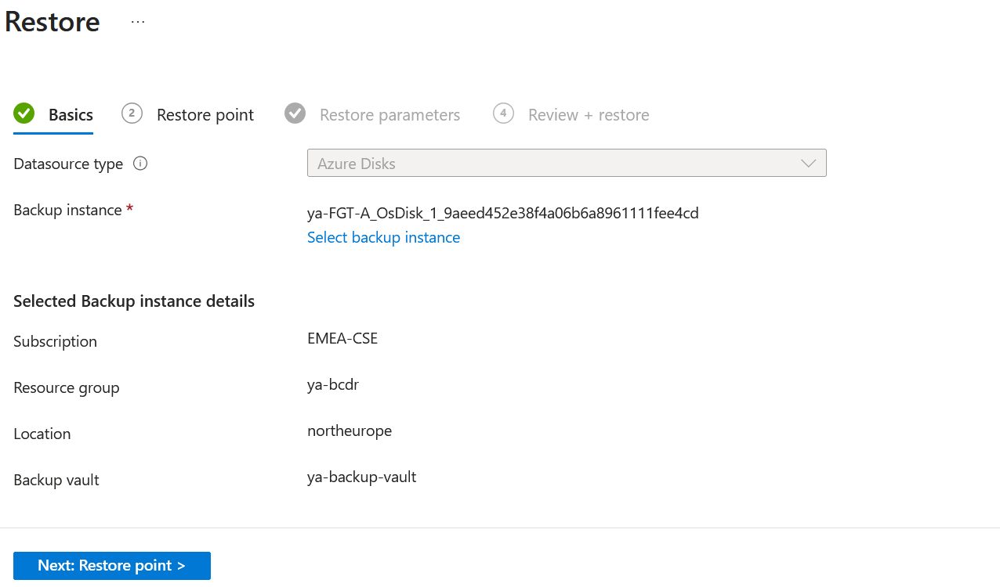
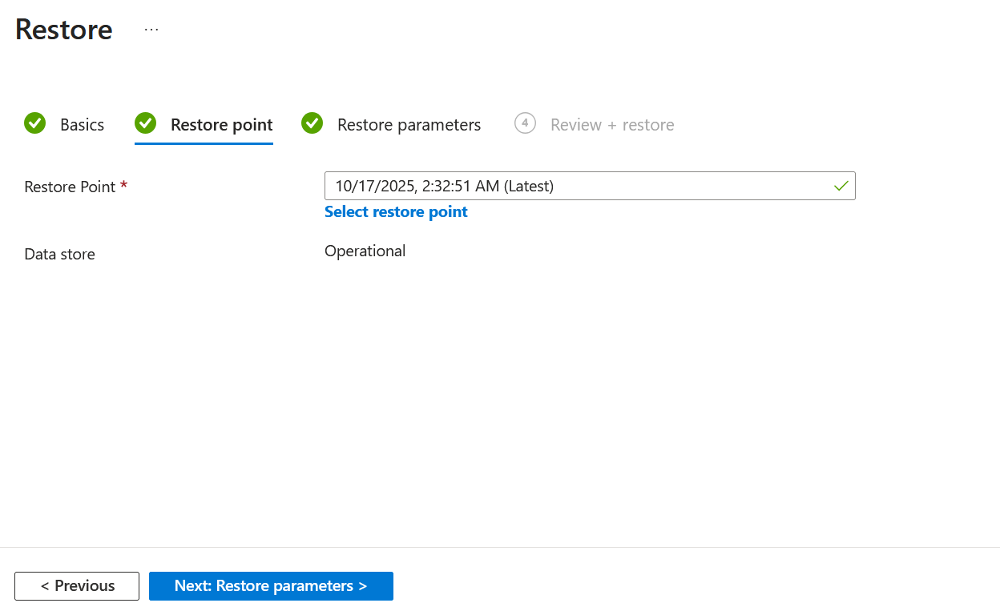

# FortiGate-VM Backup in Azure

## Introduction

Azure Backup does not currently support backing up FortiGate virtual machines (VMs).
This restriction applies to most third-party network virtual appliances (NVAs) deployed from the Azure Marketplace, including FortiGate instances.

For more information, refer to the [official Microsoft documentation](https://learn.microsoft.com/en-us/azure/backup/backup-support-matrix-iaas).

To protect your FortiGate configurations and data, consider alternative backup methods such as:

- Backup configuration as described in the [official documentation](https://docs.fortinet.com/document/fortigate/7.6.4/administration-guide/702257).

- Taking Azure-managed disk snapshots at scheduled intervals.

In this article, we will focus on disk-level backup options as an alternative to Azure Backup.

## Backup Procedure

- Start by creating a Backup Vault in Azure as described in the [documentation](https://learn.microsoft.com/en-us/azure/backup/create-manage-backup-vault)

- From your Backup Vault, navigate to Manage → Backup policies and click Add to create a new policy

- Click the + Add button in the Backup Vault to start a new backup configuration. 

- Choose Azure Disk as the data source type for your backup.

- Select the backup policy you created earlier.

- Select the FortiGate VM disks that you want to back up then review the required role assignments and permissions.

- If any roles are missing, assign them as required. Once done, validate the configuration to ensure everything is properly set up.

More information can be found from this [link](https://learn.microsoft.com/en-us/azure/backup/backup-managed-disks)

### Restore Procedure

Once Azure Disk Backup is configured for your FortiGate virtual machine (VM), you can restore disks as needed — for example, after a system failure, configuration issue, or for testing and migration purposes.
This section describes the steps required to restore FortiGate-managed disks from an Azure Backup Vault.

- Open your Backup Vault in the Azure portal and click the Restore button to begin the recovery process.

- From the list of available backup instances, locate and select the one corresponding to your FortiGate VM disks.

- Select the restore point that represents the state you wish to recover.Each restore point corresponds to a specific backup timestamp.

- Provide a name for the restored disk and select the target resource group where the restored disks will be created.

Managed disks can also be restored through the Azure Business Continuity Center.
For detailed instructions, refer to Microsoft’s [documentation](https://learn.microsoft.com/en-us/azure/backup/restore-managed-disks)

- After successfully restoring the required disks, create a new FortiGate virtual machine using the restored OS disk and attach the data disks. 
For step-by-step instructions, refer to Microsoft’s official guide [link](https://learn.microsoft.com/en-us/azure/virtual-machines/scripts/create-vm-from-managed-os-disks) form more info.

