# FortiGate VM Backup and Restore in Azure

[![[FGT] ARM - A-Single-VM](https://github.com/40net-cloud/fortinet-azure-solutions/actions/workflows/fgt-arm-a-single-vm.yml/badge.svg)](https://github.com/40net-cloud/fortinet-azure-solutions/actions/workflows/fgt-arm-a-single-vm.yml) 

:wave: - [Introduction](#introduction) - [Backup FortiGate VM with Agentless Multi-Disk Crash-Consistent](#backup-fortigate-vm-with-agentless-multi-disk-crash-consistent) - [Backup FortiGate VM with Disks Snapshots](#backup-fortigate-vm-with-disks-snapshots) - :wave:

# Introduction

Backing up and restoring FortiGate Virtual Machines (VMs) in Microsoft Azure is a critical part of maintaining business continuity, minimizing downtime, and protecting firewall configurations against data loss or corruption. This document provides a comprehensive overview of the procedures and best practices for creating, managing, and restoring backups of FortiGate VMs deployed in Azure environments. 
To protect your FortiGate configurations and data, you can use several backup methods including: 
- [Backup FortiGate VM with agentless multi-disk crash-consistent](#backup-fortigate-vm-with-agentless-multi-disk-crash-consistent)
  
  This method creates a crash-consistent backup of the entire FortiGate VM, including all attached disks. It allows you to fully restore the FortiGate VM when needed. Restore options include:
    - [Restore FortiGate with VM image version](#restore-fortigate-with-vm-image-version)
    - [Restore FortiGate from the Recovery Services Vault](#restore-fortigate-from-the-recovery-services-vault)

  We can replace only faulty disks without rebuilding the entire VM using:
    - [Restore FortiGate disks](#restore-fortigate-disks)

- [Taking Azure-managed disk snapshots at scheduled intervals](#backup-fortigate-vm-with-disks-snapshots)
 
  We can restore faulty disks or replace disks. This method uses scheduled snapshots of Azure-managed disks. Snapshots provide fast, flexible disk-level recovery.
    - [Restore with Disks Snapshots](#restore-procedure-1)

You can also back up only the FortiGate configuration as described in [Fortinet documentation](https://docs.fortinet.com/document/fortigate/7.6.4/administration-guide/702257).

## Backup FortiGate VM with Agentless Multi-Disk Crash-Consistent

Azure Backup provides agentless VM backups using multi-disk crash-consistent restore points, available only with the Enhanced VM Backup Policy and supported in all Azure public regions. It supports Premium Storage–capable VM sizes (those with an “s” in the name, e.g., DSv2).
Unsupported disks include Ultra Disks, Premium SSD v2, Ephemeral OS Disks, Shared Disks, and Write Accelerator–enabled disks.
For details, see [Microsoft’s guide](https://docs.fortinet.com/document/fortigate/7.6.4/administration-guide/702257).

### Backup Procedure

- Create a Recovery Services vault as described from [documentation](https://learn.microsoft.com/en-us/azure/backup/backup-create-recovery-services-vault#create-a-recovery-services-vault)
- Go to your Recovery Services vault, select Manage > Backup policies, and click + Add to create a new policy.
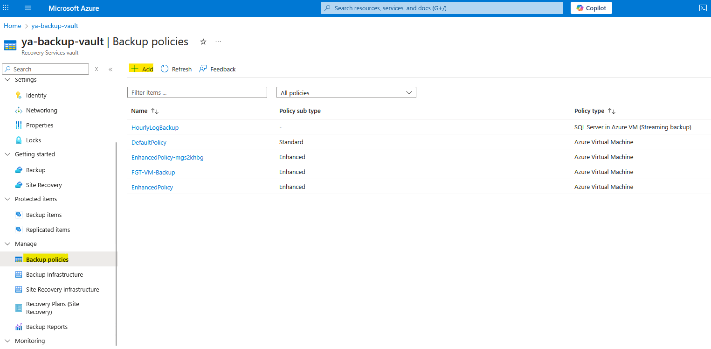
- Select Policy type as Virtual machine, set Policy subtype to Enhanced, and choose Consistency type as Only crash-consistent snapshot to enable agentless backups.
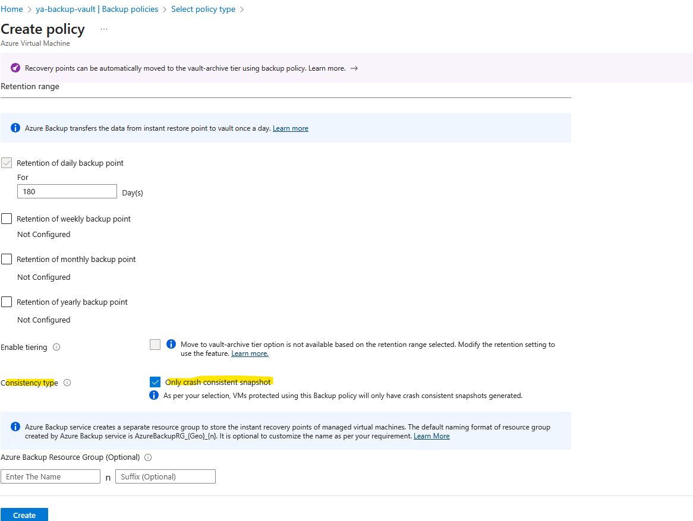
- Start configuring backup for virtual machine in Azure.
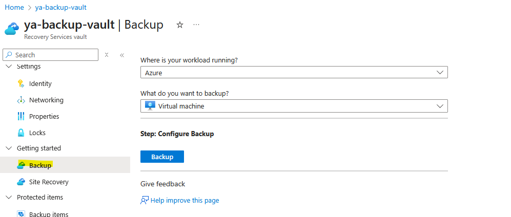
- Select the Enhanced policy created in the previous step, add the FortiGate VM, and enable the backup.
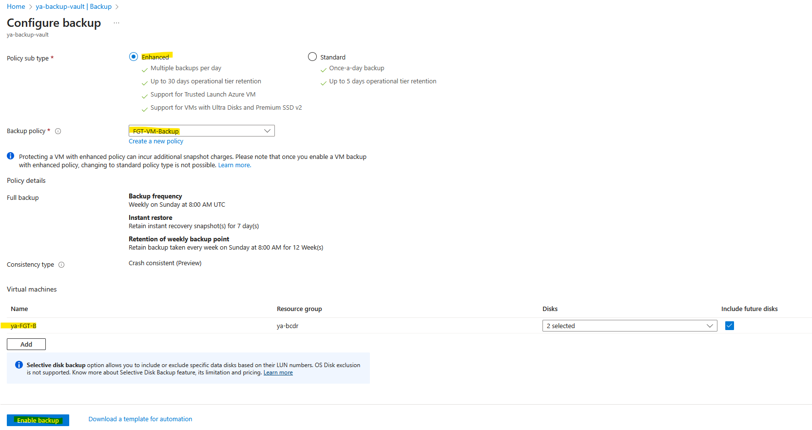
- Azure Backup service creates a separate resource group to store the instant recovery points of managed virtual machines. The default naming format of resource group created by Azure Backup service is AzureBackupRG_{Geo}_{n}. 
- You can backup now Fortigate VM or disable backup from protected items > Backup items.
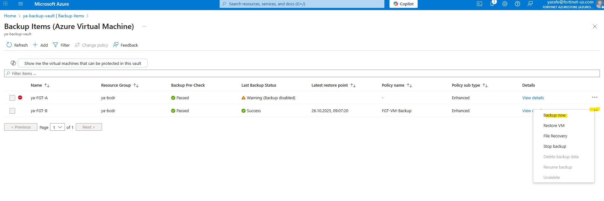

More information can be found from [link](https://learn.microsoft.com/en-us/azure/backup/backup-azure-vms-agentless-multi-disk-crash-consistent).

### Restore Procedure

You can choose the option that best fits your requirements: either deploy a new FortiGate VM or recover the faulty disk.

#### Restore FortiGate with VM image version

- Use or create [Azure compute gallery](https://learn.microsoft.com/en-us/azure/virtual-machines/create-gallery)
- Create an image definition using PowerShell

```powershell
$imageDefinition = New-AzGalleryImageDefinition `
  -GalleryName yourGallery `
  -ResourceGroupName yourRG `
  -Location RGLocation `
  -Name 'Fortigate' `
  -OsState generalized `
  -OsType Linux `
  -Publisher 'fortinet' `
  -Offer 'fortinet_fortigate-vm_v5' `
  -Sku 'fortinet_fg-vm' `
  -PurchasePlanPublisher fortinet `
  -PurchasePlanProduct fortinet_fortigate-vm_v5 `
  -PurchasePlanName fortinet_fg-vm `
  -HyperVGeneration "V1" `
  -Feature @(@{Name='IsAcceleratedNetworkSupported';Value='True'})
```


The above PowerShell command is related to VM generation g1. For generation2 use SKU “fortinet_fg-vm_g2” and for arm64 use SKU “fortinet_fg-vm_arm64”.
More details from [link](https://learn.microsoft.com/en-us/powershell/module/az.compute/new-azgalleryimagedefinition)

- Navigate to the resource group AzureBackupRG_{Geo}_{n} where the restore point collections are stored.
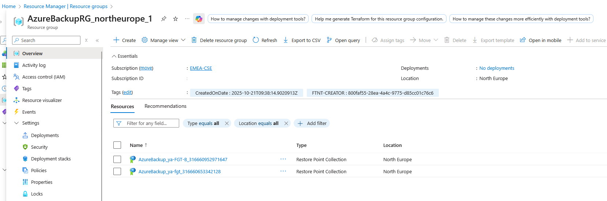
- Select the desired restore point and choose OS_disk
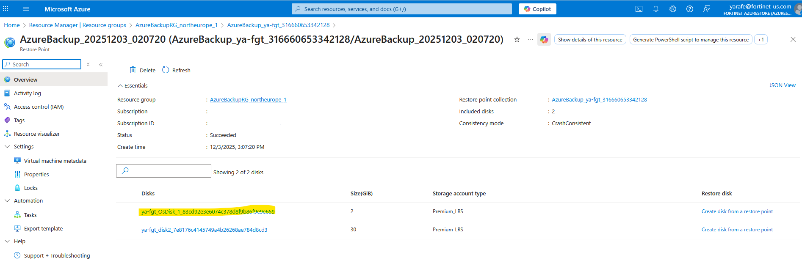
- Click on create VM image version
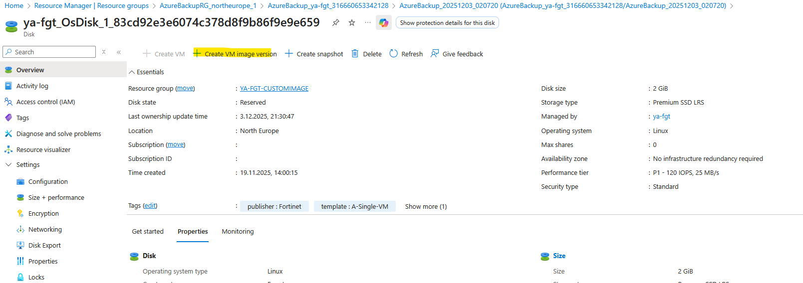
- Add version number and select your Azure compute gallery and your VM definition
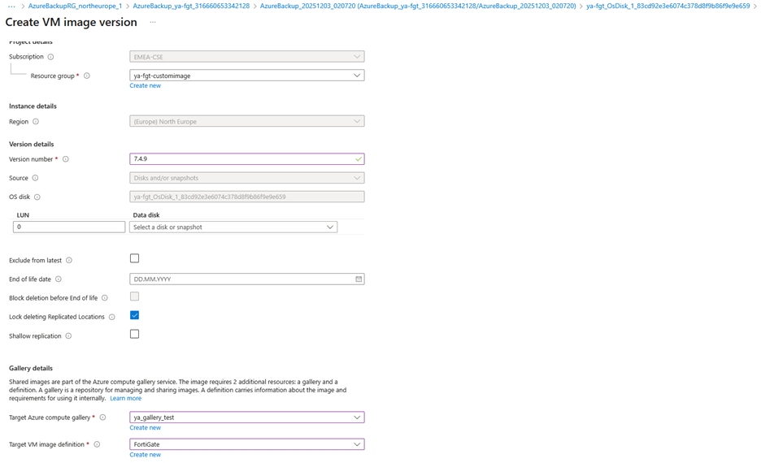
- Set default storage SKU and the replica count 
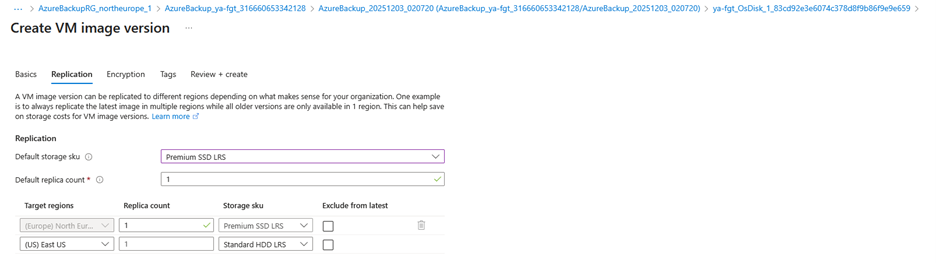

Once VM image version is created, you can use it to deploy a new FortiGate instance.
-	Go to Fortinet [Azure solutions repository](https://github.com/40net-cloud/fortinet-azure-solutions/tree/main/FortiGate/A-Single-VM) and deploy to Azure Fortigate VM.
- During the deployment in “Advanced” tab, add the resource id of the created vm image version. 
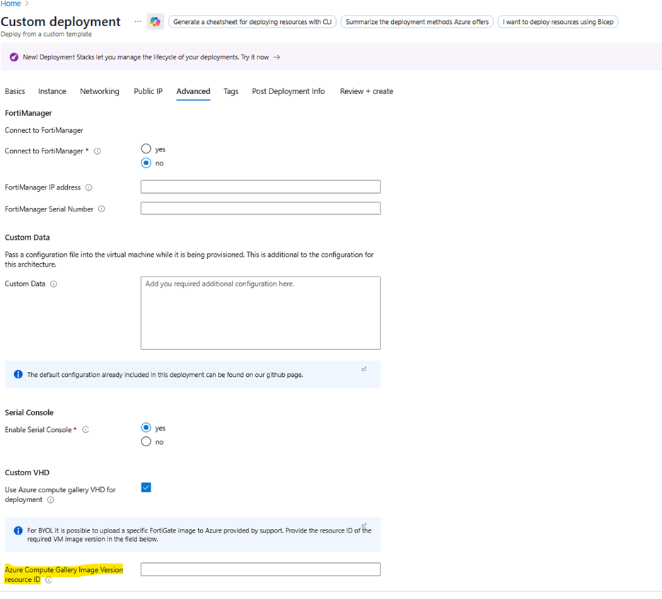
- After deployment you can detach the newly created data disk and attach your existing one or alternatively create a new data disk from the restore point and attach it to the FortiGate VM.
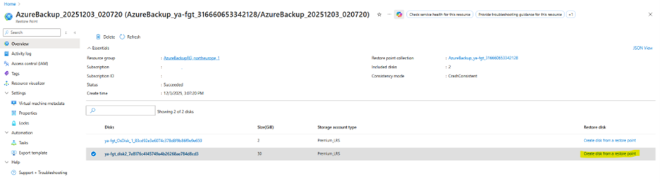

#### Restore FortiGate from the Recovery Services Vault 

- You can restore the FortiGate VM from the Recovery Services vault by navigating Protected items > Backup items.
Alternatively, you can restore it from the Business Continuity Center, as described in [Microsoft Official Documentation](https://learn.microsoft.com/en-us/azure/backup/backup-azure-arm-restore-vms)
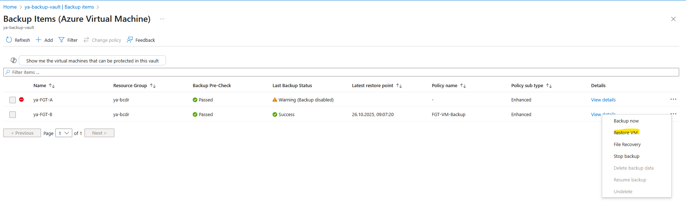

- If you want to create a new FortiGate then Select the desired restore point,specify restore target as create new, specify the name for the new FortiGate VM, and complete the required fields such as VNet, Subnet, and Resource Group.
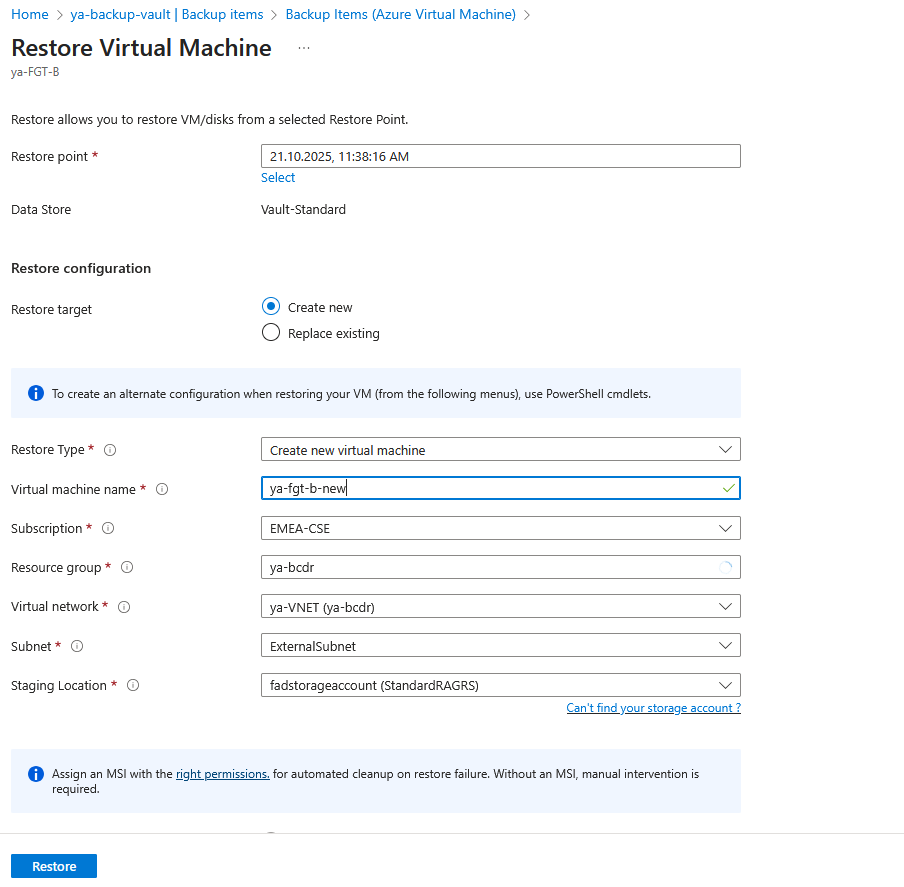

- The restored FortiGate VM will be deployed with multiple NICs placed in the same subnet by default.
After the restore completes successfully, you can reassign the NICs to different subnets using the Azure CLI.
```bash
az network nic ip-config update -g MyResourceGroup --nic-name MyNic -n MyIpConfig --subnet mysubnetId
```
For detailed steps, refer to [Microsoft’s official documentation](https://learn.microsoft.com/en-us/cli/azure/network/nic/ip-config).

#### Restore FortiGate disks
Use restore disk options as explained in [Microsoft documentation](https://learn.microsoft.com/en-us/azure/backup/backup-azure-arm-restore-vms#restore-disks).

## Backup FortiGate VM with Disks Snapshots

Azure Disk Backup provides a native, cloud-integrated solution for protecting Azure managed disks. It combines simplicity, security, and affordability, allowing administrators to configure protection quickly and restore data with confidence when a disaster occurs. More details can be found from [link](https://learn.microsoft.com/en-us/azure/backup/disk-backup-overview)

### Backup Procedure
- Start by creating a Backup Vault in Azure as described in the [documentation](https://learn.microsoft.com/en-us/azure/backup/create-manage-backup-vault)
- From your Backup Vault, navigate to Manage → Backup policies and click Add to create a new policy
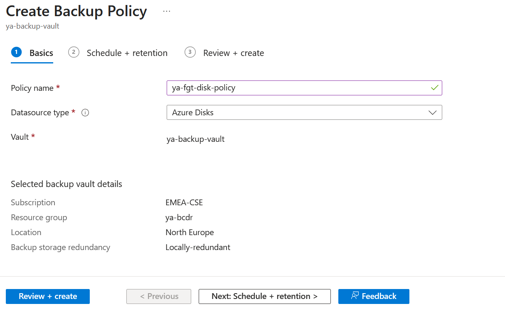

- Click the + Add button in the Backup Vault to start a new backup configuration.
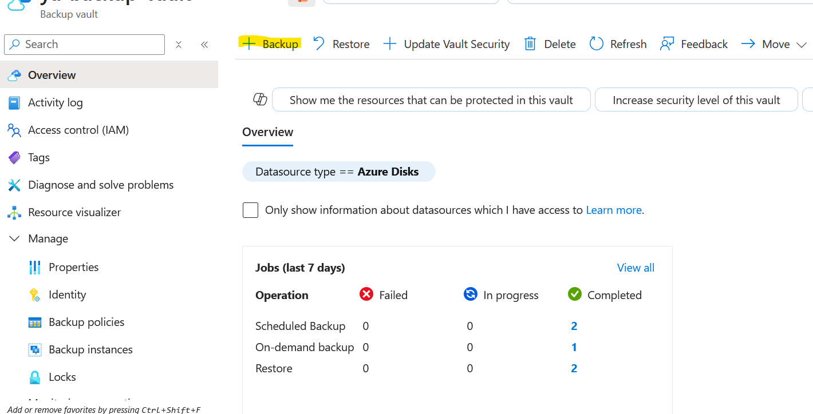

- Choose Azure Disk as the data source type for your backup.


- Select the FortiGate VM disks that you want to back up then review the required role assignments and permissions.
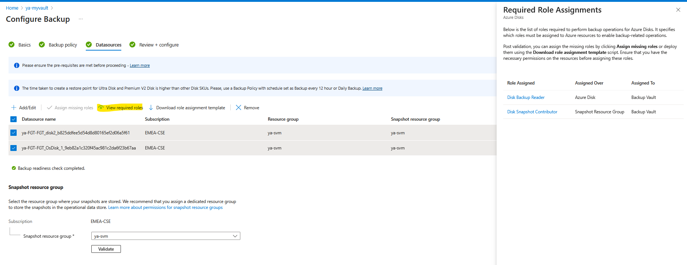

- If any roles are missing, assign them as required. Once done, validate the configuration to ensure everything is properly set up.
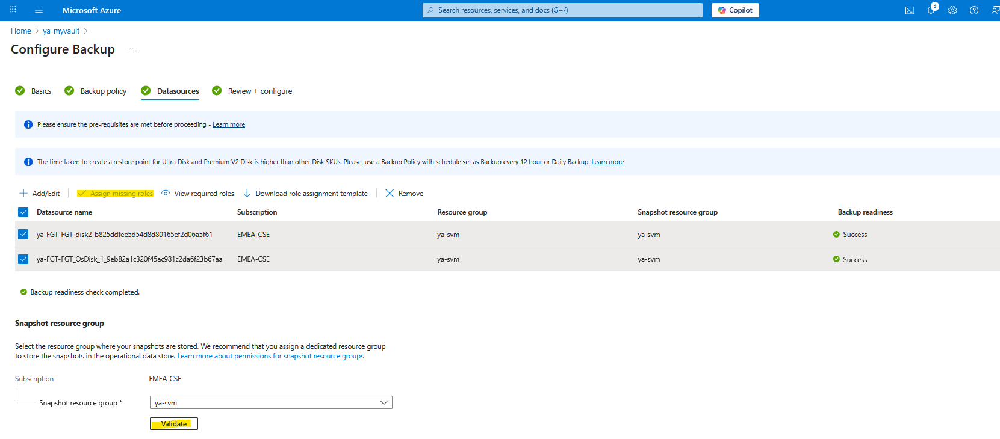

More information can be found from [link](https://learn.microsoft.com/en-us/azure/backup/backup-managed-disks)

### Restore Procedure

- Open your Backup Vault in the Azure portal and click the Restore button to begin the recovery process.
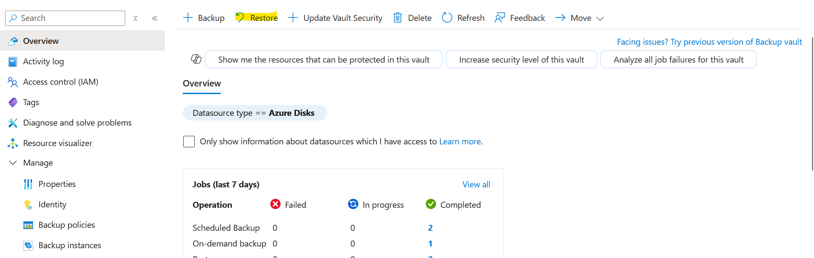

- From the list of available backup instances, locate and select the one corresponding to your FortiGate VM disks.
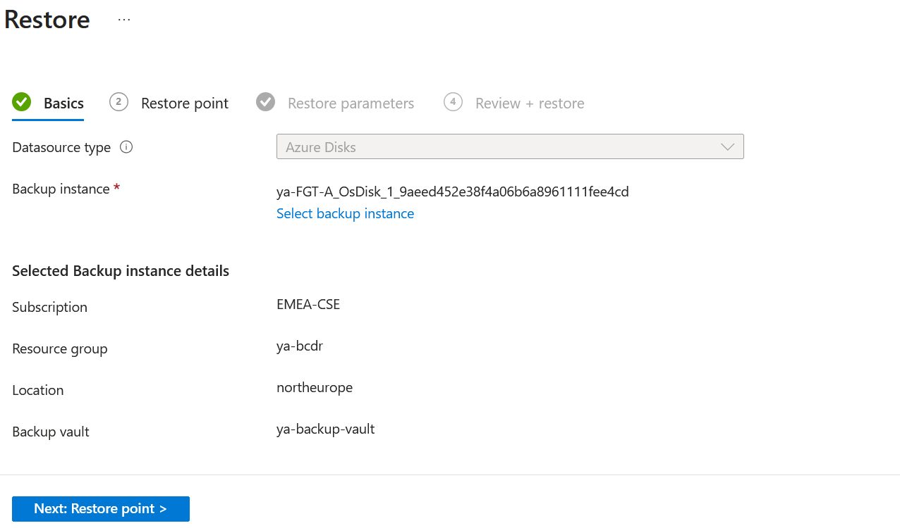

- Select the restore point that represents the state you wish to recover.Each restore point corresponds to a specific backup timestamp.


- Provide a name for the restored disk and select the target resource group where the restored disks will be created.


- You can restore data disks with similar steps.
  Managed disks can also be restored through the Azure Business Continuity Center. For detailed instructions, refer to [Microsoft’s documentation](https://learn.microsoft.com/en-us/azure/backup/restore-managed-disks)

- After successfully restoring the required disks, you can replace the OS disk of an existing FortiGate virtual machine using the following Azure CLI command:

```bash
az vm stop -n myVM -g myResourceGroup
az vm update -g <resourceGroupName> -n <vmName> --os-disk /subscriptions/<subscriptionID>/resourceGroups/<resourceGroup>/providers/Microsoft.Compute/disks/<osDiskName>
```

- Once the OS disk is updated, detach the existing data disk and attach the restored data disk.
  For more information, refer to Microsoft’s official guide [link1](https://learn.microsoft.com/en-us/azure/virtual-machines/linux/os-disk-swap) [link2](https://learn.microsoft.com/en-us/azure/virtual-machines/linux/attach-disk-portal#attach-an-existing-disk)


## Support

Fortinet-provided scripts in this and other GitHub projects do not fall under the regular Fortinet technical support scope and are not supported by FortiCare Support Services.
For direct issues, please refer to the [Issues](https://github.com/40net-cloud/fortinet-azure-solutions/issues) tab of this GitHub project.

## License

[License](/../../blob/main/LICENSE) © Fortinet Technologies. All rights reserved.
