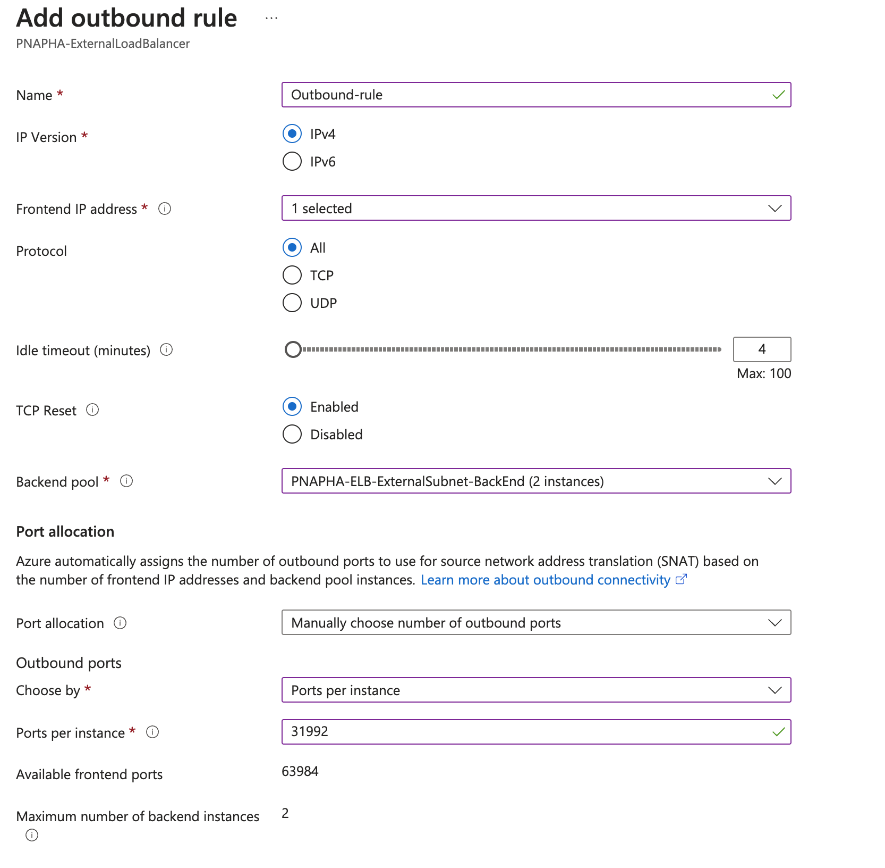
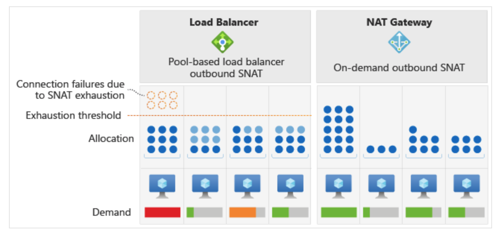
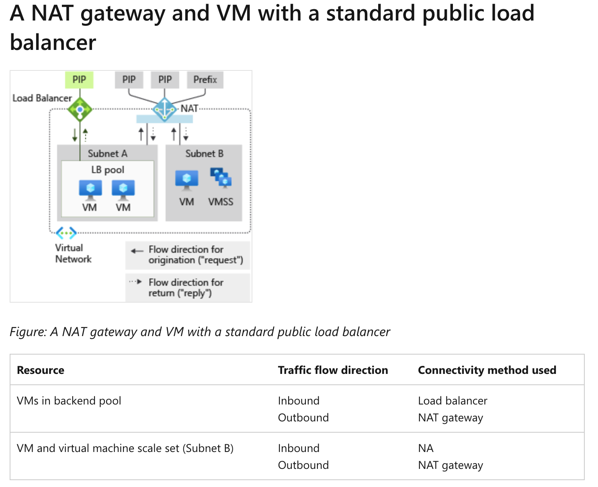

## FAQ - Troubleshoot common outbound connectivity issues with Azure Load Balancer, SNAT port exhaustion.

FortiGates VM require to have outbound connectivity to the internet. The frontend IPs of a public load balancer we use in AP or AA HA templates can be used to provide outbound connectivity to the internet for backend FortiGate instances. This configuration uses source network address translation (SNAT) to translate FortiGates virtual machine's private IP into the load balancer's public IP address. SNAT maps the IP address of the backend to the public IP address of your load balancer.

If using SNAT without outbound rules via a public load balancer, SNAT ports are pre-allocated as described in the following default SNAT ports allocation table:

The following table shows the SNAT port preallocations for backend pool sizes:

## Default port allocation table

That means that even though Public IP has 64000 SNAT ports that can be allocated only 1024 SNAT ports will be allocated for each FortiGate in AP HA CLuster architecture as there is only 2 VM instances in the backend pool.

This potentially can cause SNAT Ports exhaustion. 
SNAT exhaustion occurs when a backend instance runs out of given SNAT Ports. A load balancer can still have unused SNAT ports. If a backend instance’s used SNAT ports exceed its given SNAT ports, it's unable to establish new outbound connections.

You also need to remember that secondary IP configurations of a network interface don't provide outbound communication (unless a public IP is associated to it) via a load balancer.

Details can be fund [here](https://learn.microsoft.com/en-us/azure/load-balancer/load-balancer-outbound-connections).

In order to overcome potential SNAT port exhaustion you can:

## Create outbound Load Balancer rule

Outbound rules allow you to explicitly define SNAT(source network address translation) for a public standard load balancer. This configuration allows you to use the public IP(s) of your load balancer to provide outbound internet connectivity for your backend instances.

Outbound rules will only be followed if the backend VM doesn't have an instance-level public IP address (ILPIP).

Each public IP address contributes up to 64,000 ephemeral ports. The number of VMs in the backend pool determines the number of ports distributed to each VM. One VM in the backend pool has access to the maximum of 64,000 ports. For two VMs, a maximum of 32,000 SNAT ports can be given with an outbound rule (2x 32,000 = 64,000).

In the example shown below we allocate 31992 ports per FortiGate instance instead of 1024 ports which would be allocated by default without outbound rule configured.

More details about Outbound rules can be fund [here](https://learn.microsoft.com/en-us/azure/load-balancer/outbound-rules).

## Configure an individual public IP on FortiGate VM
If a public IP is assigned to a VM, all ports provided by the public IP are available to the VM. Unlike with a load balancer or a NAT gateway, the ports are only accessible to the single VM associated with the IP address.

Example of such configuration is shown [here](https://github.com/40net-cloud/fortinet-azure-solutions/blob/main/FortiGate/Active-Passive-ELB-ILB/doc/config-outbound-nat-considerations.md).

## Use a NAT gateway for outbound connectivity to the Internet

Azure NAT Gateway is a highly resilient and scalable Azure service that provides outbound connectivity to the internet from your virtual network. A NAT gateway’s unique method of consuming SNAT ports helps resolve common SNAT exhaustion and connection issues. 

Azure Load Balancer allocates fixed amounts of SNAT ports to each virtual machine instance in a backend pool. This method of allocation can lead to SNAT exhaustion, especially if uneven traffic patterns result in a specific virtual machine sending a higher volume of outgoing connections. Unlike load balancer, a NAT gateway dynamically allocates SNAT ports across all VM instances within a subnet.

A NAT gateway makes available SNAT ports accessible to every instance in a subnet. This dynamic allocation allows VM instances to use the number of SNAT ports each need from the available pool of ports for new connections. The dynamic allocation reduces the risk of SNAT exhaustion.

A NAT gateway selects ports at random from the available pool of ports. If there aren't available ports, SNAT ports are reused as long as there's no existing connection to the same destination public IP and port. This port selection and reuse behavior of a NAT gateway makes it less likely to experience connection timeouts.

NAT Gateway should be associated with External (Port1) subnet of the FortiGates VMs.

NAT Gateway supersedes any outbound configuration from a load-balancing rule or outbound rules on the load balancer. VM instances in the backend pool use the NAT gateway to send outbound traffic and receive return traffic. Inbound originated traffic passes through the load balancer for all VM instances within the load balancer’s backend pool. VM and the virtual machine scale set from subnet B can only egress and receive response traffic through the NAT gateway. No inbound originated traffic can be received.

More information about NAT Gateway can be fund [here](https://learn.microsoft.com/en-us/azure/load-balancer/troubleshoot-outbound-connection#use-a-nat-gateway-for-outbound-connectivity-to-the-internet) and [here](https://learn.microsoft.com/en-us/azure/nat-gateway/nat-gateway-design#a-nat-gateway-and-vm-with-a-standard-public-load-balancer)