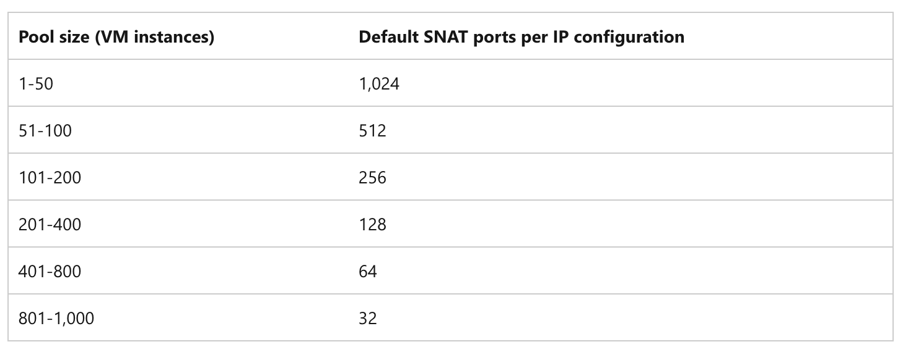

FortiGates VM require to have outbound connectivity to the internet. The frontend IPs of a public load balancer we use in AP or AA HA templates can be used to provide outbound connectivity to the internet for backend FortiGate instances. This configuration uses source network address translation (SNAT) to translate virtual machine's private IP into the load balancer's public IP address. SNAT maps the IP address of the backend to the public IP address of your load balancer.

If using SNAT without outbound rules via a public load balancer, SNAT ports are pre-allocated as described in the following default SNAT ports allocation table:

The following table shows the SNAT port preallocations for backend pool sizes:

## Default port allocation table

That means that even though Public IP has 64000 SNAT ports that can be allocated only 1024 SNAT ports will be allocated for each FortiGate in AP HA CLuster architecture as there is only 2 VM instances in the backend pool.

This potentially can cause SNAT Ports exhaustion. 
SNAT exhaustion occurs when a backend instance runs out of given SNAT Ports. A load balancer can still have unused SNAT ports. If a backend instance’s used SNAT ports exceed its given SNAT ports, it's unable to establish new outbound connections.

You also need to remember that secondary IP configurations of a network interface don't provide outbound communication (unless a public IP is associated to it) via a load balancer.

Details can be fund [here](https://learn.microsoft.com/en-us/azure/load-balancer/load-balancer-outbound-connections).

In order to overcome potential SNAT port exhaustion you can:

## Create outbound Load Balancer rule

Outbound rules allow you to explicitly define SNAT(source network address translation) for a public standard load balancer. This configuration allows you to use the public IP(s) of your load balancer to provide outbound internet connectivity for your backend instances.

Outbound rules will only be followed if the backend VM doesn't have an instance-level public IP address (ILPIP).

Each public IP address contributes up to 64,000 ephemeral ports. The number of VMs in the backend pool determines the number of ports distributed to each VM. One VM in the backend pool has access to the maximum of 64,000 ports. For two VMs, a maximum of 32,000 SNAT ports can be given with an outbound rule (2x 32,000 = 64,000).

In the example shown below we allocate 31992 ports per FortiGate instance instead of 1024 ports which would be allocated by default without outbound rule configured.

