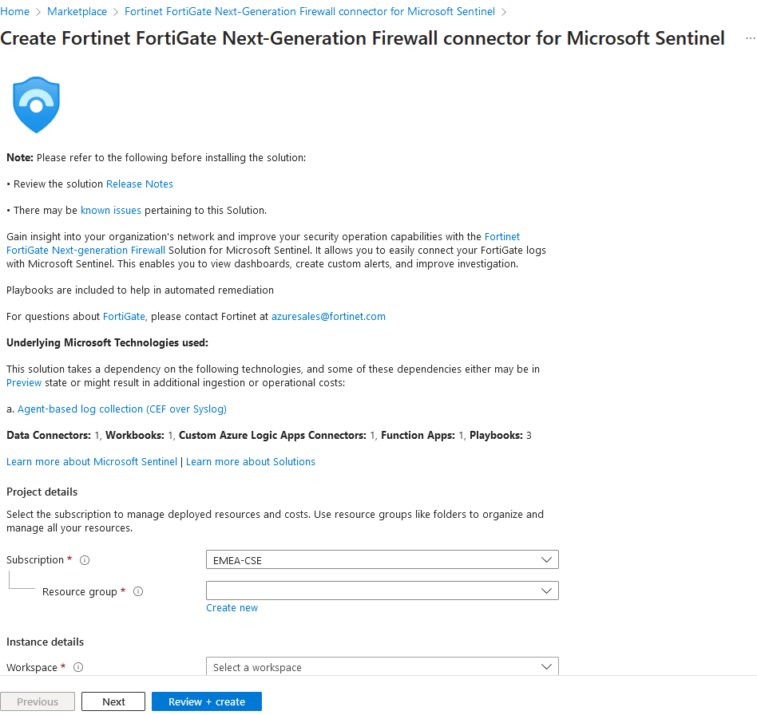
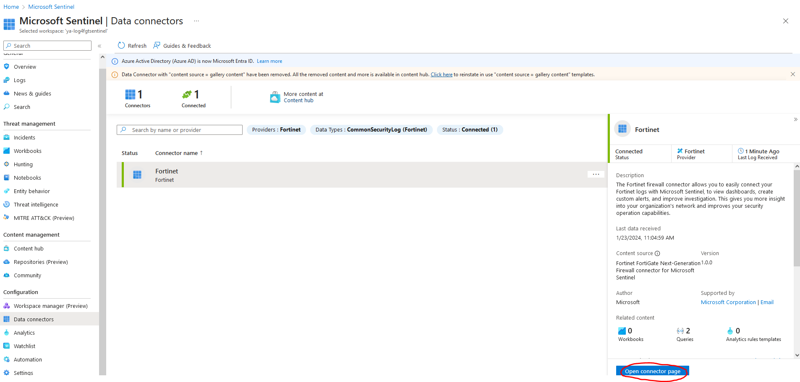
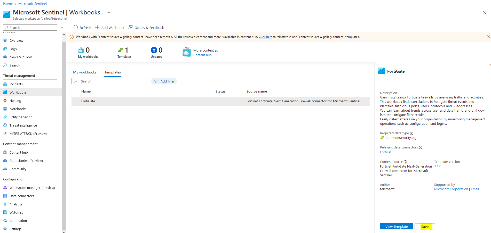

# FortiAnalyzer Integration with Microsoft Sentinel 

## Introduction

Microsoft Sentinel is a scalable, cloud-native solution offering Security Information and Event Management (SIEM) and Security Orchestration, Automation, and Response (SOAR).
It provides intelligent security analytics and threat intelligence across the enterprise, offering a unified platform for attack detection, threat visibility, proactive hunting, and response.
For further details, please refer to the following [link](https://learn.microsoft.com/en-us/azure/sentinel/overview).

In this guide, we will outline two distinct integration scenarios with Microsoft Sentinel.
The initial scenario involves integrating FortiGate with Sentinel through a Linux machine, while the second scenario focuses on FortiAnalyzer integration utilizing the Fluentd plugin.

Starting from version 7.4.0, FortiAnalyzer introduced support for log forwarding to log analytics workspace and other public cloud services through Fleuntd. You can visit the [link](https://docs.fortinet.com/document/fortianalyzer/7.4.0/new-features/198909/fluentd-support-for-public-cloud-integration) for more details.

As we are aware, retaining logs on a FortiGate device consumes instance resources such as disk space, CPU, and memory. To address this, the option to forward logging to FortiAnalyzer or a dedicated log server is available.
Additionally, some clients perceive Microsoft Sentinel as an advantageous complement to FortiGuard for detecting attacks and threats. Having Sentinel as a central hub for logging can prove beneficial for SOC teams, serving as an umbrella monitoring and alerting system for the entire infrastructure.
Conversely, log forwarding to Sentinel may incur significant costs, necessitating the implementation of an efficient filtering mechanism.
This underscores the importance of integrating Fluentd with FortiAnalyzer. This integration enhances FortiAnalyzer with an additional vital functionality, complementing its existing advantages, allowing for effective log filtering and ensuring a streamlined, cost-effective process.

## Data Flow

### FortiGate Integration with Microsoft Sentinel Scenario

To ingest CEF logs from FortiGate into Microsoft Sentinel, a dedicated Linux machine is configured to serve as proxy server for log collection and forwarding to the Microsoft Sentinel workspace.

The Linux machine is structured with two key components:

Syslog Daemon (Log Collector): Utilizing either rsyslog or syslog-ng, this daemon performs dual functions

-Actively listens for Syslog messages originating from FortiGate on TCP port 514. 

-forwards only identified CEF messages to the Log Analytics Agent on localhost, utilizing TCP port 25226.

Log Analytics Agent (OMS Agent): This agent, also referred to as the OMS Agent, engages in two critical tasks

-Listens for incoming CEF messages from the integrated Linux Syslog daemon, operating on TCP port 25226.

-Securely transmits these CEF messages over TLS to the Microsoft Sentinel workspace.

### FortiAnalyzer Integration with Microsoft Sentinel Scenario

FortiAnalyzer seamlessly integrates with Microsoft Sentinel, offering enhanced support through log streaming to multiple destinations using the Fluentd output plugin. 
Fluentd, an open-source data collector, serves as a comprehensive solution that unifies the process of collecting and consuming data. For additional details, please check the following [link](https://www.fluentd.org/architecture).

This integration enables the logs forwarding to public cloud services. The plugin efficiently aggregates semi-structured data in real-time, facilitating the buffered data's transmission to Azure Log Analytics.

FortiGate establishes communication with FortiAnalyzer and transmits logs via TCP port 514. Then FortiAnalyzer, leveraging Fluentd as a data collector, adeptly aggregates, filters, and securely transmits data to Azure Log Analytics workspace.

Fleuntd send logs to a log analytics workspace in Azure monitor by using HTTP data collector API. This involves creating POST request with URL: 
<pre><code>
https://"log analytics workspace-id".ods.opinsights.azure.com/api/logs?api-version=2016-04-01
</code></pre>

For additional details, you can refer to the provided [link](https://learn.microsoft.com/en-us/azure/azure-monitor/logs/data-collector-api?tabs=powershell)

The seamless integration of Fluentd with FortiAnalyzer removes the need for an additional proxy server, streamlining the installation process of a data collector between FortiAnalyzer and the Azure Log Analytics workspace. 
This approach offers an efficient way to manage log transmission and analysis.

## FortiGate integration with Microsoft Sentinel Setup

To establish the integration between Microsoft Sentinel and FortiGate, follow these steps:

### Create Log Analytics Workspace:
Begin by setting up a Log Analytics Workspace as detailed in this [link](https://learn.microsoft.com/en-us/azure/azure-monitor/logs/quick-create-workspace?tabs=azure-portal). Once established, proceed to onboard Sentinel with the created Log Analytics.
For more information, visit the provided [link](https://learn.microsoft.com/en-us/azure/sentinel/quickstart-onboard) for detailed instructions.

### Utilize FortiGate Data Connector:
Access Azure Marketplace to deploy the FortiGate Data Connector for Microsoft Sentinel, accompanied by workbooks and playbooks, all available for free. 

Navigate to Microsoft Sentinel Configuration -> Data Connectors, where you will find the Fortinet connector installed.
Click on "open connector page" to view the instructions provided.

### CEF Collector Installation on Linux:
Install the Common Event Format (CEF) collector on a Linux machine by executing the following Python script:

<pre><code>
sudo wget -O cef_installer.py https://raw.githubusercontent.com/Azure/Azure-Sentinel/master/DataConnectors/CEF/cef_installer.py &&sudo python cef_installer.py c7498055-e4c5-40e3-b6cd-5bf54be0debd rLysrkRNqtqFZteAWROvuEN6JQeqr5ZIUMCzE0JNaBYSc7Fxng0Kwi6ra4wkd8Nh1il/sdHufF3hXz/JoF2o4A==
</code></pre>

### Configure FortiGate Device:
Following this configuration on the Linux machine, the FortiGate device is then set up to dispatch Syslog messages in CEF format to the designated proxy machine using the provided command:

<pre><code>
config log syslogd setting
    set status enable
    set port 514
    set server "x.x.x.x" # IP of the Syslog agent's address
    set format cef
end
</code></pre>

### Validation and Connectivity Check:
Once the configuration is complete, check the Fortinet connector's status in Microsoft Sentinel to ensure successful connection. Validate connectivity by accessing the Log Analytics Workspace, as illustrated in the accompanying screenshot.

You can also verify other installed components, such as workbooks and playbook templates.

The installed workbook provides detailed analytics related to your traffic and events. 

Once you save the workbook, you can find it under your resource group, where you'll discover insightful statistics about event actions, application protocols, and user activity.

Additionally, three playbook templates are installed:

Fortinet-FortiGate-ResponseOnBlockIP: This enables SOC users to automatically respond to Microsoft Sentinel incidents involving IPs by adding or removing the IPs to the Microsoft Sentinel IP blocked group.

Fortinet-FortiGate-IPEnrichment: This playbook adds the summary of address object and its group details to an incident.

Fortinet-FortiGate-ResponseOnBlockURL: This allows SOC users to automatically respond to Microsoft Sentinel incidents involving URLs by adding the URLs to the Microsoft Sentinel URL blocked group.

You can review the [link](https://community.fortinet.com/t5/FortiGate/Technical-Tip-Integrate-FortiGate-with-Microsoft-Sentinel/ta-p/199709) for more technical details about FortiGate integration With Microsoft Sentinel.

## FortiAnalyzer integration with Microsoft Sentinel Setup

To begin, initiate the creation of a Log Analytics Workspace. The process details can be found in the following [link](https://learn.microsoft.com/en-us/azure/azure-monitor/logs/quick-create-workspace?tabs=azure-portal).

Once the Log Analytics Workspace is established, proceed to onboard Microsoft Sentinel by linking it to the created Log Analytics Workspace. No configuration for data connector is required for the FortiAnalyzer integration, as Fluentd will directly transmit logs to the Log Analytics Workspace.
Additional guidance on this step is available in the [link](https://learn.microsoft.com/en-us/azure/sentinel/quickstart-onboard).

Next, configure your FortiGate to direct logs to the FortiAnalyzer. Detailed instructions are provided in the [link](https://docs.fortinet.com/document/fortigate/7.4.2/administration-guide/712303/configuring-fortianalyzer).

Upon authorizing FortiGate from FortiAnalyzer, establish an output profile for log forwarding. Navigate to System Settings -> Advanced -> Log Forwarding -> Output Profile and create a new output profile.

Specify the type as "Azure Log Analytics" and utilize the default configuration. Subsequently, fill in the customer ID with the Workspace ID and the primary key value into the shared_key field.

Retrieve the ID and key for the Log Analytics Workspace from Settings -> Agents, as illustrated in the provided screenshot.

Move to System Settings -> Advanced -> Log Forwarding -> Settings. 

Configure the remote server type as "Forward via Output Plugin" and select your designated output profile.

### Diagnose and Troubleshooting Fluentd from FortiAnalyzer Cli

To verify Fluentd write status, execute the command:

<pre><code>
diagnose test application fwdplugind 4
</code></pre>

To ensure the presence of Fluentd log files, utilize the following command:

<pre><code>
diagnose sql fluentd log-tail
</code></pre>

Enable Fluentd logging with the command:

<pre><code>
diagnose test application fwdplugind 201 log enable
</code></pre>

After one minute, rewrite the command:

<pre><code>
diagnose test application fwdplugind 201 log enable
</code></pre>

To display processed events, use the command:

<pre><code>
diagnose sql fluentd log-tail
</code></pre>

Review the received logs from the Log Analytics Workspace, as depicted in the screenshot.

## Log Filtering

In essence, you have the flexibility to toggle the traffic log on or off via the graphical user interface (GUI) on Fortigate devices, directing it to either Fortianalyzer or a syslog server, and specifying the severity level.
Additionally, you can undertake more advanced filtering through CLI, allowing for tailored filtering based on specific values. Please refer to the following links:

[Log FortiAnalyzer filter](https://docs.fortinet.com/document/fortigate/7.4.1/cli-reference/449620/config-log-fortianalyzer-filter)

[Log syslogd filter](https://docs.fortinet.com/document/fortigate/7.4.1/cli-reference/411620/config-log-syslogd-filter)

To optimize logging from Fortigate to Fortianalyzer, you may find useful tips in this community post: 

[Minimizing Logging Tips](https://community.fortinet.com/t5/FortiAnalyzer/Technical-Tip-Minimizing-logging-from-FortiGate-to-FortiAnalyzer/ta-p/198018)

Fortianalyzer offers an intuitive GUI interface for efficiently filtering forwarded logs to log analytics workspace.You can set up device-specific filters based on configurable criteria, and also utilize free-text filtering directly from the GUI.

You can view logs in CEF on remote syslog servers or FortiAnalyzer.

With the appropriate setup, the syslog server has the capability to transmit logs in CEF format to the log analytics workspace through the Fortinet data connector. 
While, FortiAnalyzer can ingest logs into the log analytics workspace using the Apache access log format. However, extracting the essential data from the message still requires additional steps.

One approach is to utilize Azure functions for this purpose. For instance, to extract the Source Information (SrcInf) from the message, you can employ the following query and subsequently save it as a function:
<pre><code>
Table_name
| extend SrcInf = extract(@'srcintf=\"(\S+)\"', 1, Message)
</code></pre>

## Support

Fortinet-provided scripts in this and other GitHub projects do not fall under the regular Fortinet technical support scope and are not supported by FortiCare Support Services.
For direct issues, please refer to the [Issues](https://github.com/40net-cloud/fortinet-azure-solutions/issues) tab of this GitHub project.

## License

[License](LICENSE) © Fortinet Technologies. All rights reserved.
