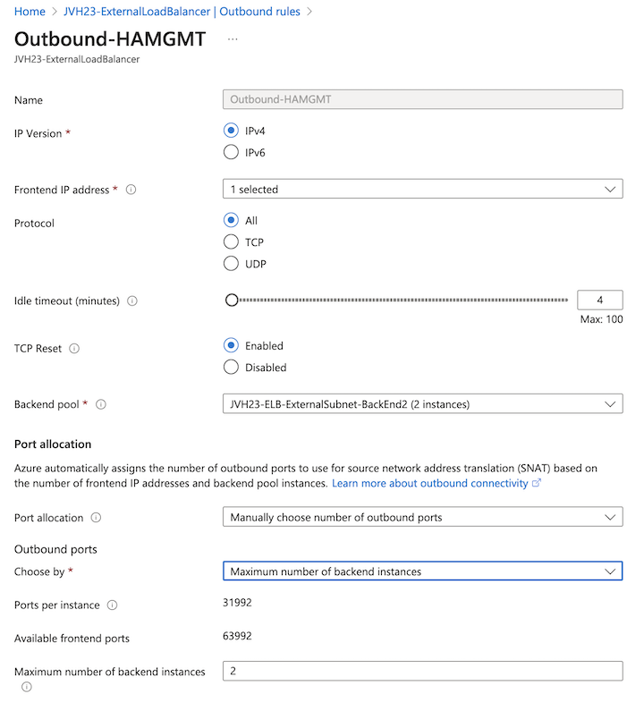

# FAQ - Our company for Microsoft Azure doesn't allow a public IP directly on a VM

## Introduction

The FortiGate-VM ARM and Terraform templates for a Single VM and Active/Passive architectures attach a public IP directly on the VM. In some organisations a public IP can't be attached to a VM enforced by [Azure Policy](https://github.com/Azure/azure-policy/blob/master/built-in-policies/policyDefinitions/Network/NetworkPublicIPNic_Deny.json) to prevent direct access to this VM from the internet.

## A Single VM

For this architecture is this public IP used for ingress, egress as well as management functionality. If a public IP can't be attached directly to the VM a Public Load Balancer needs to be deployed in front fo the FortiGate-VM. During deployment of the FortiGate-VM from the Azure Marketplace or the ARM Templates it is possible to select none as the public IP. After the deployment a public load balancer can be installed with the FortiGate-VM as a backend.

## Active/Passive

In this architecture, the HA management interfaces receive a directly attached public IP on each of the FortiGate-VMs. There are 2 use cases for these public IPs:

- Remote management of the FortiGate-VM units
- SDN connector to talk with the Azure API to retrieve dynamic objects information (public, private and SaaS ip ranges) as well as HA failover when no Load Balancers are used.

There are multiple options to secure this access and/or comply with the Azure Policy:

- No public IP:  This locks down the management interface and prevent ingress and egress. This also prevents the SDN connector from operating. HA failover using the SDN connector will not work nor the retrieval of dynamic object information.
- [Network Security Groups (NSG)](https://learn.microsoft.com/en-us/azure/virtual-network/network-security-groups-overview): WHen configured this disabled ingress and/or egress traffic. This can prevent access from the internet to the management interface of the FortiGate-VM. The Azure Policy mentioned above will still apply and prevent deployment.
- [NAT Gateway](https://learn.microsoft.com/en-us/azure/nat-gateway/nat-overview): After deployment without public IPs on the management interface a NAT Gateway can be installed and attached to the HA management subnet. This will allow the SDN connector to operate, remote management via internet is not possible. The Azure NAT Gateway incurs additional costs.
- [External Load Balancer](https://learn.microsoft.com/en-us/azure/load-balancer/load-balancer-overview): The public load balancer, installed during deployment, can be configured for the egress and ingress flows required for the HA mamagement interface. It is also possible to add an [additional external load balancer](https://azure.microsoft.com/en-us/updates/general-availability-azure-load-balancer-per-vm-limit-removal/) for an additinal cost.

## External Load Balancer: Configuration

A new backed pool needs to be configure based on ip address referencing the Nic4 of the Active/Passive deployment. Additionally an extra public IP should be configured to not interfere with the other traffic flows.

On the FortiGate-VM, the interface needs to allow the probe response similar to the port 1 and port 2 configuration.

<pre><code>
config system interface
    edit "port4"
        set ip 10.1.51.5 255.255.255.192
        set allowaccess ping https ssh <b>probe-response</b> ftm
        set type physical
        set description "hammgmtport"
        set snmp-index 4
    next
end
</code></pre>

### Ingress

For ingress to manage FortiGate A and B, an inbound NAT rule needs to be configured. An inbound NAT rule targets a backend VM directly. The external port can chosen, in the example we selected port 40000 and 40001. Variables that need to be filled in: Target virtual machine (FGT A or FGT B), Network IP configuration (IP configuration for NIC 4 of FGT A or B), Frontend IP address (public IP), Frontend Port (Port used to connect via the public IP 40000 or 40001), Backend port (HTTPS port on the FGT).

### Egress

For egress to provide access from the SDN connector to the Azure API, an [outbound rule](https://learn.microsoft.com/en-us/azure/load-balancer/outbound-rules) needs to be configured. The outbound rule requires: Fortend IP (public IP), Backend Pool (configured previously) and the port allocation. The [port allocation](https://learn.microsoft.com/en-us/azure/load-balancer/load-balancer-outbound-connections#preallocatedports) is can be split between both VMs each using 32k ports.

