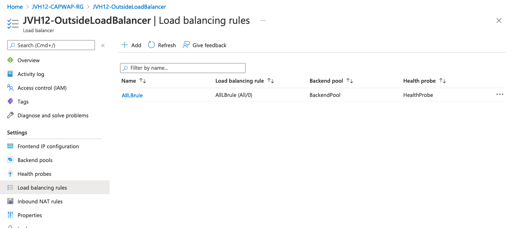

# Connecting FortiAP to FortiGate HA pair in Azure

## Introduction

Fortinet offers a wide range of wireless access points to can be managed using a FortiGate or the FortiCloud platform. In this document, we will be connecting the FortiAP located in a branch over a VPN connection or ExpressRoute into Microsoft Azure where a FortiGate Active/Passive cluster located. The FortiGate VMs can manage the FortiAP as well as route and inspect all the traffic from your FortiAP. 

## Design

<p align="center">
  
</p>

## Deployment

Deploy the FortiGate VM either as a [single VM](../A-Single-VM/) or [Active/Passive](../Active-Passive-ELB-ILB/) setup.

## Requirements and limitations

- Take Azure bandwidth costs into account. There are different types of traffic that are charged. More information can be found [here](https://azure.microsoft.com/en-us/pricing/details/bandwidth/)

## Azure configuration

For the Active/Passive HA setup an additional Azure Internal Load Balancer need to be configured in the external subnet. Alternatively you can use the already configured Internal Load Balancer in the Internal Subnet. The Internal Load Balancer has a frontend IP. The frontend IP needs to be configured as a secondary IP on both FortiGate VMs to make sure the CAPWAP tunnel gets established. 

Frontend IP configuration:


Backend configuration:


Load balancing rules configuration: To forward traffic to the active FortiGate VM a single rule is created using the HA ports features. This forwards all TCP and UDP traffic to the frontend IP to the active backend FortiGate VM.




All of this configuration is already done on the internal load balancer as an alternative to the external subnet configuration.

## FortiGate configuration

On the FortiGate side the secondary IP configuration and the WTP profile as the most important. The secondary IP configuration needs to be done on both FortiGate VMs in the Active/Passive setup, it needs to allow access for the security fabric connections which includes the CAPWAP protocol.

Depending on the connectivity from the on-premise side you might need to adapth the MTU settings for the CAPWAP tunnel. This is configured in the WTP profile via the CLI. In this setups case a VPN was establish between the branch and an Azure VPN Gateway and this required the MTU to be lowered to 1400. More information is available [here](https://docs.fortinet.com/document/fortiap/7.2.1/fortiwifi-and-fortiap-configuration-guide/873995/ip-fragmentation-of-packets-in-capwap-tunnels)

```
config system interface
    edit "port1"
        set vdom "root"
        set ip 172.16.150.4 255.255.255.224
        set allowaccess ping probe-response fabric ftm
        set type physical
        set description "external"
        set snmp-index 1
        set secondary-IP enable
        config secondaryip
            edit 1
                set ip 172.16.150.10 255.255.255.224
                set allowaccess fabric
            next
        end
    next
end
config wireless-controller wtp-profile
    edit "Test-FAP-321E"
        config platform
            set type 321E
        end
        set dtls-policy dtls-enabled
        set handoff-sta-thresh 55
        set tun-mtu-uplink 1400
        set tun-mtu-downlink 1400
        set allowaccess https ssh
    next
end
config wireless-controller vap
    edit "W12"
        set ssid "yourssid"
        set passphrase "yoursecretpassphrase
        set schedule "always"
    next
end
```

After this initial configuration the FortiAP needs to be configured to connect to the frontend IP of the load balancer. You can find the guide to configure the FortiAP on [the Fortinet documentation website](https://docs.fortinet.com/document/fortiap/7.2.1/fortiwifi-and-fortiap-configuration-guide/238787/remote-wlan-fortiaps)

Once the FortiAP is able to connect to the FortiGate, the FortiAP needs to be [authorized by the FortiGate](https://docs.fortinet.com/document/fortiap/7.2.1/fortiwifi-and-fortiap-configuration-guide/827468/discovery-and-authorization-of-aps). 


Once the FortiAP is connect and all lights are greeen a last remaining action point is a Firewall Policy. Below a very simple initial policy that will get you kickstarted to increase visiblity and control of these access points.

```
config firewall policy
    edit 1
        set name "OutboundWifi"
        set srcintf "W12"
        set dstintf "port1"
        set action accept
        set srcaddr "all"
        set dstaddr "all"
        set schedule "always"
        set service "ALL"
        set logtraffic all
        set logtraffic-start enable
        set nat enable
    next
end
```

## Links and documentation

- [FortiGate Remote FortiAP configuration](https://docs.fortinet.com/document/fortiap/7.2.1/fortiwifi-and-fortiap-configuration-guide/238787/remote-wlan-fortiaps)
- [FortiAP authorisation](https://docs.fortinet.com/document/fortiap/7.2.1/fortiwifi-and-fortiap-configuration-guide/827468/discovery-and-authorization-of-aps)
- [FortiAP CAPWAP tunnels and IP Fragmentation](https://docs.fortinet.com/document/fortiap/7.2.1/fortiwifi-and-fortiap-configuration-guide/873995/ip-fragmentation-of-packets-in-capwap-tunnels)

## Support

Fortinet-provided scripts in this and other GitHub projects do not fall under the regular Fortinet technical support scope and are not supported by FortiCare Support Services.
For direct issues, please refer to the [Issues](https://github.com/40net-cloud/fortinet-azure-solutions/issues) tab of this GitHub project.

## License

[License](LICENSE) © Fortinet Technologies. All rights reserved.
