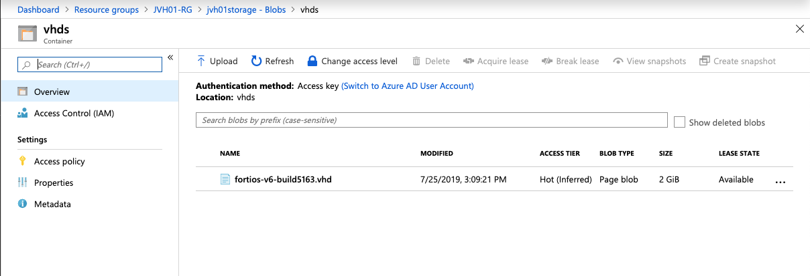

# Single VM FortiGate deployment using a custom VHD

## Introduction

The FortiGate VM's are normally deployed from the Azure Marketplace using the Azure Portal, using ARM/Terraform templates or other types of deployment. Sometimes you require a specific VHD's of the FortiGate VM.

## Design

In Microsoft Azure, this central security service hub is commonly implemented using local VNET peering. The central security services hub component will receive, using user-defined routing (UDR), all or specific traffic that needs inspection going to/coming from on-prem networks or the public internet.

This Azure ARM template will deploy a single FortiGate VM containing the following components.

- 1 FortiGate firewall in a Availability Set
- 1 Storage account for diagnostics
- 1 VNET with external, internal and 2 protected subnets
- User Defined Routes (UDR) for the different protected subnets

This Azure ARM template can also be extended or customized based on your requirements. Additional subnets besides the ones mentioned above are not automatically generated. By extending the Azure ARM templates additional subnets can be added. Additional subnets will require their own routing tables.

## Deployment

For the deployment, you can use the Azure Portal, Azure CLI, Powershell or Azure Cloud Shell. The Azure ARM templates are exclusive to Microsoft Azure and can't be used in other cloud environments. The main template is the `azuredeploy.json` which you can use in the Azure Portal. A `deploy.sh` script is provided to facilitate the deployment. You'll be prompted to provide the 4 required variables:

- PREFIX : This prefix will be added to each of the resources created by the template for ease of use and visibility.
- LOCATION : This is the Azure region where the deployment will be deployed.
- USERNAME : The username used to login to the FortiGate GUI and SSH management UI.
- PASSWORD : The password used for the FortiGate GUI and SSH management UI.

To fast track the deployment, use the Azure Cloud Shell. The Azure Cloud Shell is an in-browser CLI that contains Terraform and other tools for deployment into Microsoft Azure. It is accessible via the Azure Portal or directly at [https://shell.azure.com/](https://shell.azure.com). You can copy and paste the below one-liner to get started with your deployment.

`cd ~/clouddrive/ && wget -qO- https://github.com/jvhoof/fortinet-azure-solutions/archive/master.zip | jar x && cd ~/clouddrive/fortinet-azure-solutions-master/FortiGate/Playground/CustomVHD/ && ./deploy.sh`

After deployment, you will be shown the IP addresses of the deployed FortiGate. You can access the FortiGate using the public ip linked to VM using HTTPS on port 443.

## Requirements and limitations

This template will not deploy the default Azure Marketplace images. You can deploy using this template a custom VHD. These specific VHD's can be downloaded from support.fortinet.com. Once downloaded you need to upload this VHD to an Azure storage account. You can find more information on how to create the storage account on [this link](https://docs.microsoft.com/en-us/azure/storage/common/storage-quickstart-create-account?tabs=azure-portal). Once you have the URI for the storage account you need to use the below 'Add-AzVhd' powershell command to upload the image. The FortiGate image is very compressed and needs to extracted during the upload process. This is only working well using this powershell command. In the end you need to have a 2Gb VHD in your storage account.

`Add-AzVhd -LocalFilePath ./fortios-v6-build5163.vhd -ResourceGroupName XXX-RG -Destination 'https://xxxstorage.blob.core.windows.net/vhds/fortios-v6-build5163.vhd'`

The Azure ARM template deployment deploys different resources and is required to have the access rights and quota in your Microsoft Azure subscription to deploy the resources.

- The template will deploy Standard F2s VMs to deploy the required active/passive setup
- Licenses for Fortigate
  - BYOL: A demo license can be made available via your Fortinet partner or on our website. These can be injected during deployment or added after deployment.
  - PAYG or OnDemand: These licenses are automatically generated during the deployment of the FortiGate systems.

## License
THE SOFTWARE IS PROVIDED "AS IS", WITHOUT WARRANTY OF ANY KIND, EXPRESS OR
IMPLIED, INCLUDING BUT NOT LIMITED TO THE WARRANTIES OF MERCHANTABILITY,
FITNESS FOR A PARTICULAR PURPOSE AND NONINFRINGEMENT. IN NO EVENT SHALL THE
AUTHORS OR COPYRIGHT HOLDERS BE LIABLE FOR ANY CLAIM, DAMAGES OR OTHER
LIABILITY, WHETHER IN AN ACTION OF CONTRACT, TORT OR OTHERWISE, ARISING FROM,
OUT OF OR IN CONNECTION WITH THE SOFTWARE OR THE USE OR OTHER DEALINGS IN THE
SOFTWARE.
