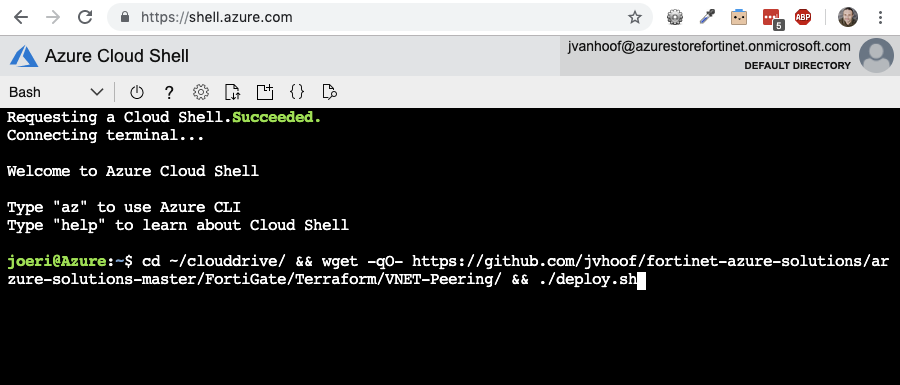

# Active/Passive High Available FortiGate pair with external and internal Azure Standard Load Balancer

# Introduction

This template deploys the [Active/Passive HA FortiGate deployment](../Active-Passive-ELB-ILB) using Spot VMs. Using Spot VMs allows you to take advantage of our unused capacity at a significant cost savings. At any point in time when Azure needs the capacity back, the Azure infrastructure will evict Spot VMs. This is great for demo or tests that are not cricital to the customer.

For more information about the deployment review the documentation [here](../Active-Passive-ELB-ILB)

# How to deploy

### Azure Portal

### Azure CLI

`cd ~/clouddrive/ && wget -qO- https://github.com/jvhoof/fortinet-azure-solutions/archive/main.tar.gz | tar zxf - && cd ~/clouddrive/fortinet-azure-solutions-main/FortiGate/Playground/SpotVM-Active-Passive-ELB-ILB/ && ./deploy.sh`

# License

Permission is hereby granted, free of charge, to any person obtaining a copy of this software and associated documentation files (the "Software"), to deal in the Software without restriction, including without limitation the rights to use, copy, modify, merge, publish, distribute, sublicense, and/or sell copies of the Software, and to permit persons to whom the Software is furnished to do so, subject to the following conditions:

The above copyright notice and this permission notice shall be included in all copies or substantial portions of the Software.

THE SOFTWARE IS PROVIDED "AS IS", WITHOUT WARRANTY OF ANY KIND, EXPRESS OR IMPLIED, INCLUDING BUT NOT LIMITED TO THE WARRANTIES OF MERCHANTABILITY, FITNESS FOR A PARTICULAR PURPOSE AND NONINFRINGEMENT. IN NO EVENT SHALL THE AUTHORS OR COPYRIGHT HOLDERS OR FORTINET SUPPORT (TAC) BE LIABLE FOR ANY CLAIM, DAMAGES OR OTHER LIABILITY, WHETHER IN AN ACTION OF CONTRACT, TORT OR OTHERWISE, ARISING FROM, OUT OF OR IN CONNECTION WITH THE SOFTWARE OR THE USE OR OTHER DEALINGS IN THE SOFTWARE.