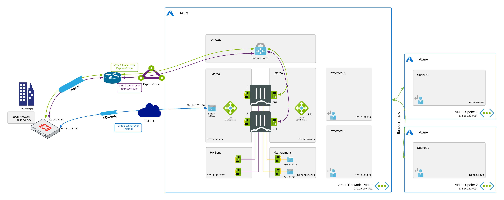
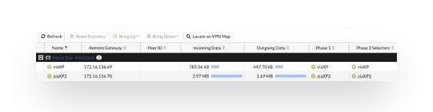
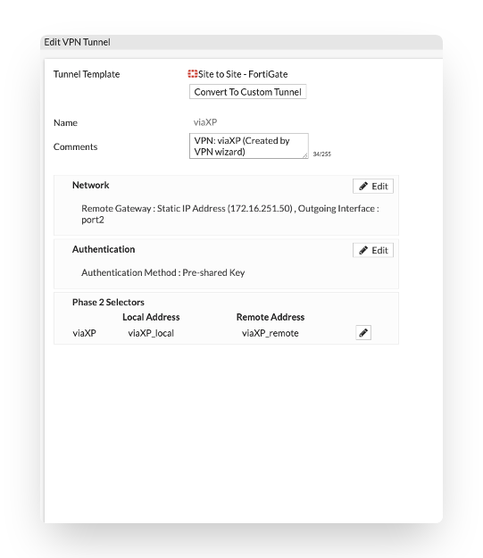
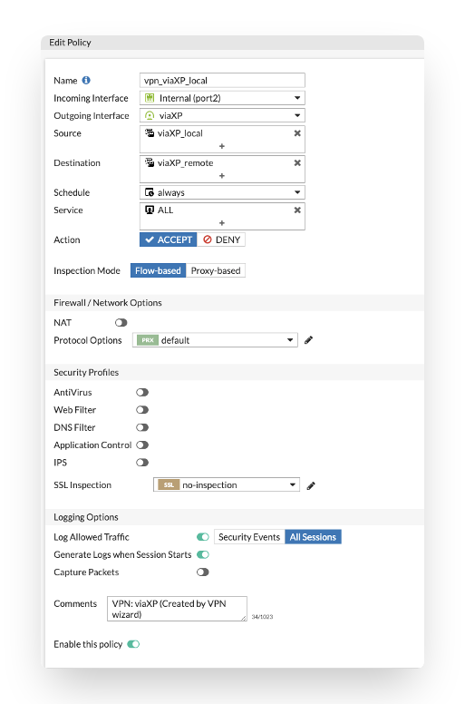
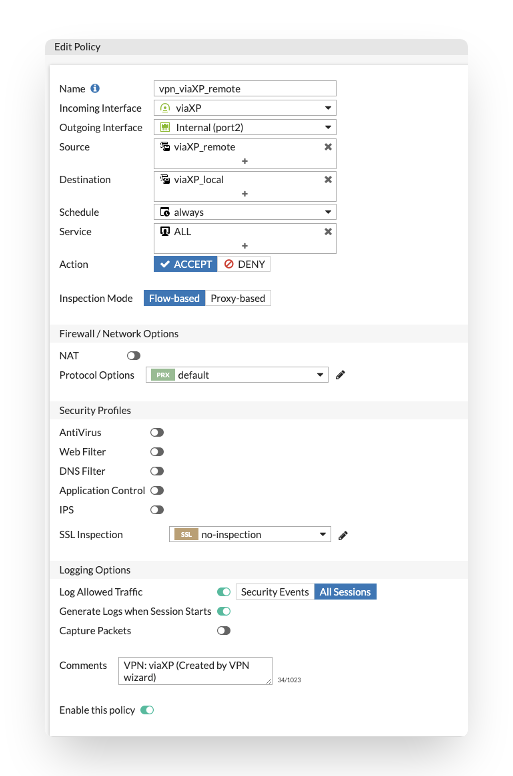
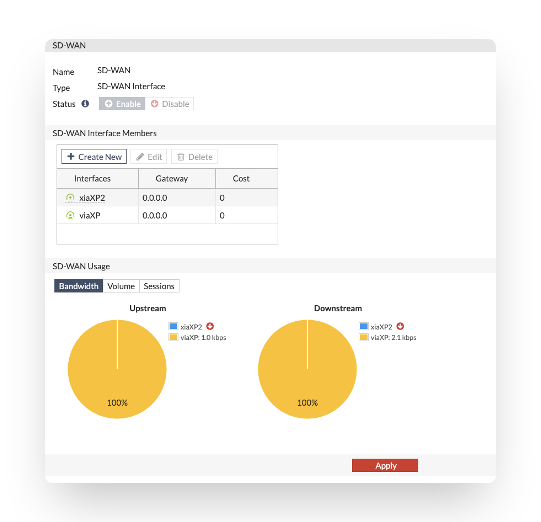
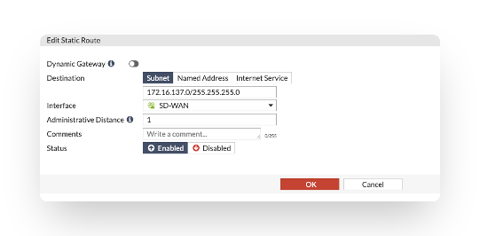
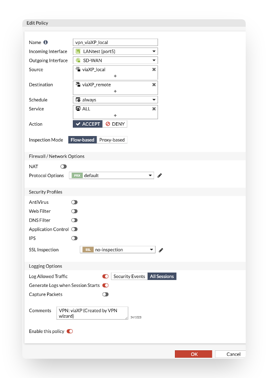
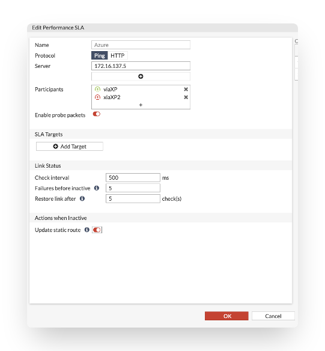
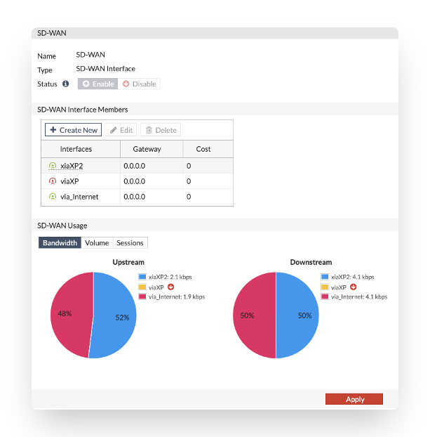

# SD-WAN - Encrypted ExpressRoute

## Introduction

ExpressRoute is an Azure service that lets you create private connections between Microsoft datacenters and infrastructure that's on your premises or in a colocation facility. With ExpressRoute, you can establish connections to Microsoft cloud services, such as Microsoft Azure and Microsoft 365.

ExpressRoute connections do not go over the public Internet, and offer higher security, reliability, and speeds with lower latencies than typical connections over the Internet.

However ExpressRoute does not provide network traffic encryption for its circuits which might critical in some scenarios. For example if you are operating in highly regulated sector like finance you might want to have full control over the traffic being sent to ExpressRoute and encrypt it before it is send to ExpressRoute circuit. Furthermore encryption of traffic sent to ExpressRoute might also be required by secuirty audits in order to meet regulations requirements.

 In order to encrypt traffic send to ExpressRoute you need to build VPN tunnel over ExpressRoute. To achieve that you need to build two separate VPN tunnels from on-premise Fortigate to two Fortigate's NGFW running as Active-Passive cluster in Microsoft Azure. One VPN tunnel is terminated on Active Fortigate A in Azure and second tunnel is terminated on passive Fortigate B in Azure.
## Flow
In the diagram the different steps to establish a session are layed out. This flow is based on the configuration as deployed in this template.

Inbound connection

1. Connection from client via local Firewall which has VPN tunnels over Express Route Circuit - s: w.x.y.z - d: 172.16.137.4
w.x.y.z is private IP address of the host in Local Area Network on-premise. No NAT happens during the whole connection.
2. Packet is sent via encrypted Express Route circuit to Azure ExpressRoute Gateway.s: w.x.y.z - d: 172.16.137.4
3a. Active Fortigate which terminates VPN tunnel picks up a packet
3b. In case of HA failover, passive Fortigate which terminates secondary VPN tunnel becomes active unit and  picks up a packet
4. FTG sends the packet to the server via routing in Azure - s: w.x.y.z - d: 172.16.137.4
5. Based on SD-WAN configuration connection can take also second path. From on-premise client via local Firewall which has VPN tunnel to Azure over Internet- s: w.x.y.z - d: 172.16.137.4
6. Packet is sent via VPN tunnel over Internet through External Azure Load Balancer to active Fortigate. s: w.x.y.z - d: 172.16.137.4
7. FTG sends the packet to the server via routing in Azure - s: w.x.y.z - d: 172.16.137.4

Outbound connection

1. Connection from client to the private IP of the server in on-premise LAN. Azure routes the traffic using UDR to the internal Load Balancer. - s: 172.16.137.4 - d: a.b.c.d 
a.b.c.d is private IP address of the host in Local Area Network on-premise. No NAT happens during the whole connection.
2. Azure Internal Load Balancer probes and send the packet to the active FGT. - s: 172.16.137.4 - d: a.b.c.d
3. Active FGT inspects the packet and when allowed sends the packet to VPN tunnel over ExpressRoute circuit. - s: 172.16.136.5 - d: a.b.c.d
4. Packet is sent via encrypted Express Route circuit to on-premise Fortigate - s: 172.16.137.4 - d: a.b.c.d
5. On-premise Fortigate sends packet to the server in on-premise LAN - s: 172.16.137.4  d: a.b.c.d
6. Connection from client to the private IP of the server in on-premise LAN. Azure routes the traffic using UDR to the internal Load Balancer. - s: 172.16.137.4 - d: a.b.c.d 
7. A zure Internal Load Balancer probes and send the packet to the active FGT. - s: 172.16.137.4 - d: a.b.c.d
8. Based on SD-WAN configuration connection can take also second path. Active FGT inspects the packet and when allowed sends the packet to VPN tunnel over Internet. - s: 172.16.136.5 - d: a.b.c.d
9. On-premise Fortigate sends packet to the server in on-premise LAN - s: 172.16.137.4  d: a.b.c.d

## Configuration
To configure encrypted Express ROute you need to build two separate VPN tunnels from on-premise Fortigate to two Fortigate's running in MS Azure. One VPN tunnel is terminated on FTG A and second VPN tunnel is terminated on FTG B. 

## Configuration of on-premise Fortigate

The drawing in [flow](#flow) section is used in the configuration screenshots with LAN on-premise 172.16.248.0/24 and IP address of Fortigate on-premise reachable via ExpressRoute 172.16.251.50

You can use VPN wizard to create VPN tunnel between on-premise Fortigate and Fortigates in Azure.

Configuration of VPN tunnel between on-premise Fortigate and Fortigate A 172.16.136.69 in Azure
<p align="center">
  
</p>


-via XP_Local - Local network 172.16.248.0/24 which should be reachable via VPN tunnel
-viaXP_remote - Remote network which should be reachable via VPN tunnel

Configuration of VPN tunnel between on-premise Fortigate and Fortigate B 172.16.136.70 in Azure

-xia XP_Local - Local network 172.16.248.0/24 which should be reachable via VPN tunnel
-xiaXP_remote - Remote network which should be reachable via VPN tunnel

In order to achieve faster VPN tunnels failover times, you can adjust dpd-retrycount and dpd-retryinterval in each VPN tunnel settings.

``` 
config vpn ipsec phase1-interface
 edit viaXP
 set dpd-retryinterval 10
 set dpd-retrycount 1
 next
```

``` 
config vpn ipsec phase1-interface
 edit xiaXP2
 set dpd-retryinterval 10
 set dpd-retrycount 1
 next
```

If you use VPN wizard, firewall policies allowing traffic between on-premise FTG and FTG A & B in Azure will be automatically created.

You can also create new SD-WAN interface which consist of the 3 VPN tunnels (2 built previously and one new over Internet) to steer the traffic according to your needs for example based on type of application like O365. More about this configuration in further section of this document.

Name: Name of auto-created policy
Incoming Interface: The interface where the packet is coming from. In our example it is port 5
Outgoing Interface: The interface where the packet is routed to, it is one of our newly created VPN tunnel
Source: LAN on-premise
Destination: Remote network in Azure that should be reachable via encrypted Express Route
Service: Service which should be allowed via VPN tunnel
NAT: Source NAT is not needed for an encrypted Express Route architecture.

Firewall policy allowing traffic from on-premise to Azure


Firewall policy allowing traffic from Azure to on-premise


Status of the VPN tunnel is displayed in VPN dashboard


## Configuration of Fortigate A & B in Azure 
You can use VPN wizard to create VPN tunnel between Azure FortiGate’s and Fortigate on-premise.


172.16.251.50 is an IP address of Fortigate on-premise reachable via ExpressRoute
-via XP_Local - Local network in Azure 
-viaXP_remote - Remote on-premise network which should be reachable via VPN tunnel, in our example 172.16.248.0/24

On Active Fortigate A static route to on-premise 172.16.248.0/24 network via VPN tunnel is created automatically.


On FTG B in Azure you need to remember to create static route to on-premise network via VPN tunnel interface, this setting is not synchronized until FortiOS 6.2.4 version


Firewall policy allowing traffic from Azure to on-premise network 172.16.248.0/24 is created automatically via VPN wizard

Name: Name of auto-created policy
Incoming Interface: The interface where the packet is coming from. In our example it is internal port 2 in Azure
Outgoing Interface: The interface where the packet is routed to, it is one of our newly created VPN tunnel
Source: LAN in Azure
Destination: Remote network on-premise 172.16.248.0/24 that should be reachable via encrypted Express Route
Service: Service which should be allowed via VPN tunnel
NAT: Source NAT is not needed for an encrypted Express Route architecture.



Firewall policy allowing traffic from on-premise network 172.16.248.0/24 to Azure is also automatically created by VPN wizard


Status of the VPN tunnel is displayed in VPN dashboard


## SD-WAN configuration
You can also combine created VPN tunnels into SD-WAN interface on your on-premise firewall to steer the traffic according to your needs.
Below is shown configuration of on-premise box.

[SD-WAN instruction](https://help.fortinet.com/fos60hlp/60/Content/FortiOS/fortigate-networking/SD-WAN/Configuring_basic_SD-WAN.htm)

First you need to remove VPN interfaces references in routes and security policies as described in above document.

On on-premise FTG create SD-WAN interface consisting of both VPN tunnels.


Configure SD-WAN load balancing according to your needs (see [SD-WAN instruction](https://help.fortinet.com/fos60hlp/60/Content/FortiOS/fortigate-networking/SD-WAN/Configuring_basic_SD-WAN.htm))

Configure Static route using previously created SD-WAN interface where 172.16.137.0/24 is a local network behind Azure Fortigates that should be reachable via SD-WAN interface.


Edit previously created firewall policies to use SD-WAN interface instead of VPN tunnel interface


Configure link health monitoring according to your needs. In our example we are probing server located in Azure with IP 172.16.137.5


If you need to send health probe packets from specific source IP for link state monitoring use commands:
```
config system virtual-wan-link 
(virtual-wan-link) # config members
(members) # edit 1
(1) # set source X.X.X.X
```
- You can also add 3rd VPN tunnel over Internet and use it in SD-WAN interface

First create new VPN tunnel over Internet between on-premise box Public IP and Public IP of External Load Balancer (40.114.187.146 in our example) in Azure.


After creation of 3rd VPN tunnel over internet, remove references of this tunnel interface in routes and security policies and add it to SD-WAN interface configuration.



Status of all three VPN tunnels will be shown in dashboard


- Configuration of Fortigate in Azure, 3rd tunnel over Internet

You can use VPN wizard to create 3rd tunnel over Internet.


Where remote gateway is the public IP of Fortigate on-premise
-via_Internet_Local - Local network in Azure 
-via_Internet_remote - Remote on-premise network which should be reachable via VPN tunnel, in our example 172.16.248.0/24

Firewall rule allowing traffic between Azure and on-premise Fortigate will be created automatically by the wizard as shown earlier.

- Terminating an IPSEC tunnel via the Azure Load Balancer is limited to the TCP and UDP protocols. For IPSEC this means that both endpoints need to support NAT-T and run the data connection over UDP/4500 instead of the ESP protocol.
- In the Azure Load Balancer 2 load balancing rules need to be created:


- IKE on port UDP/500


- IPSEC NAT-T on port UDP/4500


Floating IP (direct server return) should be disabled in this configuration. This means that Azure External load balancer will perform DNAT and UDP500 & UDP4500 packets will arrive to Fortigates cluster with private IP address set as destination IP, the same IP on which VPN service is listening to.