# SD-WAN - Encrypted ExpressRoute

## Introduction

ExpressRoute is an Azure service that lets you create private connections between Microsoft datacenters and infrastructure that's on your premises or in a colocation facility. With ExpressRoute, you can establish connections to Microsoft cloud services, such as Microsoft Azure and Microsoft 365.

ExpressRoute connections do not go over the public Internet, and offer higher security, reliability, and speeds with lower latencies than typical connections over the Internet.

However ExpressRoute does not provide network traffic encryption for its circuits which might be critical in some scenarios. For example if you are operating in highly regulated sector, like finance, you might want to have full control over the traffic being sent over ExpressRoute and encrypt it before it is send to ExpressRoute circuit. Furthermore encryption of traffic sent to ExpressRoute might also be required by security audits in order to meet regulatory requirements.

In order to encrypt traffic send over ExpressRoute, you need to build VPN tunnel over ExpressRoute. To achieve this, you need to build two separate VPN tunnels from on-premise FortiGate to two FortiGate's NGFW running as Active-Passive cluster in Microsoft Azure. One VPN tunnel is terminated on primary FortiGate A in Azure and second tunnel is terminated on secondary FortiGate B in Azure.

## Flow

In the diagram the different steps to establish a session are layed out. This flow is based on the configuration as deployed in this template.

### Inbound connection


1. Connection from client via local Firewall which has VPN tunnels over ExpressRoute Circuit - s: w.x.y.z - d: 172.16.137.4
w.x.y.z is private IP address of the host in Local Area Network on-premise. No NAT happens during the whole connection.
2. Packet is sent via encrypted ExpressRoute circuit to Azure ExpressRoute Gateway.s: w.x.y.z - d: 172.16.137.4
3a. Primary FortiGate which terminates VPN tunnel picks up a packet
3b. In case of HA failover, secondary FortiGate which terminates the secondary VPN tunnel becomes the active unit and picks up a packet
4. FTG sends the packet to the server via routing in Azure - s: w.x.y.z - d: 172.16.137.4
5. Based on SD-WAN configuration connection can take also second path. From on-premise client via local Firewall which has VPN tunnel to Azure over Internet- s: w.x.y.z - d: 172.16.137.4
6. Packet is sent via VPN tunnel over Internet through External Azure Load Balancer to active FortiGate. s: w.x.y.z - d: 172.16.137.4
7. FTG sends the packet to the server via routing in Azure - s: w.x.y.z - d: 172.16.137.4

### Outbound connection


1. Connection from client to the private IP of the server in on-premise LAN. Azure routes the traffic using UDR to the internal Load Balancer. - s: 172.16.137.4 - d: a.b.c.d
a.b.c.d is private IP address of the host in Local Area Network on-premise. No NAT happens during the whole connection.
2. Azure Internal Load Balancer probes and send the packet to the active FGT. - s: 172.16.137.4 - d: a.b.c.d
3. Primary FGT inspects the packet and when allowed sends the packet to VPN tunnel over ExpressRoute circuit. - s: 172.16.136.5 - d: a.b.c.d
4. Packet is sent via encrypted ExpressRoute circuit to on-premise FortiGate - s: 172.16.137.4 - d: a.b.c.d
5. On-premise FortiGate sends packet to the server in on-premise LAN - s: 172.16.137.4  d: a.b.c.d
6. Connection from client to the private IP of the server in on-premise LAN. Azure routes the traffic using UDR to the internal Load Balancer. - s: 172.16.137.4 - d: a.b.c.d
7. Azure Internal Load Balancer probes and send the packet to the active FGT. - s: 172.16.137.4 - d: a.b.c.d
8. Based on SD-WAN configuration connection can take also second path. Primary FGT inspects the packet and when allowed sends the packet to VPN tunnel over Internet. - s: 172.16.137.4 - d: a.b.c.d
9. On-premise FortiGate sends packet to the server in on-premise LAN - s: 172.16.137.4  d: a.b.c.d

## Configuration

To configure encrypted Express ROute you need to build two separate VPN tunnels from on-premise FortiGate to two FortiGate's running in MS Azure. One VPN tunnel is terminated on FTG A and second VPN tunnel is terminated on FTG B.

### Configuration of on-premise FortiGate

The drawing in [flow](#flow) section is used in the configuration screenshots with LAN on-premise 172.16.248.0/24 and IP address of FortiGate on-premise reachable via ExpressRoute 172.16.251.50

You can use the VPN wizard to create a VPN tunnel between on-premise FortiGate and FortiGates in Azure.

Configuration of the VPN tunnel between on-premise FortiGate and FortiGate A (172.16.136.69) in Azure
<p align="center">
  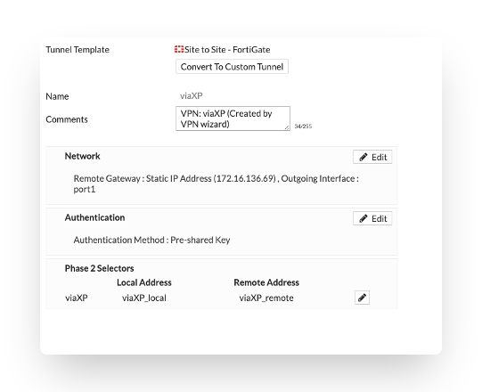
</p>

- viaXP_Local - Local network 172.16.248.0/24 which should be reachable via VPN tunnel
- viaXP_remote - Remote network which should be reachable via VPN tunnel

Configuration of VPN tunnel between on-premise FortiGate and FortiGate B 172.16.136.70 in Azure
<p align="center">
  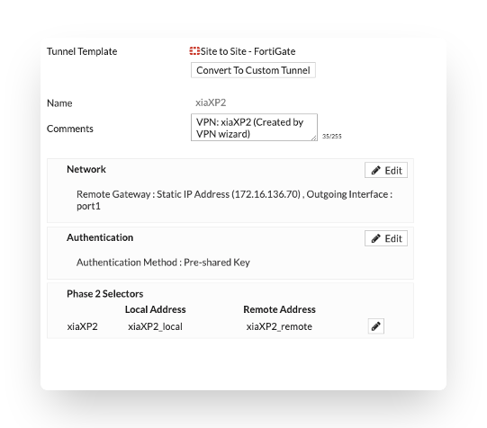
</p>

- xia XP_Local - Local network 172.16.248.0/24 which should be reachable via VPN tunnel
- xiaXP_remote - Remote network which should be reachable via VPN tunnel

In order to achieve faster VPN tunnels failover times, you can adjust dpd-retrycount and dpd-retryinterval in each VPN tunnel settings.

```
config vpn ipsec phase1-interface
 edit viaXP
 set dpd-retryinterval 10
 set dpd-retrycount 1
 next
```

```
config vpn ipsec phase1-interface
 edit xiaXP2
 set dpd-retryinterval 10
 set dpd-retrycount 1
 next
```

If you use VPN wizard, firewall policies allowing traffic between on-premise FTG and FTG A & B in Azure will be automatically created.

You can also create new SD-WAN interface which consist of the 3 VPN tunnels (2 built previously and one new over Internet) to steer the traffic according to your needs for example based on type of application like O365. More about this configuration in further section of this document.

- Name: Name of auto-created policy
- Incoming Interface: The interface where the packet is coming from. In our example it is port 5
- Outgoing Interface: The interface where the packet is routed to, it is one of our newly created VPN tunnel
- Source: LAN on-premise
- Destination: Remote network in Azure that should be reachable via encrypted ExpressRoute
Service: Service which should be allowed via VPN tunnel
- NAT: Source NAT is not needed for an encrypted ExpressRoute architecture.

Firewall policy allowing traffic from on-premise to Azure
<p align="center">
  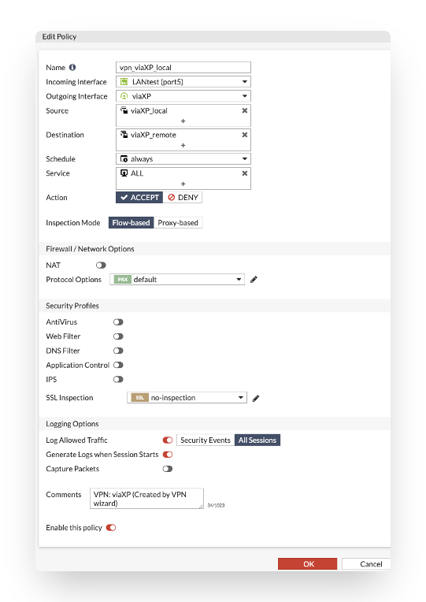
</p>


Firewall policy allowing traffic from Azure to on-premise
<p align="center">
  
</p>


Status of the VPN tunnel is displayed in VPN dashboard
<p align="center">
  
</p>


## Configuration of FortiGate A & B in Azure
You can use VPN wizard to create VPN tunnel between Azure FortiGate’s and FortiGate on-premise.
<p align="center">
  
</p>


172.16.251.50 is an IP address of FortiGate on-premise reachable via ExpressRoute
- via XP_Local - Local network in Azure
- viaXP_remote - Remote on-premise network which should be reachable via VPN tunnel, in our example 172.16.248.0/24

On primary FortiGate A static route to on-premise 172.16.248.0/24 network via VPN tunnel is created automatically.
<p align="center">
  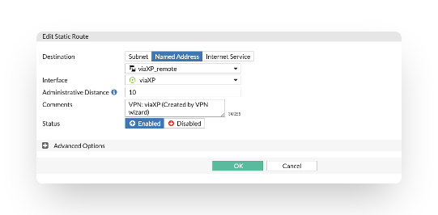
</p>


On FTG B in Azure you need to remember to create static route to on-premise network via VPN tunnel interface, this setting is not synchronized until FortiOS 6.2.4 version
<p align="center">
  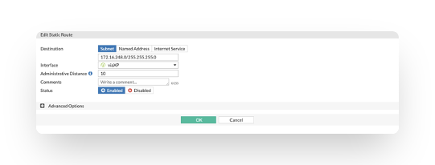
</p>


Firewall policy allowing traffic from Azure to on-premise network 172.16.248.0/24 is created automatically via VPN wizard

- Name: Name of auto-created policy
Incoming Interface: The interface where the packet is coming from. In our example it is internal port 2 in Azure
- Outgoing Interface: The interface where the packet is routed to, it is one of our newly created VPN tunnel
- Source: LAN in Azure
- Destination: Remote network on-premise 172.16.248.0/24 that should be reachable via encrypted ExpressRoute
- Service: Service which should be allowed via VPN tunnel
- NAT: Source NAT is not needed for an encrypted ExpressRoute architecture.

<p align="center">
  
</p>


Firewall policy allowing traffic from on-premise network 172.16.248.0/24 to Azure is also automatically created by VPN wizard
<p align="center">
  
</p>


- Status of the VPN tunnel is displayed in VPN dashboard
<p align="center">
  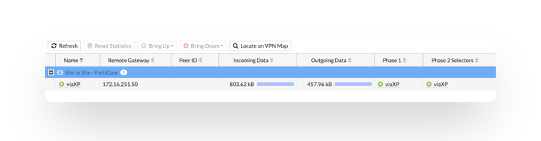
</p>


## SD-WAN configuration
You can also combine created VPN tunnels into SD-WAN interface on your on-premise firewall to steer the traffic according to your needs.
Below is shown configuration of on-premise box.

[SD-WAN instruction](https://help.fortinet.com/fos60hlp/60/Content/FortiOS/fortigate-networking/SD-WAN/Configuring_basic_SD-WAN.htm)

First you need to remove VPN interfaces references in routes and security policies as described in above document.

On on-premise FTG create SD-WAN interface consisting of both VPN tunnels.
<p align="center">
  
</p>


Configure SD-WAN load balancing according to your needs (see [SD-WAN instruction](https://help.fortinet.com/fos60hlp/60/Content/FortiOS/fortigate-networking/SD-WAN/Configuring_basic_SD-WAN.htm))

Configure Static route using previously created SD-WAN interface where 172.16.137.0/24 is a local network behind Azure FortiGates that should be reachable via SD-WAN interface.
<p align="center">
  
</p>


Edit previously created firewall policies to use SD-WAN interface instead of VPN tunnel interface
<p align="center">
  
</p>


Configure link health monitoring according to your needs. In our example we are probing server located in Azure with IP 172.16.137.5
<p align="center">
  
</p>

If you need to send health probe packets from specific source IP for link state monitoring use commands:
```
config system virtual-wan-link
(virtual-wan-link) # config members
(members) # edit 1
(1) # set source X.X.X.X
```
You can also add 3rd VPN tunnel over Internet and use it in SD-WAN interface

First create new VPN tunnel over Internet between on-premise box Public IP and Public IP of External Load Balancer (40.114.187.146 in our example) in Azure.
<p align="center">
  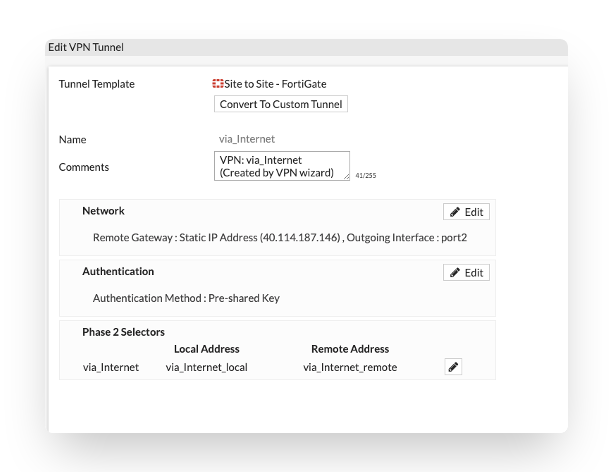
</p>


After creation of 3rd VPN tunnel over internet, remove references of this tunnel interface in routes and security policies and add it to SD-WAN interface configuration.
<p align="center">
  
</p>


Status of all three VPN tunnels will be shown in dashboard
<p align="center">
  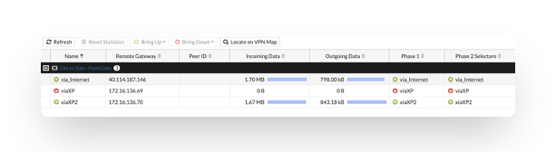
</p>


Configuration of FortiGate in Azure, 3rd tunnel over Internet

You can use VPN wizard to create 3rd tunnel over Internet.
<p align="center">
  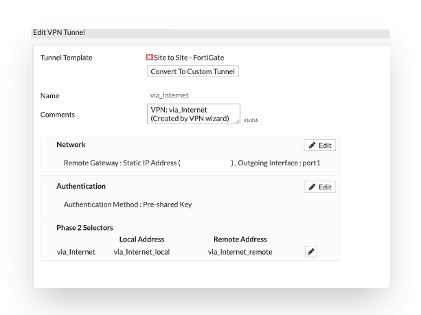
</p>


Where remote gateway is the public IP of FortiGate on-premise
- via_Internet_Local - Local network in Azure
- via_Internet_remote - Remote on-premise network which should be reachable via VPN tunnel, in our example 172.16.248.0/24

Firewall rule allowing traffic between Azure and on-premise FortiGate will be created automatically by the wizard as shown earlier.

- Terminating an IPSEC tunnel via the Azure Load Balancer is limited to the TCP and UDP protocols. For IPSEC this means that both endpoints need to support NAT-T and run the data connection over UDP/4500 instead of the ESP protocol.
- In the Azure Load Balancer 2 load balancing rules need to be created:
<p align="center">
  
</p>


- IKE on port UDP/500
<p align="center">
  
</p>


- IPSEC NAT-T on port UDP/4500
<p align="center">
  
</p>


Floating IP (direct server return) should be disabled in this configuration. This means that Azure External load balancer will perform DNAT and UDP500 & UDP4500 packets will arrive to FortiGates cluster with private IP address set as destination IP, the same IP on which VPN service is listening to.


## BGP Configuration
In larger environments with multiple on-premise FortiGates connecting to environment in Azure static route configuration is not scalable and easy to manage any more. To overcome this obstacle you can use dynamic routing [BGP](https://docs.fortinet.com/document/fortigate/6.4.2/administration-guide/750736/bgp) to steer the traffic between on-premise and cloud networks.

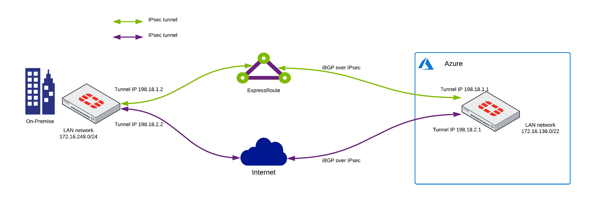

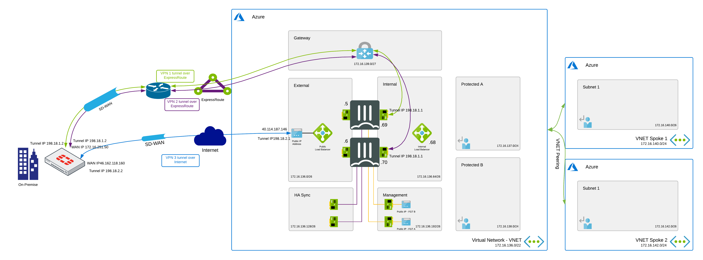

**Configuration of FortiGates in Azure**

You need to configure IP addresses on tunnel interfaces which will be used by BGP. This configuration will be synchronized between cluster members.

Configuration of VPN tunnel interface via ExpressRoute
<p align="center">
  
</p>

Where 192.18.1.1 is tunnel IP address of FortiGate A

Configuration of VPN tunnel interface via Internet
<p align="center">
  
</p>

BGP Configuration
<p align="center">
  
</p>

Where **198.18.1.2** and **198.18.2.2** are IP addresses configured on tunnel interfaces on on-premise FortiGate for BGP. Both Azure FortiGates and on-premise FortiGate should have the same AS (Autonomous System) configured, for example 650005

Network that we want to publish via BGP needs to be defined in static route on Azure FortiGate’s already.
Otherwise it will not be advertised by BGP. In this example we publish internal Azure network 172.16.136.0/22 via BGP.

```
ACCELERATE-FGT-A (bgp) # show
config router bgp
    set as 65005
    set router-id 169.254.0.2
    set ibgp-multipath enable
    set additional-path enable
    set graceful-restart enable
    config neighbor
        edit "198.18.1.2"
            set capability-graceful-restart enable
            set soft-reconfiguration enable
            set remote-as 65005
            set connect-timer 1
            set additional-path both
        next
        edit "198.18.2.2"
            set capability-graceful-restart enable
            set soft-reconfiguration enable
            set remote-as 65005
            set connect-timer 1
            set additional-path both
        next
    end
    config network
        edit 1
        set prefix 172.16.136.0 255.255.252.0
        next
```

We configure also multipath so BGP can advertise multiple networks paths available via multiple tunnels.
https://docs.fortinet.com/document/fortigate/6.2.0/new-features/815658/bgp-additional-path-support

In order for BGP to failover in seconds instead of minutes you can set connect-timer to 1. BGP connect timeout specify how fast BGP will establish a TCP session with the BGP neighbor in Active state.

If you want sessions to be routed via BGP routes after BGP is back up (instead of being sent via default WAN interface) you need to enable Snat-route-change

```
config system global
     set snat-route-change [disable|enable]
   end
```
Configuring this command would break session stickiness, when NAT is enabled. Sessions will be routed to BGP interfaces, when BGP is UP instead of being sent via default WAN interface.

As a best practice you can configure blackhole route with higher metric, in order not to send traffic via default route if BGP connection is down.

<p align="center">
  
</p>

Status of BGP routes

<p align="center">
  
</p>

**BGP Configuration on on-premise FortiGate**

You need to configure IP addresses on tunnel interfaces for BGP. **Same** IP address needs to configured on both VPN tunnel interfaces using ExpressRoute.

Configuration of first VPN tunnel interface via ExpressRoute

<p align="center">
  
</p>

Configuration of second VPN tunnel interface via ExpressRoute

<p align="center">
  
</p>

In order to configure **same IP address 198.18.1.2** on both express-route tunnel interfaces you need enable allow-subnet-overlap.

```
ACCELERATE-FGT-A # config system settings

ACCELERATE-FGT-A (settings) # set allow-subnet-overlap
```

Configuration of VPN tunnel interface via Internet
<p align="center">
  
</p>

Configuration of BGP
**198.18.1.1 and 198.18.2.1** are the IP addresses configured on VPN tunnel interfaces on Azure FortiGates.
**172.16.248.0/24** is an example of the on-premise protected network that you can publish via BGP.

<p align="center">
  
</p>

```
roz (bgp) # show
config router bgp
    set as 65005
    set router-id 169.254.0.1
    set ibgp-multipath enable
    set additional-path enable
    set graceful-restart enable
    config neighbor
        edit "198.18.1.1"
            set capability-graceful-restart enable
            set soft-reconfiguration enable
            set remote-as 65005
            set connect-timer 1
            set additional-path both
        next
        edit "198.18.2.1"
            set capability-graceful-restart enable
            set soft-reconfiguration enable
            set remote-as 65005
            set connect-timer 1
            set additional-path both
        next
    end
    config network
        edit 1
            set prefix 172.16.248.0 255.255.255.0
        next
```
We configure also multipath so BGP can advertise multiple networks paths available via multiple tunnels.
https://docs.fortinet.com/document/fortigate/6.2.0/new-features/815658/bgp-additional-path-support


In order for BGP to failover in seconds you can set connect-timer to 1. BGP connect timeout specify how fast BGP will establish a TCP session with the BGP neighbor in Active state.

If you want sessions to be routed via BGP routes after BGP is back up (instead of being sent via default WAN interface) you need to enable Snat-route-change

```
config system global
     set snat-route-change [disable|enable]
   end
```

Configuring this command would break session stickiness, when NAT is enabled. Sessions will be routed to BGP interfaces, when BGP is UP instead of being sent via default WAN interface.

As a best practice you can configure blackhole route with higher metric, in order not to send traffic via default route if BGP connection is down.

<p align="center">
  
</p>