# SD-WAN - ExpressRoute

## Introduction
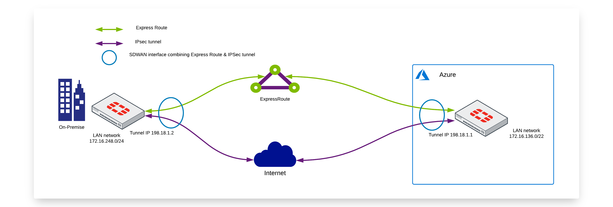

The goal of this tutorial is document on how to configure Fortinet Secure SD-WAN between an IPsec tunnel over the internet and Azure Expressroute.
 

Azure ExpressRoute lets you extend your on-premises networks into the Microsoft cloud over a private connection facilitated by a connectivity provider. With ExpressRoute, you can establish connections to Microsoft cloud services, such as Microsoft Azure and Microsoft 365. Connectivity can be from an any-to-any (IP VPN) network, a point-to-point Ethernet network, or a virtual cross-connection through a connectivity provider at a co-location facility. ExpressRoute connections do not go over the public Internet. This allows ExpressRoute connections to offer more reliability, faster speeds, consistent latencies, and higher security than typical connections over the Internet. A good resource to learn more about Expressroute is [this video](https://www.youtube.com/watch?v=oevwZZ1YFS0).

The advantage of combining Fortinet Secure SD-WAN and Expressroute is:
- Application level visibility.
- The ability to control/prioritize critical traffic and applications.
- Dynamic path selection to select the best/preferred path to the cloud.
- Automatically route traffic to next best available link in the event of an outage.

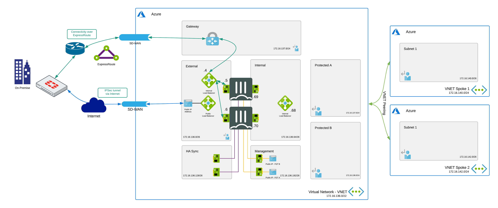

## Flow
In the diagram the different steps to establish a session are layed out. 

### Inbound connection

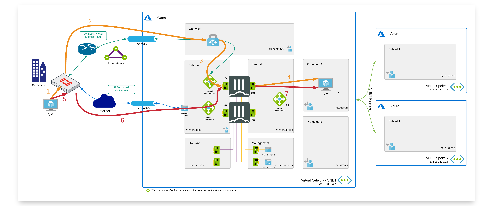

1. Connection from client via local Firewall which has Express Route connection to Azure - s: w.x.y.z - d: 172.16.137.4
w.x.y.z is private IP address of the host in Local Area Network on-premise. No NAT happens during the whole connection.
2. Packet is sent via  ExpressRoute circuit to Azure ExpressRoute Gateway.s: w.x.y.z - d: 172.16.137.4
3. Packet is sent via user defined routing (UDR) in Azure to Internal Load Balancer which forwards the packet to active FTG in HA Cluster.
4. FTG sends the packet to the server via routing in Azure - s: w.x.y.z - d: 172.16.137.4
5. Based on SD-WAN configuration connection can take also second path. From on-premise client via local Firewall which has VPN tunnel to Azure over Internet- s: w.x.y.z - d: 172.16.137.4
6. Packet is sent via VPN tunnel over Internet through External Azure Load Balancer to active FortiGate. s: w.x.y.z - d: 172.16.137.4
7. FTG sends the packet to the server via routing in Azure - s: w.x.y.z - d: 172.16.137.4

### Outbound connection

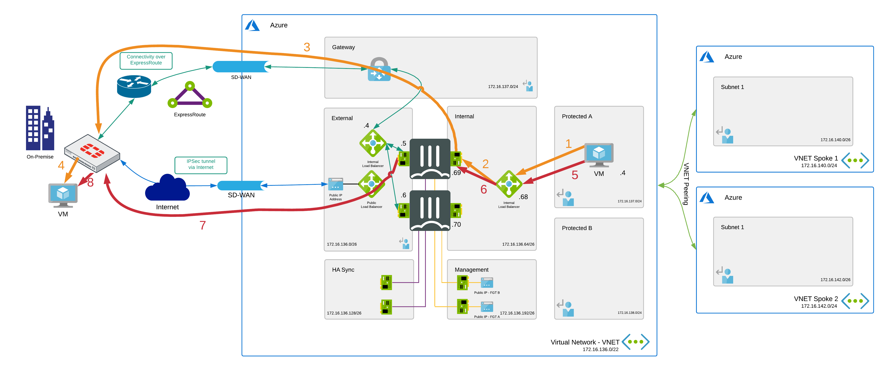

1. Connection from client to the private IP of the server in on-premise LAN. Azure routes the traffic using UDR to the internal Load Balancer. - s: 172.16.137.4 - d: a.b.c.d
a.b.c.d is private IP address of the host in Local Area Network on-premise. No NAT happens during the whole connection.
2. Azure Internal Load Balancer probes and send the packet to the active FGT. - s: 172.16.137.4 - d: a.b.c.d
3. Primary FGT inspects the packet and when allowed sends the packet to ExpressRoute circuit. - s: 172.16.137.4 - d: a.b.c.d
4. On-premise FortiGate sends packet to the server in on-premise LAN - s: 172.16.137.4  d: a.b.c.d
5. Connection from client to the private IP of the server in on-premise LAN. Azure routes the traffic using UDR to the internal Load Balancer. - s: 172.16.137.4 - d: a.b.c.d
6. Azure Internal Load Balancer probes and send the packet to the active FGT. - s: 172.16.137.4 - d: a.b.c.d
7. Based on SD-WAN configuration connection can take also second path. Primary FGT inspects the packet and when allowed sends the packet to VPN tunnel over Internet. - s: 172.16.137.4 - d: a.b.c.d
8. On-premise FortiGate sends packet to the server in on-premise LAN - s: 172.16.137.4  d: a.b.c.d

## Configuration

To configure SD-WAN integrating both Express route connection and VPN tunnel over Internet you need to configure two separate connections and build SD-WAN interface out of them.

More information about SD-WAN can be found here :
[SD-WAN Instruction](https://docs.fortinet.com/document/fortigate/7.0.0/administration-guide/19246/sd-wan)

### Configuration of on-premise FortiGate

The drawing in [flow](#flow) section is used in the configuration screenshots with LAN on-premise 172.16.248.0/24 and IP address of Express Route Router 172.16.251.254 which provides Express Route access.

You can use the VPN wizard to create a VPN tunnel between on-premise Fortigate and AP HA Cluster of Fortigates in Azure where 40.114.187.146 is Public IP address of Azure external Load Balancer.

  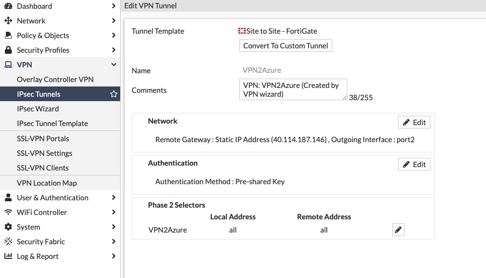

You need to remember to remove firewall policies using VPN tunnel and static routes which have been created after using VPN wizard, otherwise you will not be able to use VPN tunnel in SD-WAN configuration later on.

You need to configure SD-WAN members, one using VPN tunnel interface configured in the previous step and another member using your Express Route connection.

Leave SD-WAN Zone as virtual-wan-link.
As VPN tunnel is already configured with remote gateway settings, leave Gateway set to 0.0.0.0.

  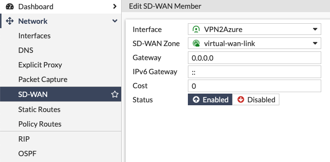

Repeat the above step for WAN, setting Gateway to the ISP's gateway: 172.16.251.254 in our setup

  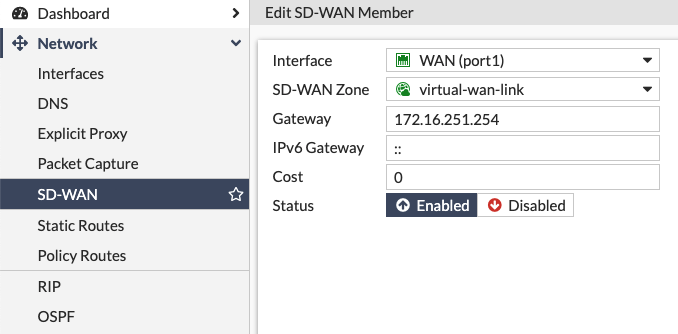

  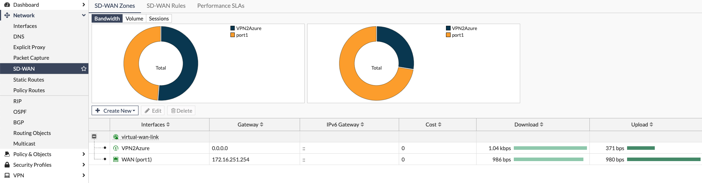

You must configure a route for the SD-WAN. The default gateways for each SD-WAN member interface do not need to be defined in the static routes table. FortiGate will decide what route or routes are preferred using Equal Cost Multi-Path (ECMP) based on distance and priority.

  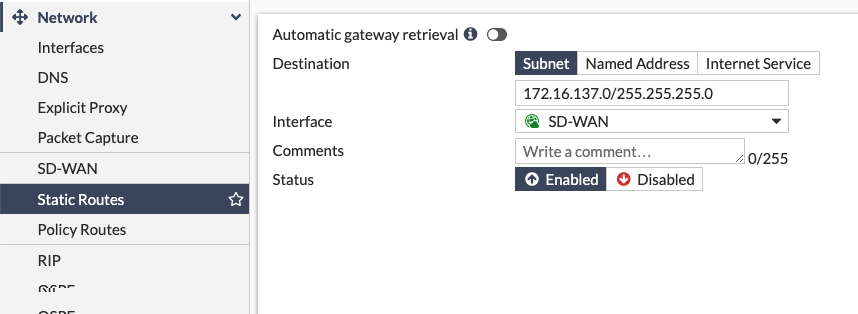

Where 172.16.137.0/24 is private address space in Azure which should be reachable via SD-WAN interface.

SD-WAN rules define specific routing options to route traffic to an SD-WAN member.

If no routing rules are defined, the default Implicit rule is used. It can be configured to use one of five different load balancing algorithms. See [Implicit rule](https://docs.fortinet.com/document/fortigate/7.0.0/administration-guide/216765/implicit-rule) for more details and examples.

  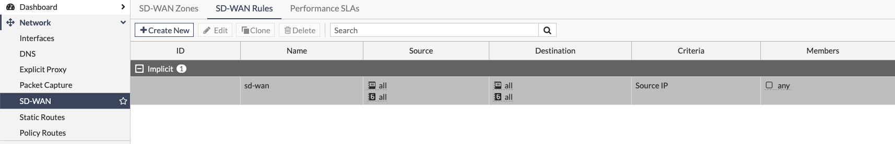

SD-WAN zones can be used in policies as source and destination interfaces. Individual SD-WAN members cannot be used in policies.

You must configure a policy that allows traffic from your organization's internal network to the SD-WAN zone. Policies configured with the SD-WAN zone apply to all SD-WAN interface members in that zone.

In our example local on-premise network is 172.16.248.0/24 and local network in Azure is 172.16.137.0/24
You don't need to enable NAT as both connections via Express Route and via VPN tunnel work without source NAT.

  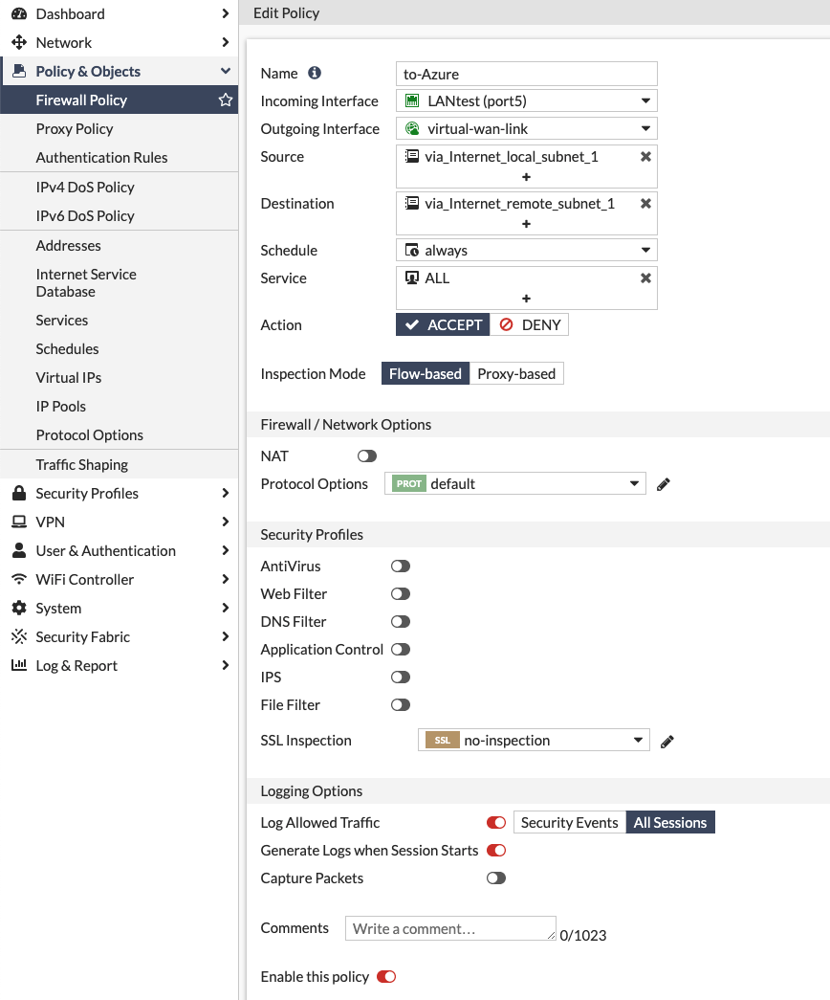

You also need to configure policy in opposite directly allowing incoming traffic from Azure to local on-premise network via SD-WAN zone.

  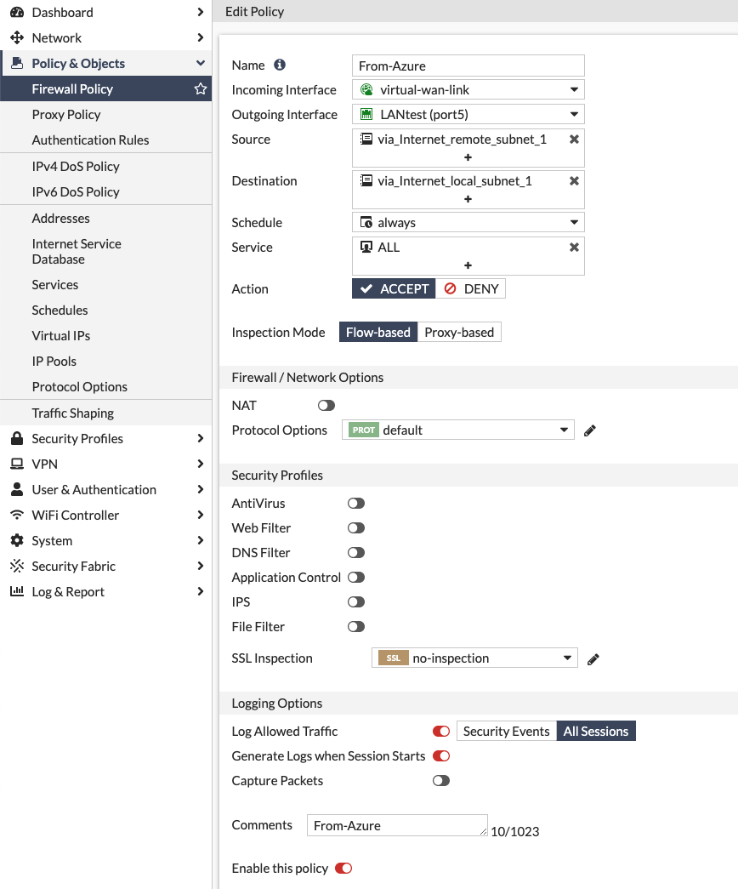

You can configure link health monitoring according to your needs. 
Performance SLA link monitoring measures the health of links that are connected to SD-WAN member interfaces by sending probing signals through each link to a server, and then measuring the link quality based on latency, jitter, and packet loss. If a link is broken, the routes on that link are removed and traffic is routed through other links. When the link is working again, the routes are re-enabled. This prevents traffic being sent to a broken link and lost.

  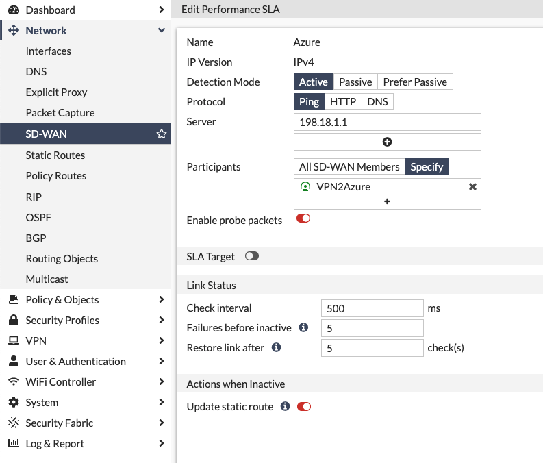

Where 198.18.1.1 is the IP address configured on VPN tunnel interface in Azure and 198.18.1.2 is the IP address configured on VPN tunnel interface on-premise.

  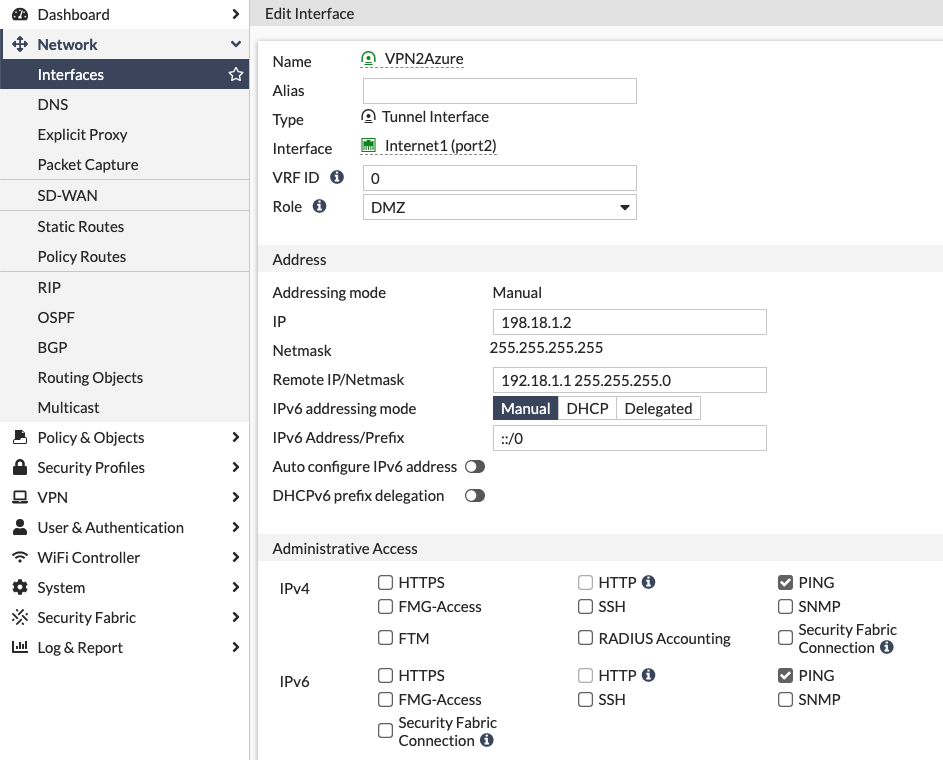

If you are using different address space for performance SLA monitoring via VPN tunnel you need to remember to include this address space in Phase 2 configuration of VPN tunnel. Otherwise traffic will not be allowed and link monitoring will fail.

  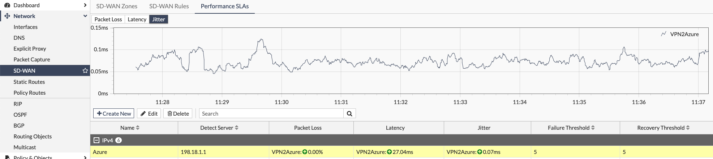

### Configuration of Azure FortiGate

You can use the VPN wizard to create a VPN tunnel between Azure AP HA Cluster Fortigate and  Fortigate on-premise where 46.162.118.160 is Public IP address of on-premise Fortigate.

  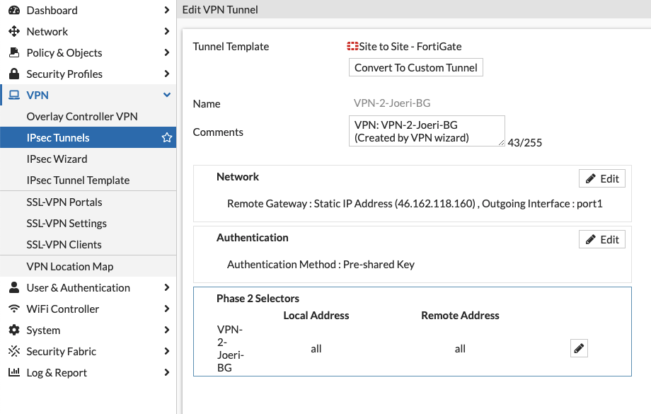

You need to remember to remove firewall policies using VPN tunnel and static routes which have been created after using VPN wizard, otherwise you will not be able to use VPN tunnel in SD-WAN configuration later on.

In order to separate traffic coming from Express Route interface from local LAN traffic in Azure you should introduce additional Frontend IP configuration of Azure internal Load Balancer (172.16.136.4 in our example) located in external subnet in Azure. See first diagram for details.

  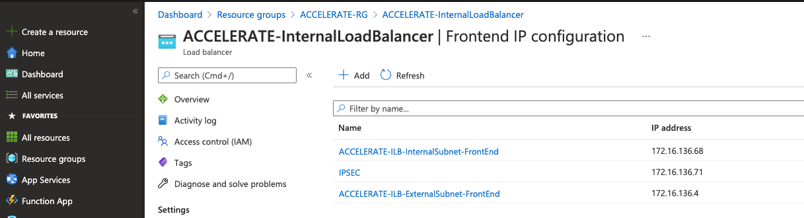

You need also to introduce new Backend Pool consisting of private IP address of Azure Fortigate A and Fortiage B interfaces located in External subnet. In our example it is 172.16.136.5 & 172.16.136.6

  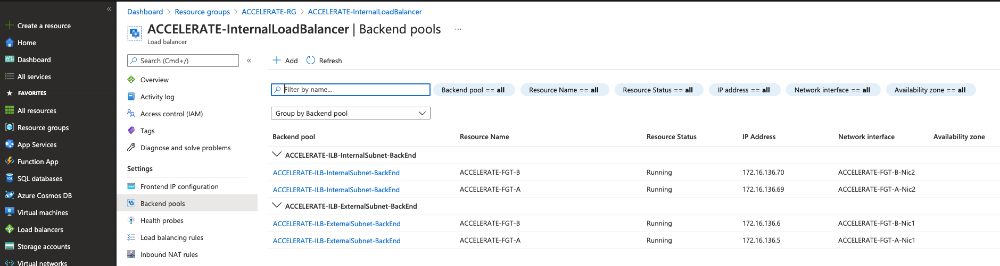

As next step you need to configure Load Balancing rule which using 'HA Ports setting' will distribute traffic incoming from Express route among AP HA cluster members.

  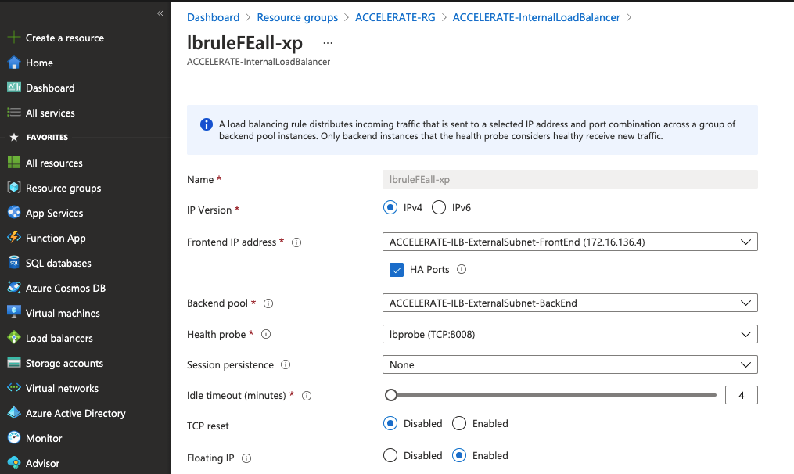

Where Frontend IP address is previously configured 172.16.136.4 and Backend Pool is the one consisting of 172.16.136.5 & 172.16.136.6 IP addresses of Fortigate's NICs in external subnet.

You also need to create Route Table which will be associated with Express Route VPN Gateway subnet and will point to Azure LAN network 172.16.137.0/24 (or also to additional spoke networks which are connected via Vnet peering) via additonally created Frontend IP of Azure Internal Load Balancer 172.16.136.4.

  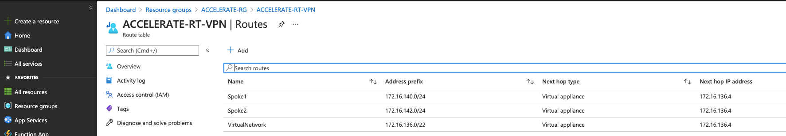

  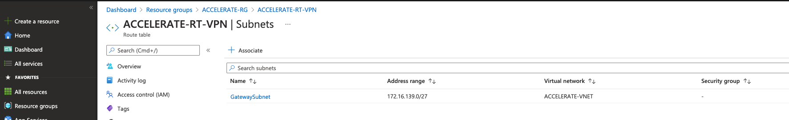

You need also to create static route on Azure Fortigate pointing that local on-premise LAN network is available via Azure default Gateway 172.16.136.1 located in external subnet. Thanks to this entry Azure will automatically route correctly the traffic to Express Route VPN Gateway and via Express Route circuit to on-premise.

You can configure this while adding SD-WAN Member interface and providing 172.16.136.1 as Gateway.

  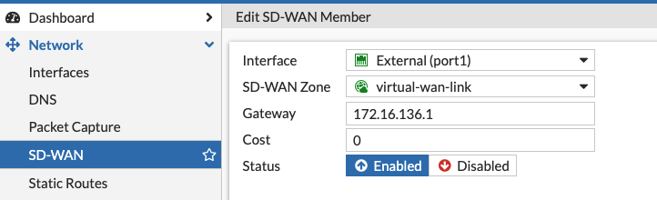

Repeat the above step for another SD-WAN member using VPN tunnel over Internet. 

  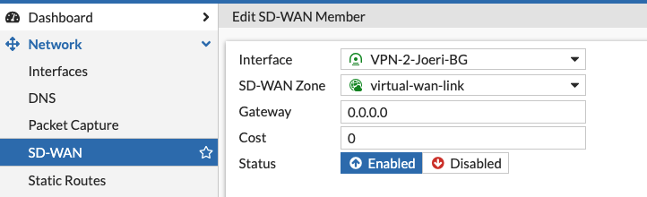

  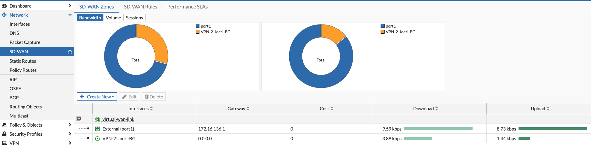

You must configure a route for the SD-WAN. The default gateways for each SD-WAN member interface do not need to be defined in the static routes table. FortiGate will decide what route or routes are preferred using Equal Cost Multi-Path (ECMP) based on distance and priority.

  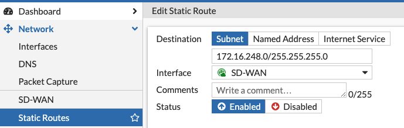

Where 172.16.248.0/24 is private LAN address space on-premise which should be reachable via SD-WAN interface.

SD-WAN rules define specific routing options to route traffic to an SD-WAN member.

If no routing rules are defined, the default Implicit rule is used. It can be configured to use one of five different load balancing algorithms. See [Implicit rule](https://docs.fortinet.com/document/fortigate/7.0.0/administration-guide/216765/implicit-rule) for more details and examples.

  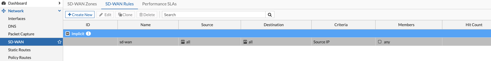

SD-WAN zones can be used in policies as source and destination interfaces. Individual SD-WAN members cannot be used in policies.

You must configure a policy that allows traffic from your organization's internal network to the SD-WAN zone. Policies configured with the SD-WAN zone apply to all SD-WAN interface members in that zone.

In our example local on-premise network is 172.16.248.0/24 and local network in Azure is 172.16.137.0/24 You don't need to enable NAT as both connections via Express Route and via VPN tunnel work without source NAT.

  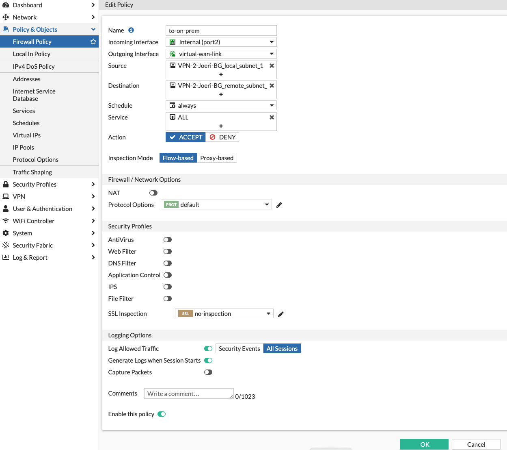

You also need to configure policy in opposite directly allowing incoming traffic from on-premise to Azure via SD-WAN zone.

  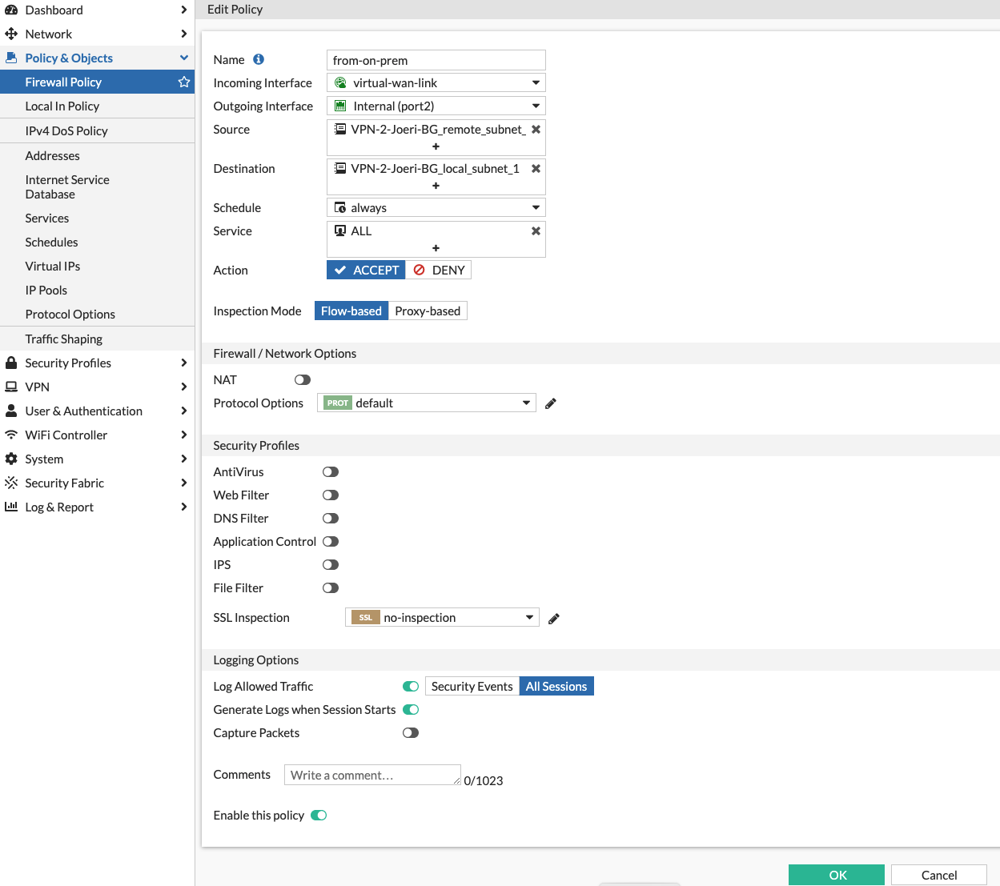

You can configure link health monitoring according to your needs. Performance SLA link monitoring measures the health of links that are connected to SD-WAN member interfaces by sending probing signals through each link to a server, and then measuring the link quality based on latency, jitter, and packet loss. If a link is broken, the routes on that link are removed and traffic is routed through other links. When the link is working again, the routes are re-enabled. This prevents traffic being sent to a broken link and lost.

  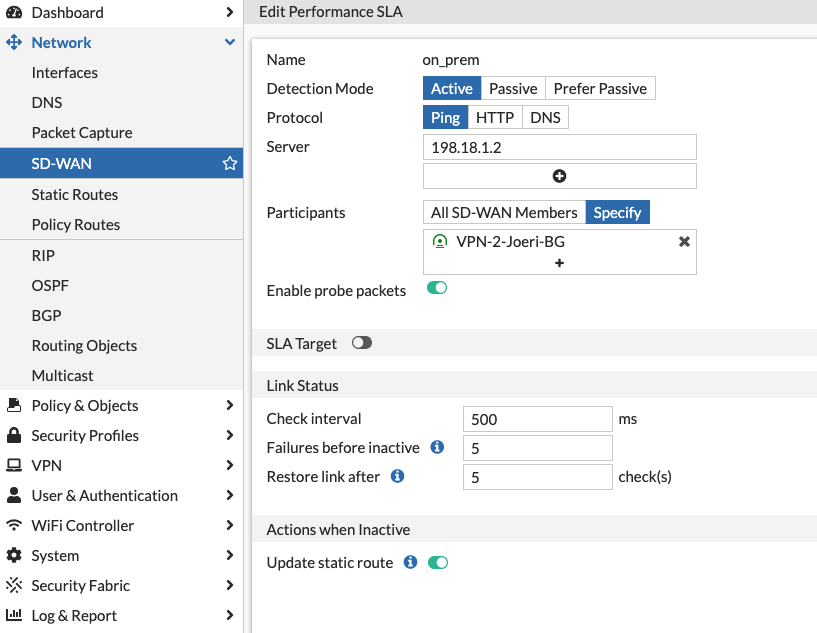

Where 198.18.1.1 is the IP address configured on VPN tunnel interface in Azure and 198.18.1.2 is the IP address configured on VPN tunnel interface on-premise.

  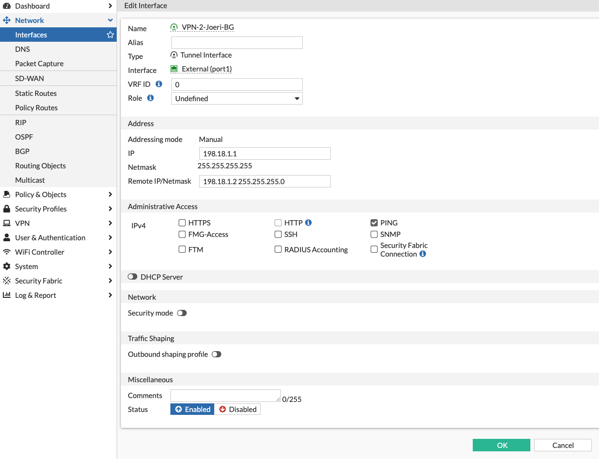

If you are using different address space for performance SLA monitoring via VPN tunnel you need to remember to include this address space in Phase 2 configuration of VPN tunnel. Otherwise traffic will not be allowed and link monitoring will fail.

  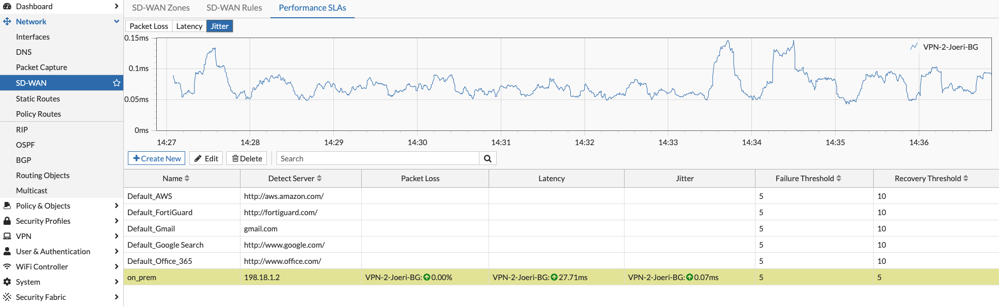

  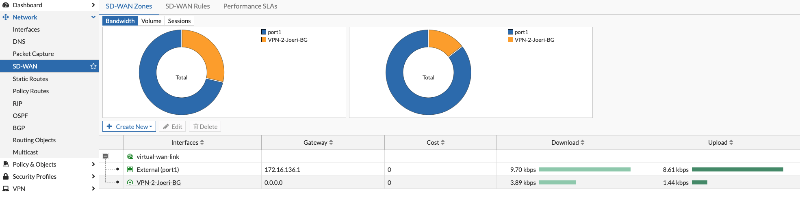

More information about Performance SLA measurements and SD-WAN usage like Volume, Bandwith, Sessions can be fund [here](https://docs.fortinet.com/document/fortigate/7.0.0/administration-guide/823480/results)

You can find CLI configuration used in this tutorial [here](config-sdwan-expressroute-cli.md)

