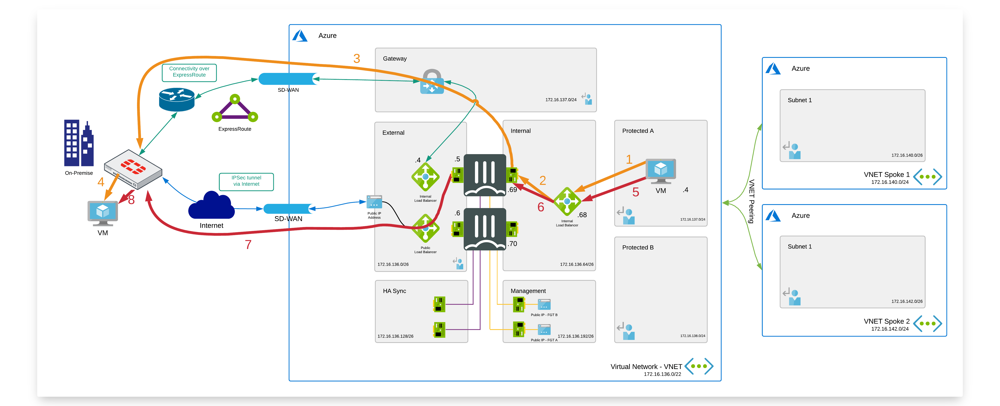

# SD-WAN - ExpressRoute

## Introduction

The goal of this webpage is document on how to configure Fortinet Secure SD-WAN between an IPsec tunnel over the internet and Azure Expressroute.
 
Azure ExpressRoute lets you extend your on-premises networks into the Microsoft cloud over a private connection facilitated by a connectivity provider. With ExpressRoute, you can establish connections to Microsoft cloud services, such as Microsoft Azure and Microsoft 365. Connectivity can be from an any-to-any (IP VPN) network, a point-to-point Ethernet network, or a virtual cross-connection through a connectivity provider at a co-location facility. ExpressRoute connections do not go over the public Internet. This allows ExpressRoute connections to offer more reliability, faster speeds, consistent latencies, and higher security than typical connections over the Internet. A good resource to learn more about Expressroute is [this video](https://www.youtube.com/watch?v=oevwZZ1YFS0).

The advantage of combining Fortinet Secure SD-WAN and Expressroute is:
- Application level visibility.
- The ability to control/prioritize critical traffic and applications.
- Dynamic path selection to select the best/preferred path to the cloud.
- Automatically route traffic to next best available link in the event of an outage.

## Flow
In the diagram the different steps to establish a session are layed out. 

### Inbound connection

1. Connection from client via local Firewall which has Express Route connection to Azure - s: w.x.y.z - d: 172.16.137.4
w.x.y.z is private IP address of the host in Local Area Network on-premise. No NAT happens during the whole connection.
2. Packet is sent via  ExpressRoute circuit to Azure ExpressRoute Gateway.s: w.x.y.z - d: 172.16.137.4
3. Packet is sent via user defined routing (UDR) in Azure to Internal Load Balancer which forwards the packet to active FTG in HA Cluster.
4. FTG sends the packet to the server via routing in Azure - s: w.x.y.z - d: 172.16.137.4
5. Based on SD-WAN configuration connection can take also second path. From on-premise client via local Firewall which has VPN tunnel to Azure over Internet- s: w.x.y.z - d: 172.16.137.4
6. Packet is sent via VPN tunnel over Internet through External Azure Load Balancer to active FortiGate. s: w.x.y.z - d: 172.16.137.4
7. FTG sends the packet to the server via routing in Azure - s: w.x.y.z - d: 172.16.137.4

### Outbound connection

1. Connection from client to the private IP of the server in on-premise LAN. Azure routes the traffic using UDR to the internal Load Balancer. - s: 172.16.137.4 - d: a.b.c.d
a.b.c.d is private IP address of the host in Local Area Network on-premise. No NAT happens during the whole connection.
2. Azure Internal Load Balancer probes and send the packet to the active FGT. - s: 172.16.137.4 - d: a.b.c.d
3. Primary FGT inspects the packet and when allowed sends the packet to ExpressRoute circuit. - s: 172.16.136.5 - d: a.b.c.d
4. On-premise FortiGate sends packet to the server in on-premise LAN - s: 172.16.137.4  d: a.b.c.d
5. Connection from client to the private IP of the server in on-premise LAN. Azure routes the traffic using UDR to the internal Load Balancer. - s: 172.16.137.4 - d: a.b.c.d
6. Azure Internal Load Balancer probes and send the packet to the active FGT. - s: 172.16.137.4 - d: a.b.c.d
7. Based on SD-WAN configuration connection can take also second path. Primary FGT inspects the packet and when allowed sends the packet to VPN tunnel over Internet. - s: 172.16.136.5 - d: a.b.c.d
8. On-premise FortiGate sends packet to the server in on-premise LAN - s: 172.16.137.4  d: a.b.c.d

## Configuration

To configure SD-WAN integrating both Express route connection and VPN tunnel over Internet you need to configure two separate connections and build SD-WAN interface out of them.

More information about SD-WAN can be found here :
[SD-WAN Instruction](https://docs.fortinet.com/document/fortigate/7.0.0/administration-guide/19246/sd-wan)

### Configuration of on-premise FortiGate

The drawing in [flow](#flow)section is used in the configuration screenshots with LAN on-premise 172.16.248.0/24 and IP address of Express Route Router 172.16.251.254 which provides Express Route access.

You can use the VPN wizard to create a VPN tunnel between on-premise Fortigate and AP HA Cluster of Fortigates in Azure where 40.114.187.146 is Public IP address of Azure external Load Balancer.

