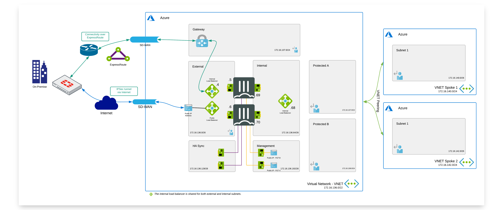

# SD-WAN - ExpressRoute

## Introduction

The goal of this webpage is document on how to configure Fortinet Secure SD-WAN between an IPsec tunnel over the internet and Azure Expressroute.
 
Azure ExpressRoute lets you extend your on-premises networks into the Microsoft cloud over a private connection facilitated by a connectivity provider. With ExpressRoute, you can establish connections to Microsoft cloud services, such as Microsoft Azure and Microsoft 365. Connectivity can be from an any-to-any (IP VPN) network, a point-to-point Ethernet network, or a virtual cross-connection through a connectivity provider at a co-location facility. ExpressRoute connections do not go over the public Internet. This allows ExpressRoute connections to offer more reliability, faster speeds, consistent latencies, and higher security than typical connections over the Internet. A good resource to learn more about Expressroute is [this video](https://www.youtube.com/watch?v=oevwZZ1YFS0).

The advantage of combining Fortinet Secure SD-WAN and Expressroute is:
- Application level visibility.
- The ability to control/prioritize critical traffic and applications.
- Dynamic path selection to select the best/preferred path to the cloud.
- Automatically route traffic to next best available link in the event of an outage.

## Flow
In the diagram the different steps to establish a session are layed out. 

### Inbound connection

1. Connection from client via local Firewall which has Express Route connection to Azure - s: w.x.y.z - d: 172.16.137.4
w.x.y.z is private IP address of the host in Local Area Network on-premise. No NAT happens during the whole connection.
2. Packet is sent via  ExpressRoute circuit to Azure ExpressRoute Gateway.s: w.x.y.z - d: 172.16.137.4
3. Packet is sent via user defined routing (UDR) in Azure to Internal Load Balancer which forwards the packet to active FTG in HA Cluster.
4. FTG sends the packet to the server via routing in Azure - s: w.x.y.z - d: 172.16.137.4
5. Based on SD-WAN configuration connection can take also second path. From on-premise client via local Firewall which has VPN tunnel to Azure over Internet- s: w.x.y.z - d: 172.16.137.4
6. Packet is sent via VPN tunnel over Internet through External Azure Load Balancer to active FortiGate. s: w.x.y.z - d: 172.16.137.4
7. FTG sends the packet to the server via routing in Azure - s: w.x.y.z - d: 172.16.137.4

### Outbound connection

## Configuration