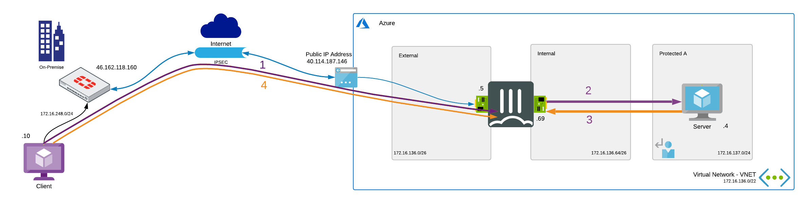
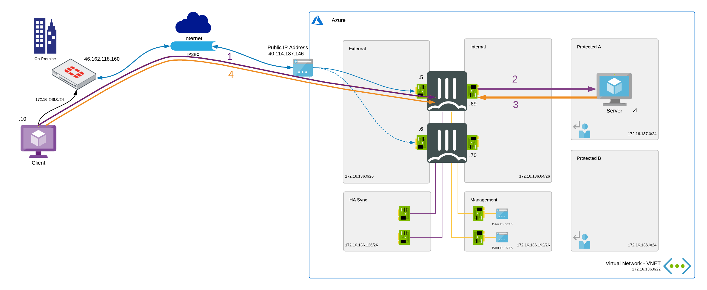

# SD-WAN - Connecting from on-premise to a FortiGate Active/Passive ELB/ILB cluster in Azure.

## Introduction

In this scenario we will be connecting your on-premise FortiGate installation to a FortiGate setup deployed in Microsoft Azure. For each of the building blocks, the differences will be highlighted on how to connect.

## Flow

### FortiGate Single VM

In the diagram the different steps to establish a session are layed out. This flow is based on the configuration as deployed in this template.

  

1. Connection from client to the server in Azure over the IPSEC connection between both FortiGate devices - s: 172.16.248.10 - d: 172.16.137.4
2. Packet is decrypted, inspected and forwarded when allowed to the server - s: 172.16.248.10 - d: 172.16.137.4
3. Server responds and sends the packet using user defined routing (UDR) back to the FortiGate in Azure - s: 172.16.137.4 - d: 172.16.248.10
4. Packet is inspected and when allowed encrypted and send to the FortiGate for decryption and forwarding to the client - s: 172.16.137.4 - d: 172.16.248.10

### Active-Passive with SDN connector

In the diagram the different steps to establish a session are layed out. This flow is based on the configuration as deployed in this template.

  

1. Connection from client to the server in Azure over the IPSEC connection between both FortiGate devices - s: 172.16.248.10 - d: 172.16.137.4
2. Packet is decrypted, inspected and forwarded when allowed to the server - s: 172.16.248.10 - d: 172.16.137.4
3. Server responds and sends the packet using user defined routing (UDR) back to the FortiGate in Azure - s: 172.16.137.4 - d: 172.16.248.10
4. Packet is inspected and when allowed encrypted and send to the FortiGate for decryption and forwarding to the client - s: 172.16.137.4 - d: 172.16.248.10

On failover the public IP and user defined routing is moved to point to the secondary FortiGate using the SDN connector.

### Active-Passive with external and internal load balancer

### Active-Active with external and internal load balancer

## Configuration

### FortiGate Single VM

Setting up the IPSEC tunnel requires a public IP attached to the external interface of the FortiGate when the branch is reachable via the internet. The public IP can have either a basic SKU or a standard SKU. Take into account a standard SKU public IP requires a network security group, is zone aware and always has a static assignment. More information on Azure Public IPs can be found [here](https://docs.microsoft.com/en-us/azure/virtual-network/public-ip-addresses)

This instance level public IP attached to the VM directly is able to handle ESP traffic. NAT happens between the instance level public IP and the private IP address attached to the network interface.

- FortiGate

The drawing in the [flow](#flow) section is used in the configuration screenshots with a standard public IP in Azure of 40.114.187.146 on the Azure Load Balancer, the FortiGate private IP of 172.16.136.5 and the backend VM having the internal IP 172.16.137.4.

The setup of the configuration is similar to the documentation [here](https://docs.fortinet.com/document/fortigate/latest/administration-guide/913287/basic-site-to-site-vpn-with-pre-shared-key). The only difference is

### Active-Passive with SDN connector

### Active-Passive with external and internal load balancer

### Active-Active with external and internal load balancer
