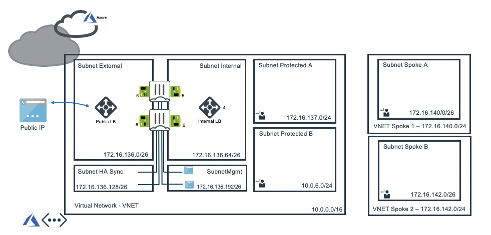

# Introduction

As organizations grow, and their consumption of the cloud increases and expands, the need to separate security management from application development increases. Different organizational units tent to build applications in different virtual networks and even different clouds and datacenters. Securing all disperse locations becomes challenging.

By building a central hub (transit network) for security functionality, that securely interconnects all disperse networks, locations, clouds and datacenters and can effectively enforce security policies between the different virtual networks and locations as well as offer central security filtering for traffic between these networks and the internet, organizations can effectively split the role of security management from application development.

# Design

In Microsoft Azure, this central security service hub is commonly implemented using local VNET peering. The central security services hub component will receive, using user defined routing (UDR), all or specific traffic that needs inspection going to/comming from on-prem networks or public internet.

This Terraform template will automatically deploy a full working environment containing the the following components.

  - 2 x FortiGate firewall's in an active/passive deployment
  - 1 x external Azure Standard Load Balancer for communication with internet
  - 1 x internal Azure Standard Load Balancer to receive all internal traffic and forwarding towards Azure Gateways connecting ExpressRoute or Azure VPN's.
  - 3 x VNET's (1 hub, 2 spoke networks) with each spoke network containing 1 subnet, and the hub contains 2 extra protected subnets
  - VNET peering between HUB and both 2 spoke networks
  - User Defined Routes (UDR) for the different protected subnets

This Terraform template can also be used to extend or customize based on your requirements. Additional subnets besides the one's mentioned above are not automatically generated. By adapting the Terraform templates you can additional subnets and/or which also require their own routing tables and VNET peering configuration.

# Deployment

For the deployment Terraform is required. This multi-cloud deployment tool can be downloaded from the website of [Hashicorp](https://www.terraform.io/) who created and maintains it. You can either run the different stage manually (terraform init, plan, apply) or you can use the deploy.sh script. There are 4 variables needed to complete kickstart the deployment. The deploy.sh script will ask them automatically. When you run the terraform command manually you need to provide the variables yourself.

  - PREFIX : This prefix will be added to each of the resources created by the templates for easy of use, manageability and visibility.
  - LOCATION : This is the Azure region where the deployment will be deployed
  - USERNAME : The username used to login to the FortiGate GUI and SSH mangement UI.
  - PASSWORD : The password used for the FortiGate GUI and SSH management UI.

For Microsoft Azure there is a fast track option by using the Azure Cloud Shell. The Azure Cloud Shell is an in-browser CLI that contains Terraform and other tools for deployment into Microsoft Azure. It is accesible via the Azure Portal or directly via [https://shell.azure.com/](https://shell.azure.com). You can copy and past the below one-liner to get start with your deployment.

`cd ~/clouddrive/ && wget -qO- https://github.com/jvhoof/fortinet-azure-solutions/archive/master.zip | jar x && cd ~/clouddrive/fortinet-azure-solutions-master/FortiGate/Terraform/ && ./deploy.sh`

After deployment you will be shown the IP address of all deployed components, this information is also stored in the output directory in the summary.out file. You can access both management GUI's using the public management IP's using HTTPS on port 8443.

# Requirements and limitations

The Terraform template deployment different resource and it is required to have the access rights and quota in your Microsoft Azure subscription to deploy the resources. 

- The template will deploy Standard F4s VM's to deploy the required active/passive setup
- Licenses for Fortigate 
  - BYOL: Demo license can be made available via your Fortinet partner or on our website. These can be injected during deployment or added after deployment.
  - PAYG or OnDemand: These licenses are automaticaly generated during the deployment of the FortiGate systems.
- With the current Terraform AzureRM provider (1.27.0) it is required to have the configuration for both spokes in the same terraform template file. We have observed that sometimes the VNET peering timing is gives issues with the provider not retrying. You can relaunch the script or Terraform apply command to complete the deployment. This is issues is known with Terraform and will be solved in future version of the provider. This issue is tracked [here](https://github.com/terraform-providers/terraform-provider-azurerm/issues/260).
 

# CI/CD pipeline and testing

# License

Permission is hereby granted, free of charge, to any person obtaining a copy of this software and associated documentation files (the "Software"), to deal in the Software without restriction, including without limitation the rights to use, copy, modify, merge, publish, distribute, sublicense, and/or sell copies of the Software, and to permit persons to whom the Software is furnished to do so, subject to the following conditions:

The above copyright notice and this permission notice shall be included in all copies or substantial portions of the Software.

THE SOFTWARE IS PROVIDED "AS IS", WITHOUT WARRANTY OF ANY KIND, EXPRESS OR IMPLIED, INCLUDING BUT NOT LIMITED TO THE WARRANTIES OF MERCHANTABILITY, FITNESS FOR A PARTICULAR PURPOSE AND NONINFRINGEMENT. IN NO EVENT SHALL THE AUTHORS OR COPYRIGHT HOLDERS OR FORTINET SUPPORT (TAC) BE LIABLE FOR ANY CLAIM, DAMAGES OR OTHER LIABILITY, WHETHER IN AN ACTION OF CONTRACT, TORT OR OTHERWISE, ARISING FROM, OUT OF OR IN CONNECTION WITH THE SOFTWARE OR THE USE OR OTHER DEALINGS IN THE SOFTWARE.