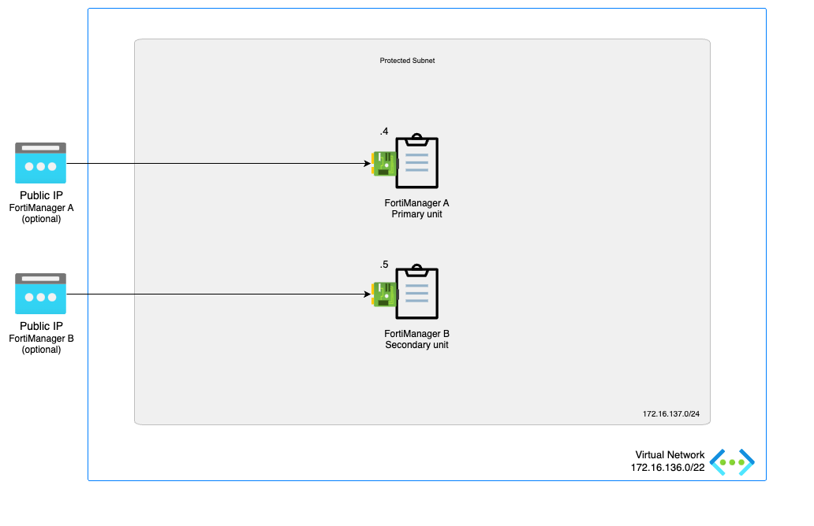
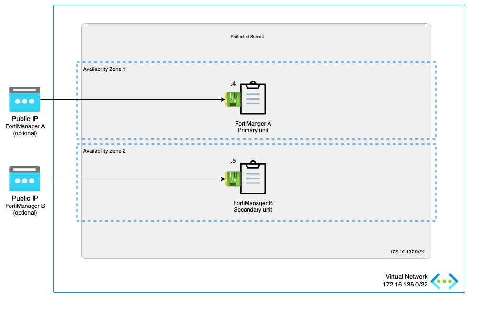
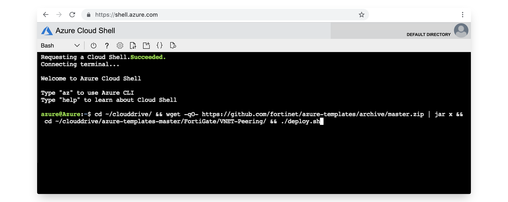

# FortiManager High Availability

## Introduction

FortiManager - Automation-Driven Centralized Management

Manage all your Fortinet devices in a single-console central management system. FortiManager provides full visibility of your network, offering streamlined provisioning and innovative automation tools.

This ARM template deploys a single FortiManager accompanied by the required infrastructure.

## Design

In Microsoft Azure, this single FortiManager-VM setup a basic setup to start exploring the capabilities of the management platform for the FortiGate next generation firewall.

This Azure ARM template will automatically deploy a full working environment containing the following components.

- 2 FortiManager VM with a 1Tb data disk for log storage
- 1 VNETs containing a subnet for the FortiManager
- Optional: 2 Basic/Standard public IPs

To enhance the availability of the solution VM can be installed in different Availability Zones instead of an Availability Set. If Availability Zones deployment is selected but the location does not support Availability Zones an Availability Set will be deployed. If Availability Zones deployment is selected and Availability Zones are available in the location, FortiManager A will be placed in Zone 1, FortiManager B will be placed in Zone 2.

This Azure ARM template can also be extended or customized based on your requirements. Additional subnets besides the ones mentioned above are not automatically generated.

The FortiManager can also be deployed without a public IP on the network interface. Select 'None' as the public IP.

## Deployment

For the deployment, you can use the Azure Portal, Azure CLI, Powershell or Azure Cloud Shell. The Azure ARM templates are exclusive to Microsoft Azure and can't be used in other cloud environments. The main template is the `mainTemplate.json` which you can use in the Azure Portal. A `deploy.sh` script is provided to facilitate the deployment. You'll be prompted to provide the 4 required variables:

- PREFIX : This prefix will be added to each of the resources created by the template for ease of use and visibility.
- LOCATION : This is the Azure region where the deployment will be deployed.
- USERNAME : The username used to login to the FortiManager GUI and SSH management UI.
- PASSWORD : The password used for the FortiManager GUI and SSH management UI.

### Azure Portal

Azure Portal Wizard:

Custom Deployment:

### Azure CLI
To fast track the deployment, use the Azure Cloud Shell. The Azure Cloud Shell is an in-browser CLI that contains Terraform and other tools for deployment into Microsoft Azure. It is accessible via the Azure Portal or directly at [https://shell.azure.com/](https://shell.azure.com). You can copy and paste the below one-liner to get started with your deployment.

`cd ~/clouddrive/ && wget -qO- https://github.com/40net-cloud/fortinet-azure-solutions/archive/main.tar.gz | tar zxf - && cd ~/clouddrive/fortinet-azure-solutions-main/FortiManager/ha-1nic/ && ./deploy.sh`

After deployment, you will be shown the IP addresses of all deployed components. This information is also stored in the output directory in the 'summary.out' file. You can access both management GUI's using the public management IP addresses using HTTPS on port 443.

## Requirements and limitations

The Azure ARM template deployment deploys different resources and is required to have the access rights and quota in your Microsoft Azure subscription to deploy the resources.

- The template will deploy Standard D3s VMs for this architecture. Other VM instances are supported as well with a recommended minimum of 2 vCPU and 4Gb of RAM. A list can be found [here](https://docs.fortinet.com/document/fortimanager-public-cloud/7.0.0/azure-administration-guide/351055/instance-type-support)
- A Network Security Group is installed that only opens TCP port 22, 443 and 514 for access to the FortiManager. Additional ports might be needed to support your use case and are documented [here](https://docs.fortinet.com/document/fortimanager/7.0.0/fortimanager-ports/465971/incoming-ports)
- License for FortiManager
  - BYOL: A demo license can be made available via your Fortinet partner or on our website. These can be injected during deployment or added after deployment.

## FortiManager configuration

### High Availability

FortiManager high availability (HA) provided enhanded reliability of the solution. In case of failure of the primary unit, a backup unit can be promoted.

In Microsoft Azure, the FortiManager manual HA failover is supported. Both units have a private and optionally a public IP configured. The FortiGate need to be configured with either the both private or both public IPs depending on the which are reachable.

More information on FortiManager High Availability can be found in [the FortiManager documentation](https://docs.fortinet.com/document/fortimanager/7.2.2/administration-guide/568591/high-availability).

### Primary FortiManager configuration

<pre>
config system ha
  set mode primary
  set clusterid 10
  set password xxx
  config peer
    edit 1
      set serial-number <b>FortiManager B serial number</b> 
      set ip <b>FortiManager B IP address</b> 
    next
  end
end
</pre>

### Secondary FortiManager configuration

<pre>
config system ha
  set mode secondary
  set clusterid 10
  set password xxx
  config peer
    edit 1
      set serial-number <b>FortiManager A serial number</b> 
      set ip <b>FortiManager A IP address</b> 
    next
  end
end
</pre>

### FortiGate configuration

## Support
Fortinet-provided scripts in this and other GitHub projects do not fall under the regular Fortinet technical support scope and are not supported by FortiCare Support Services.
For direct issues, please refer to the [Issues](https://github.com/40net-cloud/fortinet-azure-solutions/issues) tab of this GitHub project.

## License
[License](LICENSE) © Fortinet Technologies. All rights reserved.
