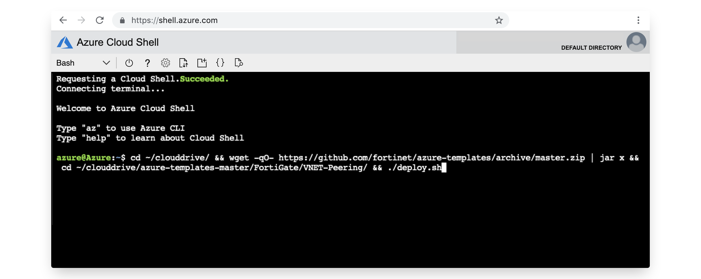
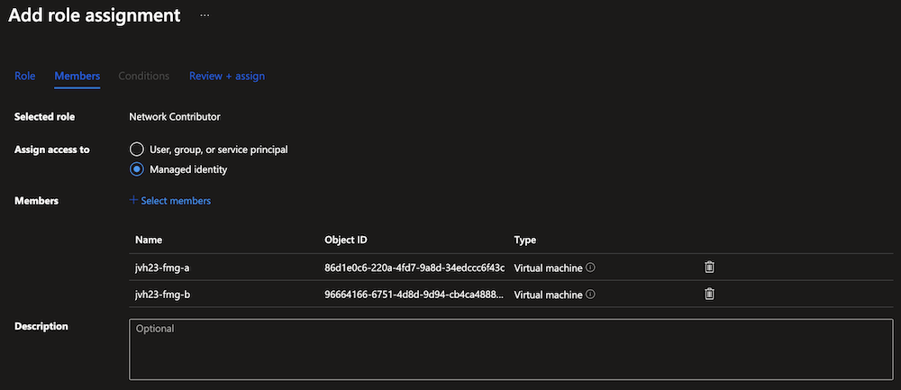
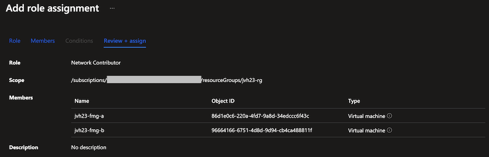
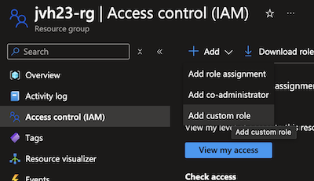
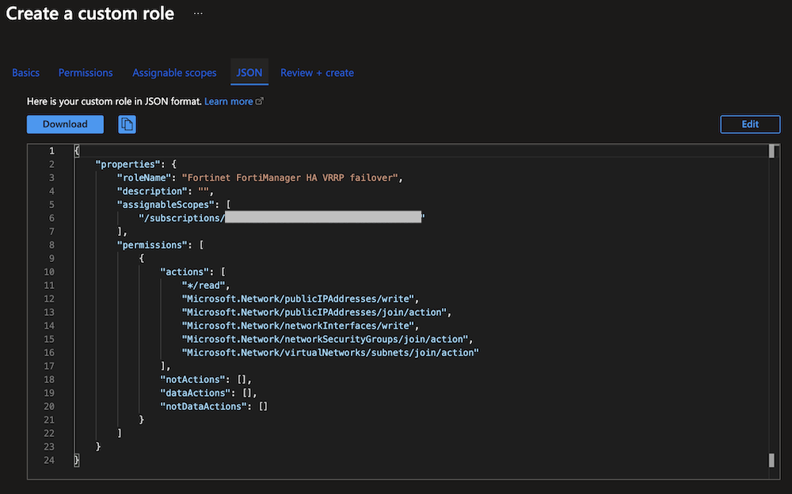
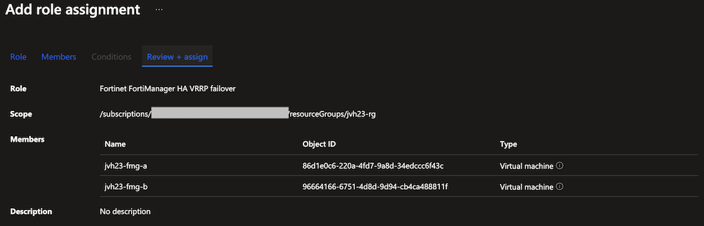

# FortiManager High Availability

:wave: - [Introduction](#introduction) - [Design](#design) - [Deployment](#deployment) - [Requirements](#requirements-and-limitations) - [Configuration](#configuration) - [Troubleshooting](#troubleshooting) - :wave:

## Introduction

FortiManager - Automation-Driven Centralized Management

Manage all your Fortinet devices in a single-console central management system. FortiManager provides full visibility of your network, offering streamlined provisioning and innovative automation tools.

This ARM template deploys two FortiManagers with High availability accompanied by the required infrastructure.

## Design

This Azure ARM template will automatically deploy a full working environment containing the following components.

- 2 FortiManager VM with one NIC and data disk(s) for log storage
- 1 VNETs containing a subnet for the FortiManager
- Standard public IPs depending on deployment scenarios:

	* Manual Failover: 2 optional Public IPs	
	* VRRP Automatic Failover with Public IP Attached to Secondary Private IP Address: 2 optional Public IPs and one mandatory HA Public IP	
	* VRRP Automatic Failover Using Secondary Private IP Address: 2 optional Public IPs
	
To enhance the availability of the solution VM can be installed in different Availability Zones instead of an Availability Set. The availability zone is the default option in the template. If Availability Zones deployment is selected but the location does not support Availability Zones an Availability Set will be deployed. If Availability Zones deployment is selected and Availability Zones are available in the location, FortiManager A will be placed in Zone 1, FortiManager B will be placed in Zone 2.


This Azure ARM template can also be extended or customized based on your requirements. Additional subnets besides the ones mentioned above are not automatically generated.

We will present three different scenarios for deploying FortiManager in high availability HA configuration:

### VRRP Automatic Failover with Public IP Attached to Secondary Private IP Address

FortiManager HA will be configured in VRRP mode using unicast. There will be a dedicated public IP address for HA attached to secondary private IP address. 
When the failover occurs, the HA public IP address will move automatically from the old primary to new primary FortiManager unit.


### VRRP Automatic Failover Using Secondary Private IP Address

FortiManager HA will be configured in VRRP mode using unicast. There will be a dedicated HA secondary private IP address. 
When the failover occurs, the HA secondary private IP address will move automatically from the old primary to new primary FortiManager unit.


### Manual Failover

FortiManager high availability (HA) provided enhanded reliability of the solution. In case of failure of the primary unit, a backup unit can be promoted.

In Microsoft Azure, the FortiManager manual HA failover is supported. Both units have a private and optionally a public IP configured. The FortiGate need to be configured with either the both private or both public IPs depending on the which are reachable.

More information on FortiManager High Availability can be found in [the FortiManager documentation](https://docs.fortinet.com/document/fortimanager/7.6.0/administration-guide/800686/configuring-ha-options).


## Deployment

For the deployment, you can use the Azure Portal, Azure CLI, Powershell or Azure Cloud Shell. The Azure ARM templates are exclusive to Microsoft Azure and can't be used in other cloud environments. The main template is the `mainTemplate.json` which you can use in the Azure Portal. A `deploy.sh` script is provided to facilitate the deployment. You'll be prompted to provide the 4 required variables:

- PREFIX : This prefix will be added to each of the resources created by the template for ease of use and visibility.
- LOCATION : This is the Azure region where the deployment will be deployed.
- USERNAME : The username used to login to the FortiManager GUI and SSH management UI.
- PASSWORD : The password used for the FortiManager GUI and SSH management UI.

### Azure Portal

Azure Portal Wizard:
[](https://portal.azure.com/#create/Microsoft.Template/uri/https%3A%2F%2Fraw.githubusercontent.com%2F40net-cloud%2Ffortinet-azure-solutions%2Fmain%2FFortiManager%2Fha%2FmainTemplate.json/createUIDefinitionUri/https%3A%2F%2Fraw.githubusercontent.com%2F40net-cloud%2Ffortinet-azure-solutions%2Fmain%2FFortiManager%2Fha%2FcreateUiDefinition.json)

Custom Deployment:
[](https://portal.azure.com/#create/Microsoft.Template/uri/https%3A%2F%2Fraw.githubusercontent.com%2F40net-cloud%2Ffortinet-azure-solutions%2Fmain%2FFortiManager%2Fha%2FmainTemplate.json)
[](http://armviz.io/#/?load=https%3A%2F%2Fraw.githubusercontent.com%2F40net-cloud%2Ffortinet-azure-solutions$2Fmain%2FFortiManager%2Fha%2FmainTemplate.json)

### Azure CLI
To fast track the deployment, use the Azure Cloud Shell. The Azure Cloud Shell is an in-browser CLI that contains Terraform and other tools for deployment into Microsoft Azure. It is accessible via the Azure Portal or directly at [https://shell.azure.com/](https://shell.azure.com). You can copy and paste the below one-liner to get started with your deployment.

`cd ~/clouddrive/ && wget -qO- https://github.com/40net-cloud/fortinet-azure-solutions/archive/main.tar.gz | tar zxf - && cd ~/clouddrive/fortinet-azure-solutions-main/FortiManager/ha/ && ./deploy.sh`



After deployment, you will be shown the IP addresses of all deployed components. This information is also stored in the output directory in the 'summary.out' file. You can access both management GUI's using the public management IP addresses using HTTPS on port 443.

## Requirements and limitations

The Azure ARM template deployment deploys different resources and is required to have the access rights and quota in your Microsoft Azure subscription to deploy the resources.

- The template will deploy Standard DS4_v2 VMs for this architecture. Other VM instances are supported as well with a recommended minimum of 4 vCPU and 16Gb of RAM. A list can be found [here](https://docs.fortinet.com/document/fortimanager-public-cloud/7.6.0/azure-administration-guide/351055/instance-type-support)
- A Network Security Group is installed that only opens TCP port 22, 80, 443, 541, 8082, 5199 and 514 for access to the FortiManager. Additional ports might be needed to support your use case and are documented [here](https://docs.fortinet.com/document/fortimanager/7.6.0/fortimanager-ports/465971)
- License for FortiManager
  - BYOL: A demo license can be made available via your Fortinet partner or on our website. These can be injected during deployment or added after deployment. For the correct configuration of the HA during deployment, the serial numbers of both FortiManager devices need to be provider. If not provided the configuration needs to be adapted to reflect the below configuration

## Configuration

The HA configuration requires the serialnumbers of both FortiManager VMs in order to complete the config. If the serialnumbers are not provided during deployment the FortiManager HA config needs to be performed manually afterwards.

### VRRP Automatic Failover with Public IP Attached to Secondary Private IP Address

After deployment perform and validate the following three steps:
 
- During deployment the root certificate (DigiCert Global Root G2) for management.azure.com is added. This certificate can also be downloaded [here](https://learn.microsoft.com/en-us/azure/security/fundamentals/azure-ca-details?tabs=root-and-subordinate-cas-list) and added as a local CA certificate on the FortiManager
- For the failover process, FortiManager uses managed identity on Microsoft Azure to migrate the public IP. Assign either the network contributor or a custom role to the resource group containing the FortiManager resources (VM, network interface, public ip address, network security group). More information can be found [here](#vrrp-managed identity)
- The FortiManager devices need to have outbound access to management.azure.com via either the attached public IPs or another outbound path

FortiManager A and FortiManager B configuration should be like below:

#### FortiManager A

<pre><code>
config system ha
    set clusterid 10
    set failover-mode vrrp
    set hb-interval 5
    set hb-lost-threshold 10
    set mode primary
        config peer
            edit 1
                set ip <b>FortiManager B Public IP address</b>
                set serial-number <b>FortiManager B serial number</b>
            next
        end
    set priority 100
    set unicast enable
    set vip <b>FortiManager HA Public IP address</b>
    set vrrp-interface "port1"
end
</code></pre>

#### FortiManager B

<pre><code>
config system ha
    set clusterid 10
    set failover-mode vrrp
    set hb-interval 5
    set hb-lost-threshold 10
    set mode secondary
        config peer
            edit 1
                set ip <b>FortiManager A Public IP address</b>
                set serial-number <b>FortiManager A serial number</b>
            next
        end
    set unicast enable
    set vip <b>FortiManager HA Public IP address</b>
    set vrrp-interface "port1"
end
</code></pre>

Fortigate configuration should be:

<pre><code>
config system central-management
  set type FortiManager
  set fmg <b>FortiManager HA Public IP address or FQDN</b>
  set serial-number <b>FortiManager A serial number</b>
end
</code></pre>


### VRRP Automatic Failover with Public IP Attached to Secondary Private IP Address

You will follow the same steps as in the previous scenario, with the only change being the use of private IPs instead of public IPs.

#### FortiManager A
<pre><code>
config system ha
    set clusterid 10
    set failover-mode vrrp
    set hb-interval 5
    set hb-lost-threshold 10
    set mode primary
        config peer
            edit 1
                set ip <b>FortiManager B private IP address - 172.16.140.5</b>
                set serial-number <b>FortiManager B serial number</b>
            next
        end
    set priority 100
    set unicast enable
    set vip <b>FortiManager VRRP HA private IP address - 172.16.140.6</b>
    set vrrp-interface "port1"
end
</code></pre>

#### FortiManager B

<pre><code>
config system ha
    set clusterid 10
    set failover-mode vrrp
    set hb-interval 5
    set hb-lost-threshold 10
    set mode secondary
        config peer
            edit 1
                set ip <b>FortiManager A private IP address - 172.16.140.4</b>
                set serial-number <b>FortiManager A serial number</b>
            next
        end
    set unicast enable
    set vip <b>FortiManager VRRP HA private IP address - 172.16.140.6</b>
    set vrrp-interface "port1"
end
</code></pre>

Fortigate configuration should be:

<pre><code>
config system central-management
  set type FortiManager
  set fmg <b>172.16.140.6</b>
  set serial-number <b>FortiManager A serial number</b>
end
</code></pre>

### Manual Failover

The configuration for FortiManager A and FortiManager B should be as follows:

#### FortiManager A
<pre><code>
config system ha
  set mode primary
  set clusterid 10
  set password xxx
  config peer
    edit 1
      set serial-number <b>FortiManager B serial number</b>
      set ip <b>FortiManager B IP address</b>
    next
  end
end
</code></pre>

#### FortiManager B
<pre><code>
config system ha
  set mode secondary
  set clusterid 10
  set password xxx
  config peer
    edit 1
      set serial-number <b>FortiManager A serial number</b>
      set ip <b>FortiManager A IP address</b>
    next
  end
end
</code></pre>

Fortigate configuration should be:

<pre><code>
config system central-management
  set type FortiManager
  set fmg <b>FortiManager A IP address or FQDN</b>
  set fmg <b>FortiManager B IP address or FQDN</b>
  set serial-number <b>FortiManager A serial number</b>
  set serial-number <b>FortiManager B serial number</b>
end
</code></pre>

### VRRP managed identity 

In case of automatic HA failover / VRRP the secondary FortiManger will become primary and start communication with Microsoft Azure to migrate the VIP (public or private IP address). For the communication, credentials are needed using a managed identity. During the deployment the system assigned managed identity is enabled on each FortiManger. It is required after deployment to provide give the FortiManager systems access to the resource group containing it's resources in Azure. This access can be using the Network Contributor role or a custom role. The following resources are updated:

- FortiGate-VM network interfaces
- Network security group attached to the FortiManager network interface nic1
- VIP public IP address or private IP address attached to the FortiManager network interface nic1 as a secondary ipconfig
- VNET and subnet that has the VIP IP address attached

#### Network contributor role

##### Azure Portal

1. In the Azure portal, open your resource group and go to Access control (IAM).
2. Click Add a role assignment.
3. From the Role dropdown list, select Network Contributor.

4. Select the FortiManager-VMs as virtual machine members for Managed Identity

5. Review + assign the role


##### Azure CLI

```
$ spID=$(az resource list -n {<FortiManager-VM name>} --query [*].identity.principalId --out tsv)
$ az role assignment create --assignee $spID --role 'Network Contributor' --scope /subscriptions/{Azure subscription ID}/resourceGroups/{Azure resourceGroup name}
```

#### Customer specific role

You must assign the Fortinet FortiGate SDN Connector RW role to both FortiGate-VMs when in an active-active or active-passive setup. You must apply this role since the VM principal ID must be retrieved. This action assigns required access rights for the service principal that Azure AD is managing specific for the FortiGate-VM to access Azure resources in the Azure subscription.

##### Azure Portal

1. In the Azure portal, open your resource group and go to Access control (IAM).
2. Click Add a custom role

3. Give the role a name

4. Go to the JSON tab and using edit fill in the json code from the Azure CLI section or the 'azure_iamrol_rw.json' file

5. Review + assign the custom role

6. In the Azure portal, open your resource group and go to Access control (IAM).
7. Click Add a role assignment.
8. From the Role dropdown list, select your custom role

9. Select the FortiManager-VMs as virtual machine members for Managed Identity

10. Review + assign the role


##### Azure CLI

Create a JSON file that contains the following data or download the json file from github. Fill in your subscription ID, replacing in the curly brackets placeholder.

```json
{
    "Name": "Fortinet FortiManager HA VRRP failover",
    "IsCustom": true,
    "Description": "Role to update the public ip address",
    "Actions": [
        "*/read",
        "Microsoft.Network/publicIPAddresses/write",
        "Microsoft.Network/publicIPAddresses/join/action",
        "Microsoft.Network/networkInterfaces/write",
        "Microsoft.Network/networkSecurityGroups/join/action",
        "Microsoft.Network/virtualNetworks/subnets/join/action"
    ],
    "DataActions": [],
    "NotActions": [],
    "NotDataActions": [],
    "AssignableScopes": [
        "/subscriptions/{subscriptionID1}"
    ]
}
```

This action assigns required access rights for the managed identity of the FortiManager-VM to access Azure resources in the Azure Resource Group.

```bash
$ az role definition create --role-definition azure_SDN_iamrole_rw.json
$ spID=$(az resource list -n {<FortiManager-VM name>} --query [*].identity.principalId --out tsv)
$ az role assignment create --assignee $spID --role 'Fortinet FortiManager HA VRRP failover' --scope /subscriptions/{Azure subscription ID}/resourceGroups/{Azure resourceGroup name}
```

## Troubleshooting

You check HA status from cli using the following commands: 

```
fmg-a # get system ha-status
HA Health Status                : OK
HA Role                         : Primary
FMG-HA Status                   : Synchronized State
Model                           : FortiManager-VM64-AZURE
Cluster-ID                      : 10
Debug                           : off
File-Quota                      : 4096
HB-Interval                     : 10
HB-Lost-Threshold               : 30
HA Primary Uptime               : Tue Jul 16 02:11:44 2024
HA Primary state change timestamp: Tue Jul 16 02:12:03 2024
HB-Lost-Threshold               : 30
Primary                         : fmg-a, FMG-VM1xxxxxx, 172.16.140.6
-----
Cluster member 1: fmg-a, FMG-VM1xxxxxx, 172.16.140.5
Last Heartbeat                  : 10 seconds ago
Last Sync                       : 980 seconds ago
Last Error                      : 
Total Synced Data (bytes)       : 6298829
Pending Synced Data (bytes)     : 0
Estimated Sync Time Left (seconds): 0
HA Sync status                  : up,in-sync
System Usage stats              :
        FMG-VM1xxxxxx(updated 0 seconds ago):
                average-cpu-user/nice/system/idle=0.27%/0.00%/0.94%/98.77%, memory=9.24%
        FMG-VM2xxxxxx(updated 10 seconds ago):
                average-cpu-user/nice/system/idle=0.05%/0.00%/0.15%/99.77%, memory=9.47%
```

```
fmg-a # get system ha
clusterid           : 10
failover-mode       : vrrp 
file-quota          : 4096
hb-interval         : 10
hb-lost-threshold   : 30
local-cert          : (null)
mode                : primary 
monitored-interfaces:
monitored-ips:
    == [ 1 ]
    id: 1           
password            : *
peer:
    == [ 1 ]
    id: 1           
priority            : 1
unicast             : enable 
vip                 : 20.50.232.45 
vip-interface       : (null)
vrrp-adv-interval   : 3
vrrp-interface      : port1 
```

You can verify the communication with Azure REST API in shell mode.
Enable shell and run these using exec shell. Please, visit the [link](https://community.fortinet.com/t5/FortiManager/Technical-Tip-How-to-enable-backend-shell-access-in-FortiManager/ta-p/242340) for more details.
Then run the following commands:

```
# fazutil azure vm
# fazutil azure nic
# fazutil azure imds
# fazutil information ha-azure
```

Force a failover. Run this on the active FortiManager
```
# diag ha force-vrrp-reelection
```

Logging of the Azure Rest API calls
```
# diagnose ha dump-cloud-api-log
```

## Support
Fortinet-provided scripts in this and other GitHub projects do not fall under the regular Fortinet technical support scope and are not supported by FortiCare Support Services.
For direct issues, please refer to the [Issues](https://github.com/40net-cloud/fortinet-azure-solutions/issues) tab of this GitHub project.

## License
[License](/../../blob/main/LICENSE) © Fortinet Technologies. All rights reserved.
