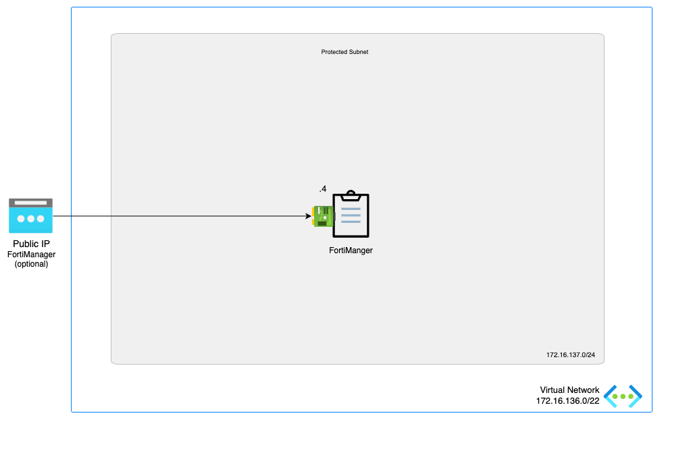

# FortiManager

## Introduction

FortiManager - Automation-Driven Centralized Management

Manage all your Fortinet devices in a single-console central management system. FortiManager provides full visibility of your network, offering streamlined provisioning and innovative automation tools.

This ARM template deploys a single FortiManager accompanied by the required infrastructure. Additionally, Fortinet Fabric Connectors deliver the ability to create dynamic security policies.

## Design

In Microsoft Azure, this single FortiManager-VM setup a basic setup to start exploring the capabilities of the management platform for the FortiGate next generation firewall.

This Azure ARM template will automatically deploy a full working environment containing the following components.

- 1 FortiManager VM with a 1Tb data disk for log storage
- 1 VNETs containing a subnet for the FortiManager
- 1 Basic public IP



The VM will have the fifth IP in the network range as his static IP. You can adapt the 'sn1IPfg1' variable in the ARM template to change this.

This Azure ARM template can also be extended or customized based on your requirements. Additional subnets besides the ones mentioned above are not automatically generated.

## Deployment

For the deployment, you can use the Azure Portal, Azure CLI, Powershell or Azure Cloud Shell. The Azure ARM templates are exclusive to Microsoft Azure and can't be used in other cloud environments. The main template is the `azuredeploy.json` which you can use in the Azure Portal. A `deploy.sh` script is provided to facilitate the deployment. You'll be prompted to provide the 4 required variables:

- PREFIX : This prefix will be added to each of the resources created by the template for ease of use and visibility.
- LOCATION : This is the Azure region where the deployment will be deployed.
- USERNAME : The username used to login to the FortiGate GUI and SSH management UI.
- PASSWORD : The password used for the FortiGate GUI and SSH management UI.

### Azure Portal

<a href="https://portal.azure.com/#create/Microsoft.Template/uri/https%3A%2F%2Fraw.githubusercontent.com%2F40net-cloud%2Ffortinet-azure-solutions%2Fmain%2FFortiManager%2Fsingle-1nic%2Fazuredeploy.json" target="_blank">
  
</a>
<a href="http://armviz.io/#/?load=https%3A%2F%2Fraw.githubusercontent.com%2F40net-cloud%2Ffortinet-azure-solutions$2Fmain%2FFortiManager%2Fsingle-1nic%2Fazuredeploy.json" target="_blank">
  
</a>

### Azure CLI
To fast track the deployment, use the Azure Cloud Shell. The Azure Cloud Shell is an in-browser CLI that contains Terraform and other tools for deployment into Microsoft Azure. It is accessible via the Azure Portal or directly at [https://shell.azure.com/](https://shell.azure.com). You can copy and paste the below one-liner to get started with your deployment.

`cd ~/clouddrive/ && wget -qO- https://github.com/40net-cloud/fortinet-azure-solutions/archive/main.tar.gz | tar zxf - && cd ~/clouddrive/fortinet-azure-solutions-main/FortiManager/single-1nic/ && ./deploy.sh`


After deployment, you will be shown the IP addresses of all deployed components. This information is also stored in the output directory in the 'summary.out' file. You can access both management GUI's using the public management IP addresses using HTTPS on port 443.

## Requirements and limitations

The Azure ARM template deployment deploys different resources and is required to have the access rights and quota in your Microsoft Azure subscription to deploy the resources.

- The template will deploy Standard D3s VMs for this architecture. Other VM instances are supported as well with a recommended minimum of 2 vCPU and 4Gb of RAM. A list can be found [here](https://docs.fortinet.com/document/fortimanager-public-cloud/7.0.0/azure-administration-guide/351055/instance-type-support)
- A Network Security Group is installed that only opens TCP port 22, 443 and 514 for access to the FortiManager. Additional ports might be needed to support your use case and are documented [here](https://docs.fortinet.com/document/fortimanager/6.2.0/ports-and-protocols/189421/incoming-ports)
- License for FortiManager
  - BYOL: A demo license can be made available via your Fortinet partner or on our website. These can be injected during deployment or added after deployment.

### Custom Images

By default this template will deploy the default Azure Marketplace images. The currently available images for FortiManager can be retrieved using Azure CLI:

```
az vm image list --all --publisher fortinet --offer fortinet-fortimanager --output table
Offer                  Publisher    Sku                    Urn                                                         Version
---------------------  -----------  ---------------------  ----------------------------------------------------------  ---------
fortinet-fortimanager  fortinet     fortinet-fortimanager  fortinet:fortinet-fortimanager:fortinet-fortimanager:6.2.0  6.2.0
fortinet-fortimanager  fortinet     fortinet-fortimanager  fortinet:fortinet-fortimanager:fortinet-fortimanager:6.2.1  6.2.1
fortinet-fortimanager  fortinet     fortinet-fortimanager  fortinet:fortinet-fortimanager:fortinet-fortimanager:6.2.2  6.2.2
fortinet-fortimanager  fortinet     fortinet-fortimanager  fortinet:fortinet-fortimanager:fortinet-fortimanager:6.2.3  6.2.3
fortinet-fortimanager  fortinet     fortinet-fortimanager  fortinet:fortinet-fortimanager:fortinet-fortimanager:6.2.5  6.2.5
fortinet-fortimanager  fortinet     fortinet-fortimanager  fortinet:fortinet-fortimanager:fortinet-fortimanager:6.4.0  6.4.0
fortinet-fortimanager  fortinet     fortinet-fortimanager  fortinet:fortinet-fortimanager:fortinet-fortimanager:6.4.1  6.4.1
fortinet-fortimanager  fortinet     fortinet-fortimanager  fortinet:fortinet-fortimanager:fortinet-fortimanager:6.4.2  6.4.2
```

Additionaly this template can be used to deploy custom VHD disk images. These specific VHD's can be obtained from Fortinet. Once retrieved you need to upload this VHD to an Azure storage account. For more information on creating a storage account, visit the Microsoft documentation [here](https://docs.microsoft.com/en-us/azure/storage/common/storage-quickstart-create-account?tabs=azure-portal). To upload the custom VHD to the storage account there is a specific powershell command: 'Add-AzVhd'. The FortiGate image is very compressed and needs to extracted during the upload process. This is only working well using this powershell command. In the end you need to have a 2Gb VHD in your storage account. The format of the command is show below where the URI of the storage account can be retrieve from the Azure Portal.

`Add-AzVhd -LocalFilePath ./fmg.vhd -ResourceGroupName XXX-RG -Destination 'https://xxx.blob.core.windows.net/vhds/fmg.vhd'`


## Support
Fortinet-provided scripts in this and other GitHub projects do not fall under the regular Fortinet technical support scope and are not supported by FortiCare Support Services.
For direct issues, please refer to the [Issues](https://github.com/40net-cloud/fortinet-azure-solutions/issues) tab of this GitHub project.

## License
[License](LICENSE) © Fortinet Technologies. All rights reserved.
