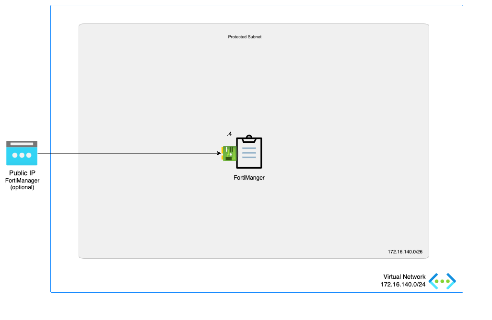

# FortiManager

:wave: - [Introduction](#introduction) - [Design](#design) - [Deployment](#deployment) - [Requirements](#requirements-and-limitations) - [Configuration](#configuration) - :wave:

## Introduction

FortiManager - Automation-Driven Centralized Management

Manage all your Fortinet devices in a single-console central management system. FortiManager provides full visibility of your network, offering streamlined provisioning and innovative automation tools.

This ARM template deploys a single FortiManager accompanied by the required infrastructure.

## Design

In Microsoft Azure, this single FortiManager-VM setup a basic setup to start exploring the capabilities of the management platform for the FortiGate next generation firewall.

This Azure ARM template will automatically deploy a full working environment containing the following components.

- 1 FortiManager VM with a 1Tb data disk for log storage
- 1 VNETs containing a subnet for the FortiManager
- Optional: 1 Standard public IP

This Azure ARM template can also be extended or customized based on your requirements. Additional subnets besides the ones mentioned above are not automatically generated.

The FortiManager can also be deployed without a public IP on the network interface. Select 'None' as the public IP.

## Deployment

For the deployment, you can use the Azure Portal, Azure CLI, Powershell or Azure Cloud Shell. The Azure ARM templates are exclusive to Microsoft Azure and can't be used in other cloud environments. The main template is the `mainTemplate.json` which you can use in the Azure Portal. A `deploy.sh` script is provided to facilitate the deployment. You'll be prompted to provide the 4 required variables:

- PREFIX : This prefix will be added to each of the resources created by the template for ease of use and visibility.
- LOCATION : This is the Azure region where the deployment will be deployed.
- USERNAME : The username used to login to the FortiManager GUI and SSH management UI.
- PASSWORD : The password used for the FortiManager GUI and SSH management UI.

### Azure Portal

Azure Portal Wizard:

Custom deployment:

### Azure CLI
To fast track the deployment, use the Azure Cloud Shell. The Azure Cloud Shell is an in-browser CLI that contains Terraform and other tools for deployment into Microsoft Azure. It is accessible via the Azure Portal or directly at [https://shell.azure.com/](https://shell.azure.com). You can copy and paste the below one-liner to get started with your deployment.

`cd ~/clouddrive/ && wget -qO- https://github.com/40net-cloud/fortinet-azure-solutions/archive/main.tar.gz | tar zxf - && cd ~/clouddrive/fortinet-azure-solutions-main/FortiManager/single/ && ./deploy.sh`

After deployment, you will be shown the IP addresses of all deployed components. This information is also stored in the output directory in the 'summary.out' file. You can access both management GUI's using the public management IP addresses using HTTPS on port 443.

## Requirements and limitations

The Azure ARM template deployment deploys different resources and is required to have the access rights and quota in your Microsoft Azure subscription to deploy the resources.

- The template will deploy Standard D4s_v2 VMs for this architecture. Other VM instances are supported as well with a recommended minimum of 4 vCPU and 16Gb of RAM. A list can be found [here](https://docs.fortinet.com/document/fortimanager-public-cloud/7.6.0/azure-administration-guide/351055/instance-type-support)
- A Network Security Group is installed that only opens TCP port 22, 80, 443, 514, 541, 5199 and 8082 for access to the FortiManager. Additional ports might be needed to support your use case and are documented [here](https://docs.fortinet.com/document/fortimanager/7.6.0/fortimanager-ports/465971)
- License for FortiManager
  - BYOL: A demo license can be made available via your Fortinet partner or on our website. These can be injected during deployment or added after deployment.
- This deployment uses and forces the use of standard SKU public IP's. By 30 September 2025, the basic SKU will be retired. More information is available [here](https://azure.microsoft.com/en-gb/updates/upgrade-to-standard-sku-public-ip-addresses-in-azure-by-30-september-2025-basic-sku-will-be-retired/)

## Configuration

The FortiManger VMs need a specific configuration to match the deployed environment. This configuration can be injected during provisioning or afterwards via the different options including GUI, CLI, FortiManager or REST API.

### Default configuration

<pre><code>
config system global 
  set hostname <b>hostname</b>
  set adom-status enable
  set clone-name-option keep
  set create-revision enable
  set device-view-mode tree
  set disable-module fortiview-noc
  set import-ignore-addr-cmt enable
  set partial-install enable
  set partial-install-force enable
  set partial-install-rev enable
  set perform-improve-by-ha enable
  set policy-hit-count enable
  set policy-object-icon enable
  set search-all-adoms enable
end
config system admin setting
  set sdwan-monitor-history enable
  set show-add-multiple enable
  set show-checkbox-in-table enable
  set show-device-import-export enable
  set show-hostname enable
  set show_automatic_script enable
  set show_schedule_script enable
  set show_tcl_script enable
end
config system interface
  edit port1
    set mode static
    set ip <b>172.16.140.4</b>
    set description fortimanager
    set allowaccess ping ssh https
  next
end
config system route
  edit 1
    set dst 0.0.0.0/0
    set gateway <b>172.16.140.1</b>
    set device port1
  next
end
</code></pre>

## Support
Fortinet-provided scripts in this and other GitHub projects do not fall under the regular Fortinet technical support scope and are not supported by FortiCare Support Services.
For direct issues, please refer to the [Issues](https://github.com/40net-cloud/fortinet-azure-solutions/issues) tab of this GitHub project.

## License
[License](/../../blob/main/LICENSE) © Fortinet Technologies. All rights reserved.
