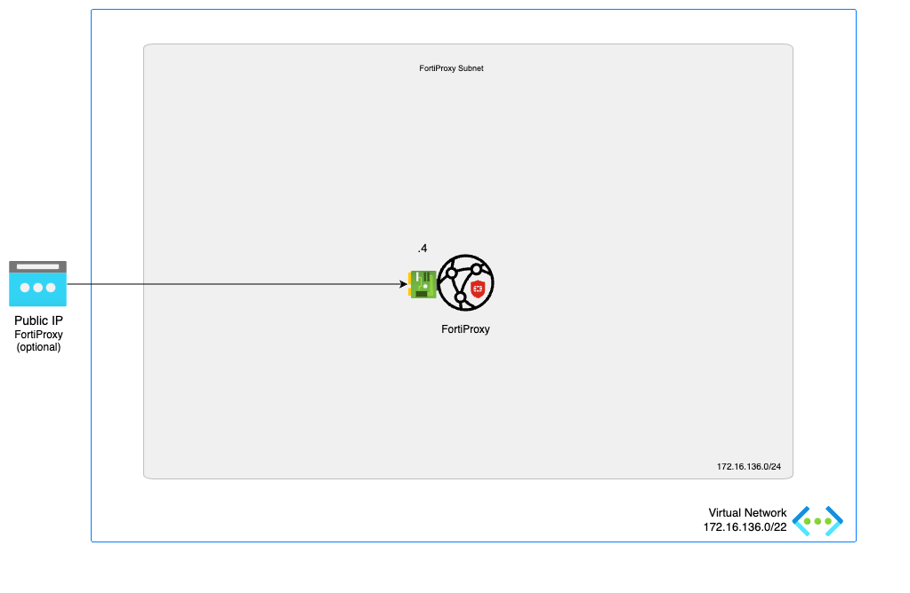

# FortiProxy - A Single VM

:wave: - [Introduction](#introduction) - [Design](#design) - [Deployment](#deployment) - [Requirements](#requirements-and-limitations) - :wave:

## Introduction

Next Generation Secure Web Gateway

FortiProxy is a secure web proxy that protects employees against Internet-borne attacks by incorporating multiple detection techniques such as Web & Video Filtering, DNS filtering, data loss prevention, antivirus, intrusion prevention, Browser Isolation and advanced threat protection. It helps enterprises enforce Internet compliance using granular application control. High-performance physical and virtual appliances deploy on-site to serve small, medium, and large enterprises.

This ARM template deploys a single FortiProxy Next-Generation Firewall accompanied by the required infrastructure. 

## Design

In Microsoft Azure, this single FortiProxy-VM setup a basic setup to start exploring the capabilities of the next generation secure web gateway. 

This Azure ARM template will automatically deploy a full working environment containing the following components.

- 1 standalone FortiProxy
- 1 VNETs 

This Azure ARM template can also be extended or customized based on your requirements. Additional subnets besides the ones mentioned above are not automatically generated. By extending the Azure ARM templates additional subnets can be added.

## Deployment

For the deployment, you can use the Azure Portal, Azure CLI, Powershell or Azure Cloud Shell. The Azure ARM templates are exclusive to Microsoft Azure and can't be used in other cloud environments. The main template is the `mainTemplate.json` which you can use in the Azure Portal. A `deploy.sh` script is provided to facilitate the deployment. You'll be prompted to provide the 4 required variables:

- PREFIX : This prefix will be added to each of the resources created by the template for ease of use and visibility.
- LOCATION : This is the Azure region where the deployment will be deployed.
- USERNAME : The username used to login to the FortiProxy GUI and SSH management UI.
- PASSWORD : The password used for the FortiProxy GUI and SSH management UI.

### Azure Portal

Azure Portal Wizard:

Custom Deployment:

## Requirements and limitations

The ARM template deploys different resources and it is required to have the access rights and quota in your Microsoft Azure subscription to deploy the resources.

- The template will deploy Standard F2s VMs for this architecture. Other VM instances are supported as well with a minimum of 2 NICs. A list can be found [here](https://docs.fortinet.com/document/fortigate-public-cloud/7.0.0/azure-administration-guide/562841/instance-type-support)
- Licenses for FortiProxy
  - BYOL: A demo license can be made available via your Fortinet partner or on our website. These can be injected during deployment or added after deployment. Purchased licenses need to be registered on the [Fortinet support site](http://support.fortinet.com). Download the .lic file after registration. Note, these files may not work until 60 minutes after it's initial creation.
  - The password provided during deployment must need password complexity rules from Microsoft Azure:
  - It must be 12 characters or longer
  - It needs to contain characters from at least 3 of the following groups: uppercase characters, lowercase characters, numbers, and special characters excluding '\' or '-'
- The terms for the FortiProxy BYOL image in the Azure Marketplace needs to be accepted once before usage. This is done automatically during deployment via the Azure Portal. For the Azure CLI the commands below need to be run before the first deployment in a subscription.
  - BYOL
`az vm image terms accept --publisher fortinet --offer fortinet-fortiproxy --plan fpx-vm-byol`

## Support

Fortinet-provided scripts in this and other GitHub projects do not fall under the regular Fortinet technical support scope and are not supported by FortiCare Support Services.
For direct issues, please refer to the [Issues](https://github.com/40net-cloud/fortinet-azure-solutions/issues) tab of this GitHub project.

## License

[License](/../../blob/main/LICENSE) © Fortinet Technologies. All rights reserved.
