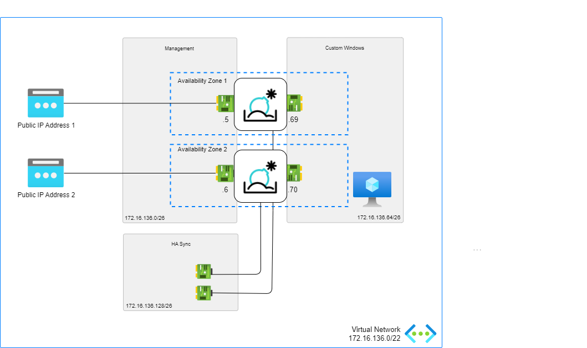

# FortiSandbox - Advanced Deployment

## Introduction

Fortinet’s FortiSandbox on Azure enables organizations to defend against advanced threats in the cloud. It works with network, email, endpoint, and other security measures, or as an extension of on-premise security architecture to leverage scale with complete control.

The advanced deployment model provide advanced features such as custom VMs and HA.

## Design

This ARM template deploys  FortiSandbox Vms accompanied by the required infrastructure in Advanced mode. It will automatically deploy a full working environment containing the following components.

- FortiSandbox Vms
- 1 VNETs containing a management subnet, custom Windows subnet and HA sync subnet

To enhance the availability of the solution VM can be installed in different Availability Zones instead of an Availability Set. If Availability Zones deployment is selected but the location does not support Availability Zones an Availability Set will be deployed. If Availability Zones deployment is selected and Availability Zones are available in the location, FortiGate A will be placed in Zone 1, FortiGate B will be placed in Zone 2.

## Deployment: Azure Portal

Azure Portal Wizard:

Custom Deployment:

## Support

Fortinet-provided scripts in this and other GitHub projects do not fall under the regular Fortinet technical support scope and are not supported by FortiCare Support Services.
For direct issues, please refer to the [Issues](https://github.com/40net-cloud/fortinet-azure-solutions/issues) tab of this GitHub project.

## License

[License](LICENSE) © Fortinet Technologies. All rights reserved.
