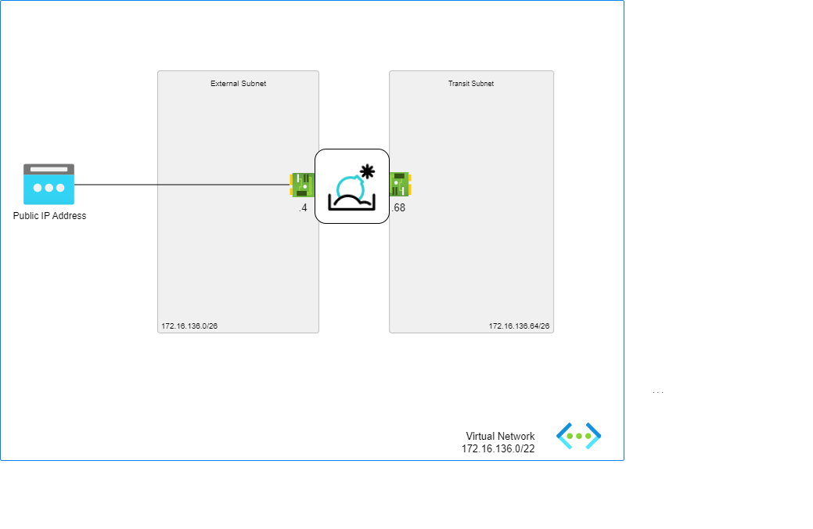

# FortiSandbox - Basic Deployment

## Introduction

The FortiSandbox basic deployment model offers the quickest and simplest method for deploying a FortiSandbox VM on Azure.For additional details, please refer to the [link](https://docs.fortinet.com/document/fortisandbox-public-cloud/4.4.0/fortisandbox-vm-on-azure/626020/deploying-fortisandbox-vm-on-azure-basic).

## Design

This ARM template deploys  FortiSandbox Vms accompanied by the required infrastructure in Basic mode. It will automatically deploy a full working environment containing the following components.

- FortiSandbox Vm
- 1 VNETs containing external subnet and transit subnet
- Public IP address attached to external NIC

## Deployment: Azure Portal

Custom Deployment:

The default login Credentials for Fortisandbox VM are as follow:

The default login credentials are as follow:
Username admin
Password: VM-ID

You can get VM-ID using azure cli command:  az vm list -–output tsv -g [Your resource group]

Upon successful login, you have the option to modify your password.

## Support

Fortinet-provided scripts in this and other GitHub projects do not fall under the regular Fortinet technical support scope and are not supported by FortiCare Support Services.
For direct issues, please refer to the [Issues](https://github.com/40net-cloud/fortinet-azure-solutions/issues) tab of this GitHub project.

## License

[License](LICENSE) © Fortinet Technologies. All rights reserved.
