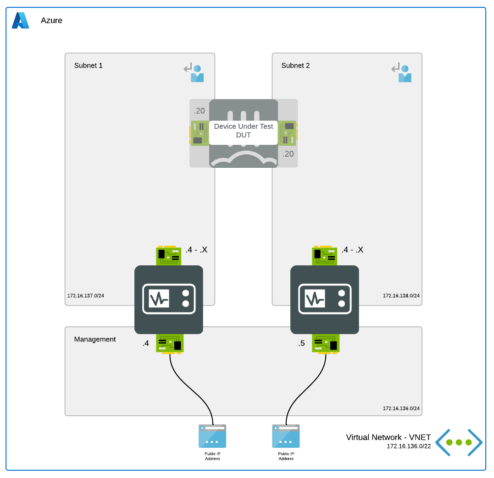

# FortiTester - TestCenter

## Introduction

This ARM template deploys a single FortiTester accompanied by the required infrastructure towards TestCenter mode. A second FortiTester can be deployed in the Subnet 2 using this template.

## Design

This Azure ARM template will automatically deploy a full working environment containing the following components.

- 2 FortiTester VMs where each can be configured as client or server
- 1 VNETs containing a management subnet and testing client and server subnet
- Accelerated Networking is enabled by default

## Deployment - Azure Portal

Azure Portal Wizard:

Custom Deployment:

## Support

Fortinet-provided scripts in this and other GitHub projects do not fall under the regular Fortinet technical support scope and are not supported by FortiCare Support Services.
For direct issues, please refer to the [Issues](https://github.com/40net-cloud/fortinet-azure-solutions/issues) tab of this GitHub project.

## License

[License](LICENSE) © Fortinet Technologies. All rights reserved.
